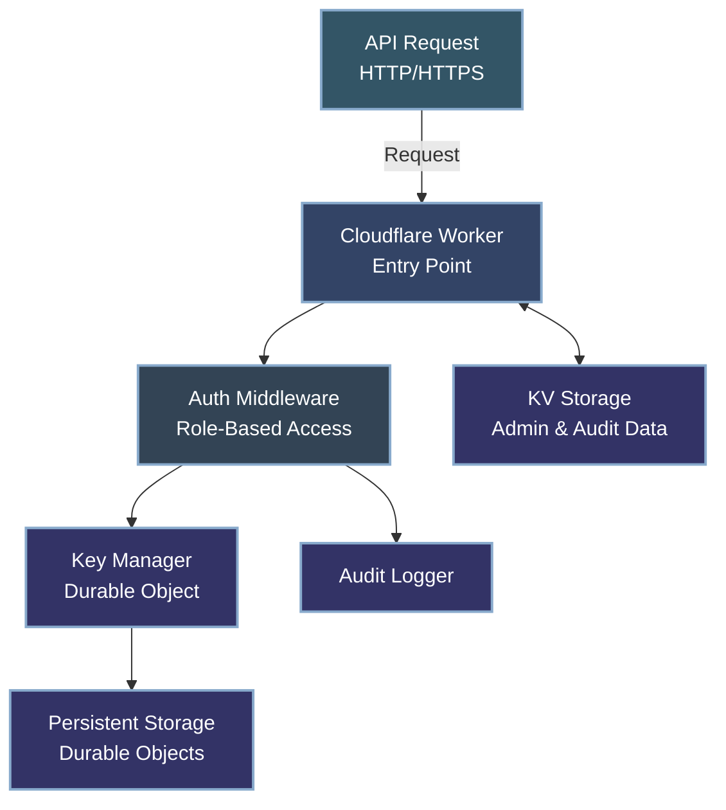

# API Key Manager

A secure, scalable Cloudflare Workers service for API key management with role-based access control. This service enables creating, validating, and managing API keys with support for permission scopes, key expiration, usage tracking, and comprehensive audit logging.

## Features

### Core Features
- **Secure Key Generation**: Cryptographically secure API key generation using Web Crypto API
- **Permission Scopes**: Restrict API key access with customizable permission scopes
- **Key Expiration**: Set automatic expiration dates for keys with cleanup
- **Usage Tracking**: Monitor when keys were last used for audit purposes
- **Durable Storage**: Persistent storage of API keys using Cloudflare Durable Objects
- **Rate Limiting**: Protect endpoints from abuse with configurable rate limits
- **IP Extraction**: Secure client IP address extraction for request tracking
- **Auto Cleanup**: Scheduled automatic cleanup of expired keys
- **CORS Support**: Built-in CORS handling for cross-origin requests

### Advanced Features
- **Role-Based Access Control**: Granular admin permissions with predefined roles
- **Admin User Management**: Create and manage admin users with specific permissions
- **Key Rotation**: Rotate keys with configurable grace periods for seamless transitions
- **Cursor-Based Pagination**: Efficient pagination for large datasets
- **Encryption at Rest**: AES-GCM encryption for API keys with versioned support
- **HMAC Verification**: Additional signature verification for enhanced security
- **Comprehensive Audit Logging**: Track all administrative actions with detailed context
- **Security Key Rotation**: Support for rotating encryption and HMAC secrets

## Architecture

This service uses Cloudflare Workers with Durable Objects and KV storage for:
- Globally consistent data storage without a separate database
- Low-latency access from any region
- Built-in scalability with Cloudflare's infrastructure
- Automatic background maintenance with Durable Object alarms



### Project Structure

```
key-manager-workers/
├── src/                  # Source code
│   ├── auth/             # Authentication system
│   │   ├── adminManager.js  # Admin user management
│   │   ├── auditLogger.js   # Audit logging
│   │   ├── index.js         # Auth module exports
│   │   ├── keyGenerator.js  # Key generation
│   │   ├── keyValidator.js  # Key validation
│   │   └── roles.js         # Role definitions
│   ├── handlers/         # API route handlers
│   │   ├── keys.js       # Key management endpoints
│   │   ├── system.js     # System endpoints
│   │   └── validation.js # Key validation endpoint
│   ├── lib/              # Core functionality
│   │   ├── KeyManagerDurableObject.js # Main Durable Object
│   │   └── router.js     # HTTP router implementation
│   ├── models/           # Business logic and data models
│   │   ├── ApiKeyManager.js # Key management operations
│   │   └── types.js      # Type definitions
│   ├── utils/            # Utility functions
│   │   ├── response.js   # HTTP response formatting
│   │   ├── security.js   # Security utilities
│   │   ├── storage.js    # Storage key generation
│   │   └── validation.js # Input validation
│   └── index.js          # Entry point
├── test/                 # Test suite
├── docs/                 # Documentation
└── wrangler.jsonc        # Cloudflare Workers configuration
```

## Role-Based Access Control

The service implements role-based access control for administrative operations with predefined roles:

| Role | Description | Key Permissions |
|------|-------------|-----------------|
| SUPER_ADMIN | Full system access | admin:keys:*, admin:users:*, admin:system:* |
| KEY_ADMIN | API key management | admin:keys:create, admin:keys:read, admin:keys:revoke |
| KEY_VIEWER | Read-only key access | admin:keys:read |
| USER_ADMIN | Admin user management | admin:users:create, admin:users:read, admin:users:revoke |
| SUPPORT | Limited support access | admin:keys:read, admin:users:read |
| CUSTOM | Custom permissions | (as specified during creation) |

Key permission scopes:

| Permission Scope | Description |
|------------------|-------------|
| admin:keys:create | Create new API keys |
| admin:keys:read | View API keys |
| admin:keys:update | Update API key properties (including rotation) |
| admin:keys:revoke | Revoke API keys |
| admin:keys:* | Full access to key management |
| admin:users:create | Create new admin users |
| admin:users:read | View admin users |
| admin:users:revoke | Revoke admin user access |
| admin:users:* | Full access to user management |
| admin:system:logs | View system logs |
| admin:system:maintenance | Perform system maintenance |
| admin:system:security | Manage security settings and keys |
| admin:system:* | Full access to system management |

## API Endpoints

### System Setup

```
POST /setup
```
Performs first-time setup of the service, creating the initial super admin.

### API Key Management

```
POST /keys
GET /keys
GET /keys/:id
DELETE /keys/:id
POST /keys/:id/rotate
GET /keys-cursor
```

### Key Validation

```
POST /validate
```

### System Maintenance

```
GET /health
POST /maintenance/cleanup
POST /maintenance/rotate-keys
```

### Audit Logs

```
GET /logs/admin
```

Detailed API documentation is available in the [API.md](./docs/API.md) file.

## Security Features

### Encryption at Rest

API keys are securely encrypted using AES-GCM encryption:

- 256-bit encryption key derived using PBKDF2
- Unique salt and IV for each key
- Authenticated encryption to prevent tampering
- Version field to support algorithm upgrades
- Support for key rotation without service disruption

### HMAC Signature Verification

All API keys have associated HMAC signatures for additional security:

- SHA-384 HMAC signatures
- Separate storage of signatures and key data
- Validation during key verification
- Support for HMAC secret rotation

### Key Rotation

Two types of key rotation are supported:

1. **API Key Rotation**:
   - Create a new key while keeping the old one valid during a grace period
   - Configurable grace period (default: 30 days)
   - Warning indicators for clients using old keys

2. **Cryptographic Material Rotation**:
   - Rotate the underlying encryption and HMAC secrets
   - Reencrypt all keys with new material
   - Update all HMAC signatures

### Comprehensive Audit Logging

All administrative actions are logged for accountability:

- Who performed the action (admin ID, IP address, user agent)
- What action was performed (with detailed context)
- When the action occurred (timestamp)
- Special handling for security-critical operations

## Deployment

### Prerequisites
- Cloudflare account with Workers enabled
- Node.js and npm installed

### Environment Setup

1. Create KV namespaces for different environments:
   ```bash
   # Create KV namespace for production
   wrangler kv:namespace create "KEYS"
   
   # Create KV namespace for staging
   wrangler kv:namespace create "KEYS" --env staging
   
   # Create KV namespace for development
   wrangler kv:namespace create "KEYS" --env development
   ```

2. Set secret environment variables for production:
   ```bash
   # Generate secure random values for these secrets
   wrangler secret put ENCRYPTION_KEY
   wrangler secret put HMAC_SECRET
   ```

### Deployment Steps

1. Set up Wrangler CLI:
   ```bash
   npm install -g wrangler
   ```

2. Authenticate with Cloudflare:
   ```bash
   wrangler login
   ```

3. Deploy to Cloudflare:
   ```bash
   npm run deploy
   ```

## Local Development

Start a local development server:
```bash
npm run dev
```

The server will be available at http://localhost:8787.

### First-Time Setup

When you first deploy the service, you need to create the initial super admin:

```bash
curl -X POST http://localhost:8787/setup \
  -H "Content-Type: application/json" \
  -d '{
    "name": "Super Admin",
    "email": "admin@example.com"
  }'
```

Save the returned API key securely - it will only be shown once!

## Testing

This project includes comprehensive unit tests, advanced security tests, and integration tests.

### Unit Tests

Run all unit tests:
```bash
npm test
```

Watch mode for development:
```bash
npm run test:watch
```

Generate test coverage report:
```bash
npm run test:coverage
```

### Integration Tests

Run the integration tests:
```bash
npm run test:integration
```

### Run All Tests

To run both unit and integration tests:
```bash
npm run test:all
```

## Security Considerations

- **One-Time Display**: API keys are only returned once at creation time
- **Secure Storage**: Keys are encrypted at rest using AES-GCM
- **HMAC Verification**: Additional signature verification prevents forgery
- **Permission Scopes**: Keys can be scoped to limit permissions
- **Auto Expiration**: Keys can be set to automatically expire
- **Usage Tracking**: Key usage is tracked for audit purposes
- **Immediate Revocation**: Revoked keys are immediately invalidated
- **Rate Limiting**: Protects against brute force and DoS attacks
- **Input Validation**: Strict validation prevents injection attacks
- **Header Validation**: Secure IP extraction prevents spoofing
- **Concurrent Safety**: Operations are safe under high concurrency
- **Comprehensive Logging**: All admin actions are logged for accountability

## Documentation

Detailed documentation is available in the `docs/` folder:

- [API Reference](./docs/API.md) - Detailed API documentation
- [Architecture](./docs/ARCHITECTURE.md) - System design and component interaction
- [Security Implementation](./docs/SECURITY.md) - Security features and considerations
- [Quick Start Guide](./docs/QUICKSTART.md) - Get up and running quickly
- [Code Organization](./docs/ORGANIZATION.md) - Codebase structure and organization
- [Testing Guide](./docs/TESTING_GUIDE.md) - Instructions for testing
- [Integration Guide](./docs/INTEGRATION_GUIDE.md) - Integrating with existing systems
- [Improvements](./docs/IMPROVEMENTS.md) - Summary of recent improvements
- [Contributing Guide](./CONTRIBUTING.md) - How to contribute to the project
- [Changelog](./CHANGELOG.md) - Version history and changes

## Future Enhancements

- Web-based admin dashboard for key management
- Enhanced metrics and usage analytics
- Webhook notifications for key events
- Multi-region consistency improvements
- OAuth integration for admin authentication
