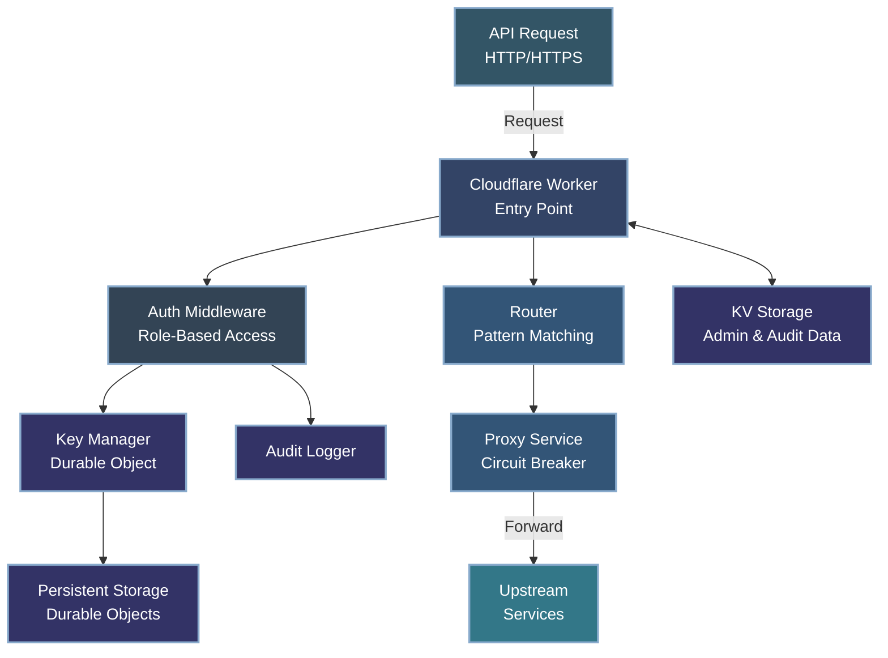

# API Gateway

A secure, scalable API gateway service built on Cloudflare Workers, providing both comprehensive API key management and full-fledged gateway capabilities. This service enables creating, validating, and managing API keys with permission scopes and expiration, while also offering advanced gateway features like request routing, proxying with circuit breaker patterns, and API versioning.

## Features

### Core Features
- **Secure Key Generation**: Cryptographically secure API key generation using Web Crypto API
- **Permission Scopes**: Restrict API key access with customizable permission scopes
- **Key Expiration**: Set automatic expiration dates for keys with cleanup
- **Usage Tracking**: Monitor when keys were last used for audit purposes
- **Durable Storage**: Persistent storage of API keys using Cloudflare Durable Objects
- **Rate Limiting**: Protect endpoints from abuse with configurable rate limits
- **IP Extraction**: Secure client IP address extraction for request tracking
- **Auto Cleanup**: Scheduled automatic cleanup of expired keys
- **CORS Support**: Built-in CORS handling for cross-origin requests

### Advanced Features
- **Role-Based Access Control**: Granular admin permissions with predefined roles
- **Admin User Management**: Create and manage admin users with specific permissions
- **Key Rotation**: Rotate keys with configurable grace periods for seamless transitions
- **Cursor-Based Pagination**: Efficient pagination for large datasets
- **Encryption at Rest**: AES-GCM encryption for API keys with versioned support
- **HMAC Verification**: Additional signature verification for enhanced security
- **Comprehensive Audit Logging**: Track all administrative actions with detailed context
- **Security Key Rotation**: Support for rotating encryption and HMAC secrets

### API Gateway Features
- **Enhanced Routing**: Support for regex pattern matching and parameter validation
- **API Versioning**: Configuration-driven API version management 
- **Request Proxying**: Forward requests to upstream services with transformation
- **Path Rewriting**: Transform request paths before forwarding
- **Header Manipulation**: Add, modify, or remove headers for proxied requests
- **Fault Tolerance**: Circuit breaker pattern and retry mechanisms
- **Timeout Management**: Configurable timeouts with request cancellation
- **OpenAPI Configuration**: Schema-validated configuration system with defaults
- **Environment Variable Support**: Flexible configuration through env vars or config files

## Architecture

This service uses Cloudflare Workers with Durable Objects and KV storage for:
- Globally consistent data storage without a separate database
- Low-latency access from any region
- Built-in scalability with Cloudflare's infrastructure
- Automatic background maintenance with Durable Object alarms



## Quick Start

```bash
# Install dependencies
npm install

# Start local development server
npm run dev

# First-time setup to create admin user
curl -X POST http://localhost:8787/setup \
  -H "Content-Type: application/json" \
  -d '{
    "name": "Super Admin",
    "email": "admin@example.com"
  }'

# Deploy to Cloudflare
npm run deploy
```

For detailed setup instructions, see the [Quick Start Guide](./docs/guides/quick-start.md).

## Documentation

Comprehensive documentation is available in the `docs/` folder:

### Guides
- [Quick Start Guide](./docs/guides/quick-start.md) - Set up and run your first API Gateway
- [Tutorials](./docs/guides/tutorials.md) - Step-by-step guides for common scenarios
- [Integration Guide](./docs/guides/integration-guide.md) - Integrate with client applications
- [Configuration Guide](./docs/guides/configuration-guide.md) - How to configure the API Gateway

### Reference
- [API Reference](./docs/reference/api-reference.md) - Complete API endpoints and usage
- [Configuration Reference](./docs/reference/configuration-reference.md) - All configuration options
- [Environment Variables Cheatsheet](./docs/reference/env-vars-cheatsheet.md) - Quick reference for env vars
- [Error Reference](./docs/reference/error-reference.md) - Error codes and troubleshooting
- [Security Reference](./docs/reference/security-reference.md) - Security features and implementation

### Architecture
- [Architecture Overview](./docs/architecture/overview.md) - High-level system architecture
- [Clean Architecture](./docs/architecture/clean-architecture.md) - Clean architecture implementation
- [Command Pattern](./docs/architecture/command-pattern.md) - Command pattern details
- [Directory Structure](./docs/architecture/directory-structure.md) - Codebase organization
- [API Gateway Features](./docs/architecture/api-gateway.md) - Gateway functionality details

### For Contributors
- [Contributing Guide](./docs/development/contributing.md) - How to contribute to the project
- [Testing Guide](./docs/development/testing.md) - Testing approaches and practices
- [Improvements](./docs/development/improvements.md) - Planned improvements
- [Development Roadmap](./docs/development/roadmap.md) - Future development plans

### Project Status
- [Changelog](./CHANGELOG.md) - Version history and changes

For a complete documentation index, see the [Documentation Hub](./docs/README.md).

## Security Features

The API Gateway includes comprehensive security features:

- **Encryption at Rest**: AES-GCM encryption for API keys
- **HMAC Signature Verification**: Additional signature validation
- **Key Rotation**: Support for both API key and cryptographic material rotation
- **Comprehensive Audit Logging**: Tracking of all administrative actions
- **Input Validation**: Strict validation to prevent injection attacks
- **Rate Limiting**: Protection against brute force and DoS attacks

For details, see the [Security Reference](./docs/reference/security-reference.md).

## API Gateway Roadmap

This project has implemented Phase 1 of its evolution into a full-fledged API gateway, with plans for further enhancements:

### Phase 1: Foundation (✅ Implemented)
- ✅ Improved request routing with regex patterns and path variables
- ✅ Enhanced path parameter validation
- ✅ API versioning support
- ✅ Proxy functionality for backend services with fault tolerance

### Phase 2: Advanced Features (In Progress)
- ⬜ Service discovery and registration system
- ⬜ Load balancing across multiple backend services
- ⬜ Advanced request/response transformation capabilities
- ⬜ Enhanced traffic management (throttling, circuit breaking)

### Phase 3: Enterprise Capabilities (Planned)
- ⬜ Support for multiple protocols (gRPC, WebSockets)
- ⬜ API composition and aggregation
- ⬜ Performance analytics dashboard
- ⬜ Blue/green and canary deployment capabilities

## License

[MIT](LICENSE)