# API Reference Documentation

This document provides a comprehensive reference for all API endpoints provided by the API Gateway. It includes request/response formats, authentication requirements, error codes, and usage examples.

## API Overview

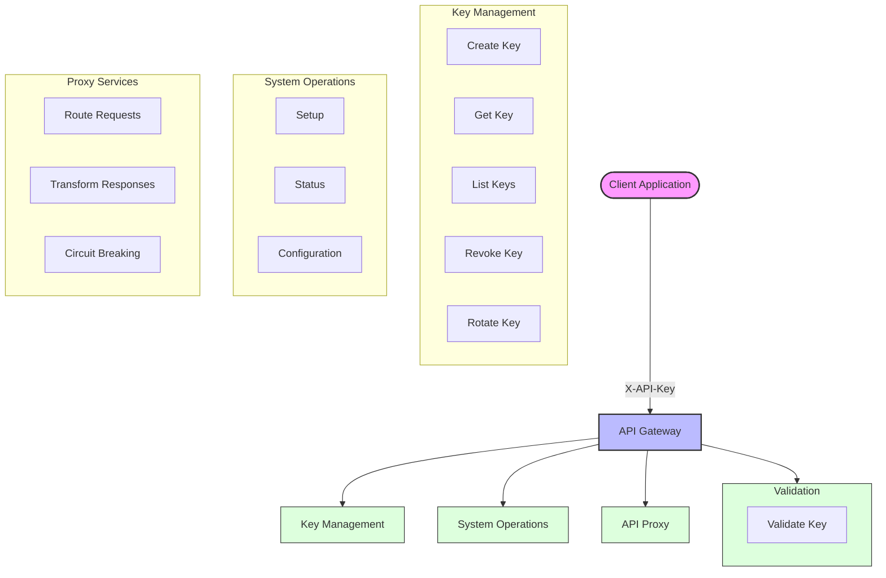

## API Architecture

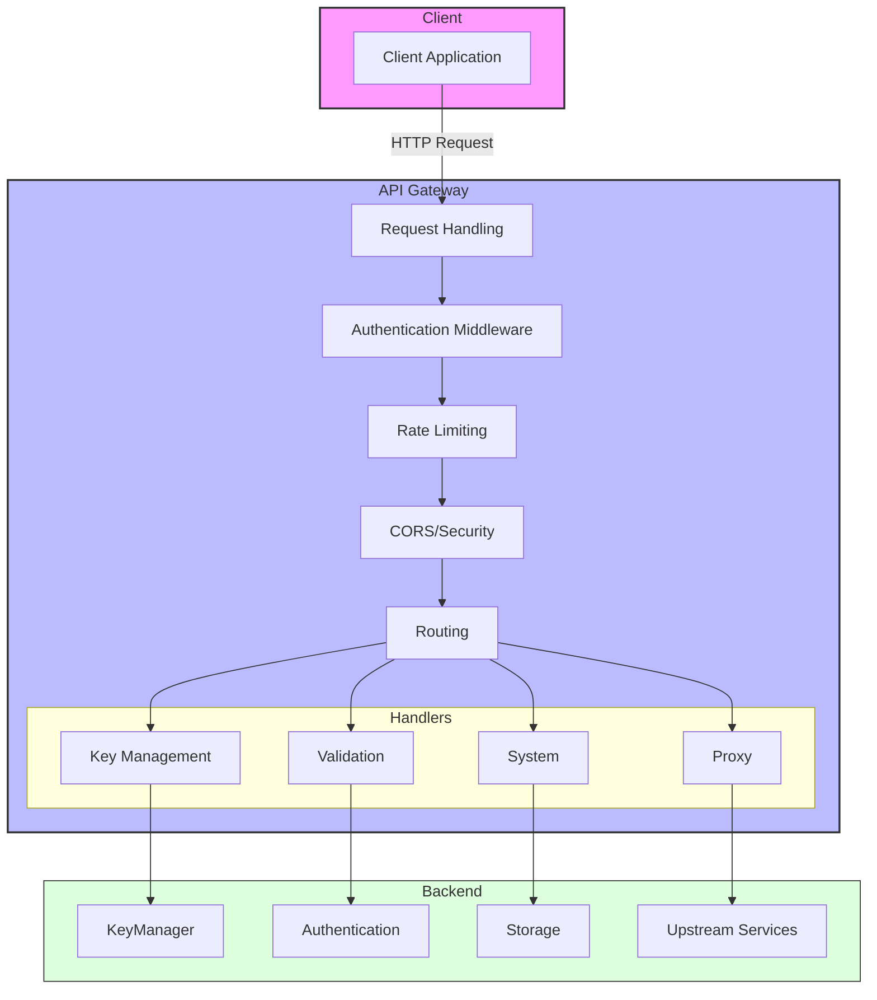

## Table of Contents

- [Authentication](#authentication)
- [API Key Management](#api-key-management)
  - [Create Key](#create-key)
  - [Get Key](#get-key)
  - [List Keys](#list-keys)
  - [Revoke Key](#revoke-key)
  - [Rotate Key](#rotate-key)
- [Key Validation](#key-validation)
  - [Validate Key](#validate-key)
- [System Operations](#system-operations)
  - [First-Time Setup](#first-time-setup)
  - [System Status](#system-status)
  - [System Configuration](#system-configuration)
- [API Gateway Features](#api-gateway-features)
  - [Proxy Request](#proxy-request)
- [Errors](#errors)
  - [Error Codes](#error-codes)
  - [Error Response Format](#error-response-format)
- [Webhooks](#webhooks)
- [Rate Limiting](#rate-limiting)

## Authentication

The API Gateway uses API key authentication for all endpoints. Administrative endpoints require an admin API key with appropriate permissions.

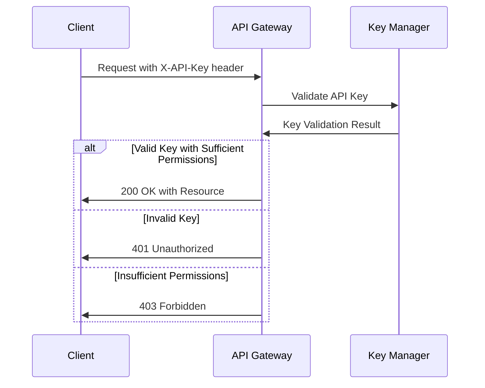

### Headers

```
X-API-Key: km_your_api_key_here
```

### Admin Permissions

Admin API keys include scopes that define their permissions:

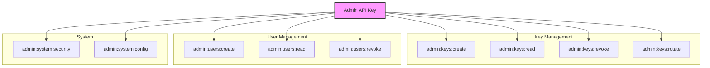

| Permission | Description |
|------------|-------------|
| `admin:keys:create` | Ability to create API keys |
| `admin:keys:read` | Ability to view API keys |
| `admin:keys:revoke` | Ability to revoke API keys |
| `admin:keys:rotate` | Ability to rotate API keys |
| `admin:users:create` | Ability to create admin users |
| `admin:users:read` | Ability to view admin users |
| `admin:users:revoke` | Ability to revoke admin access |
| `admin:system:security` | Ability to perform security operations |
| `admin:system:config` | Ability to view system configuration |

For complete details on role-based access control, see [SECURITY.md](./SECURITY.md).

## API Key Management

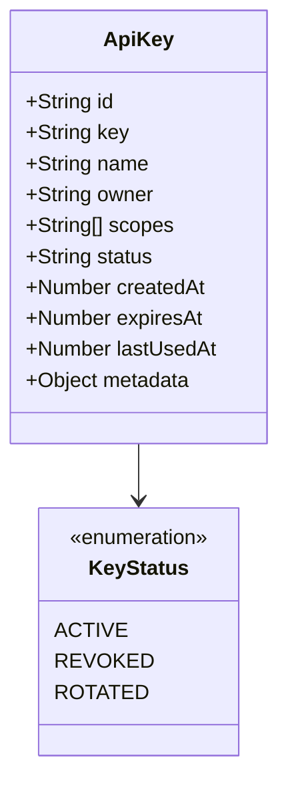

### Create Key

Creates a new API key with the specified properties.

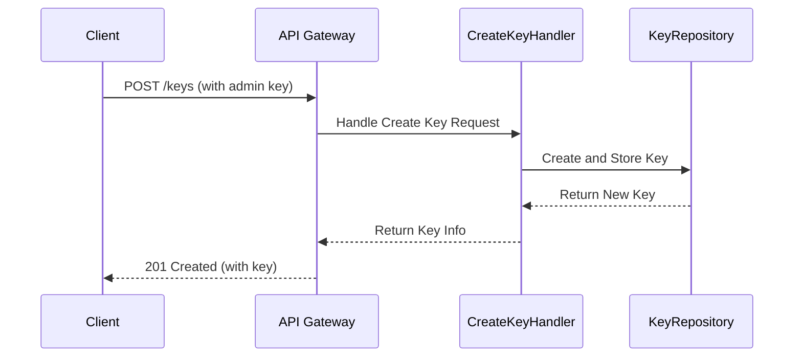

```
POST /keys
```

#### Authentication

Requires an admin API key with the `admin:keys:create` permission.

#### Request Body

```json
{
  "name": "My Application Key",
  "owner": "application-name",
  "scopes": ["read:data", "write:data"],
  "expiresAt": 1674259200000,
  "metadata": {
    "environment": "production",
    "team": "backend"
  }
}
```

| Field | Type | Required | Description |
|-------|------|----------|-------------|
| `name` | string | Yes | Descriptive name for the key |
| `owner` | string | Yes | Owner of the key (user, service, etc.) |
| `scopes` | array | Yes | Array of permission scopes |
| `expiresAt` | number | No | Expiration timestamp in milliseconds (0 = never expires) |
| `metadata` | object | No | Custom metadata for the key |

#### Response

```json
{
  "id": "550e8400-e29b-41d4-a716-446655440000",
  "key": "km_abcdef1234567890abcdef1234567890abcdef1234567890abcdef1234567890",
  "name": "My Application Key",
  "owner": "application-name",
  "scopes": ["read:data", "write:data"],
  "status": "active",
  "createdAt": 1642723200000,
  "expiresAt": 1674259200000,
  "lastUsedAt": 0,
  "metadata": {
    "environment": "production",
    "team": "backend"
  }
}
```

| Field | Type | Description |
|-------|------|-------------|
| `id` | string | Unique ID (UUID) for the key |
| `key` | string | The API key value (only shown on creation) |
| `name` | string | Descriptive name |
| `owner` | string | Key owner |
| `scopes` | array | Array of permission scopes |
| `status` | string | Key status (`active`, `revoked`, or `rotated`) |
| `createdAt` | number | Creation timestamp in milliseconds |
| `expiresAt` | number | Expiration timestamp (0 = never expires) |
| `lastUsedAt` | number | Last usage timestamp (0 = never used) |
| `metadata` | object | Custom metadata |

#### Error Codes

| Status | Code | Description |
|--------|------|-------------|
| 400 | `VALIDATION_ERROR` | Invalid request data |
| 401 | `UNAUTHORIZED` | Missing or invalid API key |
| 403 | `FORBIDDEN` | Insufficient permissions |

#### Example

```bash
curl -X POST https://api.example.com/keys \
  -H "X-API-Key: km_your_admin_key" \
  -H "Content-Type: application/json" \
  -d '{
    "name": "My Application Key",
    "owner": "application-name",
    "scopes": ["read:data", "write:data"]
  }'
```

### Get Key

Retrieves information about a specific API key by ID.

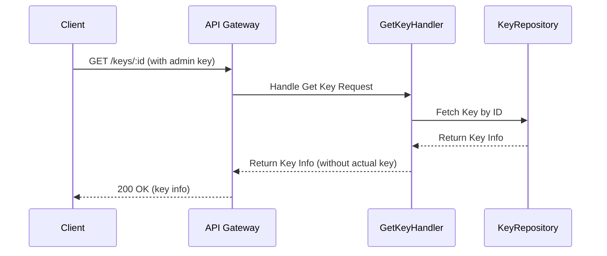

```
GET /keys/:id
```

#### Authentication

Requires an admin API key with the `admin:keys:read` permission.

#### Path Parameters

| Parameter | Description |
|-----------|-------------|
| `:id` | The UUID of the API key |

#### Response

```json
{
  "id": "550e8400-e29b-41d4-a716-446655440000",
  "name": "My Application Key",
  "owner": "application-name",
  "scopes": ["read:data", "write:data"],
  "status": "active",
  "createdAt": 1642723200000,
  "expiresAt": 1674259200000,
  "lastUsedAt": 1642780000000,
  "metadata": {
    "environment": "production",
    "team": "backend"
  }
}
```

Note: The actual API key value is not included in the response for security reasons.

#### Error Codes

| Status | Code | Description |
|--------|------|-------------|
| 401 | `UNAUTHORIZED` | Missing or invalid API key |
| 403 | `FORBIDDEN` | Insufficient permissions |
| 404 | `NOT_FOUND` | API key not found |

#### Example

```bash
curl https://api.example.com/keys/550e8400-e29b-41d4-a716-446655440000 \
  -H "X-API-Key: km_your_admin_key"
```

### List Keys

Retrieves a paginated list of API keys.

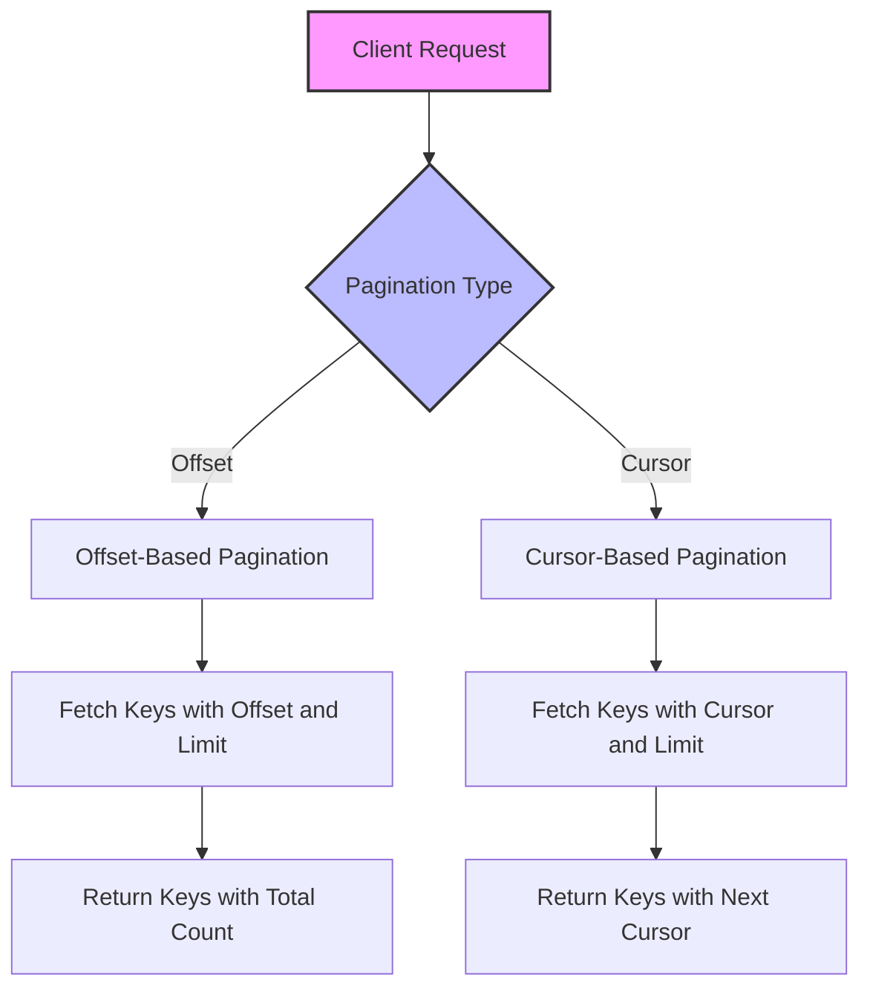

```
GET /keys
```

#### Authentication

Requires an admin API key with the `admin:keys:read` permission.

#### Query Parameters

| Parameter | Default | Description |
|-----------|---------|-------------|
| `limit` | 100 | Number of keys to return (max 1000) |
| `offset` | 0 | Offset for pagination |
| `cursor` | - | Cursor for cursor-based pagination (alternative to offset) |
| `status` | - | Filter by status (`active`, `revoked`, `rotated`) |
| `owner` | - | Filter by owner |

#### Response (Offset Pagination)

```json
{
  "items": [
    {
      "id": "550e8400-e29b-41d4-a716-446655440000",
      "name": "My Application Key",
      "owner": "application-name",
      "scopes": ["read:data", "write:data"],
      "status": "active",
      "createdAt": 1642723200000,
      "expiresAt": 1674259200000,
      "lastUsedAt": 1642780000000,
      "metadata": {
        "environment": "production",
        "team": "backend"
      }
    },
    // More keys...
  ],
  "totalItems": 42,
  "limit": 10,
  "offset": 0
}
```

#### Response (Cursor Pagination)

```json
{
  "items": [
    // API keys...
  ],
  "limit": 10,
  "hasMore": true,
  "nextCursor": "eyJpZCI6ImFiY2RlZjEyMzQiLCJ0cyI6MTY0MjcyMzIwMDAwMH0="
}
```

#### Error Codes

| Status | Code | Description |
|--------|------|-------------|
| 400 | `VALIDATION_ERROR` | Invalid pagination parameters |
| 401 | `UNAUTHORIZED` | Missing or invalid API key |
| 403 | `FORBIDDEN` | Insufficient permissions |

#### Example

```bash
curl "https://api.example.com/keys?limit=10&status=active" \
  -H "X-API-Key: km_your_admin_key"
```

### Revoke Key

Revokes an API key by ID.

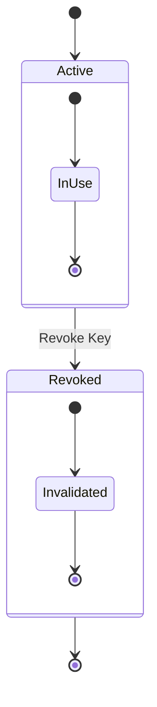

```
DELETE /keys/:id
```

#### Authentication

Requires an admin API key with the `admin:keys:revoke` permission.

#### Path Parameters

| Parameter | Description |
|-----------|-------------|
| `:id` | The UUID of the API key to revoke |

#### Query Parameters

| Parameter | Default | Description |
|-----------|---------|-------------|
| `reason` | - | Reason for revocation (optional) |

#### Response

```json
{
  "success": true,
  "message": "API key revoked successfully",
  "id": "550e8400-e29b-41d4-a716-446655440000",
  "name": "My Application Key",
  "revokedAt": 1642780000000
}
```

#### Error Codes

| Status | Code | Description |
|--------|------|-------------|
| 401 | `UNAUTHORIZED` | Missing or invalid API key |
| 403 | `FORBIDDEN` | Insufficient permissions |
| 404 | `NOT_FOUND` | API key not found |

#### Example

```bash
curl -X DELETE "https://api.example.com/keys/550e8400-e29b-41d4-a716-446655440000?reason=Security%20breach" \
  -H "X-API-Key: km_your_admin_key"
```

### Rotate Key

Rotates an API key with a grace period.

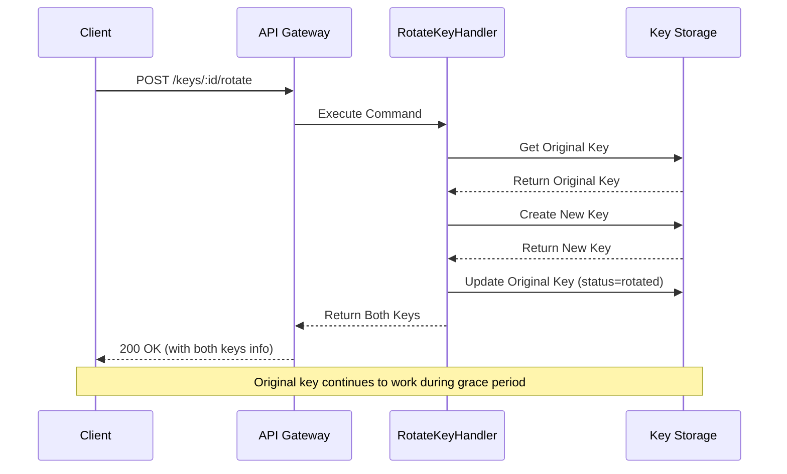

```
POST /keys/:id/rotate
```

#### Authentication

Requires an admin API key with the `admin:keys:rotate` permission.

#### Path Parameters

| Parameter | Description |
|-----------|-------------|
| `:id` | The UUID of the API key to rotate |

#### Request Body

```json
{
  "gracePeriodDays": 30,
  "scopes": ["read:data", "write:data"],
  "name": "Updated Key Name",
  "expiresAt": 1704931200000
}
```

| Field | Type | Required | Description |
|-------|------|----------|-------------|
| `gracePeriodDays` | number | No | Grace period in days (1-90) |
| `scopes` | array | No | Updated scopes (if not provided, keeps existing) |
| `name` | string | No | Updated name (if not provided, keeps existing) |
| `expiresAt` | number | No | Updated expiration timestamp |

#### Response

```json
{
  "success": true,
  "message": "API key rotated successfully",
  "originalKey": {
    "id": "550e8400-e29b-41d4-a716-446655440000",
    "name": "My Application Key",
    "status": "rotated",
    "rotatedAt": 1642780000000,
    "rotatedToId": "661f9511-f30c-52e5-b827-557766551111"
  },
  "newKey": {
    "id": "661f9511-f30c-52e5-b827-557766551111",
    "key": "km_fedcba0987654321fedcba0987654321fedcba0987654321fedcba0987654321",
    "name": "Updated Key Name",
    "scopes": ["read:data", "write:data"],
    "status": "active",
    "createdAt": 1642780000000,
    "expiresAt": 1704931200000,
    "rotatedFromId": "550e8400-e29b-41d4-a716-446655440000"
  },
  "gracePeriodDays": 30,
  "gracePeriodEnds": 1645372000000
}
```

#### Error Codes

| Status | Code | Description |
|--------|------|-------------|
| 400 | `VALIDATION_ERROR` | Invalid request data |
| 401 | `UNAUTHORIZED` | Missing or invalid API key |
| 403 | `FORBIDDEN` | Insufficient permissions |
| 404 | `NOT_FOUND` | API key not found |

#### Example

```bash
curl -X POST https://api.example.com/keys/550e8400-e29b-41d4-a716-446655440000/rotate \
  -H "X-API-Key: km_your_admin_key" \
  -H "Content-Type: application/json" \
  -d '{
    "gracePeriodDays": 30,
    "name": "Updated Key Name"
  }'
```

## Key Validation

### Validate Key

Validates an API key against required scopes.

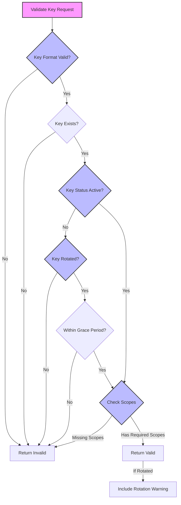

```
POST /validate
```

#### Request Body

```json
{
  "apiKey": "km_abcdef1234567890abcdef1234567890abcdef1234567890abcdef1234567890",
  "requiredScopes": ["read:data"]
}
```

| Field | Type | Required | Description |
|-------|------|----------|-------------|
| `apiKey` | string | Yes | API key to validate |
| `requiredScopes` | array | No | Scopes to check for (empty = no scope check) |

#### Response (Valid Key)

```json
{
  "valid": true,
  "keyId": "550e8400-e29b-41d4-a716-446655440000",
  "scopes": ["read:data", "write:data"],
  "owner": "application-name",
  "metadata": {
    "environment": "production",
    "team": "backend"
  }
}
```

#### Response (Invalid Key)

```json
{
  "valid": false,
  "error": "API key is revoked"
}
```

#### Response (Valid but Rotated Key)

```json
{
  "valid": true,
  "keyId": "550e8400-e29b-41d4-a716-446655440000",
  "scopes": ["read:data", "write:data"],
  "owner": "application-name",
  "metadata": {
    "environment": "production",
    "team": "backend"
  },
  "rotationWarning": {
    "message": "This API key has been rotated. Please update to the new key.",
    "gracePeriodEnds": 1645372000000,
    "newKeyId": "661f9511-f30c-52e5-b827-557766551111"
  }
}
```

#### Error Codes

| Status | Code | Description |
|--------|------|-------------|
| 400 | `VALIDATION_ERROR` | Invalid request data |
| 401 | `UNAUTHORIZED` | Invalid API key |
| 403 | `FORBIDDEN` | Missing required scopes |

#### Example

```bash
curl -X POST https://api.example.com/validate \
  -H "Content-Type: application/json" \
  -d '{
    "apiKey": "km_your_api_key",
    "requiredScopes": ["read:data"]
  }'
```

## System Operations

### First-Time Setup

Initializes the system with the first admin user.

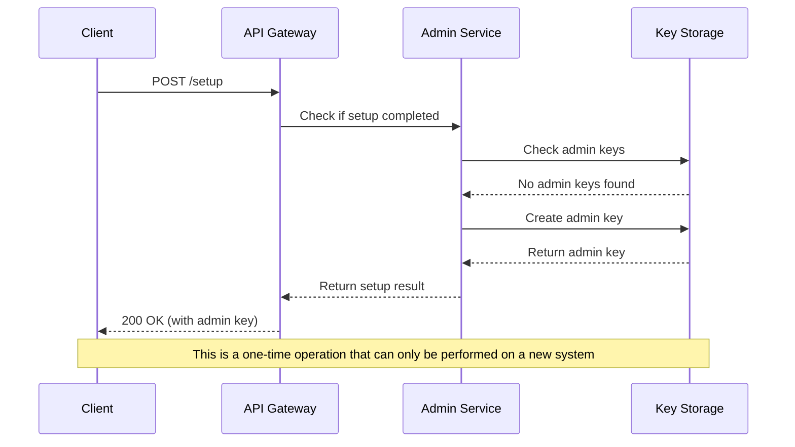

```
POST /setup
```

#### Request Body

```json
{
  "name": "Admin User",
  "email": "admin@example.com"
}
```

| Field | Type | Required | Description |
|-------|------|----------|-------------|
| `name` | string | Yes | Name of the first admin |
| `email` | string | Yes | Email of the first admin |

#### Response

```json
{
  "id": "550e8400-e29b-41d4-a716-446655440000",
  "key": "km_abcdef1234567890abcdef1234567890abcdef1234567890abcdef1234567890",
  "name": "Admin User (Super Admin)",
  "email": "admin@example.com",
  "role": "SUPER_ADMIN",
  "scopes": [
    "admin:keys:create",
    "admin:keys:read",
    "admin:keys:revoke",
    "admin:keys:rotate",
    "admin:users:create",
    "admin:users:read",
    "admin:users:revoke",
    "admin:system:security",
    "admin:system:config"
  ],
  "status": "active",
  "createdAt": 1642723200000
}
```

#### Error Codes

| Status | Code | Description |
|--------|------|-------------|
| 400 | `VALIDATION_ERROR` | Invalid request data |
| 409 | `CONFLICT` | Setup already completed |

#### Example

```bash
curl -X POST https://api.example.com/setup \
  -H "Content-Type: application/json" \
  -d '{
    "name": "Admin User",
    "email": "admin@example.com"
  }'
```

**Important**: This endpoint can only be called once. The admin API key is only returned in this initial response and cannot be retrieved later.

### System Status

Provides system status information.

```
GET /system/status
```

#### Authentication

No authentication required.

#### Response

```json
{
  "status": "healthy",
  "version": "1.0.0",
  "uptime": 86400,
  "timestamp": 1642723200000
}
```

#### Example

```bash
curl https://api.example.com/system/status
```

### System Configuration

Retrieves the current system configuration (redacted for security).

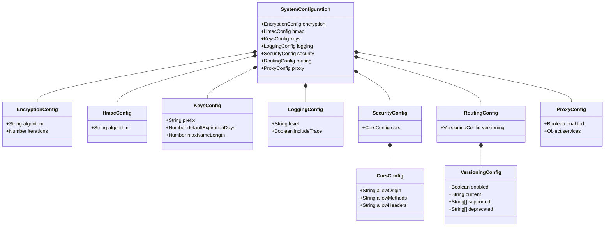

```
GET /system/config
```

#### Authentication

Requires an admin API key with the `admin:system:config` permission.

#### Response

```json
{
  "encryption": {
    "algorithm": "AES-GCM",
    "iterations": 100000
  },
  "hmac": {
    "algorithm": "SHA-384"
  },
  "keys": {
    "prefix": "km_",
    "defaultExpirationDays": 0,
    "maxNameLength": 255
  },
  "logging": {
    "level": "info",
    "includeTrace": true
  },
  "security": {
    "cors": {
      "allowOrigin": "https://admin.example.com",
      "allowMethods": "GET, POST, PUT, DELETE, OPTIONS",
      "allowHeaders": "Content-Type, Authorization, X-API-Key"
    }
  },
  "routing": {
    "versioning": {
      "enabled": true,
      "current": "1",
      "supported": ["1"],
      "deprecated": []
    }
  },
  "proxy": {
    "enabled": true,
    "services": {
      "auth": {
        "target": "https://auth.example.com"
      },
      "users": {
        "target": "https://users.example.com"
      }
    }
  }
}
```

#### Error Codes

| Status | Code | Description |
|--------|------|-------------|
| 401 | `UNAUTHORIZED` | Missing or invalid API key |
| 403 | `FORBIDDEN` | Insufficient permissions |

#### Example

```bash
curl https://api.example.com/system/config \
  -H "X-API-Key: km_your_admin_key"
```

## API Gateway Features

### Proxy Request

The API Gateway can proxy requests to upstream services based on the configured routes.

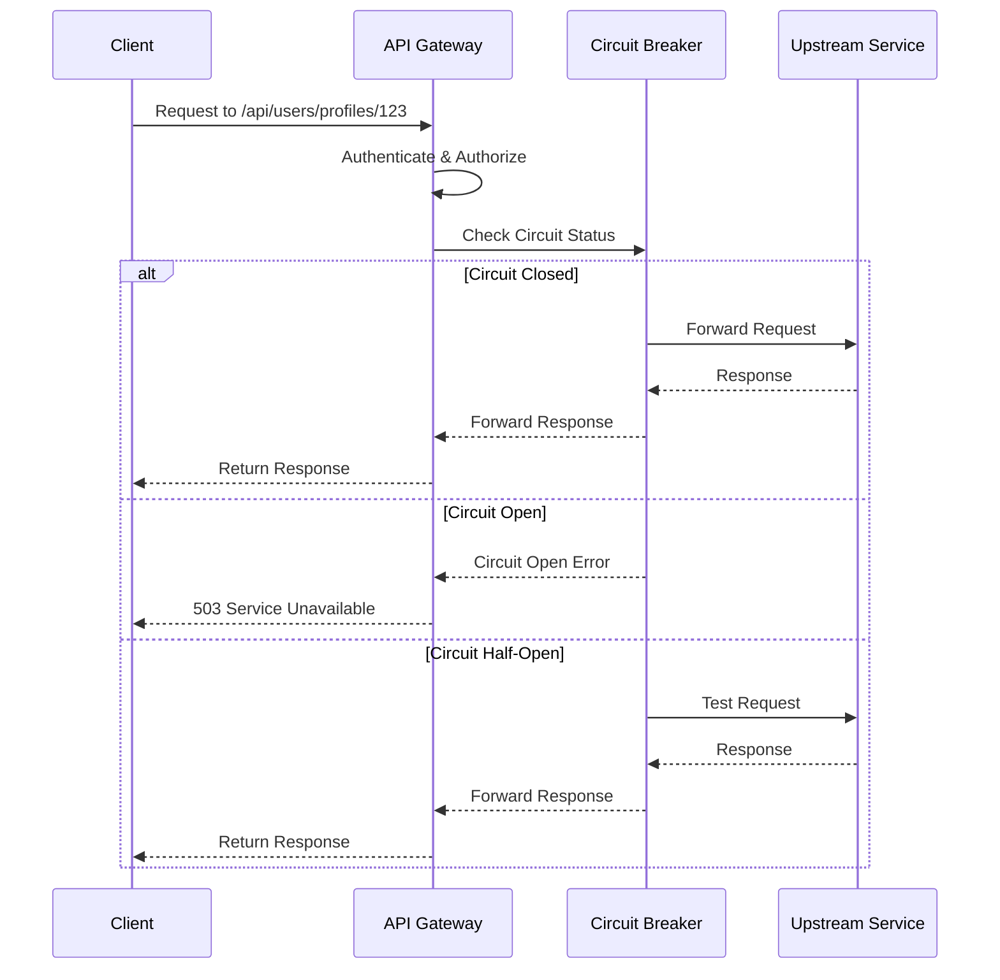

```
[ANY] /api/:service/*
```

#### Authentication

Requires a valid API key with appropriate scopes for the service.

#### Path Parameters

| Parameter | Description |
|-----------|-------------|
| `:service` | The name of the upstream service to proxy to |
| `*` | The rest of the path to forward to the service |

#### Example

```bash
curl https://api.example.com/api/users/profiles/123 \
  -H "X-API-Key: km_your_api_key" \
  -H "Content-Type: application/json"
```

This would proxy the request to the configured `users` service, forwarding to its `/profiles/123` endpoint.

## Errors

### Error Response Format

All errors follow a consistent JSON format:

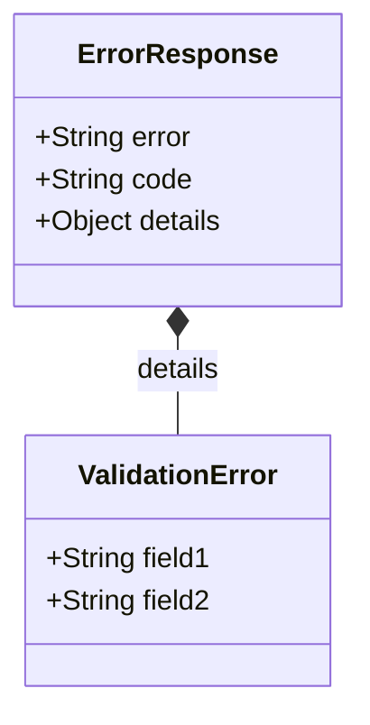

```json
{
  "error": "Error message",
  "code": "ERROR_CODE",
  "details": {
    "field1": "Specific error for field1",
    "field2": "Specific error for field2"
  }
}
```

| Field | Type | Description |
|-------|------|-------------|
| `error` | string | Human-readable error message |
| `code` | string | Error code for programmatic handling |
| `details` | object | Optional field-specific errors |

### Error Codes

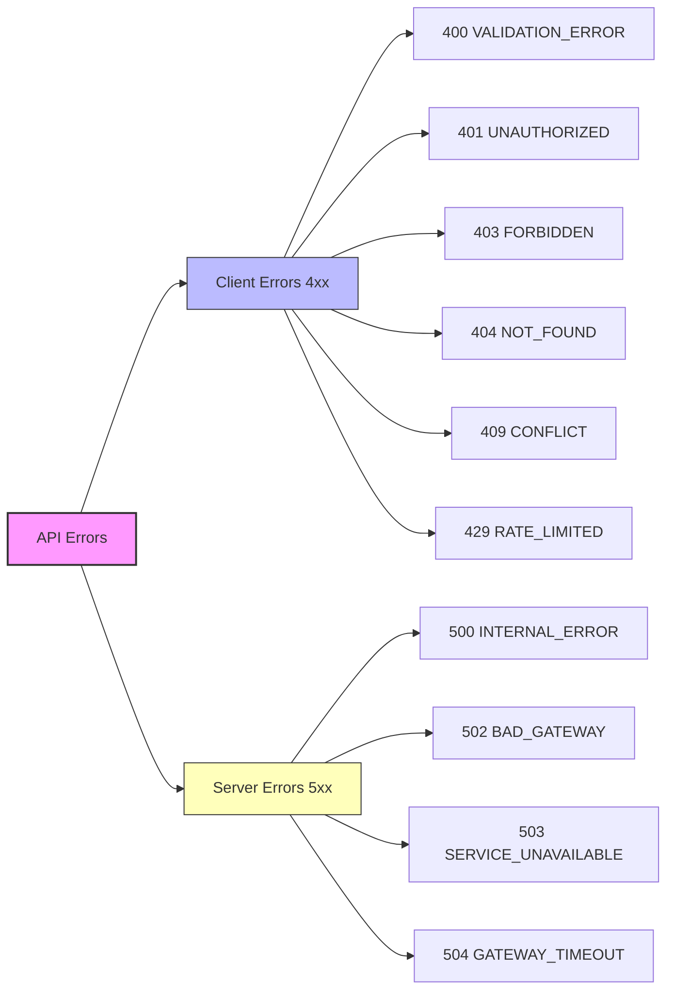

| Status | Code | Description |
|--------|------|-------------|
| 400 | `VALIDATION_ERROR` | Invalid request data |
| 401 | `UNAUTHORIZED` | Missing or invalid API key |
| 403 | `FORBIDDEN` | Insufficient permissions |
| 404 | `NOT_FOUND` | Resource not found |
| 409 | `CONFLICT` | Resource conflict |
| 429 | `RATE_LIMITED` | Too many requests |
| 500 | `INTERNAL_ERROR` | Server error |
| 502 | `BAD_GATEWAY` | Upstream service error |
| 503 | `SERVICE_UNAVAILABLE` | Service temporarily unavailable |
| 504 | `GATEWAY_TIMEOUT` | Upstream service timeout |

For more detailed information about error handling, see [ERROR_HANDLING.md](./ERROR_HANDLING.md).

## Webhooks

The API Gateway supports webhooks for key lifecycle events.

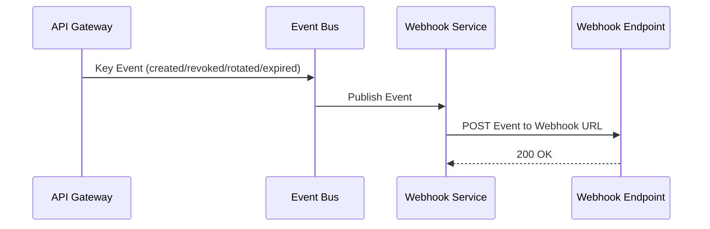

### Event Types

| Event | Description |
|-------|-------------|
| `key.created` | A new API key was created |
| `key.revoked` | An API key was revoked |
| `key.rotated` | An API key was rotated |
| `key.expired` | An API key expired |

### Webhook Payload Format

```json
{
  "event": "key.created",
  "timestamp": 1642723200000,
  "data": {
    "keyId": "550e8400-e29b-41d4-a716-446655440000",
    "owner": "application-name",
    "status": "active"
  }
}
```

Webhook configuration is done through the system configuration. See [CONFIGURATION.md](./CONFIGURATION.md) for details.

## Rate Limiting

The API Gateway implements rate limiting to prevent abuse:

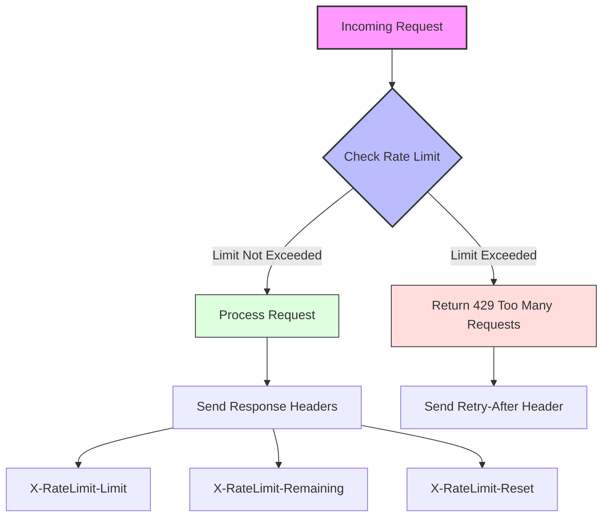

1. Default limits:
   - `/validate` endpoint: 300 req/min
   - `/keys` endpoint: 60 req/min
   - Other endpoints: 100 req/min

2. Rate limit response headers:
   - `X-RateLimit-Limit`: Total allowed requests per window
   - `X-RateLimit-Remaining`: Remaining requests in current window
   - `X-RateLimit-Reset`: Time (Unix timestamp) when window resets

3. When rate limited, receives a 429 Too Many Requests response:

```json
{
  "error": "Rate limit exceeded",
  "code": "RATE_LIMITED",
  "details": {
    "retryAfter": 45,
    "limit": 100,
    "reset": 1642723245000
  }
}
```

Rate limits can be configured through the system configuration. See [CONFIGURATION.md](./CONFIGURATION.md) for details.

## Additional Documentation

For more detailed information, refer to these additional documents:

- [Architecture Overview](./ARCHITECTURE.md)
- [Configuration Guide](./CONFIGURATION.md)
- [Security Documentation](./SECURITY.md)
- [Error Handling](./ERROR_HANDLING.md)
- [Gateway Features](./GATEWAY.md)
- [Tutorials](./TUTORIALS.md)