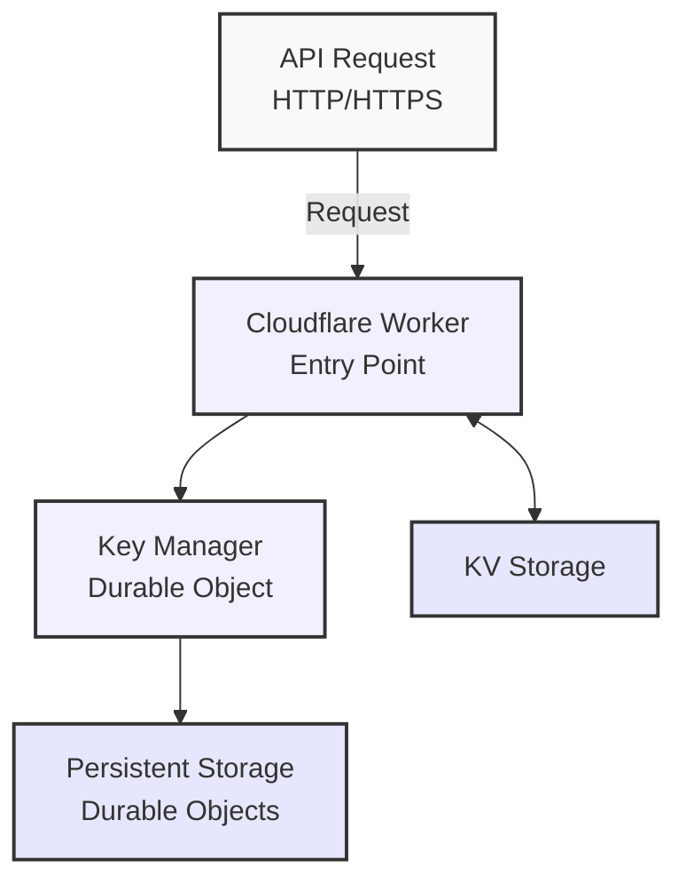
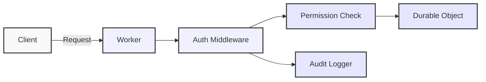
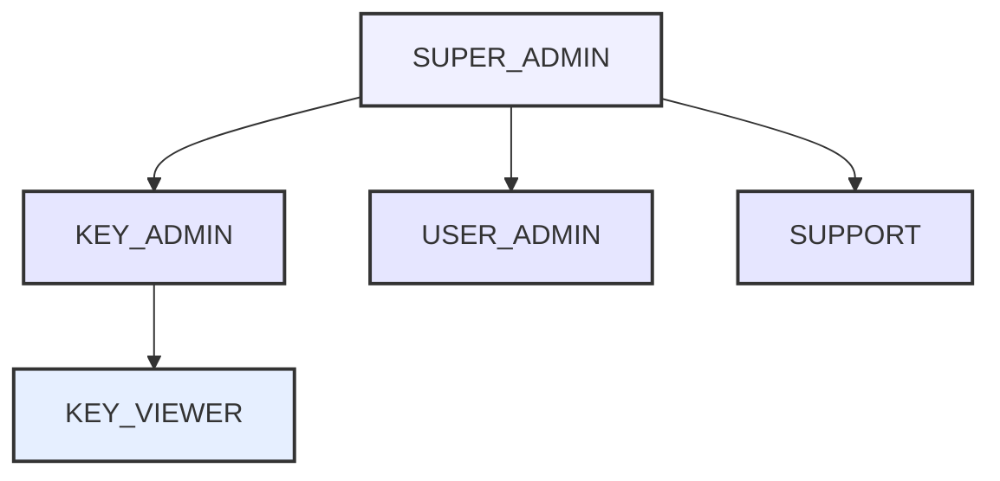
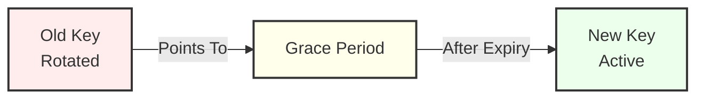
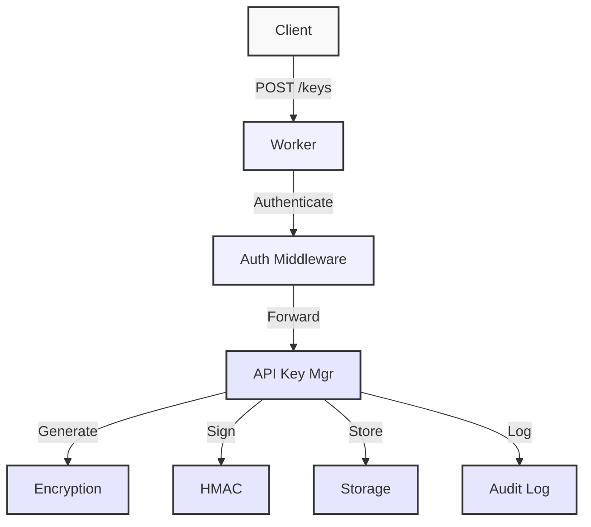
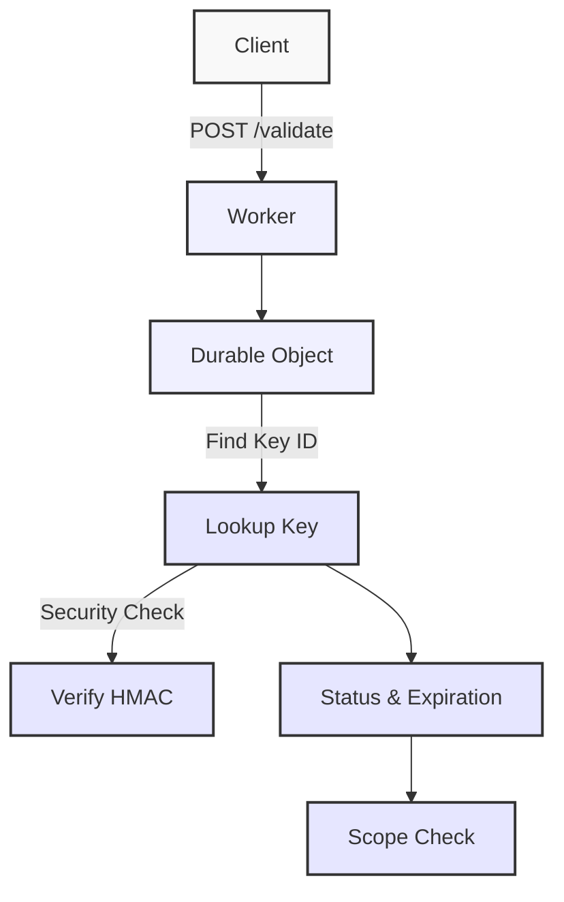
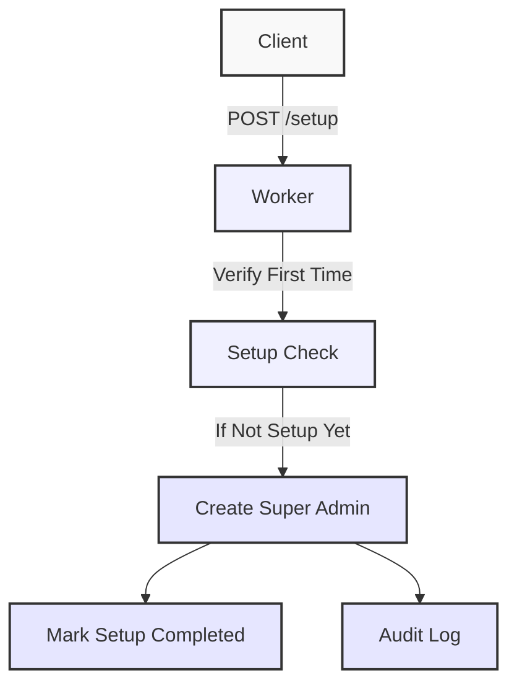

# Architecture Documentation

This document provides a detailed overview of the API Key Manager's architecture, including the new authentication and role-based access control system.

## System Architecture

The API Key Manager is built on Cloudflare Workers with Durable Objects, providing a globally distributed, highly available API key management service without a separate database.



The updated architecture includes:
1. Cloudflare KV for admin information, authentication, and audit logging
2. Durable Objects for API key management and storage
3. Authentication middleware for role-based access control
4. Background maintenance processes with alarms

### Authentication Flow



1. Client sends a request with an admin API key in the X-Api-Key header
2. Worker authenticates the request using the auth middleware
3. Permissions are checked based on the admin's role
4. Actions are logged for audit purposes
5. Request is forwarded to the Durable Object if authorized

## Key Components

### 1. Worker Entry Point (`index.js`)

The main Worker script acts as the entry point, handling incoming HTTP requests and routing them to the appropriate Durable Object.

Major responsibilities:
- First-time setup handling
- Request routing to Durable Objects
- Authentication middleware integration
- Admin information extraction
- Global error handling
- CORS configuration and handling

### 2. Authentication Module (`auth/` directory)

The new authentication module provides role-based access control:

- `auth/index.js` - Main authentication exports and middleware
- `auth/roles.js` - Role definitions and permission checking
- `auth/keyValidator.js` - API key validation logic
- `auth/keyGenerator.js` - Secure key generation
- `auth/adminManager.js` - Admin user management
- `auth/auditLogger.js` - Comprehensive audit logging

### 3. Key Manager Durable Object (`lib/KeyManagerDurableObject.js`)

The core Durable Object that provides the API key management functionality with persistent state.

Key responsibilities:
- Manages internal routing via the Router
- Handles all key management operations
- Provides data persistence via Durable Object storage
- Runs periodic maintenance via Durable Object alarms
- Integrates with the authentication system

### 4. API Key Manager (`models/ApiKeyManager.js`)

Business logic class that encapsulates API key management operations.

Key responsibilities:
- Creates new API keys with secure random values
- Validates API keys and their scopes
- Manages key revocation and expiration
- Handles key lookups and listing
- Supports key rotation with grace periods
- Cleans up expired keys and stale data

### 5. Router (`lib/router.js`)

HTTP router for handling API endpoints within the Durable Object.

Key responsibilities:
- Routes requests to the appropriate handler
- Extracts path parameters
- Provides middleware support
- Handles method not allowed errors

### 6. Utility Modules

Several utility modules provide supporting functionality:

- `utils/security.js`: Cryptographic and security functions, including encryption/decryption
- `utils/storage.js`: Storage key generation and consistency
- `utils/response.js`: HTTP response formatting
- `utils/validation.js`: Input validation functions

## Role-Based Access Control

The authentication system implements role-based access control:

### Roles and Permission Model



Each role has a defined set of permissions:

1. **SUPER_ADMIN**: Full system access
   - admin:keys:* - All key operations
   - admin:users:* - All user operations 
   - admin:system:* - All system operations

2. **KEY_ADMIN**: API key management
   - admin:keys:create - Create new keys
   - admin:keys:read - View keys
   - admin:keys:revoke - Revoke keys

3. **KEY_VIEWER**: Read-only key access
   - admin:keys:read - View keys

4. **USER_ADMIN**: Admin user management
   - admin:users:create - Create admins
   - admin:users:read - View admins
   - admin:users:revoke - Revoke admin access

5. **SUPPORT**: Limited access for support
   - admin:keys:read - View keys
   - admin:users:read - View admins

6. **CUSTOM**: Custom permissions as specified

### Permission Checking

All administrative endpoints check permissions before processing requests:

```javascript
// Check if admin has permission to list keys
if (!hasPermission(adminInfo, "admin:keys:read")) {
  return errorResponse("You do not have permission to list API keys", 403);
}
```

The `hasPermission()` function supports both direct and wildcard matches:

```javascript
// Direct match - the admin has exactly this permission
if (normalizedScope === normalizedRequired) {
  return true;
}

// Wildcard match at the end (e.g., "admin:keys:*")
if (normalizedScope.endsWith(":*")) {
  // Get the base scope (everything before the "*")
  const baseScope = normalizedScope.slice(0, -1);

  // If the required permission starts with this base, it's a match
  if (normalizedRequired.startsWith(baseScope)) {
    return true;
  }
}
```

## Comprehensive Audit Logging

The system logs all administrative actions for accountability:

### Audit Log Structure

Each audit log entry contains:

```javascript
const logEntry = {
  id: logId,            // Unique log ID
  timestamp: Date.now(), // When the action occurred
  adminId: adminId,     // Who performed the action
  action: action,       // What action was performed
  details: details,     // Additional context
  ip: clientIp,         // Client IP address
  userAgent: userAgent  // Client user agent
};
```

### Log Categories and Indexing

The system maintains multiple indices for efficient log retrieval:

1. **By Admin**: Logs indexed by the admin who performed the action
   - `log:admin:by_admin:{adminId}:{timestamp}_{logId}`

2. **By Action**: Logs indexed by the action type
   - `log:admin:by_action:{action}:{timestamp}_{logId}`

3. **Critical Actions**: Special index for security-critical actions
   - `log:admin:critical:{timestamp}_{logId}`

Critical actions include:
- system_setup
- system_config_change
- system_rotate_keys
- create_admin
- revoke_admin
- update_admin_permissions
- revoke_key_batch
- key_rotation

## Key Rotation

The system supports two types of key rotation:

### 1. API Key Rotation



The API key rotation process:
1. Original key is marked as "rotated" with a pointer to the new key
2. New key is created with the same or updated properties
3. A rotation record tracks the grace period
4. Both keys work during the grace period
5. After the grace period, only the new key is valid
6. System cleans up expired rotation records

### 2. Cryptographic Material Rotation

For sensitive security operations, the system can rotate the underlying encryption and HMAC secrets:

```javascript
// Rotate encryption material
const encryptionCount = await rotateEncryptionMaterial(
  this.state.storage,
  oldSecret,
  newSecret
);

// Rotate HMAC signatures
const hmacCount = await rotateHmacMaterial(
  this.state.storage,
  oldSecret,
  newSecret
);
```

This process:
1. Decrypts all API keys using the old secret
2. Re-encrypts them with the new secret
3. Updates all HMAC signatures with the new secret
4. Maintains comprehensive logs of the rotation process

## API Flow

### Creating an API Key



1. Client sends a POST request to `/keys` with an admin API key
2. Worker authenticates the request and checks permissions
3. If authorized, the request is routed to the Key Manager Durable Object
4. ApiKeyManager generates a secure random key
5. The key is encrypted for storage
6. An HMAC signature is generated for the key
7. The key and associated metadata are stored in Durable Object storage
8. Multiple storage indices are created for efficient lookup
9. The action is logged in the audit system
10. The full key details are returned to the client

### Validating an API Key



1. Client sends a POST request to `/validate` with an API key
2. The request is routed to the Key Manager Durable Object
3. The key ID is looked up using the fast lookup index
4. The HMAC signature is verified for additional security
5. Key status (active/revoked/rotated) is checked
6. Expiration is checked (expired keys are auto-revoked)
7. If scopes are requested, they are validated against the key's scopes
8. For rotated keys, rotation status and grace period are checked
9. Usage timestamp is updated (non-blocking)
10. Validation result is returned to the client

### First-Time Setup Flow



1. Client sends a POST request to `/setup` with admin data
2. Worker checks if setup has already been completed
3. If not completed, creates the first admin with SUPER_ADMIN role
4. Sets a flag indicating setup is complete
5. Logs the setup action in the audit system
6. Returns the admin API key to the client (only shown once)

## Data Model

### API Key Structure

Each API key stored in the system has the following structure:

```javascript
{
  id: "uuid-string",              // Unique identifier (UUID)
  name: "My API Key",             // Descriptive name
  owner: "user@example.com",      // Key owner
  email: "contact@example.com",   // Owner email (optional)
  scopes: ["read:data"],          // Permission scopes
  status: "active",               // Status (active, revoked, or rotated)
  createdAt: 1677609600000,       // Creation timestamp (ms)
  expiresAt: 1735689600000,       // Expiration timestamp (ms, 0 = never)
  lastUsedAt: 1677695999000,      // Last usage timestamp (ms)
  encryptedKey: {                 // Encrypted key data (not exposed to clients)
    encryptedData: "hex-string",
    iv: "hex-string",
    salt: "hex-string",
    iterations: 100000,
    version: 2
  },
  rotatedAt: 1677609600000,       // When the key was rotated (if applicable)
  rotatedToId: "uuid-string",     // ID of the new key (if rotated)
  rotatedFromId: "uuid-string",   // ID of the old key (if this is a rotated key)
}
```

### Rotation Record Structure

```javascript
{
  originalKeyId: "uuid-string",    // Original key ID
  newKeyId: "uuid-string",         // New key ID
  rotatedAt: 1677609600000,        // When rotation occurred
  gracePeriodEnds: 1680288000000,  // When grace period ends
  status: "active"                 // Rotation status
}
```

### Audit Log Structure

```javascript
{
  id: "log-uuid",                 // Unique log ID
  timestamp: 1677609600000,       // When the action occurred
  adminId: "admin-uuid",          // Who performed the action
  action: "create_key",           // What action was performed
  details: {                      // Action-specific details
    keyId: "key-uuid",
    name: "New API Key"
  },
  ip: "192.168.1.1",              // Client IP address
  userAgent: "Mozilla/5.0..."     // Client user agent
}
```

### Storage Schema

The data is organized in Durable Object storage and KV using the following key patterns:

#### Durable Object Storage

- `key:{uuid}` - Stores the complete API key record
- `lookup:{api_key_value}` - Maps API key values to their UUIDs for fast validation
- `hmac:{api_key_value}` - Stores HMAC signatures for additional security
- `rotation:{uuid}` - Stores key rotation information
- `keyindex:{timestamp}_{uuid}` - Sortable index for efficient pagination

#### KV Storage

- `system:setup_completed` - Flag indicating if setup is complete
- `key:{uuid}` - Stores admin key data
- `lookup:{api_key_value}` - Maps admin keys to their UUIDs
- `index:admin:{uuid}` - Index of admin keys
- `log:admin:{log_id}` - Stores audit log entries
- `log:admin:by_admin:{admin_id}:{timestamp}_{log_id}` - Admin log index
- `log:admin:by_action:{action}:{timestamp}_{log_id}` - Action log index
- `log:admin:critical:{timestamp}_{log_id}` - Critical action log index

## Maintenance and Cleanup

The system uses Durable Object alarms for automatic maintenance:

### Cleanup Process

1. An alarm is set when the Durable Object is created
2. When the alarm fires, the system:
   - Identifies and revokes expired keys
   - Removes stale lookup entries
   - Cleans up expired rotation records
3. A new alarm is scheduled for the next cleanup cycle
4. In case of errors, a shorter alarm interval is used

## Scalability and Performance

The API Key Manager is designed for high scalability and performance:

1. **Efficient Lookup**: Fast key validation through a lookup index
2. **Cursor-based Pagination**: Efficient pagination for large datasets
3. **Non-blocking Updates**: Usage timestamps are updated non-blocking
4. **Transaction Support**: Atomic operations for data consistency
5. **Minimal Storage**: Only essential data is stored with reasonable limits
6. **Concurrent Safety**: All operations are safe under high concurrency
7. **Global Distribution**: Cloudflare's global network provides low-latency access

## Security Design

See [SECURITY.md](./SECURITY.md) for detailed security implementation information.

Key security features:
- Role-based access control
- AES-GCM encryption for keys at rest
- HMAC signature verification
- Comprehensive audit logging
- API key rotation with grace periods
- Cryptographic material rotation
- Input validation and sanitization
- Rate limiting and IP validation
