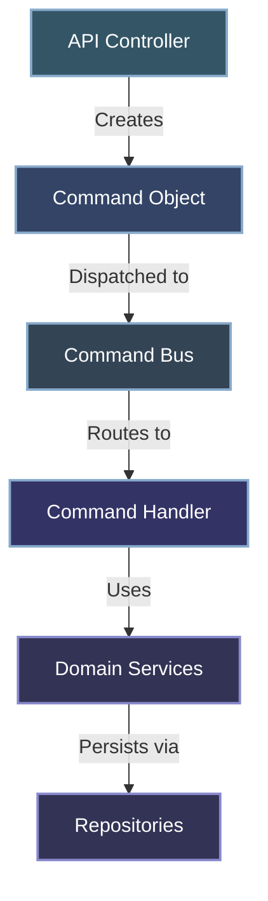
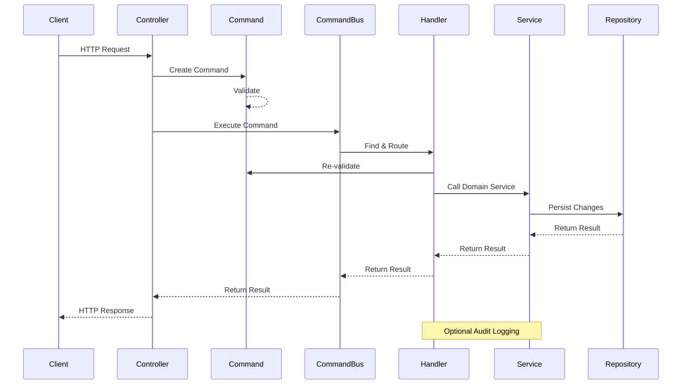

# Command Pattern Implementation

This document explains the Command Pattern implementation in the API Gateway Workers project, providing a detailed overview of the architecture, components, and usage patterns.

## Overview

The Command Pattern is a behavioral design pattern that encapsulates a request as an object, allowing for parameterization of clients with different requests, queuing of requests, and logging of operations. In the API Gateway Workers, it forms the backbone of the business logic layer.



## Core Components

### 1. Command Objects

Commands are immutable data structures that represent an intention to perform an action. They encapsulate all the information needed to perform that action.

#### Base Command Class

```javascript
// src/core/command/Command.js
export class Command {
  /**
   * Validate the command
   * 
   * @returns {Object} Validation result with isValid and errors
   */
  validate() {
    return { isValid: true, errors: {} };
  }
  
  /**
   * Get the name of the command
   * 
   * @returns {string} Command name
   */
  get name() {
    return this.constructor.name;
  }
}
```

#### Example Command Implementation

```javascript
// src/core/keys/commands/CreateKeyCommand.js
import { Command } from "../../command/Command.js";
import { validateCreateKeyParams } from "../../../utils/validation.js";

export class CreateKeyCommand extends Command {
  /**
   * Create a new CreateKeyCommand
   *
   * @param {Object} data - Key creation parameters
   */
  constructor(data) {
    super();
    this.name = data.name;
    this.owner = data.owner;
    this.scopes = data.scopes;
    this.expiresAt = data.expiresAt;
    this.createdBy = data.createdBy;
    this.metadata = data.metadata || {};
  }

  /**
   * Validate the command
   *
   * @returns {Object} Validation result
   */
  validate() {
    return validateCreateKeyParams({
      name: this.name,
      owner: this.owner,
      scopes: this.scopes,
      expiresAt: this.expiresAt
    });
  }
}
```

### 2. Command Handlers

Handlers contain the business logic to execute a specific command. Each handler is responsible for handling one command type.

#### Base Handler Class

```javascript
// src/core/command/CommandHandler.js
export class CommandHandler {
  /**
   * Check if this handler can handle the command
   *
   * @param {Command} command - Command to check
   * @returns {boolean} True if this handler can handle the command
   */
  canHandle(command) {
    throw new Error("Method not implemented");
  }

  /**
   * Handle the command
   *
   * @param {Command} command - Command to handle
   * @param {Object} context - Execution context
   * @returns {Promise<any>} Command result
   */
  async handle(command, context) {
    throw new Error("Method not implemented");
  }
}
```

#### Example Handler Implementation

```javascript
// src/core/keys/handlers/CreateKeyHandler.js
import { CommandHandler } from "../../command/CommandHandler.js";
import { CreateKeyCommand } from "../commands/CreateKeyCommand.js";
import { ValidationError } from "../../errors/ApiError.js";

export class CreateKeyHandler extends CommandHandler {
  /**
   * Create a new CreateKeyHandler
   *
   * @param {KeyService} keyService - Key service
   * @param {AuditLogger} auditLogger - Audit logger
   */
  constructor(keyService, auditLogger) {
    super();
    this.keyService = keyService;
    this.auditLogger = auditLogger;
  }

  /**
   * Check if this handler can handle the command
   *
   * @param {Command} command - Command to check
   * @returns {boolean} True if this handler can handle the command
   */
  canHandle(command) {
    return command instanceof CreateKeyCommand;
  }

  /**
   * Handle the command
   *
   * @param {CreateKeyCommand} command - Command to handle
   * @param {Object} context - Execution context
   * @returns {Promise<Object>} Created key
   */
  async handle(command, context = {}) {
    // Validate the command
    const validation = command.validate();
    if (!validation.isValid) {
      throw new ValidationError("Invalid key creation parameters", validation.errors);
    }

    // Create the key
    const key = await this.keyService.createKey({
      name: command.name,
      owner: command.owner,
      scopes: command.scopes,
      expiresAt: command.expiresAt,
      metadata: command.metadata
    });

    // Log the action if we have admin info
    if (command.createdBy && this.auditLogger) {
      await this.auditLogger.logAdminAction(
        command.createdBy,
        "create_key",
        {
          keyId: key.id,
          name: key.name,
          owner: key.owner
        },
        context.env,
        context.request
      );
    }

    return key;
  }
}
```

### 3. Command Bus

The Command Bus acts as a mediator that routes commands to the appropriate handlers.

```javascript
// src/core/command/CommandBus.js
export class CommandBus {
  /**
   * Create a new CommandBus
   */
  constructor() {
    this.handlers = [];
  }

  /**
   * Register a handler
   *
   * @param {CommandHandler} handler - Handler to register
   */
  registerHandler(handler) {
    this.handlers.push(handler);
  }

  /**
   * Execute a command
   *
   * @param {Command} command - Command to execute
   * @param {Object} context - Execution context
   * @returns {Promise<any>} Command result
   */
  async execute(command, context = {}) {
    // Ensure the command is valid before attempting to execute
    if (!command) {
      throw new Error("Cannot execute null or undefined command");
    }

    // Find the right handler
    const handler = this.findHandler(command);
    if (!handler) {
      throw new Error(`No handler found for command: ${command.constructor.name}`);
    }

    // Handle the command
    return handler.handle(command, context);
  }

  /**
   * Find a handler for a command
   *
   * @param {Command} command - Command to find handler for
   * @returns {CommandHandler|null} Handler or null if not found
   */
  findHandler(command) {
    return this.handlers.find(handler => handler.canHandle(command)) || null;
  }
}
```

## Command Flow

The command pattern establishes a clear flow from user request to business logic execution:



## Complete Command/Handler Pairs

The API Gateway Workers implements several command/handler pairs:

### Key Management

1. **Create Key**
   - `CreateKeyCommand`: Represents the intention to create a new API key
   - `CreateKeyHandler`: Creates and stores a new API key

2. **Get Key**
   - `GetKeyCommand`: Represents the intention to retrieve a key by ID
   - `GetKeyHandler`: Retrieves key details from storage

3. **List Keys**
   - `ListKeysCommand`: Represents the intention to list keys with pagination
   - `ListKeysHandler`: Retrieves a paginated list of keys

4. **Validate Key**
   - `ValidateKeyCommand`: Represents the intention to validate an API key
   - `ValidateKeyHandler`: Validates an API key against required scopes

5. **Revoke Key**
   - `RevokeKeyCommand`: Represents the intention to revoke an API key
   - `RevokeKeyHandler`: Revokes an API key and updates its status

6. **Rotate Key**
   - `RotateKeyCommand`: Represents the intention to rotate an API key
   - `RotateKeyHandler`: Rotates an API key with a grace period

7. **Cleanup Expired Keys**
   - `CleanupExpiredKeysCommand`: Represents the intention to clean up expired keys
   - `CleanupExpiredKeysHandler`: Finds and revokes expired keys

## Container Setup for Commands

The system uses a dependency injection container to wire up commands and handlers:

```javascript
// src/infrastructure/di/setupContainer.js
export function setupContainer(env) {
  // Create container
  const container = new Container();

  // Register services
  // ...

  // Register command handlers
  container.register('createKeyHandler', (c) => {
    return new CreateKeyHandler(c.resolve('keyService'), c.resolve('auditLogger'));
  });
  
  container.register('getKeyHandler', (c) => {
    return new GetKeyHandler(c.resolve('keyService'), c.resolve('auditLogger'));
  });
  
  // More handlers...

  // Register command bus
  container.register('commandBus', (c) => {
    const bus = new CommandBus();
    bus.registerHandler(c.resolve('createKeyHandler'));
    bus.registerHandler(c.resolve('getKeyHandler'));
    // Register more handlers...
    return bus;
  });

  return container;
}
```

## Controller Integration

Controllers use the command pattern to implement API endpoints:

```javascript
// src/api/controllers/KeysController.js
export class KeysController extends BaseController {
  /**
   * Create a new API key
   *
   * @param {Request} request - HTTP request
   * @returns {Promise<Response>} HTTP response
   */
  async createKey(request) {
    try {
      // Get services from context
      const { commandBus, authService } = this.services;
      
      // Get admin info from context
      const admin = this.getAdminInfo();
      
      // Check permissions
      authService.requirePermission(admin, "admin:keys:create");
      
      // Get request body
      const data = await request.json();
      
      // Create and execute command
      const command = new CreateKeyCommand({
        name: data.name,
        owner: data.owner,
        scopes: data.scopes,
        expiresAt: data.expiresAt,
        createdBy: admin.keyId,
        metadata: data.metadata
      });
      
      const result = await commandBus.execute(command, this.getExecutionContext());
      
      // Return success response
      return new Response(JSON.stringify(result), {
        status: 201,
        headers: { 'Content-Type': 'application/json' }
      });
    } catch (error) {
      // Error handling
      return this.handleError(error, request);
    }
  }
  
  // More controller methods...
}
```

## Benefits of the Command Pattern

The Command Pattern provides several benefits in the API Gateway Workers implementation:

1. **Separation of Concerns**
   - Commands represent the user's intention
   - Handlers contain business logic
   - Controllers focus on HTTP concerns
   - Services focus on domain logic

2. **Testability**
   - Commands are easily testable data structures
   - Handlers can be tested with mock services
   - CommandBus simplifies unit testing

3. **Single Responsibility**
   - Each handler has a single responsibility
   - Commands have a clear purpose
   - Clear separation between validation and execution

4. **Extensibility**
   - New commands can be added without modifying existing code
   - Handlers can be replaced or modified independently
   - CommandBus provides a consistent interface

5. **Auditability**
   - Commands represent business actions
   - Centralized logging in handlers
   - Clear traceability from user action to system change

## Testing Commands and Handlers

Here's how the pattern facilitates testing:

### Testing Commands

Commands are simple data objects with validation logic:

```javascript
// test/core/keys/commands/CreateKeyCommand.test.js
import { CreateKeyCommand } from '../../../../src/core/keys/commands/CreateKeyCommand.js';
import { jest, describe, it, expect } from '@jest/globals';

describe('CreateKeyCommand', () => {
  describe('constructor', () => {
    it('should set all properties from data', () => {
      const data = {
        name: 'Test Key',
        owner: 'test@example.com',
        scopes: ['read:data'],
        expiresAt: 1234567890,
        createdBy: 'admin-id',
        metadata: { test: 'metadata' }
      };
      
      const command = new CreateKeyCommand(data);
      
      expect(command.name).toBe(data.name);
      expect(command.owner).toBe(data.owner);
      expect(command.scopes).toBe(data.scopes);
      expect(command.expiresAt).toBe(data.expiresAt);
      expect(command.createdBy).toBe(data.createdBy);
      expect(command.metadata).toEqual(data.metadata);
    });
  });
  
  describe('validate', () => {
    it('should return valid for valid data', () => {
      const command = new CreateKeyCommand({
        name: 'Test Key',
        owner: 'test@example.com',
        scopes: ['read:data']
      });
      
      const result = command.validate();
      
      expect(result.isValid).toBe(true);
      expect(result.errors).toEqual({});
    });
    
    it('should return invalid for missing fields', () => {
      const command = new CreateKeyCommand({
        // Missing required fields
      });
      
      const result = command.validate();
      
      expect(result.isValid).toBe(false);
      expect(result.errors).toHaveProperty('name');
      expect(result.errors).toHaveProperty('owner');
      expect(result.errors).toHaveProperty('scopes');
    });
  });
});
```

### Testing Handlers

Handlers contain business logic and are tested with mock dependencies:

```javascript
// test/core/keys/handlers/CreateKeyHandler.test.js
import { CreateKeyHandler } from '../../../../src/core/keys/handlers/CreateKeyHandler.js';
import { CreateKeyCommand } from '../../../../src/core/keys/commands/CreateKeyCommand.js';
import { ValidationError } from '../../../../src/core/errors/ApiError.js';
import { jest, describe, it, expect, beforeEach } from '@jest/globals';

describe('CreateKeyHandler', () => {
  let handler;
  let keyService;
  let auditLogger;
  
  beforeEach(() => {
    // Create mock dependencies
    keyService = {
      createKey: jest.fn().mockImplementation(async (params) => {
        return {
          id: 'new-key-id',
          name: params.name,
          owner: params.owner,
          scopes: params.scopes,
          status: 'active',
          createdAt: Date.now(),
          expiresAt: params.expiresAt || 0
        };
      })
    };
    
    auditLogger = {
      logAdminAction: jest.fn().mockResolvedValue('log-id')
    };
    
    // Create handler instance
    handler = new CreateKeyHandler(keyService, auditLogger);
  });
  
  describe('canHandle', () => {
    it('should return true for CreateKeyCommand', () => {
      const command = new CreateKeyCommand({
        name: 'Test Key',
        owner: 'test@example.com',
        scopes: ['read:data']
      });
      
      expect(handler.canHandle(command)).toBe(true);
    });
    
    it('should return false for other commands', () => {
      const command = { name: 'OtherCommand' };
      
      expect(handler.canHandle(command)).toBe(false);
    });
  });
  
  describe('handle', () => {
    it('should create a key using the key service', async () => {
      const command = new CreateKeyCommand({
        name: 'Test Key',
        owner: 'test@example.com',
        scopes: ['read:data'],
        createdBy: 'admin-id'
      });
      
      const result = await handler.handle(command);
      
      expect(keyService.createKey).toHaveBeenCalledWith({
        name: 'Test Key',
        owner: 'test@example.com',
        scopes: ['read:data'],
        expiresAt: undefined,
        metadata: {}
      });
      
      expect(result.id).toBe('new-key-id');
      expect(result.name).toBe('Test Key');
    });
    
    it('should throw validation error for invalid command', async () => {
      // Create a command with invalid data that will fail validation
      const command = new CreateKeyCommand({});
      
      // Override validate method to return validation error
      command.validate = jest.fn().mockReturnValue({
        isValid: false,
        errors: { name: 'Name is required' }
      });
      
      await expect(handler.handle(command)).rejects.toThrow(ValidationError);
      expect(keyService.createKey).not.toHaveBeenCalled();
    });
    
    it('should log the action if createdBy is provided', async () => {
      const command = new CreateKeyCommand({
        name: 'Test Key',
        owner: 'test@example.com',
        scopes: ['read:data'],
        createdBy: 'admin-id'
      });
      
      const context = {
        env: { KV: {} },
        request: { headers: new Map() }
      };
      
      await handler.handle(command, context);
      
      expect(auditLogger.logAdminAction).toHaveBeenCalledWith(
        'admin-id',
        'create_key',
        expect.objectContaining({
          keyId: 'new-key-id',
          name: 'Test Key'
        }),
        context.env,
        context.request
      );
    });
  });
});
```

## Command Types Reference

| Command | Description | Handler | Parameters |
|---------|-------------|---------|------------|
| `CreateKeyCommand` | Create a new API key | `CreateKeyHandler` | name, owner, scopes, expiresAt, createdBy, metadata |
| `GetKeyCommand` | Get an API key by ID | `GetKeyHandler` | keyId |
| `ListKeysCommand` | List API keys with pagination | `ListKeysHandler` | limit, offset/cursor, filters |
| `ValidateKeyCommand` | Validate an API key | `ValidateKeyHandler` | apiKey, requiredScopes |
| `RevokeKeyCommand` | Revoke an API key | `RevokeKeyHandler` | keyId, reason, revokedBy |
| `RotateKeyCommand` | Rotate an API key | `RotateKeyHandler` | keyId, gracePeriodDays, scopes, name, expiresAt, rotatedBy |
| `CleanupExpiredKeysCommand` | Clean up expired keys | `CleanupExpiredKeysHandler` | - |

## Conclusion

The Command Pattern implementation in the API Gateway Workers project provides a robust foundation for handling business operations. By separating commands (what to do) from handlers (how to do it), the system achieves:

1. Clear separation of concerns
2. Improved testability
3. Enhanced maintainability
4. Centralized audit logging
5. Consistent error handling

This architecture makes it easy to add new functionality by simply adding new command/handler pairs without modifying existing code, promoting the Open/Closed Principle of software design.

## Further Reading

- [API Gateway Documentation](./API.md)
- [Architecture Overview](./ARCHITECTURE.md)
- [Testing Guide](./TESTING_GUIDE.md)
- [Command Pattern (Martin Fowler)](https://martinfowler.com/bliki/CommandQuerySeparation.html)
- [CQRS Pattern (Microsoft)](https://docs.microsoft.com/en-us/azure/architecture/patterns/cqrs)