# API Gateway Workers Configuration Guide

The API Gateway Workers project provides a comprehensive configuration system that allows you to customize various aspects of the gateway without modifying code. This document describes the configuration options, how to provide configuration values, and best practices for different environments.

## Configuration Architecture

The configuration system follows a layered architecture that prioritizes flexibility, security, and validation:

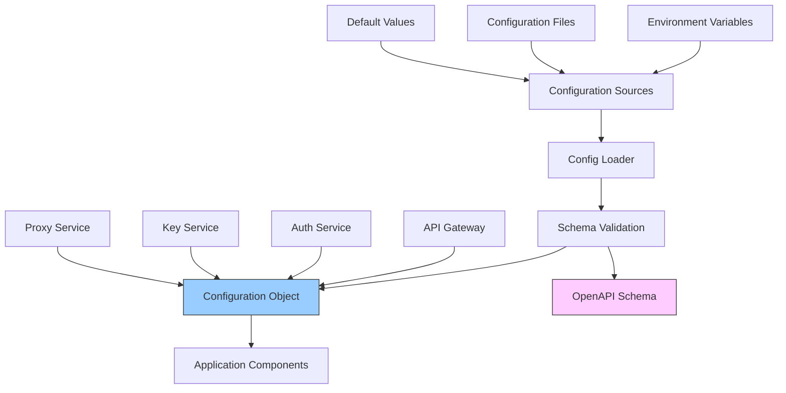

## Configuration Sources and Precedence

Configuration values can be provided in the following ways, listed in order of precedence (higher items override lower ones):

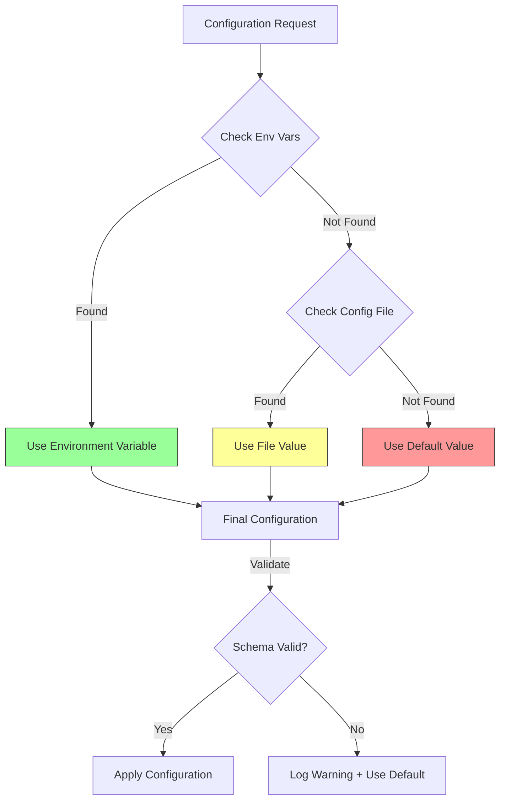

1. **Environment Variables**: Variables with `CONFIG_` prefix
2. **Configuration File**: JSON file specified by `CONFIG_PATH` environment variable
3. **Default Values**: Defined in the configuration schema

## Configuration Loading Process

The following diagram shows how configuration is loaded and applied at application startup:

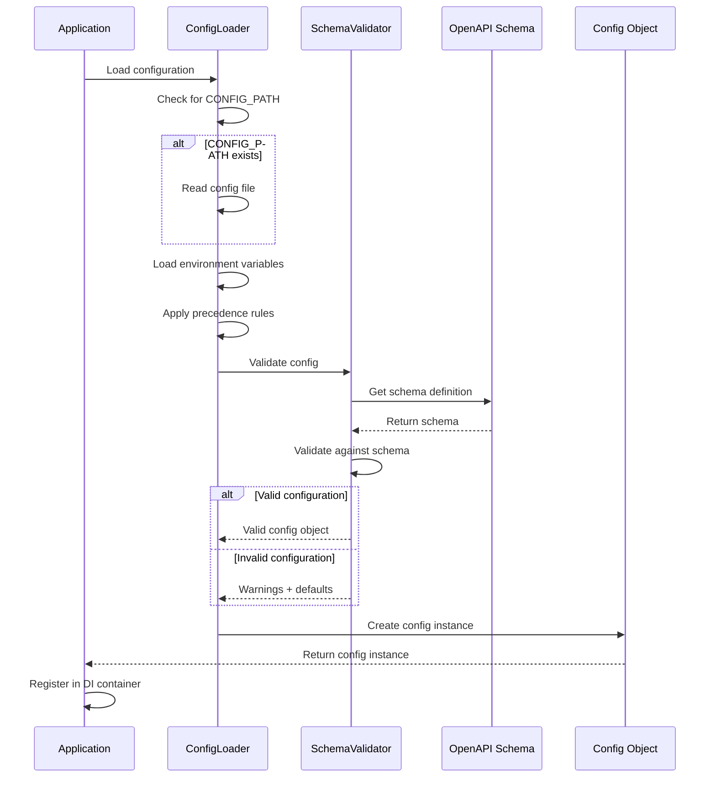

## Configuration File

You can provide a JSON configuration file to set multiple configuration options at once. The path to this file can be specified using the `CONFIG_PATH` environment variable:

```bash
CONFIG_PATH=/path/to/config.json npm run dev
```

A typical configuration file might look like this:

```json
{
  "encryption": {
    "key": "your-encryption-key"
  },
  "hmac": {
    "secret": "your-hmac-secret"
  },
  "security": {
    "cors": {
      "allowOrigin": "https://your-app.example.com"
    }
  },
  "logging": {
    "level": "info"
  }
}
```

### Configuration File Structure


## Environment Variables

For situations where you can't or don't want to use a configuration file (like cloud deployments), you can use environment variables. The naming convention is:

- Variables must start with `CONFIG_`
- Use underscores (`_`) to represent nested properties
- Values are parsed automatically to their appropriate type (string, number, boolean, JSON)

Example:

```bash
# Set the logging level
CONFIG_LOGGING_LEVEL=debug npm run dev

# Set a nested CORS configuration
CONFIG_SECURITY_CORS_ALLOW_ORIGIN=https://your-app.example.com npm run dev

# Configure proxy with a boolean
CONFIG_PROXY_ENABLED=true npm run dev
```

JSON values can also be provided via environment variables:

```bash
CONFIG_PROXY_SERVICES='{"auth":{"target":"https://auth.example.com"}}'
```

### Environment Variable Naming Convention

```mermaid
graph TD
    A[CONFIG_LOGGING_LEVEL=debug] --> B[logging.level = 'debug']
    C[CONFIG_SECURITY_CORS_ALLOW_ORIGIN=https://example.com] --> D[security.cors.allowOrigin = 'https://example.com']
    E[CONFIG_PROXY_ENABLED=true] --> F[proxy.enabled = true]
    G[CONFIG_PROXY_SERVICES='{"auth":{"target":"https://auth.example.com"}}'] --> H[proxy.services = {auth: {target: 'https://auth.example.com'}}]
```

## Configuration Options

### Core Configuration

The following diagram shows the encryption and HMAC configuration flow:

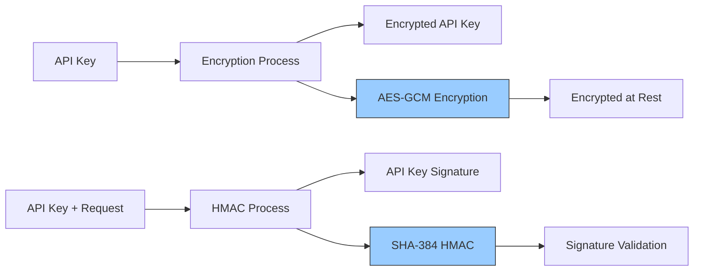

| Property | Type | Default | Description |
|----------|------|---------|-------------|
| `encryption.key` | string | | Secret key for encrypting API keys at rest (required in production) |
| `encryption.algorithm` | string | `"AES-GCM"` | Encryption algorithm to use |
| `encryption.iterations` | number | `100000` | Number of iterations for key derivation |
| `hmac.secret` | string | | Secret for generating HMAC signatures (required in production) |
| `hmac.algorithm` | string | `"SHA-384"` | HMAC algorithm to use |

### API Key Configuration

The API key structure with configurable properties:

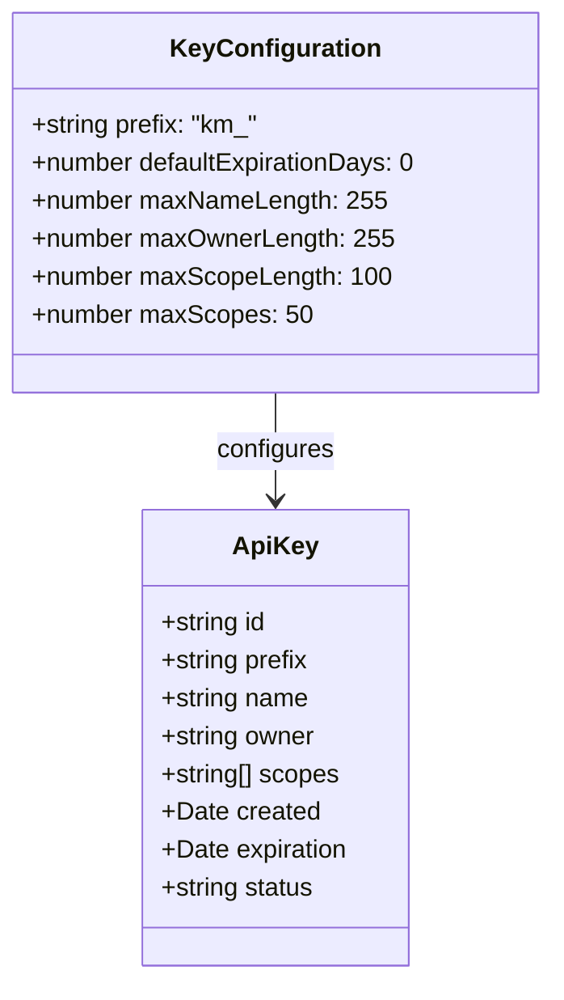

| Property | Type | Default | Description |
|----------|------|---------|-------------|
| `keys.prefix` | string | `"km_"` | Prefix for generated API keys |
| `keys.defaultExpirationDays` | number | `0` | Default expiration period in days (0 for no expiration) |
| `keys.maxNameLength` | number | `255` | Maximum length of key names |
| `keys.maxOwnerLength` | number | `255` | Maximum length of key owner names |
| `keys.maxScopeLength` | number | `100` | Maximum length of individual scope strings |
| `keys.maxScopes` | number | `50` | Maximum number of scopes per key |

### Logging Configuration

The logging level hierarchy and configuration:

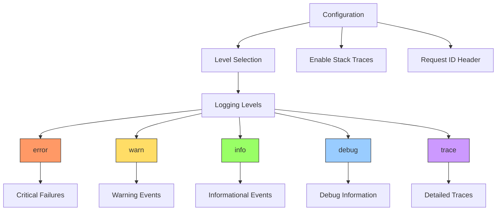

| Property | Type | Default | Description |
|----------|------|---------|-------------|
| `logging.level` | string | `"info"` | Logging level (`error`, `warn`, `info`, `debug`, `trace`) |
| `logging.includeTrace` | boolean | `true` | Include stack traces in error logs |
| `logging.requestIdHeader` | string | `"X-Request-ID"` | Header to extract request ID from |

### Security Configuration

CORS configuration and how it affects browser requests:

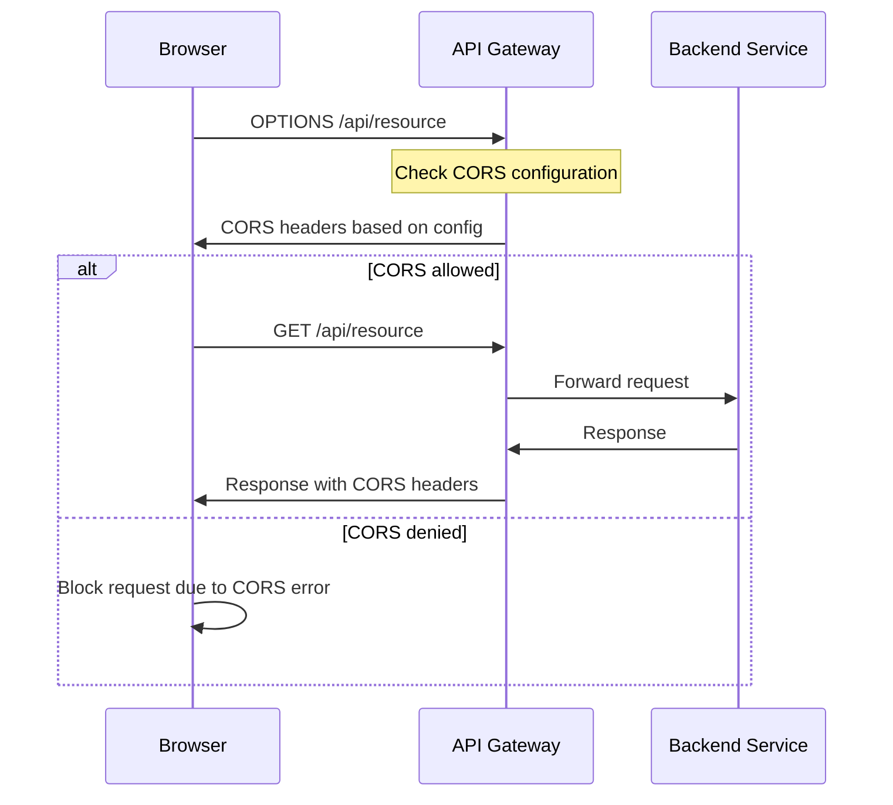

| Property | Type | Default | Description |
|----------|------|---------|-------------|
| `security.cors.allowOrigin` | string | `"*"` | Value for Access-Control-Allow-Origin header |
| `security.cors.allowMethods` | string | `"GET, POST, PUT, DELETE, OPTIONS"` | Value for Access-Control-Allow-Methods header |
| `security.cors.allowHeaders` | string | `"Content-Type, Authorization, X-API-Key"` | Value for Access-Control-Allow-Headers header |
| `security.cors.maxAge` | number | `86400` | Value for Access-Control-Max-Age header in seconds |
| `security.apiKeyHeader` | string | `"X-API-Key"` | Header name for API key authentication |

### API Routing Configuration

API versioning flow and parameter validation:

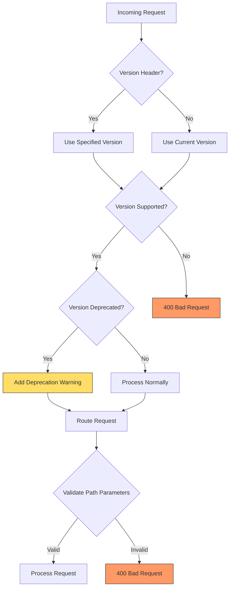

| Property | Type | Default | Description |
|----------|------|---------|-------------|
| `routing.versioning.enabled` | boolean | `true` | Enable API versioning |
| `routing.versioning.current` | string | `"1"` | Current API version |
| `routing.versioning.supported` | array | `["1"]` | List of supported API versions |
| `routing.versioning.deprecated` | array | `[]` | List of deprecated API versions |
| `routing.versioning.versionHeader` | string | `"X-API-Version"` | Header to get API version from |
| `routing.paramValidation.id` | string | `"[a-f0-9]{8}-[a-f0-9]{4}-[a-f0-9]{4}-[a-f0-9]{4}-[a-f0-9]{12}"` | Regex pattern for ID parameters |
| `routing.paramValidation.date` | string | `"\\d{4}-\\d{2}-\\d{2}"` | Regex pattern for date parameters |
| `routing.paramValidation.status` | string | `"(active\|revoked\|expired)"` | Regex pattern for status parameters |

### Rate Limiting Configuration

Rate limiting architecture and decision flow:

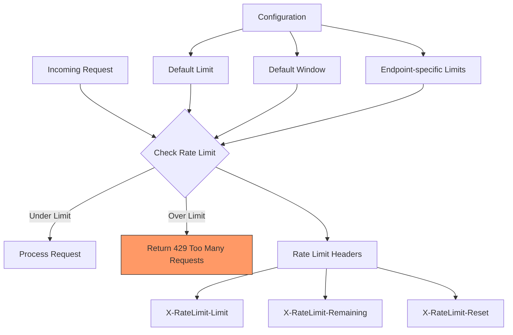

| Property | Type | Default | Description |
|----------|------|---------|-------------|
| `rateLimit.defaultLimit` | number | `100` | Default rate limit per window |
| `rateLimit.defaultWindow` | number | `60000` | Default rate limit window in milliseconds |
| `rateLimit.endpoints` | object | see below | Endpoint-specific rate limits |
| `rateLimit.headers.limit` | string | `"X-RateLimit-Limit"` | Header for rate limit |
| `rateLimit.headers.remaining` | string | `"X-RateLimit-Remaining"` | Header for remaining requests |
| `rateLimit.headers.reset` | string | `"X-RateLimit-Reset"` | Header for rate limit reset time |

Default endpoint-specific rate limits:
```json
{
  "/validate": { "limit": 300 },
  "/keys": { "limit": 60 }
}
```

### API Gateway Proxy Configuration

Proxy architecture with circuit breaker:

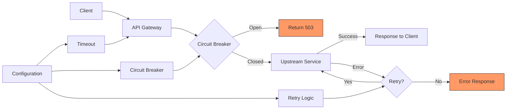

| Property | Type | Default | Description |
|----------|------|---------|-------------|
| `proxy.enabled` | boolean | `false` | Enable proxy functionality |
| `proxy.timeout` | number | `30000` | Default timeout for proxied requests in milliseconds |
| `proxy.headers` | object | `{"X-Forwarded-By":"key-manager-gateway"}` | Default headers to add to proxied requests |
| `proxy.circuitBreaker.enabled` | boolean | `true` | Enable circuit breaker functionality |
| `proxy.circuitBreaker.failureThreshold` | number | `5` | Number of failures before opening the circuit |
| `proxy.circuitBreaker.resetTimeout` | number | `30000` | Time in milliseconds before attempting to close the circuit |
| `proxy.retry.enabled` | boolean | `true` | Enable request retry functionality |
| `proxy.retry.maxAttempts` | number | `3` | Maximum number of retry attempts |
| `proxy.retry.backoff` | number | `1000` | Initial backoff in milliseconds |
| `proxy.services` | object | `{}` | Upstream service configurations for proxying |

## Environment-Specific Configurations

The recommended configuration approach for different environments:

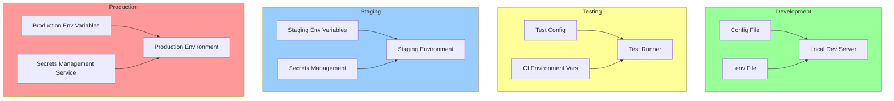

### Development Environment

For development, you can create a `config.dev.json` file with non-sensitive values and defaults:

```json
{
  "logging": {
    "level": "debug",
    "includeTrace": true
  },
  "security": {
    "cors": {
      "allowOrigin": "*"
    }
  }
}
```

Then use it in your development workflow:

```bash
CONFIG_PATH=config.dev.json npm run dev
```

### Production Environment

In production, you should set the required secure values via environment variables:

```bash
# Required secure values
CONFIG_ENCRYPTION_KEY=your-secure-encryption-key
CONFIG_HMAC_SECRET=your-secure-hmac-secret

# Production-specific settings
CONFIG_LOGGING_LEVEL=error
CONFIG_LOGGING_INCLUDE_TRACE=false
CONFIG_SECURITY_CORS_ALLOW_ORIGIN=https://your-production-app.com

# Start the application
npm run start
```

## Secrets Management

Never commit sensitive configuration values like encryption keys and HMAC secrets to your code repository. Instead:

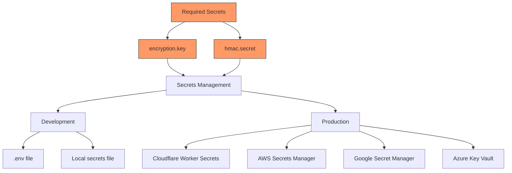

1. For development, use a local `.env` file that's excluded from version control
2. For production, use your platform's secrets management system:
   - Cloudflare: Worker Environment Variables or Secret bindings
   - AWS: AWS Secrets Manager or Parameter Store
   - GCP: Google Secret Manager
   - Azure: Azure Key Vault

## Configuration Validation

The API Gateway includes built-in validation for configuration values through an OpenAPI schema:

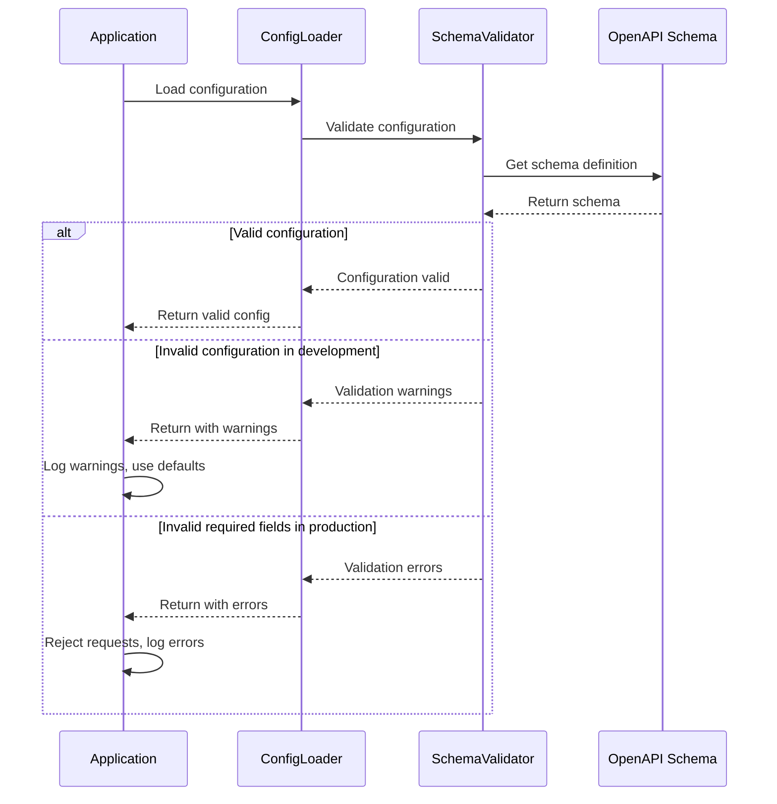

If invalid configuration is provided, warnings will be logged and default values will be used when possible.

In production mode, validation for required security values like `encryption.key` and `hmac.secret` will cause the application to reject requests if these values are missing.

## Advanced Configuration Examples

### Configuring Proxy Service

This configuration enables the proxy feature and sets up multiple backend services:

```json
{
  "proxy": {
    "enabled": true,
    "services": {
      "auth": {
        "target": "https://auth-service.example.com",
        "pathRewrite": {
          "^/api/auth": ""
        },
        "headers": {
          "X-Internal-Service": "gateway"
        }
      },
      "users": {
        "target": "https://user-service.example.com",
        "timeout": 5000
      }
    }
  }
}
```

The proxy routing flow:

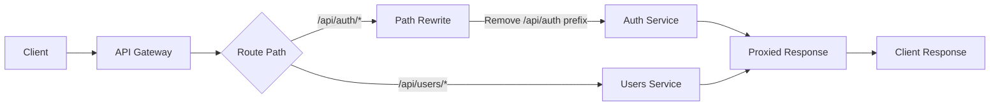

### Custom Parameter Validation

Define custom validation patterns for URL parameters:

```json
{
  "routing": {
    "paramValidation": {
      "id": "[a-f0-9]{8}-[a-f0-9]{4}-[a-f0-9]{4}-[a-f0-9]{4}-[a-f0-9]{12}",
      "slug": "[a-z0-9-]+",
      "username": "[a-zA-Z0-9_]{3,20}"
    }
  }
}
```

Path parameter validation in routes:

```mermaid
flowchart TD
    A[Request: /api/users/john_doe] --> B{Validate 'username'}
    B -->|Matches [a-zA-Z0-9_]{3,20}| C[Process Request]
    B -->|Does Not Match| D[400 Bad Request]
    
    E[Request: /api/posts/invalid-id] --> F{Validate 'id'}
    F -->|Matches UUID Pattern| G[Process Request]
    F -->|Does Not Match| H[400 Bad Request]
    
    style D fill:#f96,stroke:#333
    style H fill:#f96,stroke:#333
```

### Advanced Rate Limiting

Configure different rate limits for specific endpoints:

```json
{
  "rateLimit": {
    "defaultLimit": 100,
    "defaultWindow": 60000,
    "endpoints": {
      "/api/v1/search": { "limit": 30, "window": 60000 },
      "/api/v1/users/create": { "limit": 10, "window": 300000 }
    }
  }
}
```

Endpoint-specific rate limiting visualization:

```mermaid
flowchart LR
    A[Default Rate Limit] --> B[100 requests per minute]
    
    C[/api/v1/search] --> D[30 requests per minute]
    E[/api/v1/users/create] --> F[10 requests per 5 minutes]
    G[Other Endpoints] --> B
    
    H[Rate Limit Counter] --> I{Limit Exceeded?}
    I -->|Yes| J[429 Too Many Requests]
    I -->|No| K[Process Request]
    
    style J fill:#f96,stroke:#333
```

## Managing Configuration Changes

When changing configuration across environments, follow this workflow:

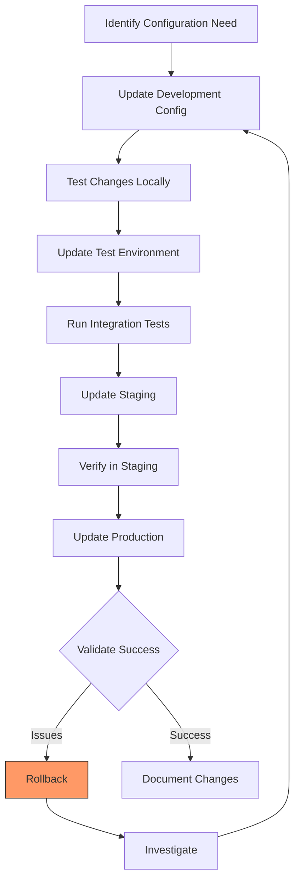

## Checking Current Configuration

During development, you can check the effective configuration by making a request to the `/system/config` endpoint (requires administrative privileges):

```bash
curl https://your-gateway.example.com/system/config \
  -H "X-API-Key: your-admin-key" \
  -H "Content-Type: application/json"
```

This will return a JSON representation of the current configuration (with sensitive values redacted).

Example response:

```json
{
  "encryption": {
    "key": "[REDACTED]",
    "algorithm": "AES-GCM",
    "iterations": 100000
  },
  "hmac": {
    "secret": "[REDACTED]",
    "algorithm": "SHA-384"
  },
  "logging": {
    "level": "info",
    "includeTrace": true,
    "requestIdHeader": "X-Request-ID"
  },
  "security": {
    "cors": {
      "allowOrigin": "https://your-app.example.com",
      "allowMethods": "GET, POST, PUT, DELETE, OPTIONS",
      "allowHeaders": "Content-Type, Authorization, X-API-Key",
      "maxAge": 86400
    },
    "apiKeyHeader": "X-API-Key"
  }
}
```

## Troubleshooting Configuration Issues

If you encounter configuration issues:

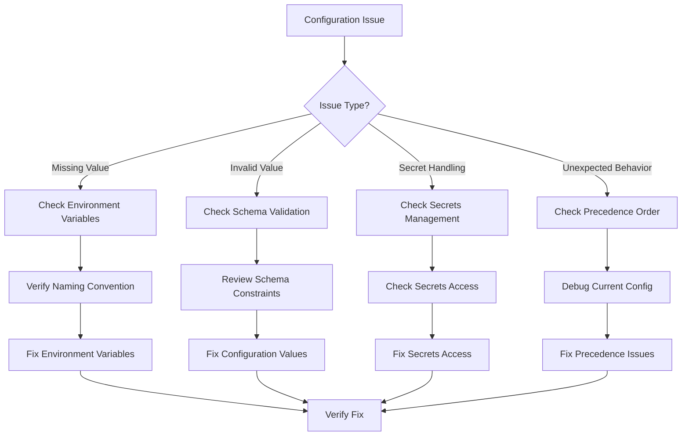

1. Check the application logs for warnings and errors related to configuration
2. Verify that environment variables use the correct naming convention (`CONFIG_` prefix with underscores for nesting)
3. Make sure JSON configuration files contain valid JSON
4. When using environment variables for complex values (objects, arrays), ensure the JSON is properly formatted and escaped
5. If a setting isn't taking effect, check the precedence order (environment variables override file configuration)

## Further Reading

- [API Gateway Documentation](./GATEWAY.md) - For more information on API gateway functionality
- [Security Guide](./SECURITY.md) - For details on security configuration best practices
- [OpenAPI Schema](../schemas/config.schema.json) - The complete schema definition for configuration validation