# API Gateway Configuration Guide

The API Gateway project provides a comprehensive configuration system that allows you to customize various aspects of the gateway without modifying code. This document describes the configuration options, how to provide configuration values, and best practices for different environments.

## Configuration Architecture

The configuration system follows a layered architecture that prioritizes flexibility, security, and validation:

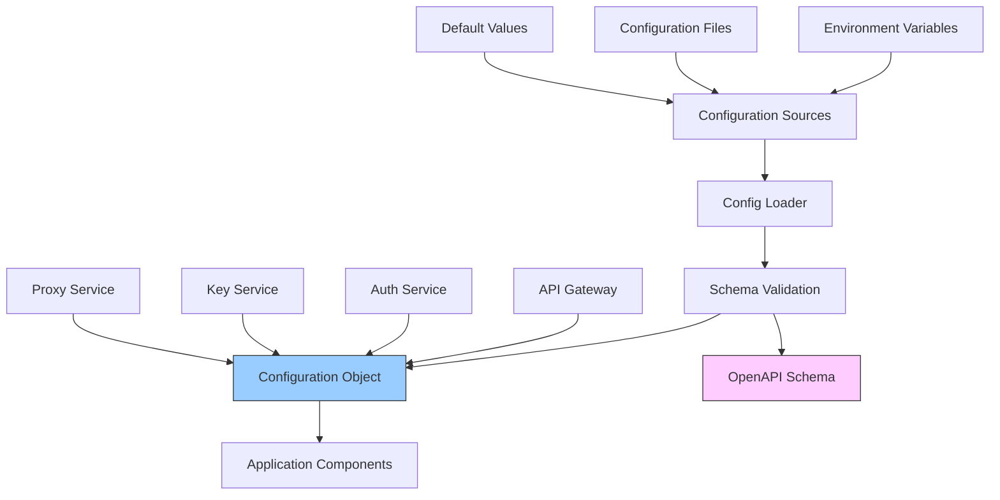

## Configuration Sources and Precedence

Configuration values can be provided in the following ways, listed in order of precedence (higher items override lower ones):

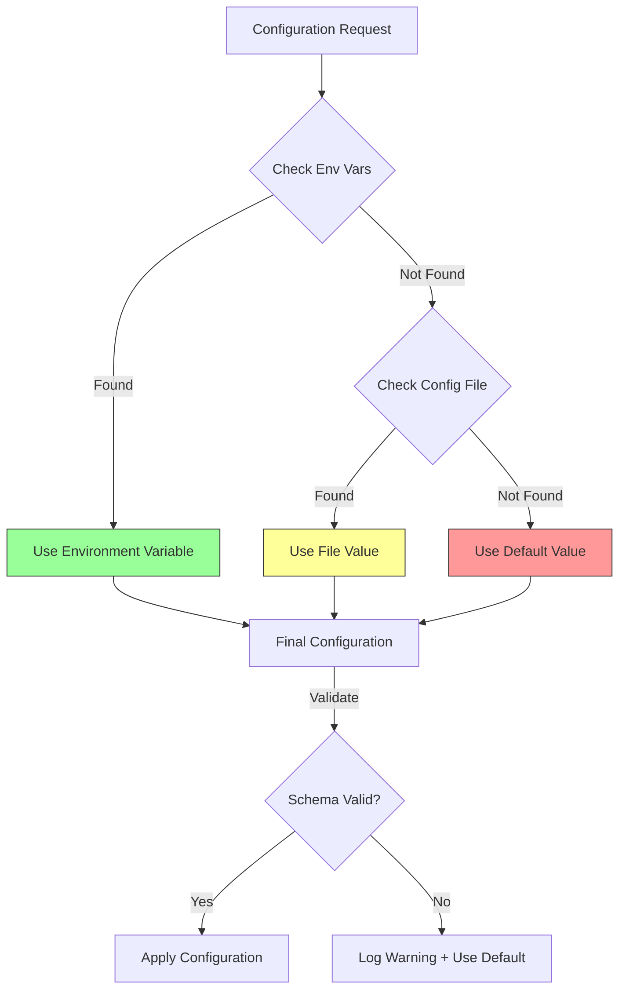

1. **Environment Variables**: Variables with `CONFIG_` prefix
2. **Configuration File**: JSON file specified by `CONFIG_PATH` environment variable
3. **Default Values**: Defined in the configuration schema

## Configuration Loading Process

The following diagram shows how configuration is loaded and applied at application startup:

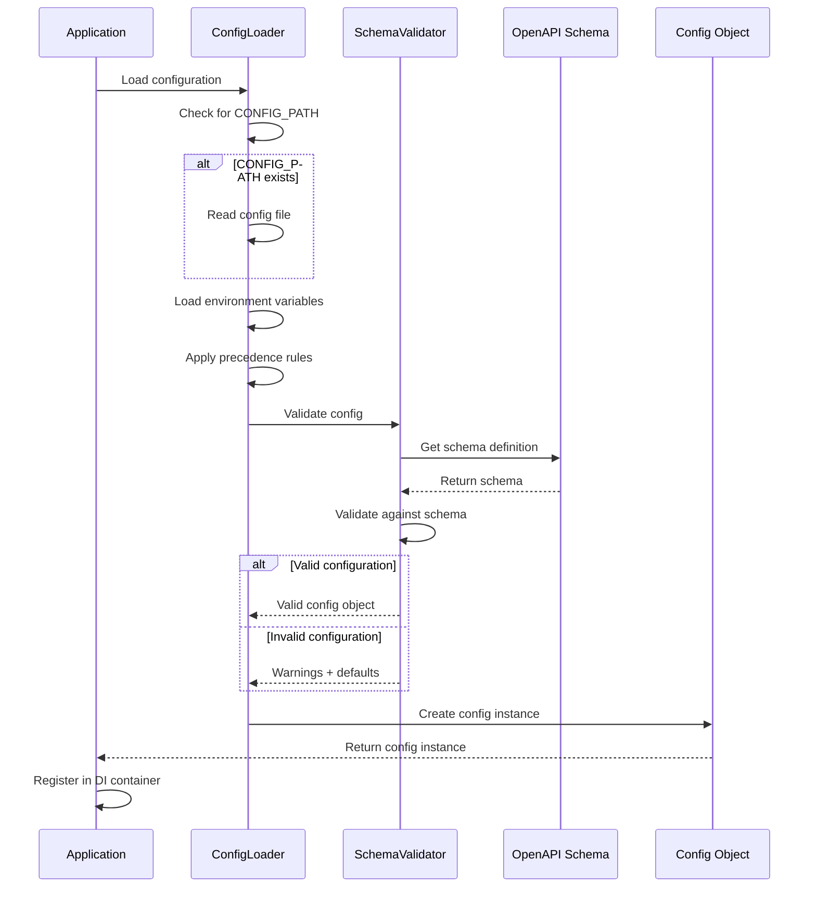

## Configuration File

You can provide a JSON configuration file to set multiple configuration options at once. The path to this file can be specified using the `CONFIG_PATH` environment variable:

```bash
CONFIG_PATH=/path/to/config.json npm run dev
```

A typical configuration file might look like this:

```json
{
  "encryption": {
    "key": "your-encryption-key"
  },
  "hmac": {
    "secret": "your-hmac-secret"
  },
  "security": {
    "cors": {
      "allowOrigin": "https://your-app.example.com"
    }
  },
  "logging": {
    "level": "info"
  }
}
```

The project includes several example configuration files:

1. `config.example.json` - General example with all configuration options
2. `config.development.example.json` - Example tailored for development environments
3. `config.production.example.json` - Example tailored for production environments

To use these examples:

```bash
# For development
cp config.development.example.json config.dev.json
CONFIG_PATH=config.dev.json npm run dev

# For production
cp config.production.example.json config.prod.json
# Edit config.prod.json to set secure values
NODE_ENV=production CONFIG_PATH=config.prod.json npm start
```

### Configuration File Structure

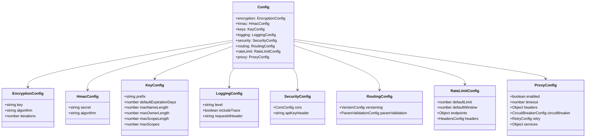

## Environment Variables

For situations where you can't or don't want to use a configuration file (like cloud deployments), you can use environment variables. The naming convention is:

- Variables must start with `CONFIG_`
- Use underscores (`_`) to represent nested properties
- Values are parsed automatically to their appropriate type (string, number, boolean, JSON)

### Basic Environment Variable Examples

```bash
# Set the logging level
CONFIG_LOGGING_LEVEL=debug npm run dev

# Set a nested CORS configuration
CONFIG_SECURITY_CORS_ALLOW_ORIGIN=https://your-app.example.com npm run dev

# Configure proxy with a boolean
CONFIG_PROXY_ENABLED=true npm run dev

# Set a numeric value
CONFIG_RATELIMIT_DEFAULTLIMIT=200 npm run dev
```

### Complex Types in Environment Variables

The API Gateway provides advanced handling for complex data structures in environment variables, with special parsing for proxy services, rate limits, and security headers.

#### 1. Using JSON strings

You can provide JSON strings for any complex objects:

```bash
# Configure proxy services with a JSON object
CONFIG_PROXY_SERVICES='{"auth":{"target":"https://auth.example.com","timeout":5000},"users":{"target":"https://users.example.com"}}'

# Configure supported API versions with a JSON array
CONFIG_ROUTING_VERSIONING_SUPPORTED='["1","2","3"]'

# Configure rate limits for endpoints
CONFIG_RATELIMIT_ENDPOINTS='{"\/api\/keys":{"limit":60,"window":60000},"\/api\/validate":{"limit":300}}'
```

#### 2. Using Structured Environment Variables

For complex objects, you can use structured naming patterns that are automatically parsed:

##### Proxy Services Configuration

```bash
# Configure the "auth" proxy service
CONFIG_PROXY_SERVICES_AUTH_TARGET=https://auth.example.com
CONFIG_PROXY_SERVICES_AUTH_TIMEOUT=5000
CONFIG_PROXY_SERVICES_AUTH_HEADERS='{"X-Internal-Service":"gateway"}'
CONFIG_PROXY_SERVICES_AUTH_PATHREWRITE='{"^/api/auth":""}'

# Configure the "users" proxy service
CONFIG_PROXY_SERVICES_USERS_TARGET=https://users.example.com
CONFIG_PROXY_SERVICES_USERS_TIMEOUT=10000
```

This automatically creates the following structure:

```javascript
{
  proxy: {
    services: {
      auth: {
        target: 'https://auth.example.com',
        timeout: 5000,
        headers: { 'X-Internal-Service': 'gateway' },
        pathRewrite: { '^/api/auth': '' }
      },
      users: {
        target: 'https://users.example.com',
        timeout: 10000
      }
    }
  }
}
```

##### Rate Limit Configuration

```bash
# Set rate limit for the /api/keys endpoint
CONFIG_RATELIMIT_ENDPOINTS_API_KEYS_LIMIT=60
CONFIG_RATELIMIT_ENDPOINTS_API_KEYS_WINDOW=60000

# Set rate limit for the /api/validate endpoint
CONFIG_RATELIMIT_ENDPOINTS_API_VALIDATE_LIMIT=300
```

This automatically creates this structure:

```javascript
{
  rateLimit: {
    endpoints: {
      '/api/keys': {
        limit: 60,
        window: 60000
      },
      '/api/validate': {
        limit: 300
      }
    }
  }
}
```

##### Security Headers Configuration

```bash
CONFIG_SECURITY_HEADERS_X_CONTENT_TYPE_OPTIONS=nosniff
CONFIG_SECURITY_HEADERS_X_FRAME_OPTIONS=DENY
CONFIG_SECURITY_HEADERS_STRICT_TRANSPORT_SECURITY=max-age=31536000; includeSubDomains
```

This automatically creates:

```javascript
{
  security: {
    headers: {
      'X-Content-Type-Options': 'nosniff',
      'X-Frame-Options': 'DENY',
      'Strict-Transport-Security': 'max-age=31536000; includeSubDomains'
    }
  }
}
```

#### Type Conversion

Environment variables are automatically converted to the appropriate type:

| Input | Converted To |
|--------|-------------|
| `"true"` | `true` (boolean) |
| `"false"` | `false` (boolean) |
| `"42"` | `42` (number) |
| `"[1,2,3]"` | `[1,2,3]` (array) |
| `"{"key":"value"}"` | `{key: "value"}` (object) |
| Other strings | left as strings |

### Environment Variable Naming Convention

```mermaid
graph TD
    A[CONFIG_LOGGING_LEVEL=debug] --> B[logging.level = 'debug']
    C[CONFIG_SECURITY_CORS_ALLOW_ORIGIN=https://example.com] --> D[security.cors.allowOrigin = 'https://example.com']
    E[CONFIG_PROXY_ENABLED=true] --> F[proxy.enabled = true]
    G[CONFIG_PROXY_SERVICES='{"auth":{"target":"https://auth.example.com"}}'] --> H[proxy.services = {auth: {target: 'https://auth.example.com'}}]
    I[CONFIG_PROXY_SERVICES_AUTH_TARGET=https://auth.example.com] --> J[proxy.services.auth.target = 'https://auth.example.com']
    K[CONFIG_RATELIMIT_ENDPOINTS_API_KEYS_LIMIT=60] --> L[rateLimit.endpoints['/api/keys'].limit = 60]
```

### Legacy Environment Variables

For backward compatibility, the API Gateway also supports certain legacy environment variables without the `CONFIG_` prefix. However, these are deprecated and should be avoided in new deployments:

```bash
# Legacy variables (deprecated)
ENCRYPTION_KEY=your-secure-key
HMAC_SECRET=your-hmac-secret
KEY_PREFIX=api_
RATE_LIMIT=100
CORS_ALLOW_ORIGIN=*
```

Always prefer the `CONFIG_` prefixed variables for newer deployments.

## Configuration Options

### Core Configuration

The following diagram shows the encryption and HMAC configuration flow:

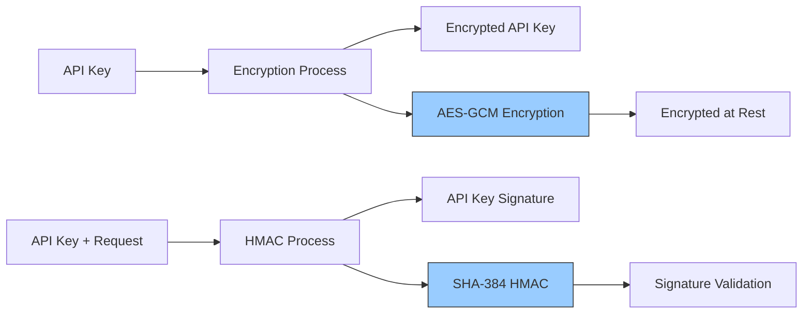

| Property | Type | Default | Description |
|----------|------|---------|-------------|
| `encryption.key` | string | | Secret key for encrypting API keys at rest (required in production) |
| `encryption.algorithm` | string | `"AES-GCM"` | Encryption algorithm to use |
| `encryption.iterations` | number | `100000` | Number of iterations for key derivation |
| `hmac.secret` | string | | Secret for generating HMAC signatures (required in production) |
| `hmac.algorithm` | string | `"SHA-384"` | HMAC algorithm to use |

### API Key Configuration

The API key structure with configurable properties:

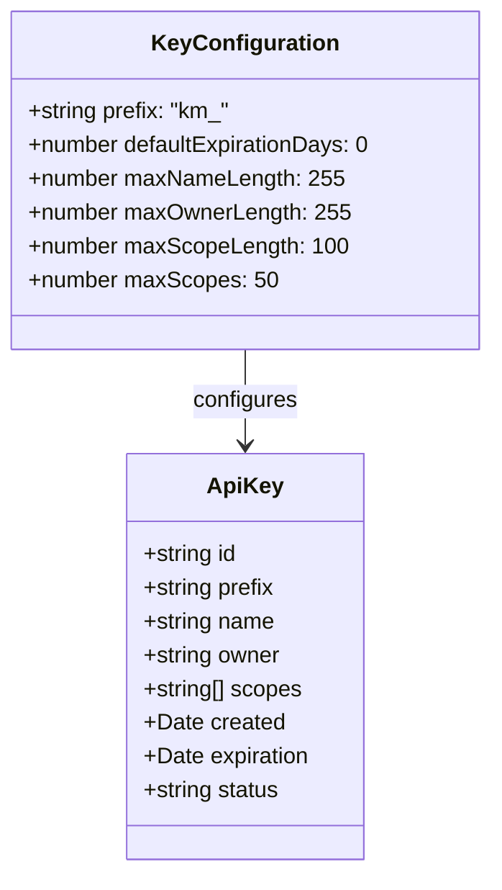

| Property | Type | Default | Description |
|----------|------|---------|-------------|
| `keys.prefix` | string | `"km_"` | Prefix for generated API keys |
| `keys.defaultExpirationDays` | number | `0` | Default expiration period in days (0 for no expiration) |
| `keys.maxNameLength` | number | `255` | Maximum length of key names |
| `keys.maxOwnerLength` | number | `255` | Maximum length of key owner names |
| `keys.maxScopeLength` | number | `100` | Maximum length of individual scope strings |
| `keys.maxScopes` | number | `50` | Maximum number of scopes per key |

### Logging Configuration

The logging level hierarchy and configuration:

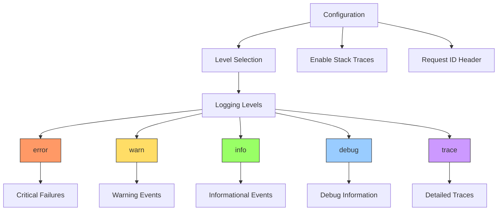

| Property | Type | Default | Description |
|----------|------|---------|-------------|
| `logging.level` | string | `"info"` | Logging level (`error`, `warn`, `info`, `debug`, `trace`) |
| `logging.includeTrace` | boolean | `true` | Include stack traces in error logs |
| `logging.requestIdHeader` | string | `"X-Request-ID"` | Header to extract request ID from |

### Security Configuration

The API Gateway includes comprehensive security features for CORS handling, API key authentication, and security headers.

#### CORS Configuration

CORS (Cross-Origin Resource Sharing) configuration controls how browsers can access your API from different origins:

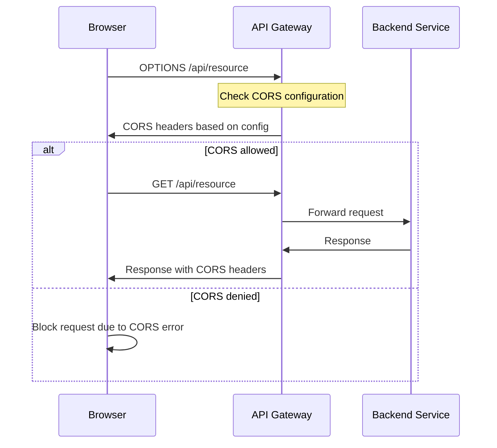

| Property | Type | Default | Description |
|----------|------|---------|-------------|
| `security.cors.allowOrigin` | string | `"*"` | Value for Access-Control-Allow-Origin header |
| `security.cors.allowMethods` | string | `"GET, POST, PUT, DELETE, OPTIONS"` | Value for Access-Control-Allow-Methods header |
| `security.cors.allowHeaders` | string | `"Content-Type, Authorization, X-API-Key"` | Value for Access-Control-Allow-Headers header |
| `security.cors.maxAge` | number | `86400` | Value for Access-Control-Max-Age header in seconds |

#### API Key Configuration

| Property | Type | Default | Description |
|----------|------|---------|-------------|
| `security.apiKeyHeader` | string | `"X-API-Key"` | Header name for API key authentication |

#### Security Headers

The API Gateway can add security headers to all responses to improve security posture:

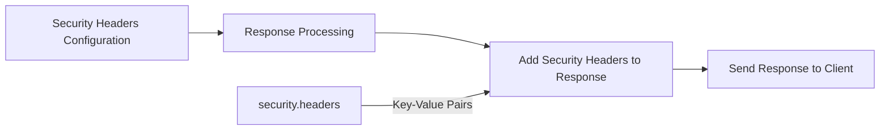

| Property | Type | Default | Description |
|----------|------|---------|-------------|
| `security.headers` | object | `{}` | Custom security headers to add to all responses |

Example security headers configuration:

```json
"security": {
  "headers": {
    "X-Content-Type-Options": "nosniff",
    "X-Frame-Options": "DENY",
    "Strict-Transport-Security": "max-age=31536000; includeSubDomains",
    "X-XSS-Protection": "1; mode=block",
    "Content-Security-Policy": "default-src 'self'"
  }
}
```

These headers can be configured via environment variables as well:

```bash
CONFIG_SECURITY_HEADERS_X_CONTENT_TYPE_OPTIONS=nosniff
CONFIG_SECURITY_HEADERS_X_FRAME_OPTIONS=DENY
```

Common security headers and their purposes:

| Header | Purpose |
|--------|---------|
| `X-Content-Type-Options` | Prevents MIME type sniffing |
| `X-Frame-Options` | Controls whether page can be displayed in frames |
| `Strict-Transport-Security` | Enforces HTTPS connections |
| `X-XSS-Protection` | Enables browser's XSS filtering |
| `Content-Security-Policy` | Controls allowed resources |
| `Referrer-Policy` | Controls referrer information |

### API Routing Configuration

API versioning flow and parameter validation:

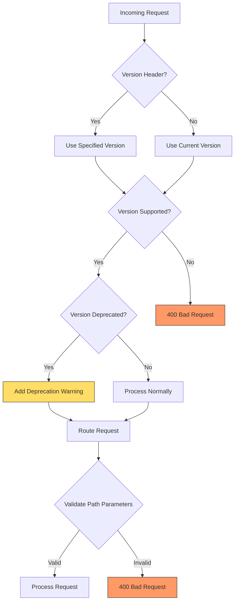

#### API Versioning Configuration

| Property | Type | Default | Description |
|----------|------|---------|-------------|
| `routing.versioning.enabled` | boolean | `true` | Enable API versioning |
| `routing.versioning.current` | string | `"1"` | Current API version |
| `routing.versioning.supported` | array | `["1"]` | List of supported API versions |
| `routing.versioning.deprecated` | array | `[]` | List of deprecated API versions |
| `routing.versioning.versionHeader` | string | `"X-API-Version"` | Header to get API version from |

#### Parameter Validation Configuration

| Property | Type | Default | Description |
|----------|------|---------|-------------|
| `routing.paramValidation.id` | string | `"[a-f0-9]{8}-[a-f0-9]{4}-[a-f0-9]{4}-[a-f0-9]{4}-[a-f0-9]{12}"` | Regex pattern for ID parameters |
| `routing.paramValidation.date` | string | `"\\d{4}-\\d{2}-\\d{2}"` | Regex pattern for date parameters |
| `routing.paramValidation.status` | string | `"(active\|revoked\|expired)"` | Regex pattern for status parameters |

You can add custom parameter validation patterns by adding new properties to the `routing.paramValidation` object:

```json
{
  "routing": {
    "paramValidation": {
      "username": "[a-zA-Z0-9_]{3,20}",
      "email": "[a-zA-Z0-9._%+-]+@[a-zA-Z0-9.-]+\\.[a-zA-Z]{2,}"
    }
  }
}
```

#### Route Priority Configuration

The API Gateway uses a priority system to determine which route should handle a request when multiple routes match the same path pattern. Lower numbers indicate higher priority.

| Property | Type | Default | Description |
|----------|------|---------|-------------|
| `routing.priority.exact` | number | `1` | Priority for exact path matches (e.g., `/api/keys`) |
| `routing.priority.parameter` | number | `2` | Priority for parametrized path matches (e.g., `/api/keys/:id`) |
| `routing.priority.regex` | number | `3` | Priority for regex path matches (e.g., `/api/keys/.*`) |

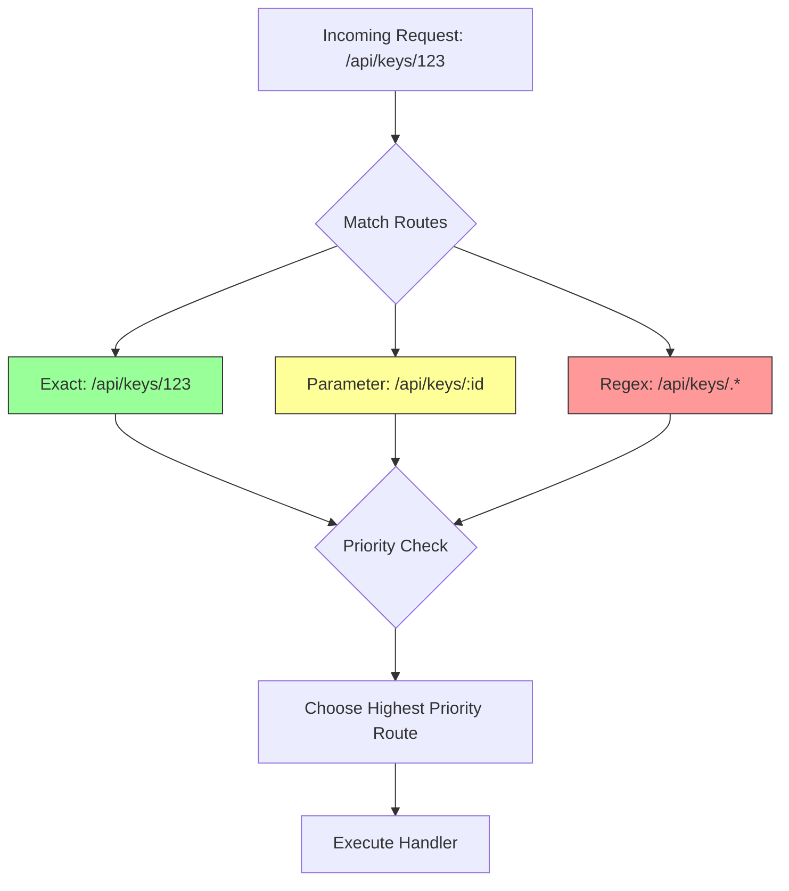

### Rate Limiting Configuration

Rate limiting architecture and decision flow:

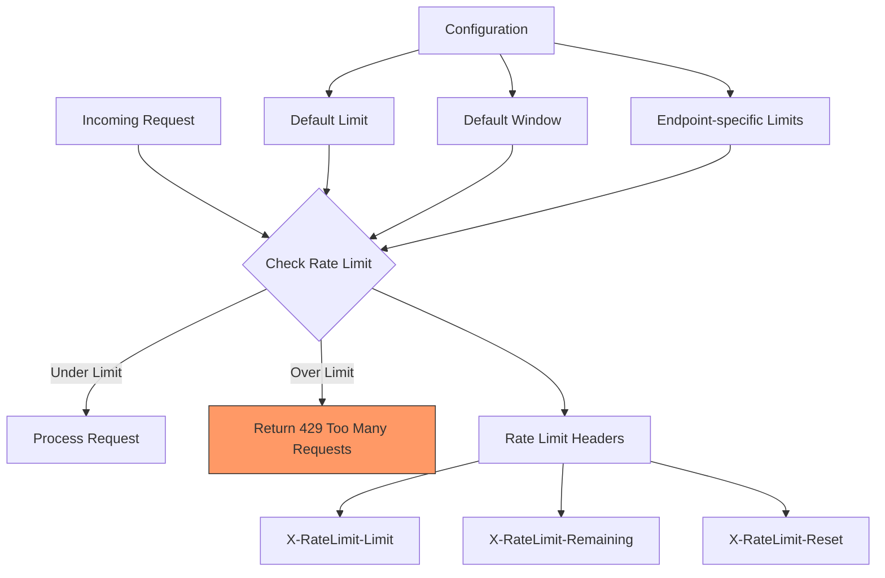

| Property | Type | Default | Description |
|----------|------|---------|-------------|
| `rateLimit.defaultLimit` | number | `100` | Default rate limit per window |
| `rateLimit.defaultWindow` | number | `60000` | Default rate limit window in milliseconds |
| `rateLimit.endpoints` | object | see below | Endpoint-specific rate limits |
| `rateLimit.headers.limit` | string | `"X-RateLimit-Limit"` | Header for rate limit |
| `rateLimit.headers.remaining` | string | `"X-RateLimit-Remaining"` | Header for remaining requests |
| `rateLimit.headers.reset` | string | `"X-RateLimit-Reset"` | Header for rate limit reset time |

Default endpoint-specific rate limits:
```json
{
  "/validate": { "limit": 300 },
  "/keys": { "limit": 60 }
}
```

### API Gateway Proxy Configuration

The API Gateway includes powerful proxy capabilities for routing requests to upstream services, with built-in circuit breaker and retry functionality for resilience.

#### Proxy Architecture with Circuit Breaker

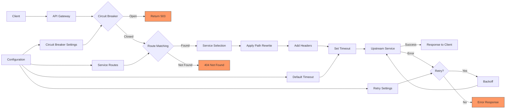

#### Proxy Service Selection and Path Rewriting

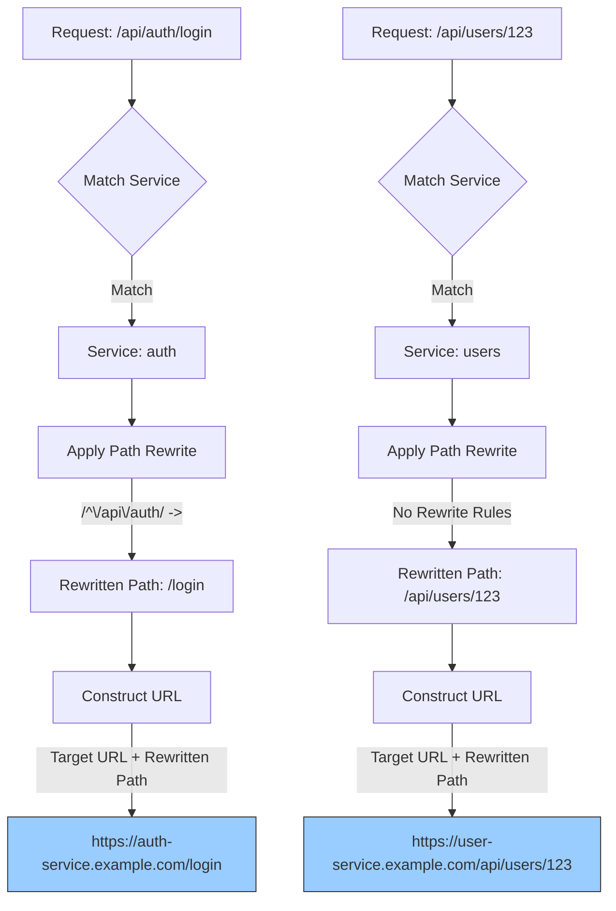

#### Core Proxy Configuration

| Property | Type | Default | Description |
|----------|------|---------|-------------|
| `proxy.enabled` | boolean | `false` | Enable proxy functionality |
| `proxy.timeout` | number | `30000` | Default timeout for proxied requests in milliseconds |
| `proxy.headers` | object | `{"X-Forwarded-By":"key-manager-gateway"}` | Default headers to add to proxied requests |

#### Circuit Breaker Configuration

| Property | Type | Default | Description |
|----------|------|---------|-------------|
| `proxy.circuitBreaker.enabled` | boolean | `true` | Enable circuit breaker functionality |
| `proxy.circuitBreaker.failureThreshold` | number | `5` | Number of failures before opening the circuit |
| `proxy.circuitBreaker.resetTimeout` | number | `30000` | Time in milliseconds before attempting to close the circuit |

#### Retry Configuration

| Property | Type | Default | Description |
|----------|------|---------|-------------|
| `proxy.retry.enabled` | boolean | `true` | Enable request retry functionality |
| `proxy.retry.maxAttempts` | number | `3` | Maximum number of retry attempts |
| `proxy.retry.backoff` | number | `1000` | Initial backoff in milliseconds (doubles with each retry) |

#### Service Configuration

The `proxy.services` object contains configurations for upstream services:

| Property | Type | Description |
|----------|------|-------------|
| `proxy.services.<name>` | object | Configuration for an upstream service |
| `proxy.services.<name>.target` | string | Target URL for the service (required) |
| `proxy.services.<name>.pathRewrite` | object | Path rewrite rules (regex pattern to replacement) |
| `proxy.services.<name>.headers` | object | Headers to add to requests for this service |
| `proxy.services.<name>.timeout` | number | Service-specific timeout in milliseconds |

Example service configuration:

```json
"proxy": {
  "services": {
    "auth": {
      "target": "https://auth-service.example.com",
      "pathRewrite": {
        "^/api/auth": ""
      },
      "headers": {
        "X-Internal-Service": "gateway"
      },
      "timeout": 10000
    }
  }
}
```

## Environment-Specific Configurations

The recommended configuration approach for different environments:

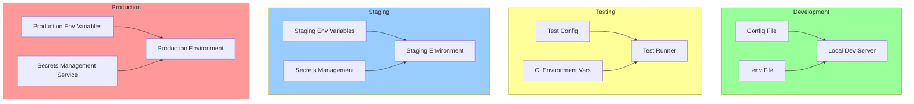

### Development Environment

For development, you can create a `config.dev.json` file with non-sensitive values and defaults:

```json
{
  "logging": {
    "level": "debug",
    "includeTrace": true
  },
  "security": {
    "cors": {
      "allowOrigin": "*"
    }
  }
}
```

Then use it in your development workflow:

```bash
CONFIG_PATH=config.dev.json npm run dev
```

### Production Environment

For production deployments, stricter validation is applied to ensure secure configuration. The following secure values are **required** in production:

```bash
# Required secure values (MUST be set in production)
CONFIG_ENCRYPTION_KEY=your-secure-encryption-key
CONFIG_HMAC_SECRET=your-secure-hmac-secret

# Production-specific settings (recommended)
CONFIG_LOGGING_LEVEL=error
CONFIG_LOGGING_INCLUDE_TRACE=false
CONFIG_SECURITY_CORS_ALLOW_ORIGIN=https://your-production-app.com

# Enable production mode validation
NODE_ENV=production

# Start the application
npm run start
```

#### Production Validation Rules

The API Gateway enforces these rules in production mode:

1. `encryption.key` and `hmac.secret` must be explicitly set
2. Default development values (containing "development") are rejected
3. Validation errors for critical security settings will cause startup failure

If your application fails to start in production with an error like:

```
Production configuration validation failed: [{"keyword":"required","dataPath":".encryption.key","message":"encryption.key is required in production"}]
```

You need to set the required configuration values before the application will start.

#### Security Settings For Production

For a secure production deployment, we recommend:

```bash
# Encryption and HMAC (required)
CONFIG_ENCRYPTION_KEY=<strong-random-key>
CONFIG_HMAC_SECRET=<strong-random-secret>

# Security headers
CONFIG_SECURITY_HEADERS_STRICT_TRANSPORT_SECURITY=max-age=31536000; includeSubDomains
CONFIG_SECURITY_HEADERS_X_CONTENT_TYPE_OPTIONS=nosniff
CONFIG_SECURITY_HEADERS_X_FRAME_OPTIONS=DENY
CONFIG_SECURITY_HEADERS_X_XSS_PROTECTION=1; mode=block

# CORS (restrict to your domains)
CONFIG_SECURITY_CORS_ALLOW_ORIGIN=https://your-app.example.com
CONFIG_SECURITY_CORS_ALLOW_METHODS=GET, POST, PUT, DELETE, OPTIONS

# Logging (minimal in production)
CONFIG_LOGGING_LEVEL=error
CONFIG_LOGGING_INCLUDE_TRACE=false

# Rate limiting (stricter in production)
CONFIG_RATELIMIT_DEFAULTLIMIT=50
CONFIG_RATELIMIT_ENDPOINTS_API_VALIDATE_LIMIT=200
```

## Secrets Management

Never commit sensitive configuration values like encryption keys and HMAC secrets to your code repository. Instead:

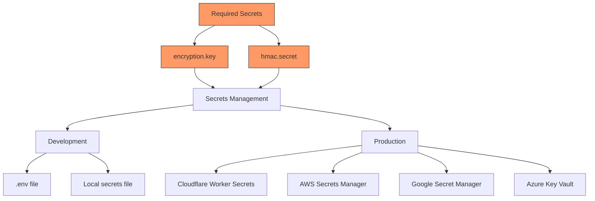

1. For development, use a local `.env` file that's excluded from version control
2. For production, use your platform's secrets management system:
   - Cloudflare: Worker Environment Variables or Secret bindings
   - AWS: AWS Secrets Manager or Parameter Store
   - GCP: Google Secret Manager
   - Azure: Azure Key Vault

## Configuration Validation

The API Gateway includes built-in validation for configuration values through an OpenAPI schema:

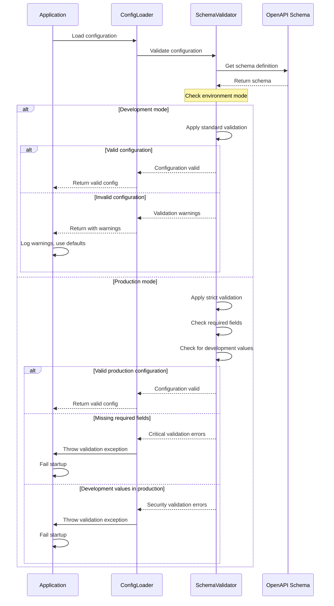

### Development Mode Validation

In development mode, validation is permissive:

1. All schema rules are checked but treated as warnings
2. Missing values get default values from the schema
3. Type mismatches are logged but don't prevent startup
4. Configuration warnings are logged to the console

### Production Mode Validation

In production mode, validation is strict for security-critical settings:

1. Required fields must be present (`encryption.key` and `hmac.secret`)
2. Development placeholder values are rejected
3. Critical validation errors will cause application startup to fail
4. Non-critical validation issues are still logged as warnings

### Detecting Production Mode

The system detects production mode using environment variables:

1. If `NODE_ENV` is set to `"production"`, production mode is enabled
2. If `CONFIG_ENV` is set to `"production"`, production mode is enabled
3. Otherwise, development mode is used

### Validation Rules

The validation system checks:

1. **Type validation**: Ensures values match their expected types
2. **Required fields**: In production, checks security-critical fields are present
3. **Development values**: Prevents placeholder values in production
4. **Schema conformance**: Ensures all values conform to the schema rules

### Error Handling

When validation errors occur:

1. **Development mode**: Warnings logged to console, defaults used
2. **Production mode**: Critical errors throw exceptions, application startup fails
3. **Runtime validation**: Config.validate() can be called at runtime to check configuration

### Programmatic Configuration Validation

You can validate configuration at runtime using the Config class:

```javascript
import { Config } from './src/infrastructure/config/Config.js';

// Create a config instance
const config = new Config(configValues);

try {
  // Validate with default behavior (throws in production)
  config.validate();
  console.log("Configuration is valid");
} catch (error) {
  console.error("Configuration validation failed:", error.message);
  process.exit(1);
}

// Or get validation results without throwing
const { isValid, errors } = config.validate(false);
if (!isValid) {
  console.warn("Configuration warnings:", errors);
}
```

This is useful for:

- Custom startup scripts that need to validate configuration
- Health checks that verify configuration is still valid
- Admin tools that need to validate configuration changes

### Maintenance Configuration

The API Gateway includes built-in maintenance operations for cleaning up expired keys and performing other system tasks.

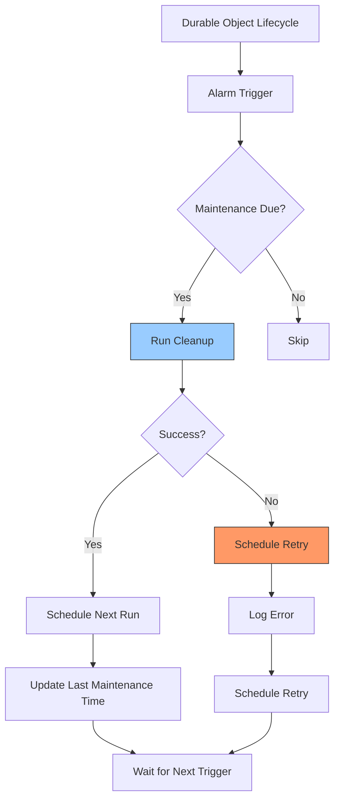

| Property | Type | Default | Description |
|----------|------|---------|-------------|
| `maintenance.cleanupIntervalHours` | number | `24` | Interval in hours between cleanup operations |
| `maintenance.retryIntervalHours` | number | `1` | Interval in hours before retrying a failed cleanup |

The maintenance operations run automatically in the background and do not require any user intervention. However, you can configure the frequency of these operations to match your system's needs.

## Advanced Configuration Examples

### Configuring Proxy Service

This configuration enables the proxy feature and sets up multiple backend services:

```json
{
  "proxy": {
    "enabled": true,
    "services": {
      "auth": {
        "target": "https://auth-service.example.com",
        "pathRewrite": {
          "^/api/auth": ""
        },
        "headers": {
          "X-Internal-Service": "gateway"
        }
      },
      "users": {
        "target": "https://user-service.example.com",
        "timeout": 5000
      }
    }
  }
}
```

The proxy routing flow:

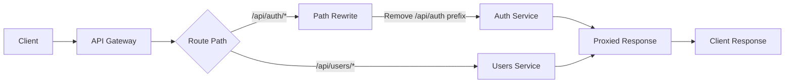

### Custom Parameter Validation

Define custom validation patterns for URL parameters:

```json
{
  "routing": {
    "paramValidation": {
      "id": "[a-f0-9]{8}-[a-f0-9]{4}-[a-f0-9]{4}-[a-f0-9]{4}-[a-f0-9]{12}",
      "slug": "[a-z0-9-]+",
      "username": "[a-zA-Z0-9_]{3,20}"
    }
  }
}
```

Path parameter validation in routes:

```mermaid
flowchart TD
    A[Request: /api/users/john_doe] --> B{Validate 'username'}
    B -->|Matches [a-zA-Z0-9_]{3,20}| C[Process Request]
    B -->|Does Not Match| D[400 Bad Request]
    
    E[Request: /api/posts/invalid-id] --> F{Validate 'id'}
    F -->|Matches UUID Pattern| G[Process Request]
    F -->|Does Not Match| H[400 Bad Request]
    
    style D fill:#f96,stroke:#333
    style H fill:#f96,stroke:#333
```

### Advanced Rate Limiting

Configure different rate limits for specific endpoints:

```json
{
  "rateLimit": {
    "defaultLimit": 100,
    "defaultWindow": 60000,
    "endpoints": {
      "/api/v1/search": { "limit": 30, "window": 60000 },
      "/api/v1/users/create": { "limit": 10, "window": 300000 }
    }
  }
}
```

Endpoint-specific rate limiting visualization:

```mermaid
flowchart LR
    A[Default Rate Limit] --> B[100 requests per minute]
    
    C[/api/v1/search] --> D[30 requests per minute]
    E[/api/v1/users/create] --> F[10 requests per 5 minutes]
    G[Other Endpoints] --> B
    
    H[Rate Limit Counter] --> I{Limit Exceeded?}
    I -->|Yes| J[429 Too Many Requests]
    I -->|No| K[Process Request]
    
    style J fill:#f96,stroke:#333
```

## Managing Configuration Changes

When changing configuration across environments, follow this workflow:

```mermaid
flowchart TD
    A[Identify Configuration Need] --> B[Update Development Config]
    B --> C[Test Changes Locally]
    C --> D[Update Test Environment]
    D --> E[Run Integration Tests]
    E --> F[Update Staging]
    F --> G[Verify in Staging]
    G --> H[Update Production]
    
    H --> I{Validate Success}
    I -->|Issues| J[Rollback]
    I -->|Success| K[Document Changes]
    
    J --> L[Investigate]
    L --> B
    
    style J fill:#f96,stroke:#333
```

## Checking Current Configuration

During development, you can check the effective configuration by making a request to the `/system/config` endpoint (requires administrative privileges):

```bash
curl https://your-gateway.example.com/system/config \
  -H "X-API-Key: your-admin-key" \
  -H "Content-Type: application/json"
```

This will return a JSON representation of the current configuration (with sensitive values redacted).

Example response:

```json
{
  "encryption": {
    "key": "[REDACTED]",
    "algorithm": "AES-GCM",
    "iterations": 100000
  },
  "hmac": {
    "secret": "[REDACTED]",
    "algorithm": "SHA-384"
  },
  "logging": {
    "level": "info",
    "includeTrace": true,
    "requestIdHeader": "X-Request-ID"
  },
  "security": {
    "cors": {
      "allowOrigin": "https://your-app.example.com",
      "allowMethods": "GET, POST, PUT, DELETE, OPTIONS",
      "allowHeaders": "Content-Type, Authorization, X-API-Key",
      "maxAge": 86400
    },
    "apiKeyHeader": "X-API-Key"
  }
}
```

## Troubleshooting Configuration Issues

If you encounter configuration issues:

```mermaid
flowchart TD
    A[Configuration Issue] --> B{Issue Type?}
    
    B -->|Missing Value| C[Check Environment Variables]
    B -->|Invalid Value| D[Check Schema Validation]
    B -->|Secret Handling| E[Check Secrets Management]
    B -->|Unexpected Behavior| F[Check Precedence Order]
    
    C --> G[Verify Naming Convention]
    D --> H[Review Schema Constraints]
    E --> I[Check Secrets Access]
    F --> J[Debug Current Config]
    
    G --> K[Fix Environment Variables]
    H --> L[Fix Configuration Values]
    I --> M[Fix Secrets Access]
    J --> N[Fix Precedence Issues]
    
    K --> O[Verify Fix]
    L --> O
    M --> O
    N --> O
```

1. Check the application logs for warnings and errors related to configuration
2. Verify that environment variables use the correct naming convention (`CONFIG_` prefix with underscores for nesting)
3. Make sure JSON configuration files contain valid JSON
4. When using environment variables for complex values (objects, arrays), ensure the JSON is properly formatted and escaped
5. If a setting isn't taking effect, check the precedence order (environment variables override file configuration)

## Further Reading

- [API Gateway Documentation](./GATEWAY.md) - For more information on API gateway functionality
- [Security Guide](./SECURITY.md) - For details on security configuration best practices
- [OpenAPI Schema](../schemas/config.schema.json) - The complete schema definition for configuration validation