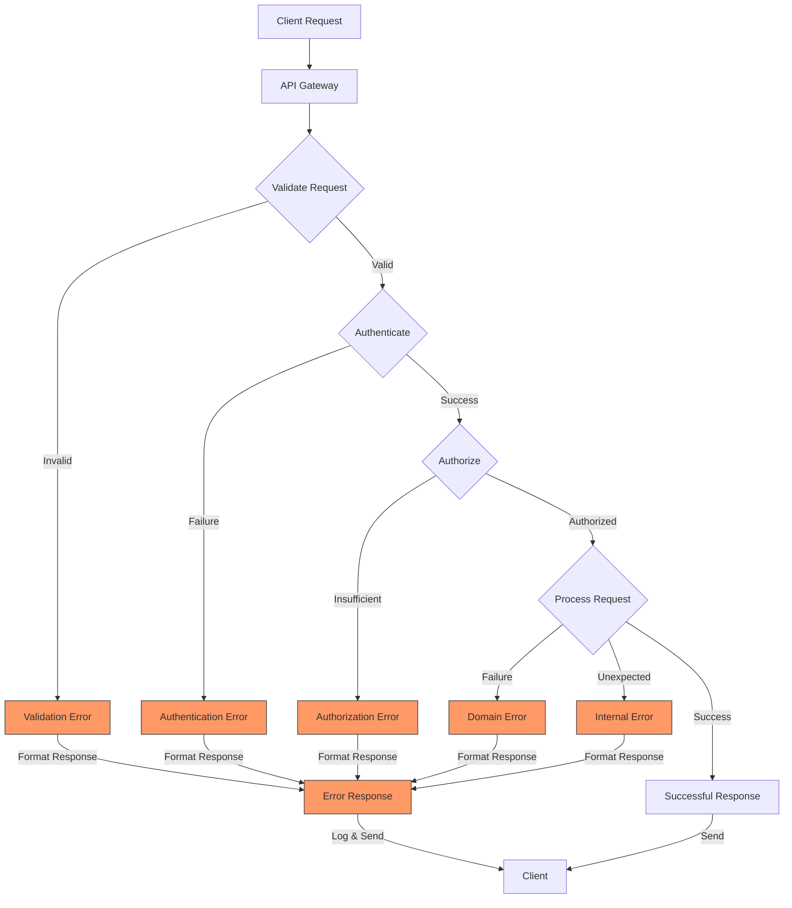
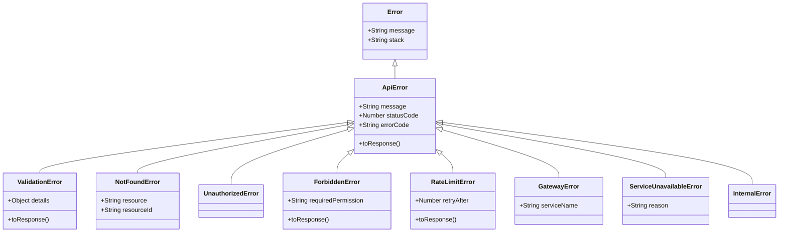
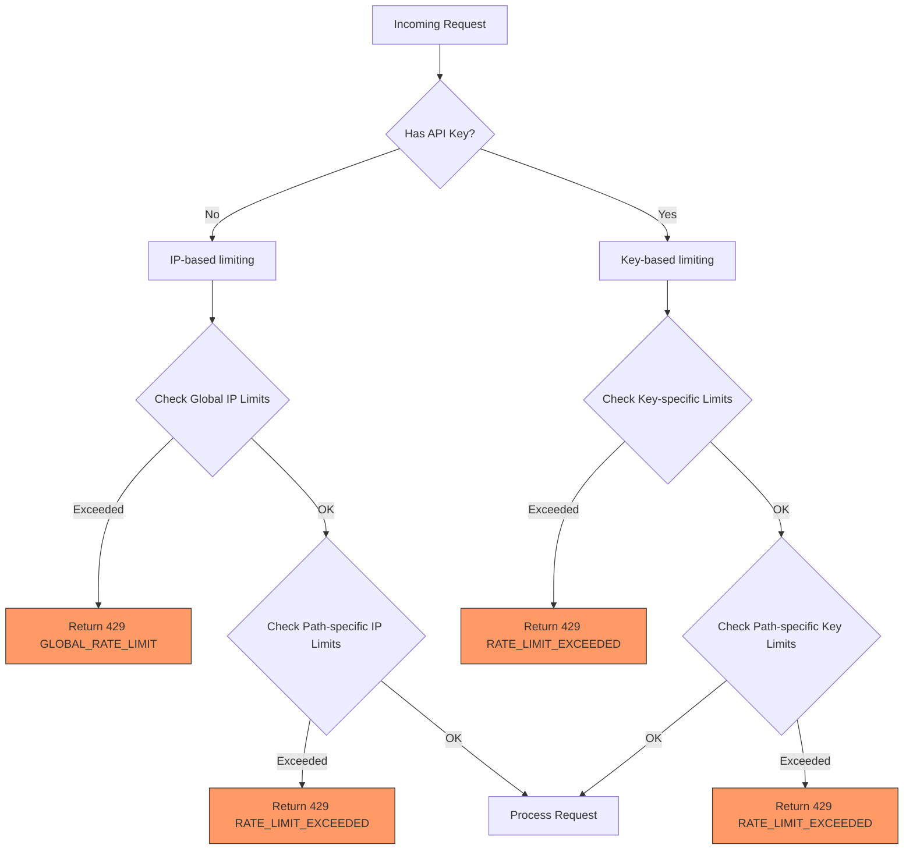
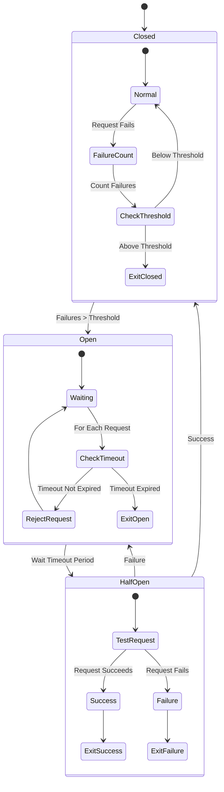
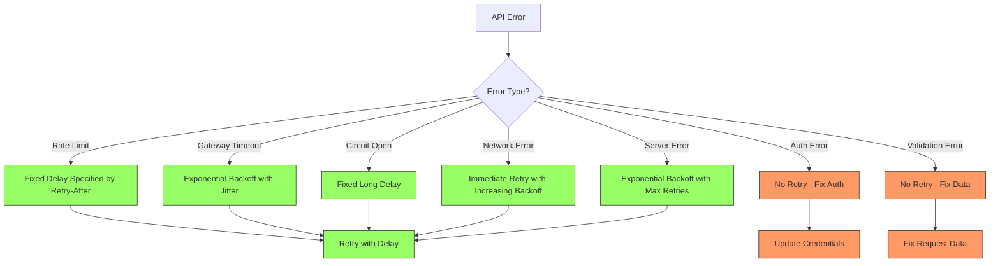
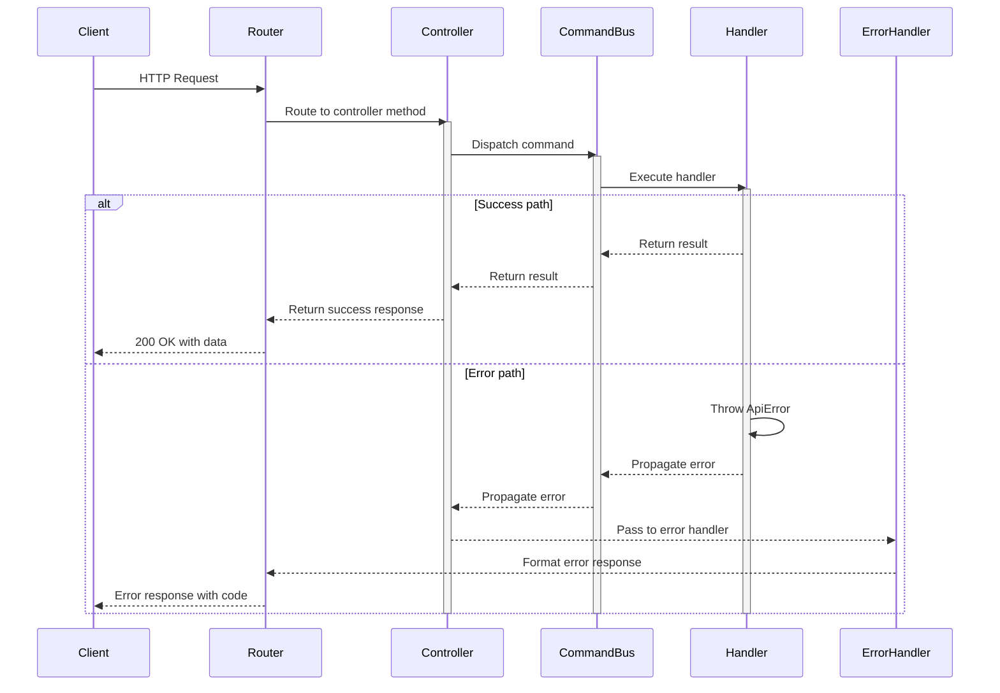
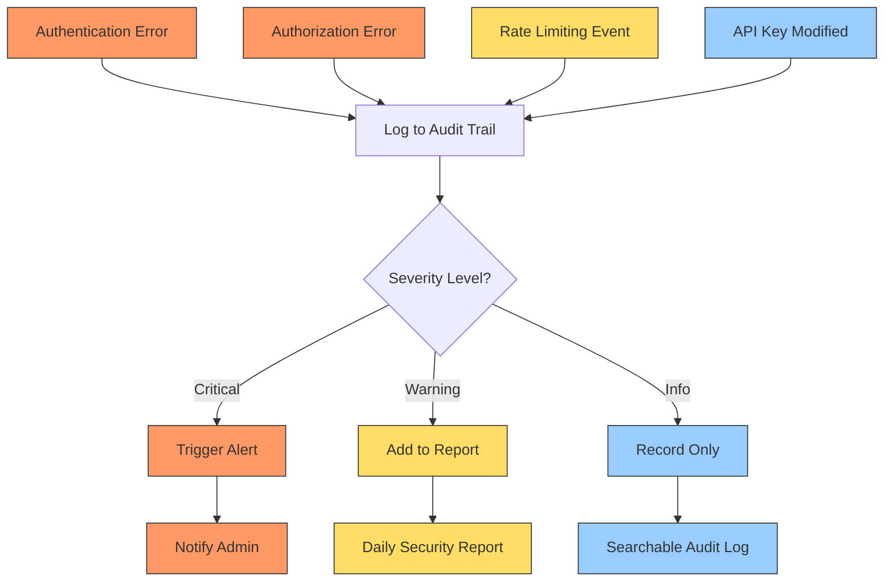
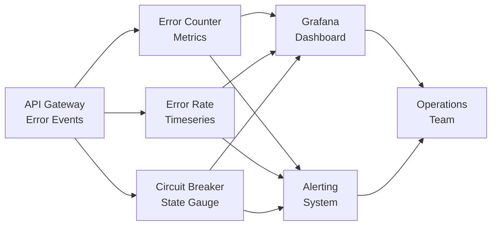

# Error Handling Guide

The API Gateway implements a comprehensive error handling system to provide consistent, secure, and informative error responses across the application. This guide explains how errors are structured, the standard error codes, and how to handle errors both as an API consumer and as a developer extending the Gateway.

## Error Response Format

All API errors are returned with a consistent JSON structure:

```json
{
  "error": "Error message describing what went wrong",
  "code": "ERROR_CODE",
  "requestId": "unique-request-identifier",
  "details": {
    // Optional additional information about the error
  }
}
```

### Fields

- **error**: A human-readable description of the error
- **code**: A machine-readable error code (see [Error Codes](#error-codes) section)
- **requestId**: A unique identifier for the request that can be used for troubleshooting
- **details**: An optional object containing additional error-specific information

## Error Flow

The following diagram shows how errors are handled throughout the API Gateway:



## HTTP Status Codes

The API Gateway uses standard HTTP status codes to indicate the general category of response:

| Status Code | Category | Description |
|-------------|----------|-------------|
| 200-299 | Success | The request was successfully received, understood, and accepted |
| 400 | Bad Request | The request contains invalid parameters or is malformed |
| 401 | Unauthorized | Authentication credentials are missing or invalid |
| 403 | Forbidden | The authenticated user doesn't have permission for the requested resource |
| 404 | Not Found | The requested resource doesn't exist |
| 405 | Method Not Allowed | The HTTP method is not supported for the requested resource |
| 409 | Conflict | The request conflicts with the current state of the server |
| 422 | Unprocessable Entity | The request was well-formed but contains semantic errors |
| 429 | Too Many Requests | The user has sent too many requests in a given amount of time |
| 500 | Internal Server Error | The server encountered an unexpected condition |
| 502 | Bad Gateway | The gateway received an invalid response from an upstream server |
| 503 | Service Unavailable | The server is currently unable to handle the request |
| 504 | Gateway Timeout | The gateway did not receive a timely response from an upstream server |

## Error Class Hierarchy

The API Gateway implements a comprehensive hierarchy of error classes:



## Error Codes

The API Gateway uses the following error codes to provide more specific information about what went wrong:

### Authentication and Authorization Errors

| Code | HTTP Status | Description |
|------|-------------|-------------|
| `MISSING_API_KEY` | 401 | No API key was provided in the request |
| `INVALID_API_KEY` | 401 | The provided API key is invalid or malformed |
| `EXPIRED_API_KEY` | 401 | The API key has expired |
| `REVOKED_API_KEY` | 401 | The API key has been revoked |
| `INSUFFICIENT_SCOPE` | 403 | The API key doesn't have the required scope for this operation |
| `PERMISSION_DENIED` | 403 | The user doesn't have permission for this operation |
| `ADMIN_REQUIRED` | 403 | This operation requires administrative privileges |

### Validation Errors

| Code | HTTP Status | Description |
|------|-------------|-------------|
| `INVALID_PARAMETERS` | 400 | The request contains invalid parameters |
| `MISSING_REQUIRED_FIELD` | 400 | A required field is missing from the request |
| `INVALID_FORMAT` | 400 | A field has an invalid format |
| `VALIDATION_FAILED` | 422 | The request data failed validation checks |
| `INVALID_JSON` | 400 | The request body contains invalid JSON |
| `SCHEMA_VALIDATION_FAILED` | 422 | The request data doesn't match the required schema |

### Resource Errors

| Code | HTTP Status | Description |
|------|-------------|-------------|
| `RESOURCE_NOT_FOUND` | 404 | The requested resource was not found |
| `METHOD_NOT_ALLOWED` | 405 | The HTTP method is not allowed for this resource |
| `RESOURCE_CONFLICT` | 409 | The request would create a resource conflict |
| `RESOURCE_ALREADY_EXISTS` | 409 | The resource already exists |
| `STALE_RESOURCE` | 409 | The resource has been modified since it was retrieved |

### Rate Limiting Errors

| Code | HTTP Status | Description |
|------|-------------|-------------|
| `RATE_LIMIT_EXCEEDED` | 429 | The rate limit for this operation has been exceeded |
| `CONCURRENT_REQUEST_LIMIT` | 429 | Too many concurrent requests from the same client |
| `GLOBAL_RATE_LIMIT` | 429 | Global API rate limit reached |

### Gateway Errors

| Code | HTTP Status | Description |
|------|-------------|-------------|
| `UPSTREAM_SERVICE_ERROR` | 502 | An upstream service returned an error |
| `GATEWAY_TIMEOUT` | 504 | The gateway timed out waiting for an upstream service |
| `CIRCUIT_OPEN` | 503 | The circuit breaker is open for the requested service |
| `SERVICE_UNAVAILABLE` | 503 | The requested service is temporarily unavailable |
| `PROXY_ERROR` | 502 | An error occurred while proxying the request |
| `TRANSFORMATION_ERROR` | 500 | Error transforming request or response |

### System Errors

| Code | HTTP Status | Description |
|------|-------------|-------------|
| `INTERNAL_ERROR` | 500 | An unexpected internal error occurred |
| `STORAGE_ERROR` | 500 | An error occurred when accessing the storage system |
| `CONFIGURATION_ERROR` | 500 | An error in the system configuration |
| `ENCRYPTION_ERROR` | 500 | An error occurred during encryption/decryption |
| `RUNTIME_ERROR` | 500 | A runtime error occurred during request processing |

## Validation Error Details

When a validation error occurs (`VALIDATION_FAILED`), the `details` field will contain information about which fields failed validation:

```json
{
  "error": "Validation failed for key creation",
  "code": "VALIDATION_FAILED",
  "requestId": "request-id-123",
  "details": {
    "validationErrors": {
      "name": "Name is required and must be a string",
      "scopes": "At least one scope is required"
    }
  }
}
```

## Rate Limiting Architecture

Rate limiting in the API Gateway follows this decision flow:



## Circuit Breaker Pattern

The API Gateway implements the Circuit Breaker pattern to handle failures in upstream services:



### Circuit Breaker Implementation Details

The Circuit Breaker pattern is implemented with these parameters:

| Parameter | Default | Description |
|-----------|---------|-------------|
| `failureThreshold` | 5 | Number of failures before opening the circuit |
| `resetTimeout` | 30000 | Time in ms before trying half-open state |
| `requestTimeout` | 10000 | Time in ms before timing out a request |

Example circuit breaker configuration:

```javascript
// Circuit breaker configuration
const circuitBreakerConfig = {
  enabled: true,
  failureThreshold: 5,
  resetTimeout: 30000
};

// Service circuit breaker state example
const circuitState = {
  "authService": {
    failures: 0,
    lastFailure: 0,
    open: false
  }
};
```

## Error Handling as an API Consumer

### Best Practices

1. **Always check HTTP status codes** first to understand the general category of the response.
2. **Parse the error code** to programmatically handle different error scenarios.
3. **Log the requestId** for troubleshooting purposes.
4. **Implement appropriate retry logic** for certain error codes (e.g., `GATEWAY_TIMEOUT`).
5. **Handle rate limiting properly** by respecting the `Retry-After` header.

### Example: Client-Side Error Handling

```javascript
async function makeApiRequest(endpoint, options) {
  try {
    const response = await fetch(`https://api.example.com${endpoint}`, {
      ...options,
      headers: {
        'X-API-Key': 'your-api-key',
        'Content-Type': 'application/json',
        ...options.headers
      }
    });
    
    if (!response.ok) {
      const errorData = await response.json();
      
      console.error(
        `API Error: ${errorData.code} - ${errorData.error}`,
        `Request ID: ${errorData.requestId}`
      );
      
      // Handle specific error cases
      switch (errorData.code) {
        case 'RATE_LIMIT_EXCEEDED':
          const retryAfter = response.headers.get('Retry-After') || 60;
          console.log(`Rate limited. Retry after ${retryAfter} seconds`);
          break;
        
        case 'EXPIRED_API_KEY':
        case 'REVOKED_API_KEY':
          // Handle authentication issues
          console.log('Authentication failed. Please update your API key.');
          break;
          
        case 'VALIDATION_FAILED':
          console.log('Validation errors:', errorData.details.validationErrors);
          break;
          
        case 'CIRCUIT_OPEN':
          console.log('Service temporarily unavailable, try again later');
          // Implement exponential backoff retry
          break;
      }
      
      throw new Error(`API request failed: ${errorData.error}`);
    }
    
    return await response.json();
  } catch (error) {
    console.error('Request failed:', error);
    throw error;
  }
}
```

### Recommended Retry Strategies



## Error Handling as a Developer

### Error Classes

The API Gateway implements a hierarchy of error classes to ensure consistent error handling. When extending the gateway, you should use the appropriate error class from this hierarchy:

### Throwing Errors

When adding new functionality, use the appropriate error class:

```javascript
import { ValidationError, NotFoundError } from '../errors/ApiError.js';

function getResource(id) {
  if (!id) {
    throw new ValidationError('Resource ID is required', {
      validationErrors: { id: 'ID is required' }
    });
  }
  
  const resource = lookupResource(id);
  
  if (!resource) {
    throw new NotFoundError('Resource', id);
  }
  
  return resource;
}
```

### Adding Custom Error Details

You can include additional details when throwing errors:

```javascript
throw new ValidationError(
  'Failed to validate input data', 
  { 
    validationErrors: { 
      name: 'Name is required', 
      email: 'Invalid email format' 
    } 
  }
);
```

### Error Middleware

The API Gateway uses error middleware (`errorHandler`) to catch all errors and format them consistently:

```javascript
/**
 * Error handler middleware for standardized error responses
 *
 * @param {Error} error - The error that occurred
 * @param {Request} request - The original request
 * @returns {Response} Formatted error response
 */
function errorHandler(error, request) {
  // Create a context with request information
  const context = {
    path: new URL(request.url).pathname,
    method: request.method,
    error: error,
    requestId: logger.getRequestId(request)
  };
  
  // Log differently based on error type
  if (error instanceof ApiError) {
    // For ApiErrors use appropriate log level based on status code
    const logLevel = error.statusCode >= 500 ? 'error' : 'warn';
    logger[logLevel](`API Error: ${error.message}`, {
      ...context,
      operation: error.code || 'API_ERROR',
      statusCode: error.statusCode
    });
    
    return new Response(
      JSON.stringify(error.toResponse()),
      {
        status: error.statusCode,
        headers: {
          "Content-Type": "application/json",
          "Access-Control-Allow-Origin": "*",
          "Access-Control-Allow-Methods": "GET, POST, PUT, DELETE, OPTIONS",
          "Access-Control-Allow-Headers":
            "Content-Type, Authorization, X-API-Key",
        },
      },
    );
  }

  // For unexpected errors, log at error level and return a generic 500 response
  logger.error(`Unexpected error: ${error.message}`, {
    ...context,
    operation: 'INTERNAL_ERROR'
  });
  
  const genericError = {
    error: "An unexpected error occurred",
    code: "INTERNAL_ERROR",
    status: 500,
  };

  return new Response(
    JSON.stringify(genericError),
    {
      status: 500,
      headers: {
        "Content-Type": "application/json",
        "Access-Control-Allow-Origin": "*",
        "Access-Control-Allow-Methods": "GET, POST, PUT, DELETE, OPTIONS",
        "Access-Control-Allow-Headers":
          "Content-Type, Authorization, X-API-Key",
      },
    },
  );
}
```

### Error Handling Flow in Controllers



## Error Logging and Alerting

The API Gateway logs all errors with the associated request ID, making it easier to trace issues. The logging level is determined by the error severity:

- **Error Level**: 5xx errors, critical system failures
- **Warning Level**: 4xx errors, rate limiting, circuit breaker events
- **Info Level**: Authentication attempts, key usage
- **Debug Level**: Request and response details for troubleshooting

### Log Format

All error logs include:

```json
{
  "level": "error",
  "message": "API Error: Resource not found",
  "timestamp": "2023-07-21T14:32:10.243Z",
  "requestId": "req-123456",
  "path": "/api/keys/123",
  "method": "GET",
  "statusCode": 404,
  "errorCode": "RESOURCE_NOT_FOUND",
  "responseTime": 42,
  "clientIp": "192.168.1.1"
}
```

## Circuit Breaker Pattern in Detail

The API Gateway implements the Circuit Breaker pattern with three distinct states:

### 1. Closed State (Normal Operation)

```javascript
// Normal request flow in closed state
if (!this.circuitState[serviceName].open) {
  try {
    const response = await fetch(request);
    
    if (response.ok) {
      // Reset failure count on success
      this.resetCircuitBreaker(serviceName);
    } else if (response.status >= 500) {
      // Record failure for server errors
      this.recordFailure(serviceName);
    }
    
    return response;
  } catch (error) {
    // Record failure for network errors
    this.recordFailure(serviceName);
    throw error;
  }
}
```

### 2. Open State (Failing Fast)

```javascript
// Circuit is open, fail fast without calling service
if (this.isCircuitOpen(serviceName)) {
  return new Response(
    JSON.stringify({ 
      error: 'Service temporarily unavailable', 
      code: 'CIRCUIT_OPEN' 
    }),
    { status: 503, headers: { 'Content-Type': 'application/json' }}
  );
}
```

### 3. Half-Open State (Probing)

```javascript
// Check if it's time to try again (half-open state)
if (circuit.open) {
  const now = Date.now();
  const resetTimeout = this.proxyConfig.circuitBreaker.resetTimeout;
  
  if (now - circuit.lastFailure > resetTimeout) {
    // Allow one test request to go through
    circuit.open = false;
    circuit.halfOpen = true;
    
    try {
      const response = await fetch(request);
      
      if (response.ok) {
        // Reset on success
        this.resetCircuitBreaker(serviceName);
      } else if (response.status >= 500) {
        // Back to open on failure
        circuit.open = true;
        circuit.failures = this.proxyConfig.circuitBreaker.failureThreshold;
      }
      
      return response;
    } catch (error) {
      // Back to open on error
      circuit.open = true;
      circuit.failures = this.proxyConfig.circuitBreaker.failureThreshold;
      throw error;
    }
  }
  
  // Still in timeout period, reject fast
  return new Response(
    JSON.stringify({ 
      error: 'Service temporarily unavailable', 
      code: 'CIRCUIT_OPEN' 
    }),
    { status: 503, headers: { 'Content-Type': 'application/json' }}
  );
}
```

## Custom Error Responses

You can customize error responses for specific scenarios by extending the error handling system:

```javascript
// Custom error for a specific feature
export class QuotaExceededError extends ApiError {
  constructor(message, details = {}) {
    super(message, 403, 'QUOTA_EXCEEDED');
    this.details = details;
  }
  
  toResponse() {
    return {
      ...super.toResponse(),
      quota: this.details
    };
  }
}

// Usage
throw new QuotaExceededError('Storage quota exceeded', { 
  current: 15.5, 
  limit: 15, 
  unit: 'GB' 
});
```

## Error Auditing and Security Events

All security-related errors are automatically logged to the audit trail, allowing administrators to monitor security-related events:



### Audited Events

| Event | Description | Severity |
|-------|-------------|----------|
| `API_KEY_CREATED` | New API key created | Info |
| `API_KEY_REVOKED` | API key revoked | Warning |
| `AUTHENTICATION_FAILED` | Failed authentication attempt | Warning |
| `AUTHORIZATION_FAILED` | Insufficient permissions | Warning |
| `ADMIN_KEY_CREATED` | Admin API key created | Critical |
| `ADMIN_KEY_USED` | Admin API key used | Warning |
| `RATE_LIMIT_TRIGGERED` | Rate limit exceeded | Info |
| `BRUTE_FORCE_SUSPECTED` | Multiple auth failures | Critical |

## Integration with Monitoring Systems

The API Gateway exports error metrics for monitoring systems:



### Exported Metrics

- `api_errors_total` - Counter of total errors by code and endpoint
- `api_error_rate` - Rate of errors as a percentage of total requests
- `circuit_breaker_state` - Current state of each service circuit breaker (0=closed, 1=open)
- `rate_limiting_events` - Counter of rate limiting events by client and endpoint

## Conclusion

The error handling system in the API Gateway Workers is designed to provide consistent, informative, and secure error responses. By following the practices outlined in this guide, you can ensure that your applications properly handle error scenarios and that any custom code you add to the gateway maintains the same level of consistency.

## Further Reading

- [API Documentation](./API.md) - Complete API reference
- [Security Guide](./SECURITY.md) - Security best practices
- [Logging Guide](./LOGGING.md) - Detailed logging information
- [Proxy Documentation](./GATEWAY.md) - API Gateway proxy features