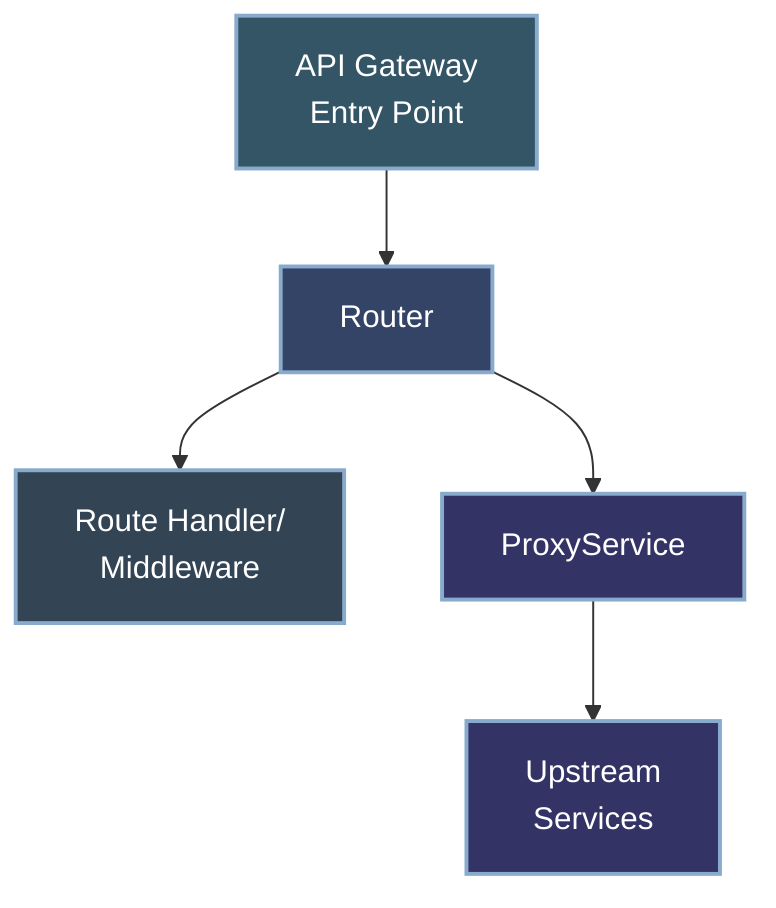
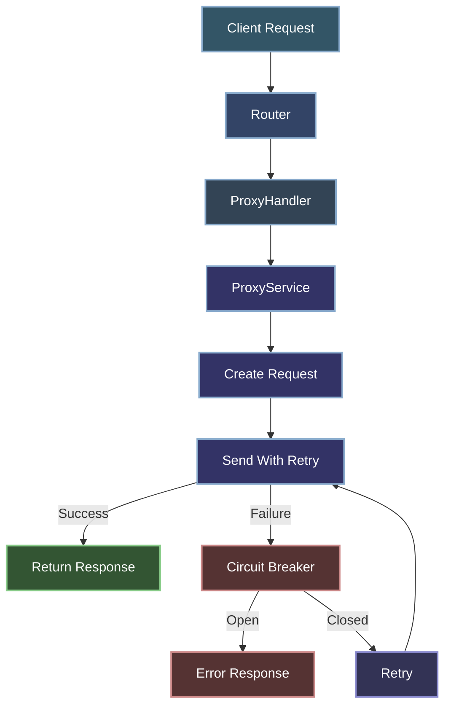

# API Gateway Functionality

The Key Manager Workers service has been enhanced with API Gateway capabilities, allowing it to not only manage API keys but also serve as a full-fledged API gateway. This document provides detailed information about these new features, their implementation, and how to use them effectively.

## Overview

The API Gateway functionality includes:

1. **Enhanced Routing**
   - Regular expression-based pattern matching
   - Validation for path parameters
   - API versioning support

2. **Proxy Capabilities**
   - Request forwarding to upstream services
   - Path rewriting and transformation
   - Header manipulation
   - Retry mechanisms with backoff
   - Circuit breaker for fault tolerance

3. **Configuration-Driven Architecture**
   - Centralized configuration for routing and proxying
   - Environment-based configuration overrides
   - Service registration for upstream endpoints

## Architecture

The gateway functionality follows the same clean architecture principles that guide the rest of the codebase:



### Key Components

1. **Enhanced Router** (`src/infrastructure/http/Router.js`)
   - Handles HTTP requests with advanced routing capabilities
   - Supports regex patterns, path parameters, and API versioning
   - Forwards proxy requests to the ProxyService

2. **ProxyService** (`src/core/proxy/ProxyService.js`)
   - Handles forwarding requests to upstream services
   - Manages retries, timeouts, and circuit breaking
   - Implements path rewriting and header manipulation

3. **Configuration** (`src/infrastructure/config/Config.js`)
   - Centralized configuration for routing and proxy settings
   - Service definitions and routing patterns
   - Environment-specific overrides

## Enhanced Routing Features

### Regex Pattern Matching

The router now supports three types of route matching with configurable priority:

1. **Exact Path Matching** (highest priority)
   ```javascript
   router.add('GET', '/users', handleGetUsers);
   ```

2. **Path Parameter Matching** (medium priority)
   ```javascript
   router.add('GET', '/users/:id', handleGetUser);
   ```

3. **Regex Pattern Matching** (lowest priority)
   ```javascript
   router.addRegex('GET', /^\/users\/(\d+)\/posts$/, handleUserPosts);
   ```

### Path Parameter Validation

The router supports validated path parameters using patterns defined in the configuration:

```javascript
// Define validation patterns in config
const config = {
  routing: {
    paramValidation: {
      id: "[a-f0-9]{8}-[a-f0-9]{4}-[a-f0-9]{4}-[a-f0-9]{4}-[a-f0-9]{12}", // UUID format
      date: "\\d{4}-\\d{2}-\\d{2}" // YYYY-MM-DD format
    }
  }
}

// Use pattern validation in routes
router.addValidated('GET', '/users/:id', 'id', 'id', handleGetUser);
router.addValidated('GET', '/logs/:date', 'date', 'date', handleGetLogs);
```

This ensures that path parameters match the expected format before the route handler is invoked.

### API Versioning

The router supports API versioning with configuration-driven version management:

```javascript
// Define API version config
const config = {
  routing: {
    versioning: {
      enabled: true,
      current: "1",
      supported: ["1", "2"],
      deprecated: [],
      versionHeader: "X-API-Version"
    }
  }
}

// Create versioned routes
router.addVersioned('GET', '/users', handleGetUsers);
// Generates routes for /v1/users and /v2/users automatically
```

You can also combine versioning with validated parameters:

```javascript
router.addVersionedValidated('GET', '/users/:id', 'id', 'id', handleGetUser);
// Generates routes for /v1/users/:id and /v2/users/:id with UUID validation
```

## Proxy Functionality

The proxy functionality allows the gateway to forward requests to upstream services.

### Configuration

Proxy configuration is centralized in the `Config` class:

```javascript
const config = {
  proxy: {
    // Master switch for proxy functionality
    enabled: true,
    // Default timeout for proxied requests (ms)
    timeout: 30000,
    // Default headers to add to proxied requests
    headers: {
      "X-Forwarded-By": "key-manager-gateway"
    },
    // Circuit breaker configuration
    circuitBreaker: {
      enabled: true,
      failureThreshold: 5,
      resetTimeout: 30000
    },
    // Retry configuration
    retry: {
      enabled: true,
      maxAttempts: 3,
      backoff: 1000 // Initial backoff in ms (doubles with each retry)
    },
    // Upstream services configuration
    services: {
      // No services defined by default
    }
  }
};
```

### Service Registration

Upstream services must be registered in the configuration before they can be used:

```javascript
config.registerProxyService('userService', {
  target: 'https://api.example.com/users',
  pathRewrite: { '^/api/users': '' },
  headers: { 'X-Service-Key': 'abc123' },
  timeout: 5000 // Service-specific timeout
});
```

### Adding Proxy Routes

Once a service is registered, you can create proxy routes:

```javascript
router.addProxy('/api/users/*', 'userService', {
  stripPrefix: '/api/users' // Optional prefix to remove
});
```

This creates routes for all HTTP methods (GET, POST, PUT, DELETE, etc.) and forwards matching requests to the specified service.

### Proxy Request Flow



1. Client sends a request to the gateway
2. Router matches the request to a proxy route
3. ProxyHandler extracts the service name and path information
4. ProxyService creates a new request for the upstream service
5. Request is sent with retry logic if configured
6. Circuit breaker monitors for failures
7. Response from upstream service is returned to the client

### Path Rewriting

The proxy supports path rewriting to transform request paths before forwarding:

1. **Service-Level Rewriting**: Defined when registering a service
   ```javascript
   config.registerProxyService('userService', {
     target: 'https://api.example.com',
     pathRewrite: { '^/api/users': '/v2/users' }
   });
   ```

2. **Route-Level Prefix Stripping**: Defined when creating a proxy route
   ```javascript
   router.addProxy('/api/users/*', 'userService', {
     stripPrefix: '/api/users'
   });
   ```

### Header Manipulation

Headers can be added at multiple levels:

1. **Global Headers**: Applied to all proxy requests
   ```javascript
   config.proxy.headers = {
     'X-Forwarded-By': 'key-manager-gateway'
   };
   ```

2. **Service-Specific Headers**: Applied to requests for a specific service
   ```javascript
   config.registerProxyService('userService', {
     headers: { 'X-Service-Key': 'abc123' }
   });
   ```

3. **Route-Specific Headers**: Applied to requests for a specific route
   ```javascript
   router.addProxy('/api/users/*', 'userService', {
     headers: { 'X-Route-Specific': 'value' }
   });
   ```

### Fault Tolerance

The proxy implementation includes several fault tolerance mechanisms:

1. **Retry Logic**
   - Configurable number of retry attempts
   - Exponential backoff with configurable initial delay
   - Success response short-circuits retry loop

2. **Circuit Breaker**
   - Tracks failure counts per service
   - Opens circuit after threshold is reached
   - Automatically resets after timeout period
   - Half-open state to test recovery

3. **Timeouts**
   - Global default timeout
   - Service-specific timeout overrides
   - Request cancellation via AbortController

## Implementation Details

### Router Implementation

The enhanced router now prioritizes routes based on configuration:

```javascript
findRoute(method, path) {
  // Routes are checked in order of priority
  // 1. Exact path match (highest priority)
  // 2. Parameter path match (medium priority)
  // 3. Regex path match (lowest priority)
  
  // Start with exact path matches
  for (const route of this.routes) {
    if (route.method !== method) continue;
    if (!route.isRegex && route.path === path) {
      return { ...route, params: {} };
    }
  }
  
  // Then check parameter paths
  // ...
  
  // Finally check regex paths
  // ...
}
```

### ProxyService Implementation

The ProxyService handles the complexities of forwarding requests:

```javascript
async proxyRequest(serviceName, request, path) {
  // Check if proxy is enabled
  if (!this.proxyConfig.enabled) {
    return new Response(
      JSON.stringify({ error: 'Proxy functionality is disabled' }),
      { status: 501, headers: { 'Content-Type': 'application/json' }}
    );
  }
  
  // Get service configuration
  const serviceConfig = this.proxyConfig.services?.[serviceName];
  if (!serviceConfig) {
    return new Response(
      JSON.stringify({ error: `Unknown proxy service: ${serviceName}` }),
      { status: 502, headers: { 'Content-Type': 'application/json' }}
    );
  }
  
  // Check circuit breaker
  if (this.isCircuitOpen(serviceName)) {
    return new Response(
      JSON.stringify({ error: 'Service temporarily unavailable' }),
      { status: 503, headers: { 'Content-Type': 'application/json' }}
    );
  }
  
  // Create the proxied request
  const proxiedRequest = await this.createProxiedRequest(
    this.buildTargetUrl(serviceConfig, path || requestUrl.pathname, requestUrl.search),
    request,
    serviceConfig
  );
  
  // Send the request with retry logic
  return this.sendWithRetry(serviceName, proxiedRequest);
}
```

## Configuration Reference

### Routing Configuration

```javascript
routing: {
  // API versioning configuration
  versioning: {
    enabled: true,          // Enable/disable versioning
    current: "1",           // Current API version
    supported: ["1"],       // All supported versions
    deprecated: [],         // Deprecated versions
    versionHeader: "X-API-Version"  // Response header
  },
  // Path parameter validation patterns
  paramValidation: {
    id: "[a-f0-9]{8}-[a-f0-9]{4}-[a-f0-9]{4}-[a-f0-9]{4}-[a-f0-9]{12}", // UUID format
    date: "\\d{4}-\\d{2}-\\d{2}", // YYYY-MM-DD format
    status: "(active|revoked|expired)" // Valid status values
  },
  // Route priority (lower number = higher priority)
  priority: {
    exact: 1,
    parameter: 2,
    regex: 3
  }
}
```

### Proxy Configuration

```javascript
proxy: {
  // Master switch for proxy functionality
  enabled: false,
  // Default timeout for proxied requests (ms)
  timeout: 30000,
  // Default headers to add to proxied requests
  headers: {
    "X-Forwarded-By": "key-manager-gateway"
  },
  // Circuit breaker configuration
  circuitBreaker: {
    enabled: true,
    failureThreshold: 5,
    resetTimeout: 30000
  },
  // Retry configuration
  retry: {
    enabled: true,
    maxAttempts: 3,
    backoff: 1000 // Initial backoff in ms (doubles with each retry)
  },
  // Upstream services configuration
  services: {
    // Services registered via registerProxyService
  }
}
```

## Environment Variables

The gateway functionality can be configured using environment variables:

| Variable | Description | Default |
|----------|-------------|---------|
| ROUTING_API_VERSIONING_ENABLED | Enable/disable API versioning | true |
| API_VERSION_CURRENT | Current API version | "1" |
| API_VERSIONS_SUPPORTED | Comma-separated list of supported versions | "1" |
| API_VERSIONS_DEPRECATED | Comma-separated list of deprecated versions | "" |
| API_VERSION_HEADER | Header for API version | "X-API-Version" |
| PROXY_ENABLED | Enable/disable proxy functionality | false |
| PROXY_TIMEOUT | Default proxy timeout in ms | 30000 |
| PROXY_RETRY_ENABLED | Enable/disable retry mechanism | true |
| PROXY_RETRY_MAX_ATTEMPTS | Maximum retry attempts | 3 |
| PROXY_CIRCUIT_BREAKER_ENABLED | Enable/disable circuit breaker | true |

## Usage Examples

### Basic Routing Examples

```javascript
// Standard route
router.add('GET', '/users', handleGetUsers);

// Route with path parameter
router.add('GET', '/users/:id', handleGetUser);

// Route with regex pattern
router.addRegex('GET', /^\/users\/(\d+)\/posts$/, handleUserPosts);

// Route with validated parameter
router.addValidated('GET', '/users/:id', 'id', 'id', handleGetUser);

// Versioned route
router.addVersioned('GET', '/users', handleGetUsers);

// Versioned route with validated parameter
router.addVersionedValidated('GET', '/users/:id', 'id', 'id', handleGetUser);
```

### Proxy Examples

```javascript
// Register an upstream service
config.registerProxyService('userService', {
  target: 'https://api.example.com',
  pathRewrite: { '^/api/users': '/v2/users' },
  headers: { 'X-Service-Key': 'abc123' }
});

// Create a proxy route
router.addProxy('/api/users/*', 'userService', {
  stripPrefix: '/api/users'
});

// Create a proxy route with regex pattern
router.addRegex('GET', /^\/api\/users\/(\d+)$/, (req, ctx) => {
  return ctx.proxyService.proxyRequest('userService', req, `/users/${ctx.params[0]}`);
});
```

## Gateway Features Roadmap

### Phase 1: Foundation (Implemented)
- ✅ Improved request routing with regex patterns and path variables
- ✅ Enhanced path parameter validation
- ✅ API versioning support
- ✅ Basic proxy functionality for backend services

### Phase 2: Advanced Features (Planned)
- ⬜ Service discovery and registration
- ⬜ Load balancing across multiple backend services
- ⬜ Request/response transformation capabilities
- ⬜ Advanced traffic management (throttling, circuit breaking)

### Phase 3: Enterprise Capabilities (Future)
- ⬜ Support for multiple protocols (gRPC, WebSockets)
- ⬜ API composition and aggregation
- ⬜ Performance analytics dashboard
- ⬜ Blue/green and canary deployment capabilities

## Troubleshooting

### Common Issues

#### Proxy Services Not Working
- Ensure `PROXY_ENABLED` is set to true
- Verify the service has been properly registered
- Check that the target URL is accessible
- Inspect network traffic for request/response details

#### Route Not Matching
- Check route priority (exact > parameter > regex)
- Ensure regex patterns are properly escaped
- Verify path parameter validation patterns
- Confirm API versioning configuration

#### Performance Issues
- Monitor circuit breaker status
- Check retry configuration
- Optimize regex patterns for efficiency
- Consider increasing timeouts for slow services

### Debugging

Set the `DEBUG=true` environment variable to enable detailed logging, including:
- Route matching attempts
- Proxy request details
- Circuit breaker state changes
- Retry attempts

## Security Considerations

When using the gateway functionality, consider the following security aspects:

1. **Authentication and Authorization**
   - The gateway forwards requests as-is by default
   - Consider adding authentication middleware for proxy routes
   - Use service-specific API keys in headers when needed

2. **Rate Limiting**
   - Apply rate limiting to proxy routes to prevent abuse
   - Consider service-specific rate limits

3. **Response Validation**
   - Validate responses from upstream services
   - Consider implementing response sanitization

4. **TLS/SSL**
   - Ensure upstream services use HTTPS
   - Validate certificates when connecting to services

5. **Header Security**
   - Be careful with header forwarding to prevent information leakage
   - Sanitize sensitive headers before forwarding

## Best Practices

1. **Route Organization**
   - Group related routes together
   - Use consistent patterns for API endpoints
   - Document route patterns and parameter validation

2. **Service Registration**
   - Register services during application startup
   - Use descriptive service names
   - Document service dependencies

3. **Error Handling**
   - Implement consistent error responses
   - Log service failures for monitoring
   - Consider custom error templates for proxy failures

4. **Monitoring**
   - Monitor circuit breaker statuses
   - Track proxy request latencies
   - Set up alerts for service degradation

5. **Performance**
   - Cache frequently accessed proxy responses
   - Use efficient regex patterns
   - Implement request batching for high-volume endpoints