# Quick Start Guide

This guide will help you quickly set up and start using the API Key Manager service.

## Overview

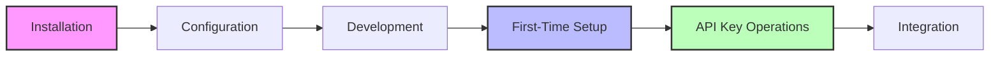

## Prerequisites

- [Node.js](https://nodejs.org/) (v16 or higher)
- [npm](https://www.npmjs.com/) (v7 or higher)
- [Wrangler CLI](https://developers.cloudflare.com/workers/wrangler/) (for Cloudflare Workers)
- A Cloudflare account (free tier is sufficient)

## Installation

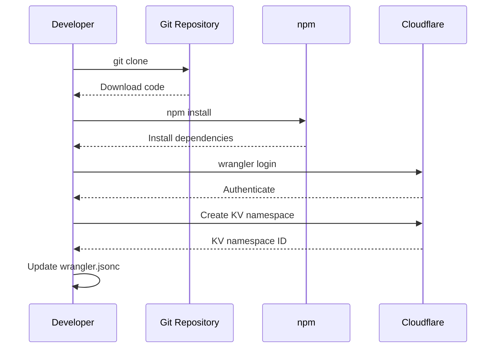

1. Clone the repository:

```bash
git clone https://github.com/erfianugrah/key-manager-workers.git
cd key-manager-workers
```

2. Install dependencies:

```bash
npm install
```

3. Configure your Cloudflare credentials:

```bash
wrangler login
```

4. Configure the KV namespaces in your wrangler.jsonc file:

```bash
# Create KV namespace for your environment
wrangler kv:namespace create "KV" 
```

Copy the ID from the output and update your wrangler.jsonc file with the correct KV namespace ID.

## Configuration

The API Gateway uses a comprehensive configuration system that supports:
- Configuration files in JSON format
- Environment variables with the `CONFIG_` prefix
- OpenAPI schema validation for all settings

### Basic Configuration Setup

Create a configuration file (e.g., `config.json`) with your settings:

```json
{
  "proxy": {
    "enabled": true,
    "services": {
      "auth": {
        "target": "https://auth-service.example.com",
        "pathRewrite": {
          "^/api/auth": ""
        },
        "headers": {
          "X-Internal-Service": "gateway"
        }
      },
      "users": {
        "target": "https://user-service.example.com",
        "timeout": 5000
      },
      "content": {
        "target": "https://content-service.example.com",
        "pathRewrite": {
          "^/api/content": "/v2"
        }
      }
    }
  },
  "encryption": {
    "key": "your-encryption-key-here-for-development-only"
  },
  "hmac": {
    "secret": "your-hmac-secret-here-for-development-only" 
  },
  "security": {
    "cors": {
      "allowOrigin": "*",
      "allowMethods": "GET, POST, PUT, DELETE, OPTIONS",
      "allowHeaders": "Content-Type, Authorization, X-API-Key" 
    },
    "apiKeyHeader": "X-API-Key"
  },
  "logging": {
    "level": "info",
    "includeTrace": true
  }
}
```

### Using Environment Variables

All configuration options can also be set via environment variables with a `CONFIG_` prefix:

```bash
# Example: Set logging level to debug
CONFIG_LOGGING_LEVEL=debug npm run dev

# Example: Enable proxy functionality
CONFIG_PROXY_ENABLED=true npm run dev

# Example: Configure a proxy service
CONFIG_PROXY_SERVICES_AUTH_TARGET=https://auth.example.com npm run dev
```

### Configuration Priority

Configuration values are resolved with the following priority (highest to lowest):
1. Environment variables with `CONFIG_` prefix
2. Values from configuration file
3. Default values from the OpenAPI schema

### Production Configuration

For production deployments, set these required security variables as Cloudflare secrets:

```bash
# Generate secure random values
ENCRYPTION_KEY=$(openssl rand -base64 32)
HMAC_SECRET=$(openssl rand -base64 32)

# Set them as Cloudflare secrets
wrangler secret put ENCRYPTION_KEY
wrangler secret put HMAC_SECRET
```

For more details, see the [Configuration documentation](./CONFIGURATION.md).

## Local Development

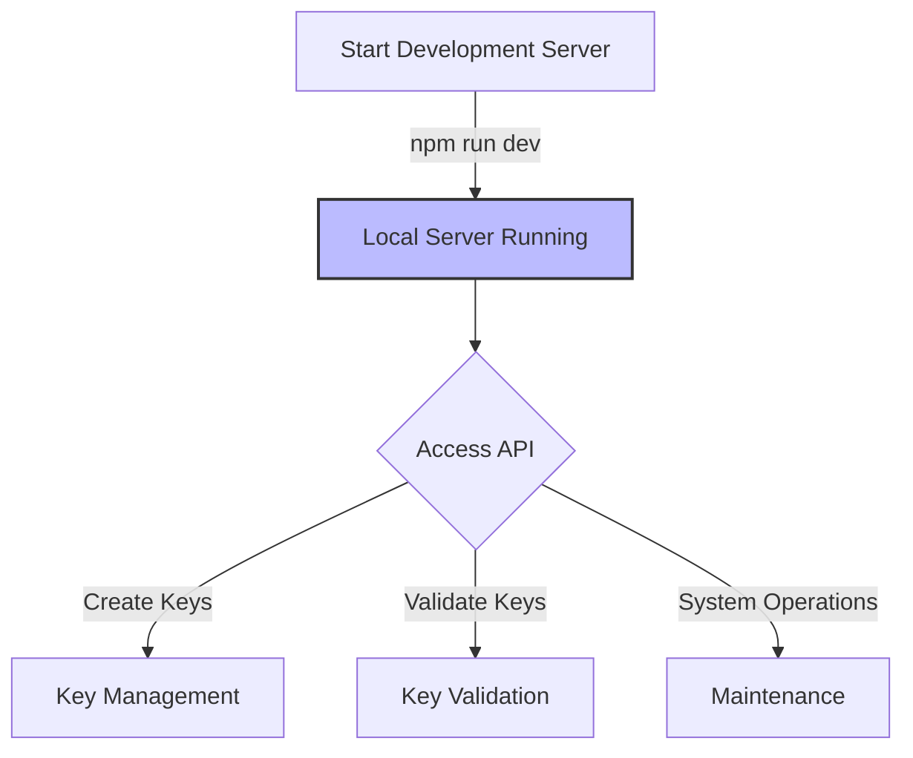

Start a local development server:

```bash
npm run dev
```

This will start the API Key Manager service on `http://localhost:8787`.

## First-Time Setup

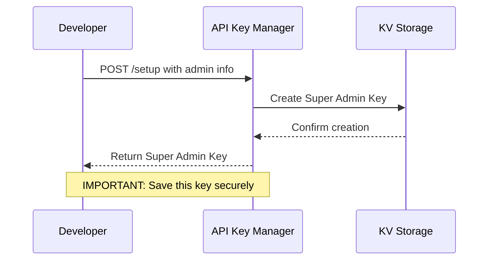

When you first deploy the service, you need to create the initial super admin:

```bash
curl -X POST http://localhost:8787/setup \
  -H "Content-Type: application/json" \
  -d '{
    "name": "Super Admin",
    "email": "admin@example.com"
  }'
```

Response:

```json
{
  "message": "Initial setup completed successfully",
  "id": "d8e8fca2-dc0f-4db4-ac8c-5b6b4a4b9a94",
  "key": "km_a95c530a7af5f492a74499e70578d150...",
  "name": "Super Admin (Super Admin)",
  "email": "admin@example.com",
  "role": "SUPER_ADMIN",
  "note": "IMPORTANT: Save this API key securely. It will never be shown again."
}
```

**Important**: Save the API key from the response securely. It will only be shown once and cannot be recovered later.

## Administrative Operations

All administrative operations require an API key with appropriate permissions. Include your admin API key in the `X-Api-Key` header for all administrative requests.

### API Key Lifecycle

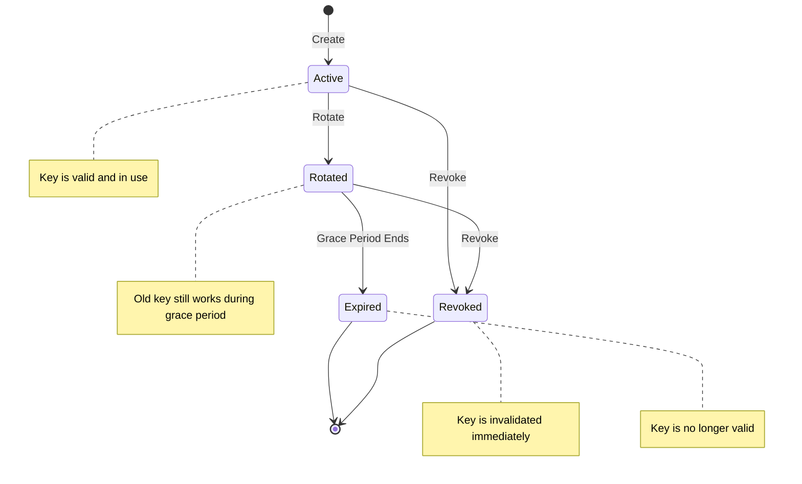

### Creating an API Key

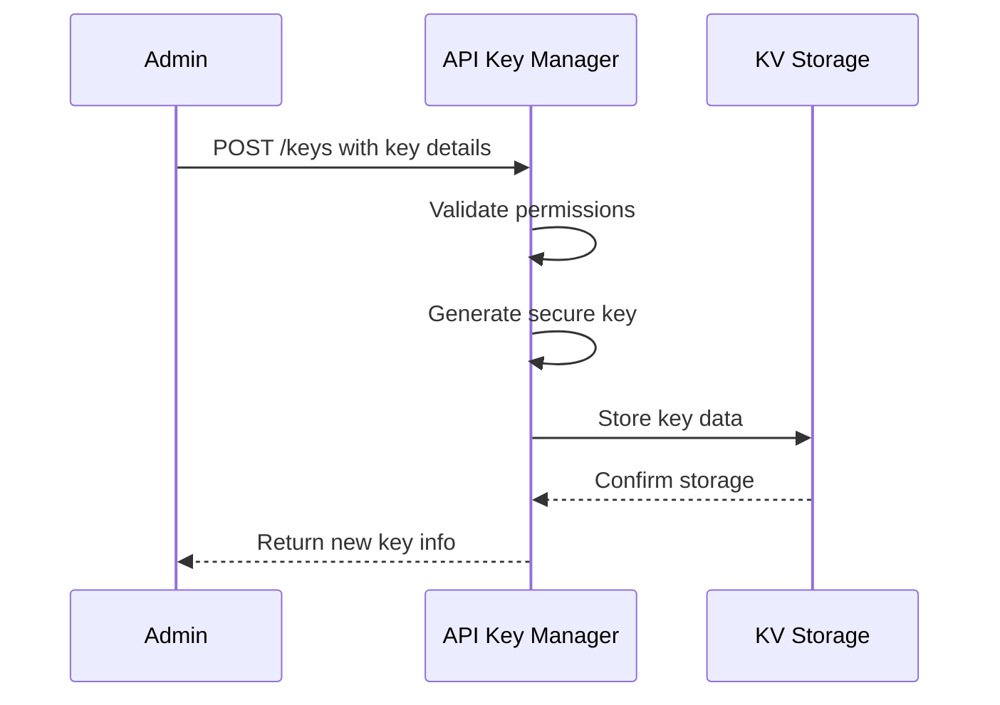

```bash
curl -X POST http://localhost:8787/keys \
  -H "Content-Type: application/json" \
  -H "X-Api-Key: km_your_admin_key_here" \
  -d '{
    "name": "My API Key",
    "owner": "user@example.com",
    "scopes": ["read:data", "write:data"],
    "expiresAt": 1735689600000
  }'
```

Response:

```json
{
  "id": "d8e8fca2-dc0f-4db4-ac8c-5b6b4a4b9a94",
  "name": "My API Key",
  "owner": "user@example.com",
  "scopes": ["read:data", "write:data"],
  "status": "active",
  "createdAt": 1677609600000,
  "expiresAt": 1735689600000,
  "lastUsedAt": 0,
  "key": "km_a95c530a7af5f492a74499e70578d150..."
}
```

### Listing API Keys

```bash
curl http://localhost:8787/keys \
  -H "X-Api-Key: km_your_admin_key_here"
```

Response:

```json
[
  {
    "id": "d8e8fca2-dc0f-4db4-ac8c-5b6b4a4b9a94",
    "name": "My API Key",
    "owner": "user@example.com",
    "scopes": ["read:data", "write:data"],
    "status": "active",
    "createdAt": 1677609600000,
    "expiresAt": 1735689600000,
    "lastUsedAt": 1677695999000
  }
]
```

For more efficient pagination with large datasets, use the cursor-based endpoint:

```bash
curl "http://localhost:8787/keys-cursor?limit=10" \
  -H "X-Api-Key: km_your_admin_key_here"
```

### Getting API Key Details

```bash
curl http://localhost:8787/keys/d8e8fca2-dc0f-4db4-ac8c-5b6b4a4b9a94 \
  -H "X-Api-Key: km_your_admin_key_here"
```

Response:

```json
{
  "id": "d8e8fca2-dc0f-4db4-ac8c-5b6b4a4b9a94",
  "name": "My API Key",
  "owner": "user@example.com",
  "scopes": ["read:data", "write:data"],
  "status": "active",
  "createdAt": 1677609600000,
  "expiresAt": 1735689600000,
  "lastUsedAt": 1677695999000
}
```

### Rotating an API Key

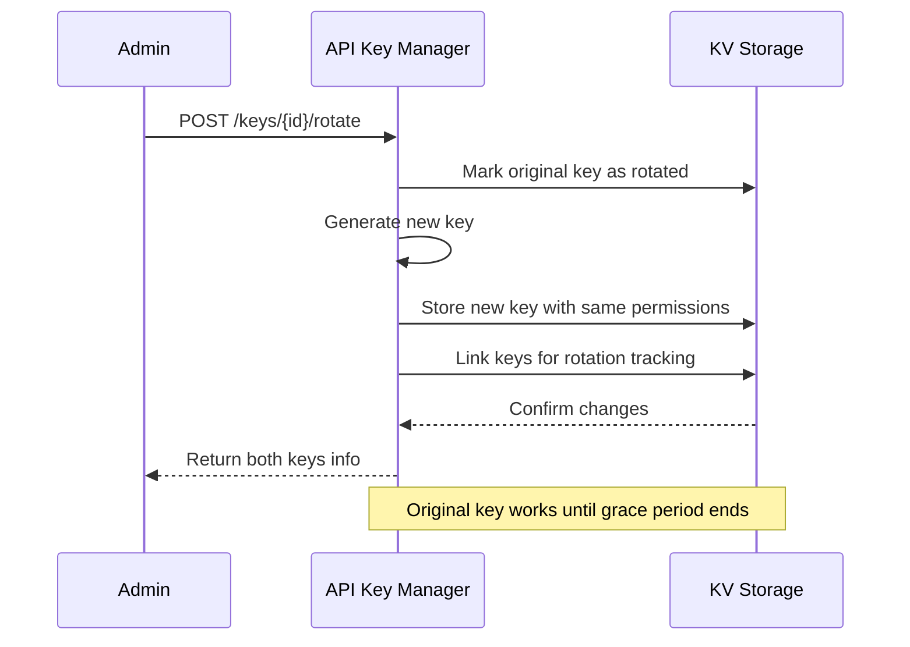

To rotate a key (create a new key while maintaining a grace period for the old one):

```bash
curl -X POST http://localhost:8787/keys/d8e8fca2-dc0f-4db4-ac8c-5b6b4a4b9a94/rotate \
  -H "Content-Type: application/json" \
  -H "X-Api-Key: km_your_admin_key_here" \
  -d '{
    "gracePeriodDays": 30,
    "name": "Rotated Key Name"
  }'
```

Response:

```json
{
  "success": true,
  "message": "API key rotated successfully",
  "originalKey": {
    "id": "d8e8fca2-dc0f-4db4-ac8c-5b6b4a4b9a94",
    "name": "My API Key",
    "status": "rotated",
    "rotatedAt": 1677609600000,
    "gracePeriodEnds": 1680288000000
  },
  "newKey": {
    "id": "f9e7d6c5-b4a3-2d1c-e0f9-8b7a6c5d4e3f",
    "key": "km_new_key_value_here",
    "name": "Rotated Key Name",
    "status": "active",
    "createdAt": 1677609600000
  }
}
```

### Revoking an API Key

```bash
curl -X DELETE http://localhost:8787/keys/d8e8fca2-dc0f-4db4-ac8c-5b6b4a4b9a94 \
  -H "X-Api-Key: km_your_admin_key_here"
```

Response:

```json
{
  "success": true,
  "message": "API key revoked successfully",
  "id": "d8e8fca2-dc0f-4db4-ac8c-5b6b4a4b9a94",
  "name": "My API Key",
  "revokedAt": 1677695999000
}
```

## Public Endpoints

### Validating an API Key

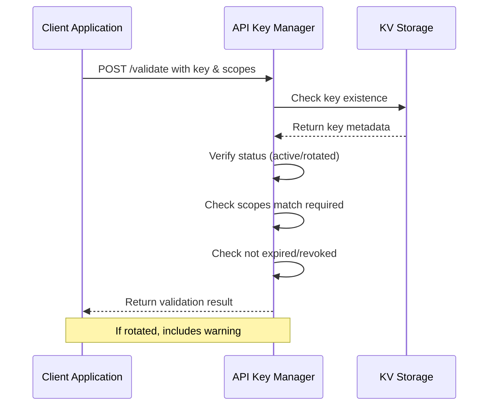

The validation endpoint is public (doesn't require admin authentication) and can be used by your services to validate API keys.

Using the key in the request body:

```bash
curl -X POST http://localhost:8787/validate \
  -H "Content-Type: application/json" \
  -d '{
    "key": "km_a95c530a7af5f492a74499e70578d150...",
    "scopes": ["read:data"]
  }'
```

Or using the key in the header:

```bash
curl -X POST http://localhost:8787/validate \
  -H "Content-Type: application/json" \
  -H "X-API-Key: km_a95c530a7af5f492a74499e70578d150..." \
  -d '{
    "scopes": ["read:data"]
  }'
```

Response (valid key):

```json
{
  "valid": true,
  "owner": "user@example.com",
  "scopes": ["read:data", "write:data"],
  "keyId": "d8e8fca2-dc0f-4db4-ac8c-5b6b4a4b9a94"
}
```

Response (rotated key):

```json
{
  "valid": true,
  "owner": "user@example.com",
  "scopes": ["read:data", "write:data"],
  "keyId": "d8e8fca2-dc0f-4db4-ac8c-5b6b4a4b9a94",
  "warning": "This API key has been rotated. Please switch to the new key before 2023-01-15T00:00:00.000Z",
  "rotatedToId": "f9e7d6c5-b4a3-2d1c-e0f9-8b7a6c5d4e3f",
  "gracePeriodEnds": 1673740800000
}
```

### Health Check

```bash
curl http://localhost:8787/health
```

Response:

```json
{
  "status": "healthy",
  "version": "1.0.0",
  "timestamp": 1677609600000
}
```

## System Administration

### Running Maintenance Tasks

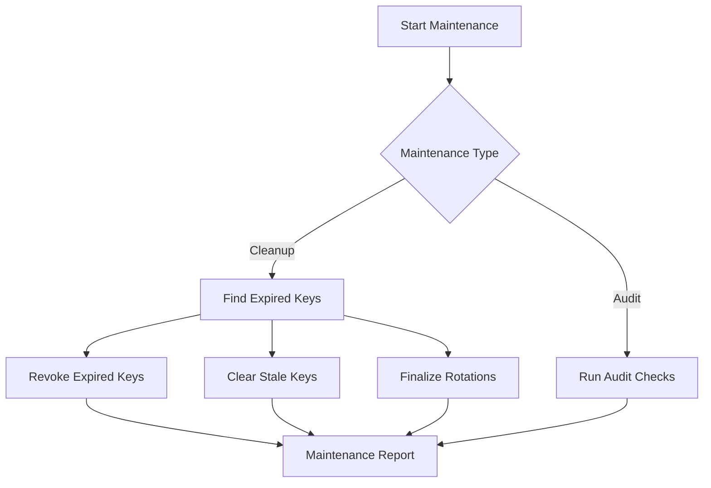

To manually trigger cleanup of expired keys (requires admin:system:maintenance permission):

```bash
curl -X POST http://localhost:8787/maintenance/cleanup \
  -H "X-Api-Key: km_your_admin_key_here"
```

Response:

```json
{
  "revokedCount": 5,
  "staleCount": 2,
  "rotationCount": 3,
  "timestamp": 1677695999000
}
```

### Viewing Audit Logs

To view admin action logs (requires admin:system:logs permission):

```bash
curl "http://localhost:8787/logs/admin?limit=10" \
  -H "X-Api-Key: km_your_admin_key_here"
```

Response:

```json
{
  "logs": [
    {
      "id": "log-uuid-1",
      "timestamp": 1677609600000,
      "adminId": "admin-uuid-1",
      "action": "create_key",
      "details": {
        "keyId": "key-uuid-1",
        "name": "New API Key"
      },
      "ip": "192.168.1.1",
      "userAgent": "Mozilla/5.0..."
    }
  ],
  "cursor": "next-page-cursor",
  "hasMore": true
}
```

## Role-Based Access Control

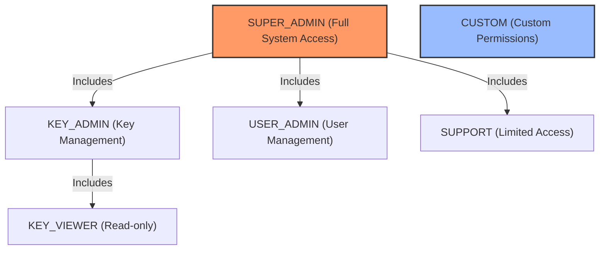

The API Key Manager uses role-based access control with the following predefined roles:

| Role | Description | Key Permissions |
|------|-------------|-----------------|
| SUPER_ADMIN | Full system access | admin:keys:*, admin:users:*, admin:system:* |
| KEY_ADMIN | API key management | admin:keys:create, admin:keys:read, admin:keys:revoke |
| KEY_VIEWER | Read-only key access | admin:keys:read |
| USER_ADMIN | Admin user management | admin:users:create, admin:users:read, admin:users:revoke |
| SUPPORT | Limited support access | admin:keys:read, admin:users:read |
| CUSTOM | Custom permissions | (as specified during creation) |

## Client Integration

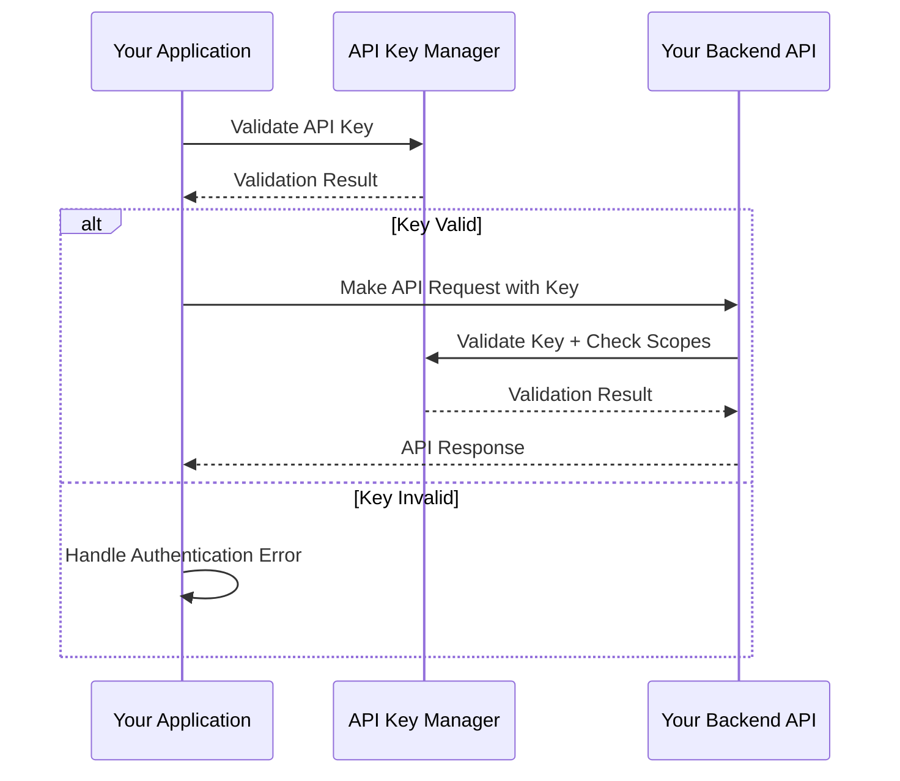

Here are examples of how to integrate the API Key Manager with your applications.

### JavaScript/Node.js Example

```javascript
// Validate an API key
async function validateApiKey(apiKey, requiredScopes = []) {
  const response = await fetch('https://your-worker.workers.dev/validate', {
    method: 'POST',
    headers: {
      'Content-Type': 'application/json',
      'X-API-Key': apiKey
    },
    body: JSON.stringify({ scopes: requiredScopes })
  });
  
  const result = await response.json();
  
  if (result.valid) {
    // Check for rotation warning
    if (result.warning) {
      console.warn(`API Key Warning: ${result.warning}`);
    }
    return true;
  } else {
    console.error(`API Key Error: ${result.error}`);
    return false;
  }
}

// Administrative operations example
async function createApiKey(adminKey, keyData) {
  const response = await fetch('https://your-worker.workers.dev/keys', {
    method: 'POST',
    headers: {
      'Content-Type': 'application/json',
      'X-Api-Key': adminKey
    },
    body: JSON.stringify(keyData)
  });
  
  if (response.ok) {
    return await response.json();
  } else {
    const error = await response.json();
    throw new Error(`Failed to create API key: ${error.error}`);
  }
}
```

### Python Example

```python
import requests

def validate_api_key(api_key, required_scopes=None):
    if required_scopes is None:
        required_scopes = []
        
    response = requests.post(
        'https://your-worker.workers.dev/validate',
        headers={
            'Content-Type': 'application/json',
            'X-API-Key': api_key
        },
        json={'scopes': required_scopes}
    )
    
    result = response.json()
    
    if result.get('valid', False):
        # Check for rotation warning
        if 'warning' in result:
            print(f"API Key Warning: {result['warning']}")
        return True
    else:
        print(f"API Key Error: {result.get('error', 'Unknown error')}")
        return False

def create_api_key(admin_key, key_data):
    response = requests.post(
        'https://your-worker.workers.dev/keys',
        headers={
            'Content-Type': 'application/json',
            'X-API-Key': admin_key
        },
        json=key_data
    )
    
    if response.ok:
        return response.json()
    else:
        error = response.json()
        raise Exception(f"Failed to create API key: {error.get('error', 'Unknown error')}")
```

### Express.js Middleware Example

Here's a complete middleware implementation for validating API keys in Express.js applications:

```javascript
// API Key validation middleware for Express.js
const axios = require('axios');

/**
 * Creates middleware for validating API keys against the API Gateway
 * @param {Object} options - Configuration options
 * @param {string} options.gatewayUrl - API Gateway URL
 * @param {string[]} options.requiredScopes - Required permission scopes
 * @param {boolean} options.cacheResults - Whether to cache validation results
 * @param {number} options.cacheTtl - Cache TTL in milliseconds
 * @param {boolean} options.failClosed - If true, deny access on gateway errors
 */
function createApiKeyMiddleware(options = {}) {
  const {
    gatewayUrl = 'https://your-gateway.workers.dev',
    requiredScopes = [],
    cacheResults = true,
    cacheTtl = 60000, // 1 minute
    failClosed = true
  } = options;

  // Simple in-memory cache
  const cache = new Map();

  // Cleanup expired cache entries periodically
  if (cacheResults) {
    setInterval(() => {
      const now = Date.now();
      for (const [key, entry] of cache.entries()) {
        if (now > entry.expiresAt) {
          cache.delete(key);
        }
      }
    }, Math.min(cacheTtl, 60000)); // Run at most every minute
  }

  return async (req, res, next) => {
    // Get API key from header or query parameter
    const apiKey = req.headers['x-api-key'] || req.query.api_key;
    
    if (!apiKey) {
      return res.status(401).json({ 
        error: 'API key is required',
        code: 'MISSING_API_KEY',
        requestId: req.id || crypto.randomUUID()
      });
    }
    
    // Check cache first
    if (cacheResults) {
      const cacheKey = `${apiKey}:${requiredScopes.join(',')}`;
      const cachedResult = cache.get(cacheKey);
      
      if (cachedResult && cachedResult.expiresAt > Date.now()) {
        // Add validated info to request object
        req.apiKey = cachedResult.data;
        
        // Handle rotation warnings
        if (cachedResult.data.warning) {
          res.setHeader('X-API-Key-Warning', cachedResult.data.warning);
        }
        
        return next();
      }
    }
    
    try {
      // Validate key against API Gateway
      const response = await axios({
        method: 'POST',
        url: `${gatewayUrl}/validate`,
        headers: {
          'Content-Type': 'application/json',
          'X-API-Key': apiKey,
          'X-Request-ID': req.id || crypto.randomUUID()
        },
        data: { scopes: requiredScopes },
        timeout: 5000 // 5-second timeout
      });
      
      const result = response.data;
      
      if (result.valid) {
        // Prepare API key info
        const apiKeyInfo = {
          id: result.keyId,
          owner: result.owner,
          scopes: result.scopes,
          warning: result.warning,
          rotatedToId: result.rotatedToId,
          gracePeriodEnds: result.gracePeriodEnds
        };
        
        // Cache result
        if (cacheResults) {
          const cacheKey = `${apiKey}:${requiredScopes.join(',')}`;
          cache.set(cacheKey, {
            data: apiKeyInfo,
            expiresAt: Date.now() + cacheTtl
          });
        }
        
        // Add validated info to request object
        req.apiKey = apiKeyInfo;
        
        // Check for rotation warning
        if (result.warning) {
          // Add header to inform client about rotation
          res.setHeader('X-API-Key-Warning', result.warning);
        }
        
        next();
      } else {
        return res.status(403).json({ 
          error: result.error || 'Invalid API key',
          code: result.code || 'INVALID_API_KEY',
          requestId: req.id || crypto.randomUUID()
        });
      }
    } catch (error) {
      console.error('API key validation error:', error);
      
      // Decide whether to fail open or closed
      if (failClosed) {
        return res.status(500).json({ 
          error: 'Failed to validate API key',
          code: 'VALIDATION_ERROR',
          requestId: req.id || crypto.randomUUID()
        });
      } else {
        // In fail-open mode (less secure but more available), 
        // we allow the request through but log the error
        console.warn(`Fail-open: Allowing request despite validation error: ${error.message}`);
        next();
      }
    }
  };
}

// Configuration options for different environments
const apiKeyMiddlewareOptions = {
  development: {
    gatewayUrl: 'http://localhost:8787',
    cacheResults: false,  // Disable cache for development
    failClosed: false     // Allow requests on errors for easier development
  },
  production: {
    gatewayUrl: 'https://api-gateway.example.com',
    cacheResults: true,
    cacheTtl: 300000,     // 5 minutes cache
    failClosed: true      // Block requests on errors in production
  }
};

// Create environment-specific middleware
const env = process.env.NODE_ENV || 'development';
const apiKeyMiddleware = createApiKeyMiddleware(apiKeyMiddlewareOptions[env]);

// Usage in Express routes
app.get('/protected-resource', 
  apiKeyMiddleware, // Use without parameters for global required scopes
  (req, res) => {
    // Access is granted and key is valid
    res.json({ 
      message: 'Success', 
      data: 'Protected data',
      keyOwner: req.apiKey.owner
    });
  }
);

// Usage with specific scopes for a route
app.post('/users', 
  createApiKeyMiddleware({ ...apiKeyMiddlewareOptions[env], requiredScopes: ['write:users'] }),
  (req, res) => {
    // Only keys with write:users scope can access this
    res.json({ 
      message: 'User created',
      userId: 123
    });
  }
);

// Protected route with multiple scopes required
app.delete('/admin/users/:id', 
  createApiKeyMiddleware({ 
    ...apiKeyMiddlewareOptions[env], 
    requiredScopes: ['admin:users', 'delete:users'],
    failClosed: true // Always fail closed for admin routes
  }),
  (req, res) => {
    // High-security route requires multiple permissions
    res.json({ 
      message: 'User deleted',
      id: req.params.id
    });
  }
);
```

## Deployment

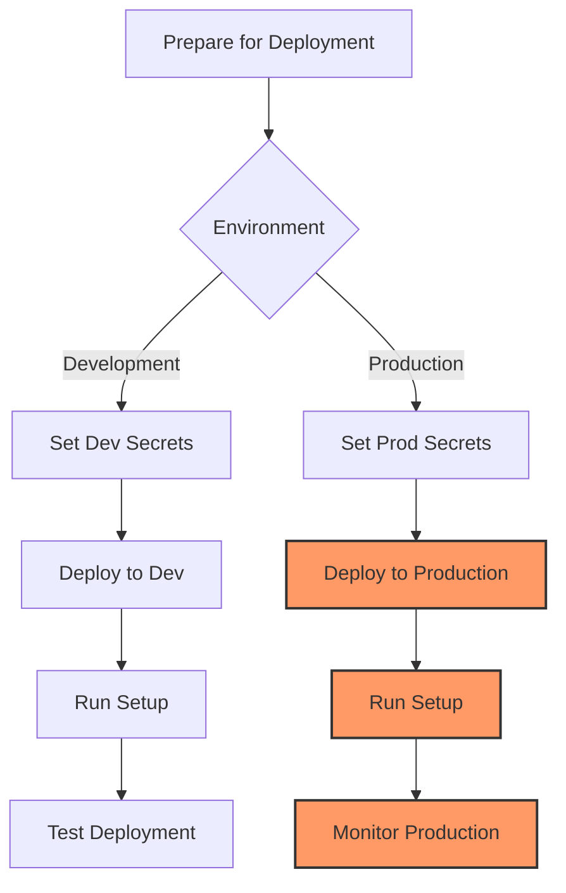

### Pre-deployment Checklist

Before deploying to production, make sure you have completed the following:

1. Generated secure encryption key and HMAC secret
2. Created a production configuration file
3. Set required environment variables
4. Tested your configuration locally
5. Planned your initial setup (admin user information)
6. Prepared your database strategy (KV namespaces for different environments)
7. Configured custom domains (if required)

### Environment-Specific Settings

#### Development Environment

```bash
# Create a development KV namespace
wrangler kv:namespace create "KV_DEV"

# Update wrangler.jsonc with dev binding
# Example:
#  "dev": {
#    "kv_namespaces": [
#      {
#        "binding": "KV",
#        "id": "your-dev-kv-id"
#      }
#    ]
#  }
```

#### Production Environment 

```bash
# Create a production KV namespace
wrangler kv:namespace create "KV_PROD" --env production

# Update wrangler.jsonc with production binding
# Example:
#  "env": {
#    "production": {
#      "kv_namespaces": [
#        {
#          "binding": "KV",
#          "id": "your-prod-kv-id"
#        }
#      ]
#    }
#  }
```

### Deploying to Different Environments

#### Development Deployment

```bash
# Deploy to development environment
npm run dev

# Alternatively, use Wrangler directly
wrangler deploy --env development
```

#### Production Deployment

```bash
# Deploy to production environment
npm run deploy:prod

# Alternatively, use Wrangler directly
wrangler deploy --env production
```

This will deploy the API Gateway service to Cloudflare Workers using Wrangler.

### Environment Variables and Secrets

Set the following secret environment variables for production:

```bash
# For dev/staging environments
wrangler secret put ENCRYPTION_KEY --env development
wrangler secret put HMAC_SECRET --env development

# For production
wrangler secret put ENCRYPTION_KEY --env production
wrangler secret put HMAC_SECRET --env production
```

### Recommended Secret Generation

For maximum security, generate strong random values for your secrets:

```bash
# Generate a secure encryption key (32 bytes)
ENCRYPTION_KEY=$(openssl rand -base64 32)
echo "ENCRYPTION_KEY: $ENCRYPTION_KEY"

# Generate a secure HMAC secret (32 bytes)
HMAC_SECRET=$(openssl rand -base64 32)
echo "HMAC_SECRET: $HMAC_SECRET"

# Save these securely in your password manager or secrets vault
```

### Custom Domain Setup

To use a custom domain with your API Gateway:

1. Add a custom domain in your Cloudflare Workers configuration:

```bash
# Add a custom domain
wrangler domain add api-gateway.yourdomain.com --env production
```

2. Update your DNS settings to point to your Workers domain.

3. Configure your `wrangler.jsonc` with the custom domain:

```json
{
  "env": {
    "production": {
      "route": "api-gateway.yourdomain.com/*"
    }
  }
}
```

### Post-Deployment Steps

After successful deployment, perform these important steps:

1. Create the initial super admin:

```bash
curl -X POST https://api-gateway.yourdomain.com/setup \
  -H "Content-Type: application/json" \
  -d '{
    "name": "Super Admin",
    "email": "admin@example.com"
  }'
```

2. Test the deployment with basic health check:

```bash
curl https://api-gateway.yourdomain.com/health
```

3. Check logs to verify proper functioning:

```bash
wrangler tail --env production
```

4. Set up monitoring and alerts (see Monitoring section).

## Next Steps

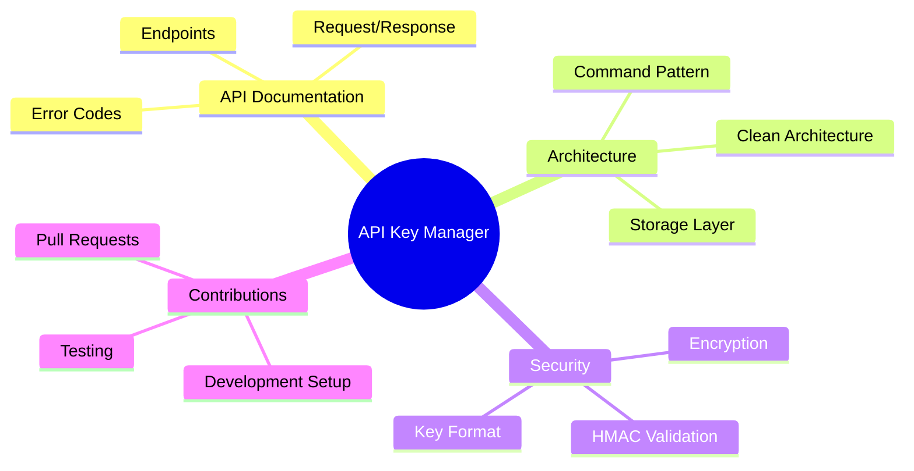

- Read the full [API documentation](./API.md)
- Learn about the [architecture](./ARCHITECTURE.md)
- Understand the [security implementation](./SECURITY.md)
- See how to [contribute](../CONTRIBUTING.md)

## Troubleshooting

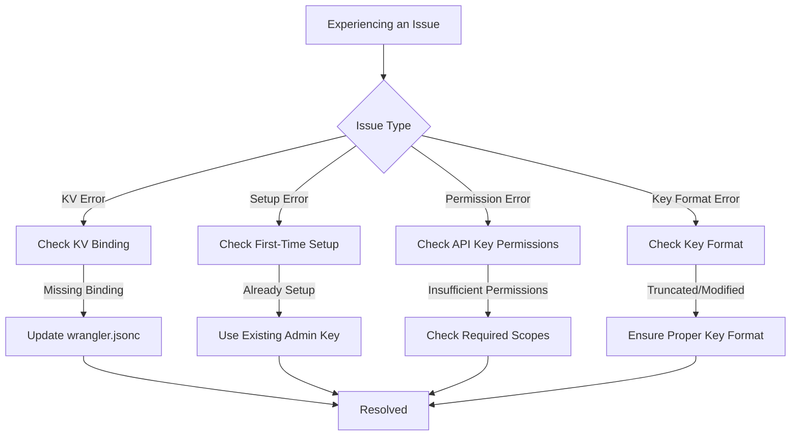

### Common Issues

**"Missing KV binding"**

Make sure your `wrangler.jsonc` file has the correct KV namespace binding:

```json
{
  "kv_namespaces": [
    {
      "binding": "KV",
      "id": "your-kv-namespace-id-here"
    }
  ]
}
```

**"Setup has already been completed"**

The setup endpoint can only be called once. If you need to create additional admins, you need to use the existing super admin API key.

**"You do not have permission"**

This means your API key doesn't have the required permission scope for the operation you're trying to perform. Check the role and permissions associated with your API key.

**"Invalid API key format"**

Ensure your API keys are in the correct format (starting with `km_` followed by a hex string) and have not been truncated or modified.

### Debug Mode

For more detailed error information during development, set the debug mode:

```bash
# Enable debug mode for local development
CONFIG_LOGGING_LEVEL=debug npm run dev
```

This will provide more detailed logs in the console to help diagnose issues.

For more help, please [open an issue](https://github.com/yourusername/key-manager-workers/issues).