# Security Implementation Details

This document outlines the security features implemented in the API Key Manager service.

## Security Architecture Overview

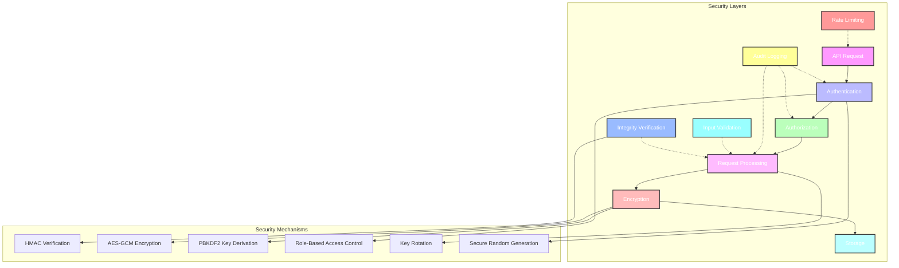

The security architecture integrates multiple layers of protection, from API request authentication to secure storage with encryption and integrity verification. Each layer has specific responsibilities to provide defense in depth.

## Core Security Features

### API Key Generation

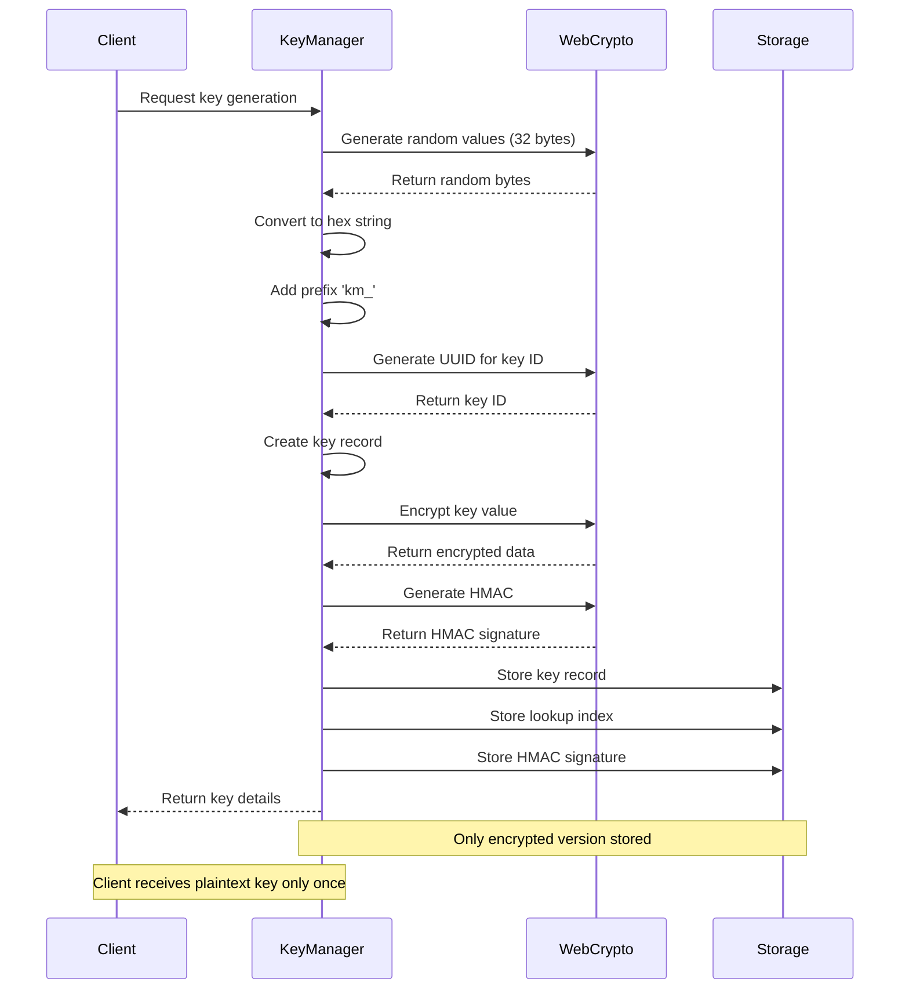

API keys are generated using the Web Crypto API to ensure cryptographic randomness:

```javascript
export function generateApiKey(prefix = 'km_') {
  const keyBuffer = new Uint8Array(32);
  crypto.getRandomValues(keyBuffer);
  
  const randomPart = [...keyBuffer]
    .map(byte => byte.toString(16).padStart(2, '0'))
    .join('');
    
  return `${prefix}${randomPart}`;
}
```

Key characteristics:
- 32 bytes (256 bits) of entropy
- Hex-encoded for safe transfer
- Prefixed with 'km_' for easy identification
- Keys have a consistent format and length

### Encryption at Rest

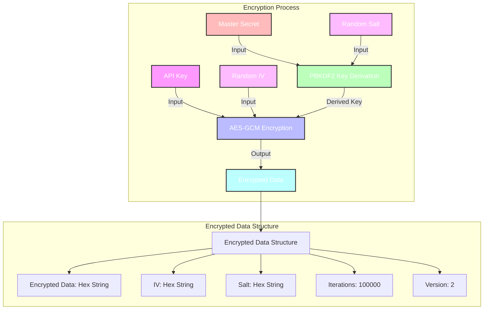

API keys are encrypted at rest using AES-GCM encryption:

```javascript
export async function encryptData(data, secret, isTest = false) {
  // Generate a random IV for each encryption (12 bytes for AES-GCM)
  const iv = crypto.getRandomValues(new Uint8Array(12));

  // Generate salt (16 bytes)
  const salt = crypto.getRandomValues(new Uint8Array(16));

  // Derive a suitable encryption key using PBKDF2
  // Using 100,000 iterations for better security
  const key = await crypto.subtle.deriveKey(
    {
      name: "PBKDF2",
      salt: salt,
      iterations: 100000,
      hash: "SHA-256",
    },
    keyMaterial,
    { name: "AES-GCM", length: 256 },
    false,
    ["encrypt"],
  );

  // Encrypt the data and return the encrypted data with metadata
  // ...
}
```

Encryption security features:
- AES-GCM authenticated encryption
- Unique initialization vector (IV) for each key
- Key derivation with PBKDF2 and high iteration count
- Version field for future encryption algorithm changes
- Support for key rotation without service disruption

### HMAC Signature Verification

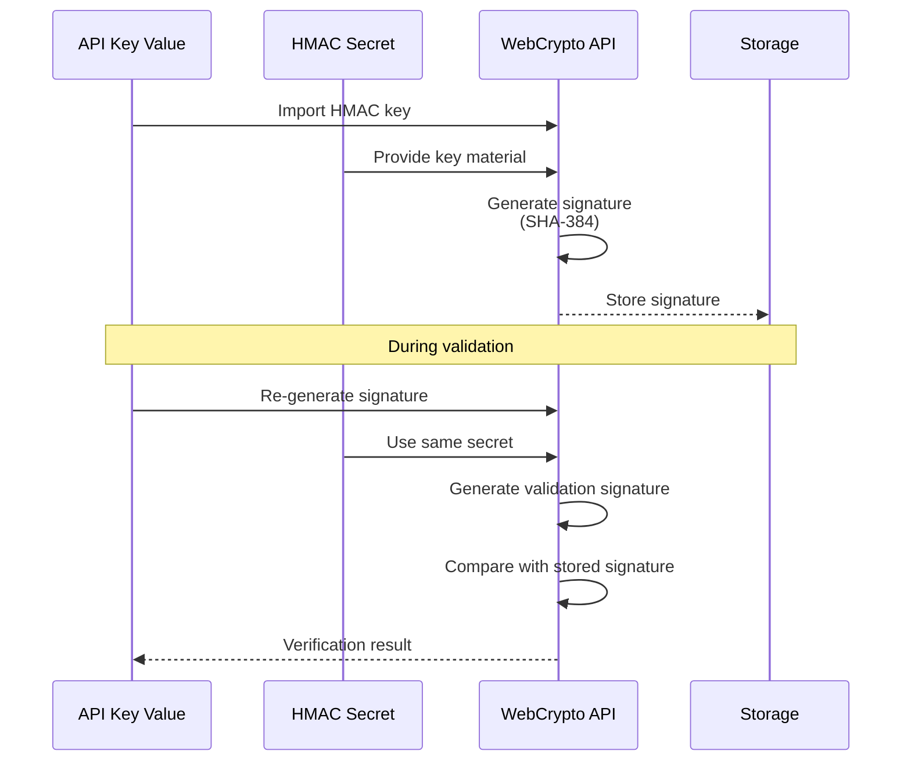

API keys include HMAC signatures for additional security:

```javascript
export async function generateHmac(keyId, secret, isTest = false) {
  const encoder = new TextEncoder();
  const keyData = encoder.encode(secret);
  const message = encoder.encode(keyId);

  // Import the secret key
  const key = await crypto.subtle.importKey(
    "raw",
    keyData,
    { name: "HMAC", hash: "SHA-384" }, // Using SHA-384 for stronger HMAC
    false,
    ["sign"],
  );

  // Sign the message
  const signature = await crypto.subtle.sign(
    "HMAC",
    key,
    message,
  );

  // Convert the signature to a hex string
  return bufferToHex(new Uint8Array(signature));
}
```

HMAC security benefits:
- Prevents key forgery even if database is compromised
- Uses SHA-384 for strong cryptographic security
- Provides integrity verification for key validation
- Allows secure key rotation

### Key Rotation

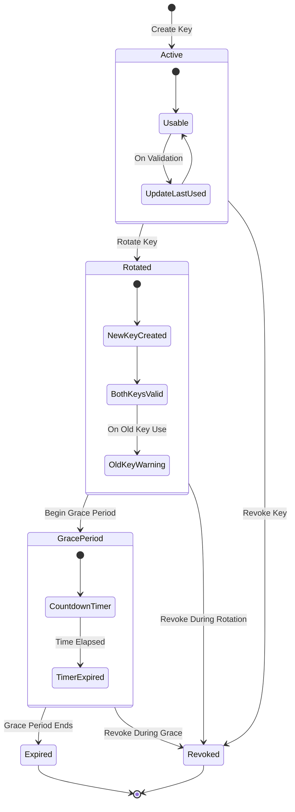

The system supports both API key rotation and cryptographic material rotation:

1. **API Key Rotation**:
   - Creates a new key while keeping the old one active during a grace period
   - Both keys work during the transition period
   - Warning indicators on old key usage to encourage migration
   - Configurable grace period (default 30 days)

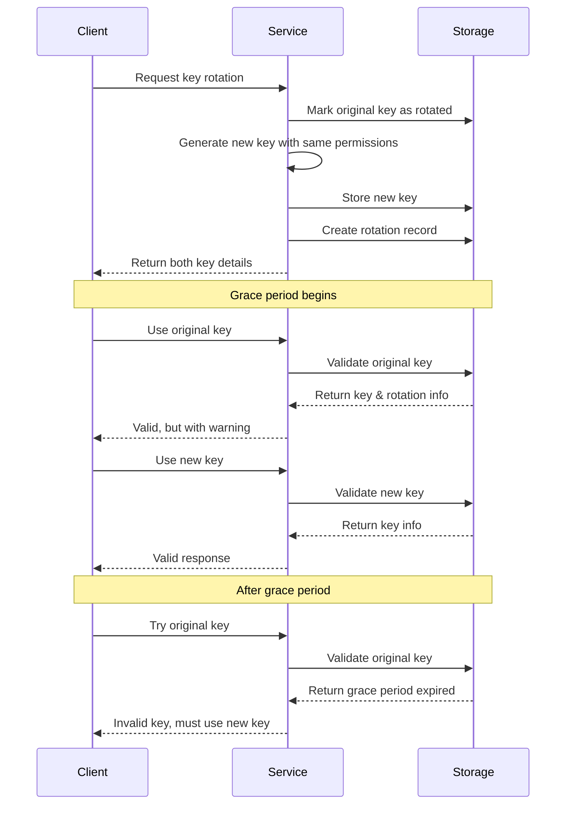

2. **Cryptographic Material Rotation**:
   - Allows rotating the encryption and HMAC secrets
   - Decrypts and re-encrypts all stored keys with new material
   - Updates all HMAC signatures with new material
   - Maintains backward compatibility during transition

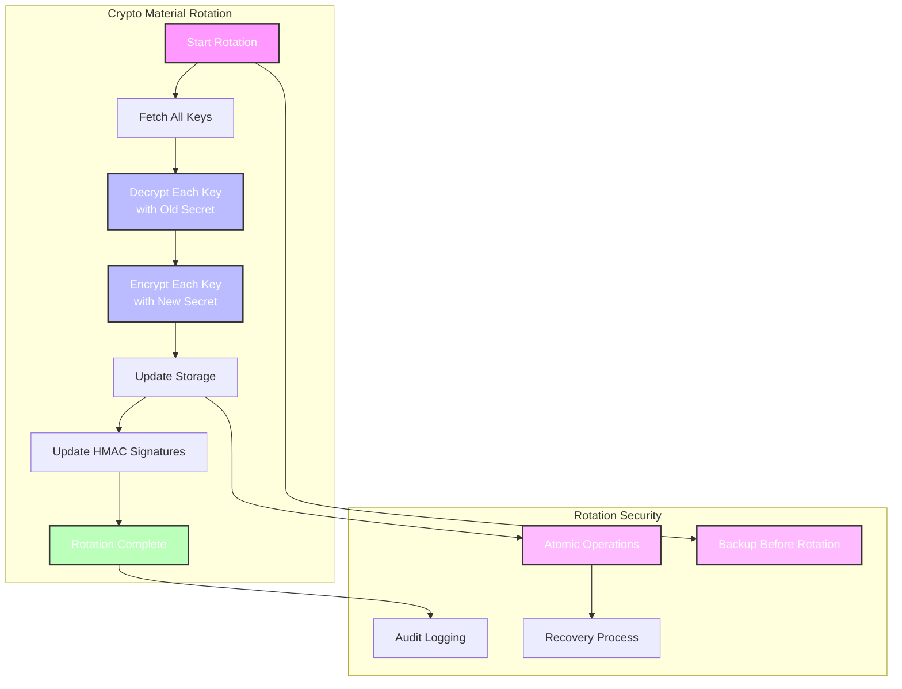

### Role-Based Access Control

```mermaid
graph TB
    subgraph "Role Hierarchy"
        SUPER["SUPER_ADMIN"] --> KEY_ADMIN["KEY_ADMIN"]
        SUPER --> USER_ADMIN["USER_ADMIN"]
        SUPER --> SYSTEM_ADMIN["SYSTEM_ADMIN"]
        KEY_ADMIN --> KEY_VIEWER["KEY_VIEWER"]
        USER_ADMIN --> USER_VIEWER["USER_VIEWER"]
        SUPER --> SUPPORT["SUPPORT"]
    end
    
    subgraph "Permission Categories"
        KEY_PERMS["admin:keys:*"]
        USER_PERMS["admin:users:*"]
        SYSTEM_PERMS["admin:system:*"]
        
        KEY_PERMS --> KEY_CREATE["admin:keys:create"]
        KEY_PERMS --> KEY_READ["admin:keys:read"]
        KEY_PERMS --> KEY_REVOKE["admin:keys:revoke"]
        KEY_PERMS --> KEY_ROTATE["admin:keys:rotate"]
        
        USER_PERMS --> USER_CREATE["admin:users:create"]
        USER_PERMS --> USER_READ["admin:users:read"]
        USER_PERMS --> USER_REVOKE["admin:users:revoke"]
        
        SYSTEM_PERMS --> SYSTEM_CONFIG["admin:system:config"]
        SYSTEM_PERMS --> SYSTEM_MAINT["admin:system:maintenance"]
        SYSTEM_PERMS --> SYSTEM_LOGS["admin:system:logs"]
        SYSTEM_PERMS --> SYSTEM_SECURITY["admin:system:security"]
    end
    
    SUPER -.-> KEY_PERMS
    SUPER -.-> USER_PERMS
    SUPER -.-> SYSTEM_PERMS
    
    KEY_ADMIN -.-> KEY_CREATE
    KEY_ADMIN -.-> KEY_READ
    KEY_ADMIN -.-> KEY_REVOKE
    KEY_ADMIN -.-> KEY_ROTATE
    
    KEY_VIEWER -.-> KEY_READ
    
    USER_ADMIN -.-> USER_CREATE
    USER_ADMIN -.-> USER_READ
    USER_ADMIN -.-> USER_REVOKE
    
    USER_VIEWER -.-> USER_READ
    
    SUPPORT -.-> KEY_READ
    SUPPORT -.-> USER_READ
    
    style SUPER fill:#f99,stroke:#333,stroke-width:2px,color:#ffffff
    style KEY_ADMIN fill:#9f9,stroke:#333,stroke-width:2px,color:#ffffff
    style USER_ADMIN fill:#99f,stroke:#333,stroke-width:2px,color:#ffffff
    style SYSTEM_ADMIN fill:#f9f,stroke:#333,stroke-width:2px,color:#ffffff
    style KEY_PERMS fill:#ff9,stroke:#333,stroke-width:2px,color:#ffffff
    style USER_PERMS fill:#ff9,stroke:#333,stroke-width:2px,color:#ffffff
    style SYSTEM_PERMS fill:#ff9,stroke:#333,stroke-width:2px,color:#ffffff
```

Admin access is controlled using a comprehensive role-based permission system:

```javascript
export function hasPermission(adminKey, requiredPermission) {
  // Normalize required permission to lowercase for case-insensitive checks
  const normalizedRequired = requiredPermission.toLowerCase();

  // Check each scope in the admin key
  for (const scope of adminKey.scopes) {
    // Direct match - the admin has exactly this permission
    if (normalizedScope === normalizedRequired) {
      return true;
    }

    // Wildcard match at the end (e.g., "admin:keys:*")
    if (normalizedScope.endsWith(":*")) {
      // Get the base scope (everything before the "*")
      const baseScope = normalizedScope.slice(0, -1);

      // If the required permission starts with this base, it's a match
      if (normalizedRequired.startsWith(baseScope)) {
        return true;
      }
    }
    
    // More checks...
  }

  // No matching permission found
  return false;
}
```

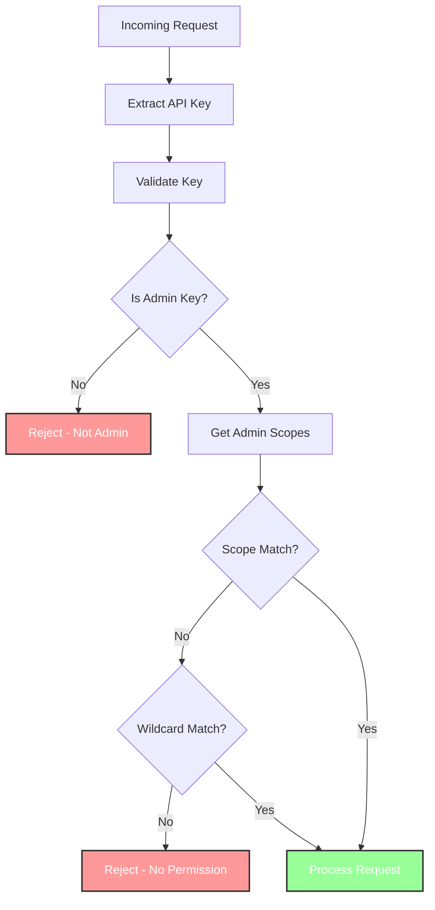

RBAC security features:
- Granular permission control using scope hierarchies
- Wildcard permissions for administrative convenience
- Case-insensitive permission matching for consistency
- Predefined roles with sensible permission boundaries
- Support for custom roles with specific permissions

### Comprehensive Audit Logging

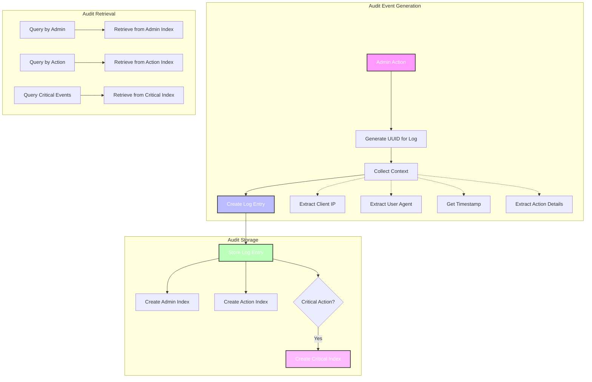

All administrative actions are logged for accountability:

```javascript
export async function logAdminAction(adminId, action, details, env, request) {
  // Generate a unique ID for the log entry
  const logId = crypto.randomUUID();

  // Get client IP if request is provided
  let clientIp = "unknown";
  let userAgent = "unknown";
  if (request) {
    clientIp = getClientIp(request);
    userAgent = request.headers.get("User-Agent") || "unknown";
  }

  // Create log entry
  const logEntry = {
    id: logId,
    timestamp: Date.now(),
    adminId: adminId,
    action: action,
    details: details || {},
    ip: clientIp,
    userAgent: userAgent,
  };

  // Store log entry and indices
  // ...
}
```

Audit logging features:
- Captures who performed each action
- Records what action was performed with detailed context
- Logs when the action occurred (timestamp)
- Records client IP address and user agent
- Special handling for critical security actions
- Multiple indices for efficient log retrieval

## Rate Limiting

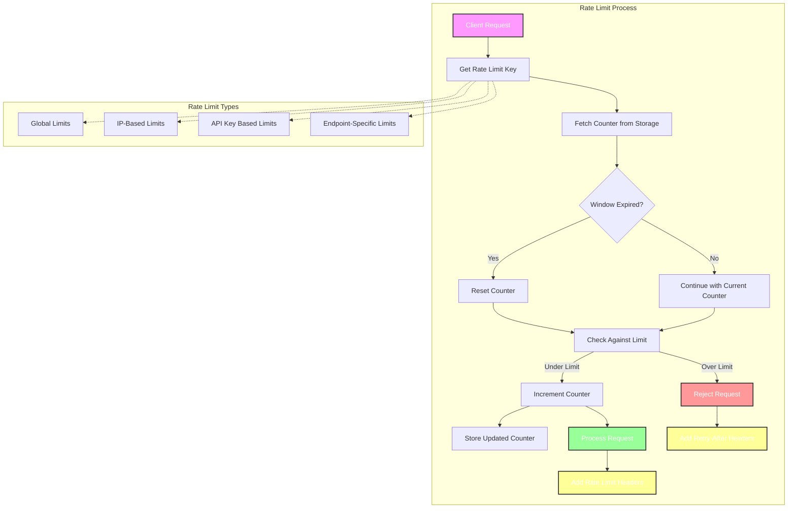

Rate limiting is implemented to prevent abuse and brute force attacks:

```javascript
export async function checkRateLimit(
  storage, 
  rateLimitKey, 
  limit = 100, 
  windowMs = 60000
) {
  // Get current rate limit data or create new
  const rateLimitData = await storage.get(rateLimitKey) || { 
    count: 0, 
    resetAt: Date.now() + windowMs 
  };
  
  // Reset counter if the time window has passed
  if (rateLimitData.resetAt < Date.now()) {
    rateLimitData.count = 0;
    rateLimitData.resetAt = Date.now() + windowMs;
  }
  
  // Check if rate limit exceeded BEFORE incrementing
  const limited = rateLimitData.count >= limit;
  const retryAfter = Math.ceil((rateLimitData.resetAt - Date.now()) / 1000);
  
  // Calculate remaining
  const remaining = Math.max(0, limit - rateLimitData.count);
  
  // Only increment the counter if not limited
  if (!limited) {
    // Increment counter
    rateLimitData.count++;
    
    // Store updated rate limit data
    await storage.put(rateLimitKey, rateLimitData, { 
      expirationTtl: Math.ceil(windowMs / 1000) + 60 // Add 1 minute buffer
    });
  }
  
  return {
    limited,
    retryAfter,
    remaining,
    reset: rateLimitData.resetAt
  };
}
```

Rate limiting features:
- Per-client tracking based on IP address
- Per-endpoint isolation to prevent cross-endpoint impact
- Configurable limits and time windows
- Automatic reset when the time window expires
- Proper HTTP headers (Retry-After, X-RateLimit-*)

## IP Address Extraction

```mermaid
flowchart TB
    subgraph "IP Extraction Process"
        Request[Client Request] --> CheckCF{CF-Connecting-IP<br>Present?}
        
        CheckCF -->|Yes| ValidateCF{Valid Format?}
        CheckCF -->|No| CheckXFF{X-Forwarded-For<br>Present?}
        
        ValidateCF -->|Yes| SanitizeCF[Sanitize CF IP]
        ValidateCF -->|No| CheckXFF
        
        CheckXFF -->|Yes| ExtractFirst[Extract First IP]
        CheckXFF -->|No| UseUnknown[Use "unknown"]
        
        ExtractFirst --> ValidateXFF{Valid Format?}
        ValidateXFF -->|Yes| SanitizeXFF[Sanitize XFF IP]
        ValidateXFF -->|No| UseUnknown
        
        SanitizeCF --> ReturnIP[Return Client IP]
        SanitizeXFF --> ReturnIP
        UseUnknown --> ReturnIP
    end
    
    style Request fill:#f9f,stroke:#333,stroke-width:2px,color:#ffffff
    style SanitizeCF fill:#9f9,stroke:#333,stroke-width:2px,color:#ffffff
    style SanitizeXFF fill:#ff9,stroke:#333,stroke-width:2px,color:#ffffff
    style UseUnknown fill:#f99,stroke:#333,stroke-width:2px,color:#ffffff
    style ReturnIP fill:#bbf,stroke:#333,stroke-width:2px,color:#ffffff
```

Client IP addresses are securely extracted with protection against spoofing:

```javascript
export function getClientIp(request) {
  // Prioritize Cloudflare headers
  const cfIp = request.headers.get('CF-Connecting-IP');
  if (cfIp && cfIp.trim()) {
    // Sanitize the IP address
    const sanitizedIp = cfIp.trim().replace(/[^a-zA-Z0-9.:]/g, '');
    // Verify it's a valid IP format (basic check)
    if (sanitizedIp.match(/^[0-9a-fA-F.:]{3,45}$/)) {
      return sanitizedIp;
    }
  }
  
  // Fall back to X-Forwarded-For
  const forwardedIp = request.headers.get('X-Forwarded-For');
  if (forwardedIp && forwardedIp.trim()) {
    // Get first IP in the chain (client IP)
    const firstIp = forwardedIp.split(',')[0].trim();
    // Sanitize the IP address
    const sanitizedIp = firstIp.replace(/[^a-zA-Z0-9.:]/g, '');
    // Verify it's a valid IP format (basic check)
    if (sanitizedIp.match(/^[0-9a-fA-F.:]{3,45}$/)) {
      return sanitizedIp;
    }
  }
  
  return 'unknown';
}
```

IP extraction features:
- Prioritizes Cloudflare's CF-Connecting-IP header
- Falls back to X-Forwarded-For when needed
- Extracts only the first IP from X-Forwarded-For chains
- Sanitizes inputs to prevent injection attacks
- Validates IP format before returning
- Returns 'unknown' for missing or invalid headers

## Key Validation and Expiration

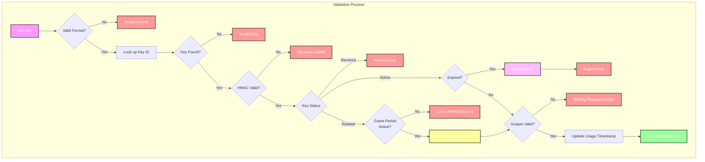

Keys are validated with several security checks:

```javascript
async validateKey(apiKey, requiredScopes = []) {
  // Verify key format
  if (!apiKey) {
    return { valid: false, error: 'API key is required' };
  }
  
  if (!apiKey.startsWith('km_')) {
    return { valid: false, error: 'Invalid API key format' };
  }

  // Use the lookup for validation
  const keyId = await this.storage.get(getLookupStorageId(apiKey));
  if (!keyId) {
    return { valid: false, error: 'Invalid API key' };
  }
  
  // Verify the HMAC signature for additional security
  const storedHmac = await this.storage.get(getHmacStorageId(apiKey));
  if (storedHmac) {
    const isValidHmac = await verifyHmac(keyId, storedHmac, this.hmacSecret);
    if (!isValidHmac) {
      return { valid: false, error: 'API key signature verification failed' };
    }
  }
  
  // Get the key details
  const foundKey = await this.storage.get(getKeyStorageId(keyId));
  
  // Check key status
  if (foundKey.status !== 'active') {
    return { valid: false, error: 'API key is revoked' };
  }
  
  // Check for rotated keys during grace period
  if (foundKey.status === 'rotated') {
    const rotationInfo = await this.storage.get(getRotationStorageId(keyId));
    
    // If the rotation grace period has expired, the key is no longer valid
    if (!rotationInfo || Date.now() > rotationInfo.gracePeriodEnds) {
      return {
        valid: false,
        error: 'API key has been rotated and grace period has expired',
        rotatedToId: foundKey.rotatedToId
      };
    }
    
    // During grace period, return a warning but still validate
    // ...
  }

  // Check if the key has expired
  if (foundKey.expiresAt > 0 && foundKey.expiresAt < Date.now()) {
    // Auto-revoke expired keys
    foundKey.status = 'revoked';
    await this.storage.put(getKeyStorageId(keyId), foundKey);
    
    return { valid: false, error: 'API key has expired' };
  }

  // Check required scopes (case-insensitive)
  // ...

  // Update usage timestamp (non-blocking)
  // ...

  // Return valid result
  // ...
}
```

Key validation security features:
- Verification of key format
- HMAC signature verification
- Immediate rejection of revoked keys
- Automatic expiration and revocation of expired keys
- Clear warnings for rotated keys to encourage migration
- Case-insensitive scope matching for consistent application
- Non-blocking updates to usage timestamps
- Cleanup of stale lookup entries

## Automatic Key Cleanup

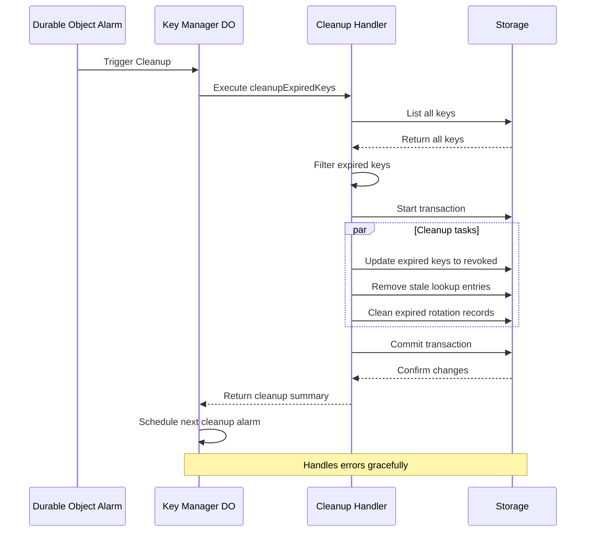

Expired keys and stale entries are automatically cleaned up via Durable Object alarms:

```javascript
async cleanupExpiredKeys() {
  const now = Date.now();
  const keys = await this.storage.list({ prefix: 'key:' });
  let revokedCount = 0;
  let staleCount = 0;
  let rotationCount = 0;
  
  const tx = this.storage.transaction();
  
  // First pass: find and revoke expired keys
  for (const [keyPath, value] of keys) {
    // Check for expired keys
    if (value.expiresAt > 0 && value.expiresAt < now && value.status === 'active') {
      // Revoke the key
      value.status = 'revoked';
      value.revokedAt = now;
      tx.put(keyPath, value);
      revokedCount++;
    }
    
    // Check for rotated keys with expired grace periods
    if (value.status === 'rotated') {
      const rotationInfo = await this.storage.get(getRotationStorageId(value.id));
      
      if (rotationInfo && rotationInfo.gracePeriodEnds < now) {
        // Grace period has expired, clean up the rotation
        tx.delete(getRotationStorageId(value.id));
        rotationCount++;
      }
    }
  }
  
  // Second pass: find and remove stale lookup entries
  // ...
  
  // Commit all changes in a single transaction
  await tx.commit();
  
  return {
    revokedCount,
    staleCount,
    rotationCount,
    timestamp: now
  };
}
```

Cleanup security features:
- Scheduled automatic cleanup via Durable Object alarms
- Transaction-based operations for data integrity
- Cleanup of expired keys, rotations, and stale lookup entries
- Error handling to ensure partial failures don't halt cleanup
- Audit information on cleanup results

## Authentication Middleware

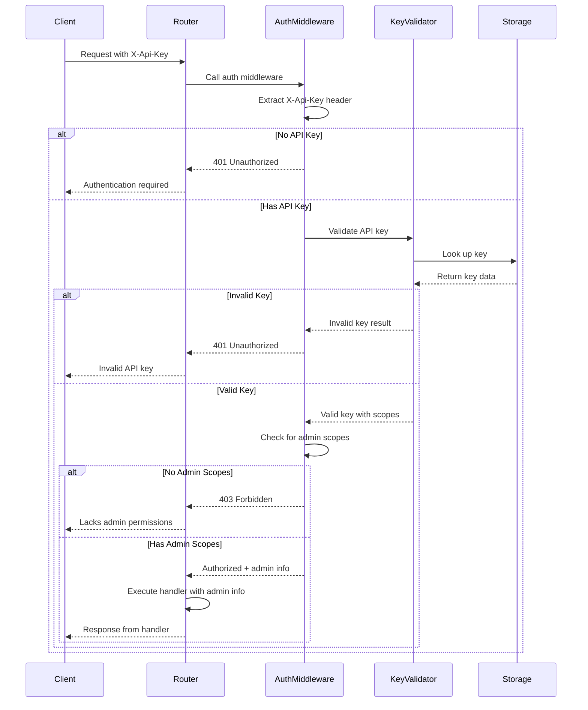

All administrative endpoints are protected by authentication middleware:

```javascript
export async function authMiddleware(request, env) {
  try {
    // Extract API key from header
    const apiKey = request.headers.get("X-Api-Key");

    // No API key provided
    if (!apiKey) {
      return {
        authorized: false,
        error: "Authentication required",
        status: 401,
      };
    }

    // Validate the API key
    const result = await validateApiKey(apiKey, [], env);

    // Invalid API key
    if (!result.valid) {
      return {
        authorized: false,
        error: result.error || "Invalid API key",
        status: 401,
      };
    }

    // Check if key has any admin scopes
    const hasAdminScope = result.scopes.some((scope) =>
      scope.startsWith("admin:")
    );

    if (!hasAdminScope) {
      return {
        authorized: false,
        error: "This API key lacks administrative permissions",
        status: 403,
      };
    }

    // Key is valid and has admin permissions
    return {
      authorized: true,
      adminKey: result,
    };
  } catch (error) {
    console.error("Authentication error:", error);

    return {
      authorized: false,
      error: "Authentication error",
      status: 500,
    };
  }
}
```

Authentication security features:
- Authentication for all administrative endpoints
- Validation of admin role permissions
- Rejection of non-admin keys for admin operations
- Clear error messages for authentication issues
- Detailed logging of authorization failures

## First-Time Setup Security

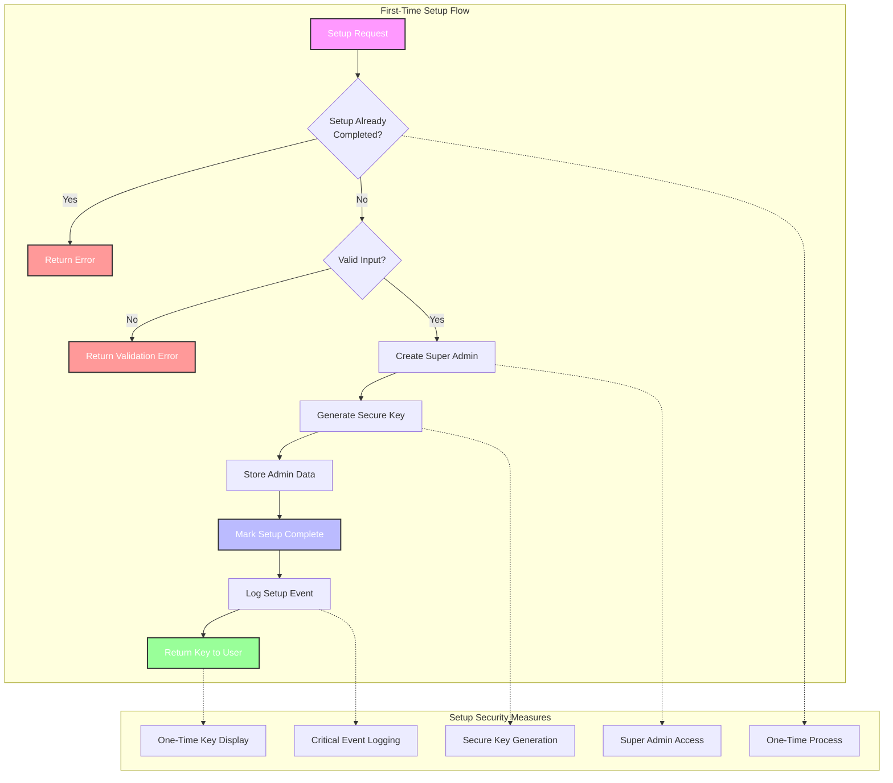

The first-time setup process has special security handling:

```javascript
export async function setupFirstAdmin(adminData, env) {
  // Check if setup has already been completed
  const setupCompleted = await isSetupCompleted(env);

  if (setupCompleted) {
    throw new Error("Setup has already been completed");
  }

  // Validate required fields
  if (!adminData.name || !adminData.email) {
    throw new Error("Name and email are required for the first admin");
  }

  // Create the first admin with SUPER_ADMIN role
  const adminKey = await createAdminKey({
    name: `${adminData.name} (Super Admin)`,
    owner: adminData.name,
    email: adminData.email,
    role: "SUPER_ADMIN",
    scopes: ADMIN_ROLES.SUPER_ADMIN.scopes,
    metadata: {
      isFirstAdmin: true,
      setupDate: new Date().toISOString(),
    },
  }, env);

  // Mark setup as completed
  await env.KV.put("system:setup_completed", "true");

  // Log the setup event
  await logAdminAction(adminKey.id, "system_setup", {
    adminName: adminData.name,
    adminEmail: adminData.email,
  }, env);

  return adminKey;
}
```

Setup security features:
- One-time initialization process
- Prevention of multiple setup operations
- Initial super admin creation with full permissions
- Secure logging of the setup operation
- Clear API key display for initial admin only

## Input Validation

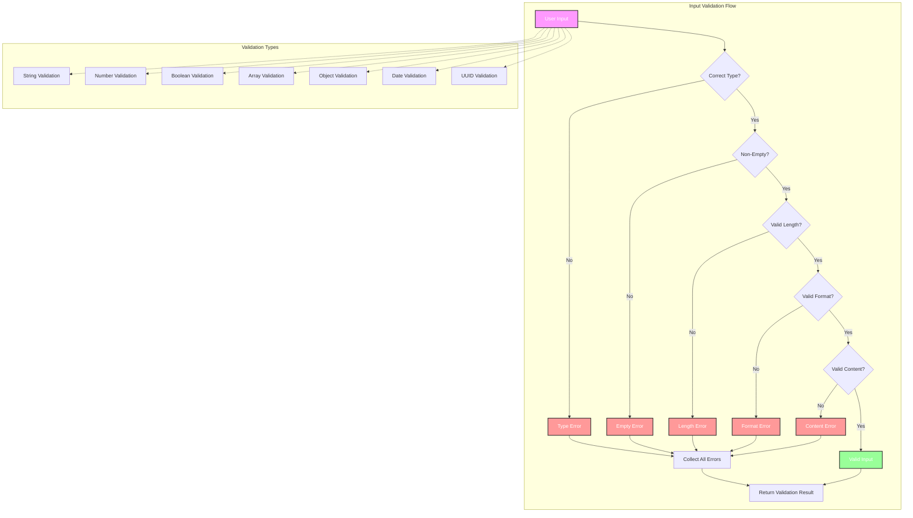

All API inputs are validated to prevent injection and other attacks:

```javascript
export function validateCreateKeyParams(params) {
  const errors = {};
  
  // Check required fields with size limits
  if (!isNonEmptyString(params.name)) {
    errors.name = 'Name must be a non-empty string';
  } else if (params.name.length > MAX_NAME_LENGTH) {
    errors.name = `Name must be at most ${MAX_NAME_LENGTH} characters`;
  }
  
  // Other field validations...
  
  return {
    isValid: Object.keys(errors).length === 0,
    errors
  };
}
```

Input validation features:
- Non-empty string validation
- String length limits to prevent DoS attacks
- Type checking to ensure input consistency 
- UUID format validation
- Rate limiting to prevent brute force attacks

## Storage Security

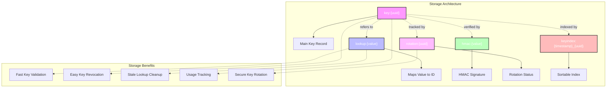

API keys are stored securely with a multi-level approach:

1. The main key record is stored with its ID as the key
2. A lookup index maps the API key value to its ID for validation
3. HMAC signatures are stored separately for additional verification
4. Rotation records track key rotation status and grace periods

This separation allows:
- Fast key validation without exposing key details
- Easy key revocation without changing the key value
- Ability to clean up stale lookups
- Tracking usage and metadata separately from the key itself
- Secure key rotation with grace periods

## Critical Operations Protection

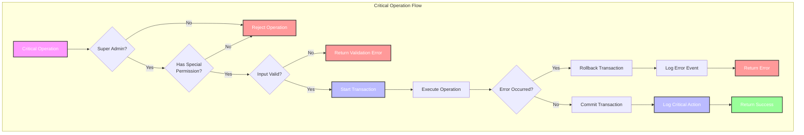

Critical operations like key rotation have additional protection:

1. **Super Admin Requirement**: Only users with specific admin:system:security permission can perform critical operations
2. **Critical Action Logging**: Special audit logging for high-impact operations
3. **Transaction Support**: Critical operations use transactions for atomicity
4. **Retry Logic**: Important operations include retry mechanisms to handle temporary failures
5. **Thorough Validation**: Additional input validation for critical operations

## HTTPS and Network Security

When deployed on Cloudflare, this service automatically benefits from:

```mermaid
flowchart TB
    subgraph "Cloudflare Security Features"
        TLS[TLS Encryption]
        DDoS[DDoS Protection]
        WAF[Web Application Firewall]
        Cache[Distributed Caching]
        ThreatIntel[Threat Intelligence]
        Bot[Bot Management]
        RateLimit[Rate Limiting]
        ZeroTrust[Zero Trust Access]
    end
    
    subgraph "Security Benefits"
        Encryption[Data in Transit Security]
        Availability[Service Availability]
        MitigatedAttacks[Attack Mitigation]
        Performance[Reduced Attack Surface]
        Intelligence[Real-time Threat Response]
    end
    
    TLS --> Encryption
    DDoS --> Availability
    WAF --> MitigatedAttacks
    Cache --> Performance
    ThreatIntel --> Intelligence
    Bot --> MitigatedAttacks
    RateLimit --> Availability
    ZeroTrust --> MitigatedAttacks
    
    style TLS fill:#f9f,stroke:#333,stroke-width:2px,color:#ffffff
    style DDoS fill:#bbf,stroke:#333,stroke-width:2px,color:#ffffff
    style WAF fill:#bfb,stroke:#333,stroke-width:2px,color:#ffffff
    style Cache fill:#fbf,stroke:#333,stroke-width:2px,color:#ffffff
    style ThreatIntel fill:#fbb,stroke:#333,stroke-width:2px,color:#ffffff
    style Bot fill:#bff,stroke:#333,stroke-width:2px,color:#ffffff
    style Encryption fill:#9f9,stroke:#333,stroke-width:2px,color:#ffffff
    style Availability fill:#9f9,stroke:#333,stroke-width:2px,color:#ffffff
```

- TLS encryption for all traffic
- DDoS protection
- Web Application Firewall (WAF)
- Distributed global caching
- Real-time threat intelligence

## Security Best Practices

```mermaid
mindmap
    root((Security<br>Best Practices))
        Authentication & Authorization
            API Key Entropy
            HMAC Verification
            Role-Based Access
            Permission Scopes
        Data Protection
            AES-GCM Encryption
            PBKDF2 Key Derivation
            Encrypted at Rest
            Unique IVs & Salts
        Key Management
            Key Rotation Support
            Expiration Controls
            Grace Periods
            Revocation Capability
        Defensive Coding
            Input Validation
            Output Encoding
            Error Handling
            Rate Limiting
        Operational Security
            Audit Logging
            Critical Action Special Handling
            Transaction Support
            Auto-Cleanup
```

This service implements the following security best practices:

1. All inputs are validated and sanitized
2. API keys have sufficient entropy (256 bits)
3. Encryption at rest for sensitive data
4. HMAC validation for key integrity
5. Comprehensive error handling prevents information leakage
6. Rate limiting prevents brute force attacks
7. Keys can be scoped to limit damage if compromised
8. Keys automatically expire if configured
9. Role-based access control for administrative operations
10. Thorough audit logging for accountability
11. Support for key rotation without service disruption
12. Automatic cleanup of expired data
13. Transaction support for atomicity
14. Dedicated cryptographic material rotation capabilities