# Testing Guide for API Key Manager

This guide provides comprehensive instructions for testing the API Key Manager with the Clean Architecture and Command pattern implementation. The testing strategy aligns with the architectural layers to ensure thorough verification of functionality at all levels.

## Test Architecture Overview

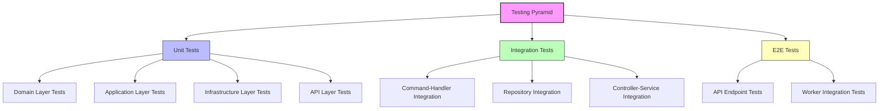

## Test Organization

Our test suite follows Clean Architecture principles, organizing tests according to their architectural layer:

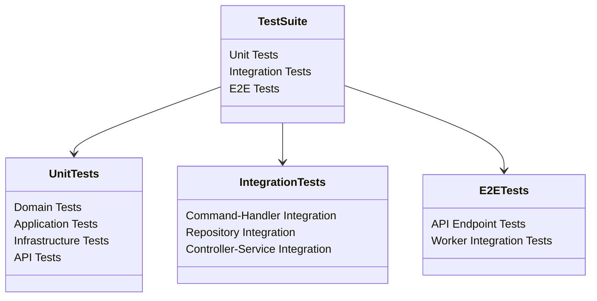

## Setting Up the Test Environment

Before running tests, you need to set up a proper test environment. The following sequence diagram outlines the setup process:

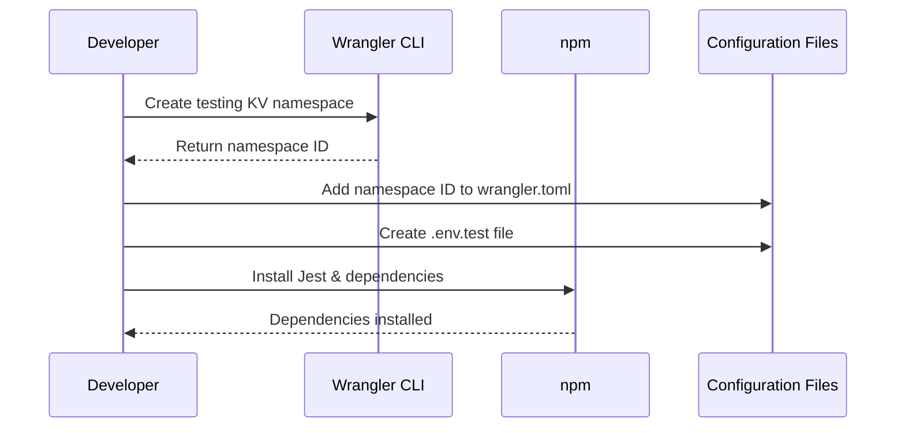

### 1. Create a Testing KV Namespace

```bash
wrangler kv:namespace create "KEYS_TEST" --env test
```

Add the resulting namespace ID to your `wrangler.toml`:

```toml
[env.test]
kv_namespaces = [
  { binding = "KV", id = "YOUR_TEST_KV_NAMESPACE_ID" }
]
```

### 2. Configure Environment Variables

Create a `.env.test` file in your project root:

```
ENCRYPTION_KEY=test-encryption-key-for-testing-only
HMAC_SECRET=test-hmac-secret-for-testing-only
```

### 3. Install Testing Dependencies

```bash
npm install --save-dev jest @cloudflare/workers-types
```

## Test Container Architecture

The API Gateway Workers project uses a specialized TestContainer for dependency injection in tests. This container provides a consistent way to mock dependencies across test suites:

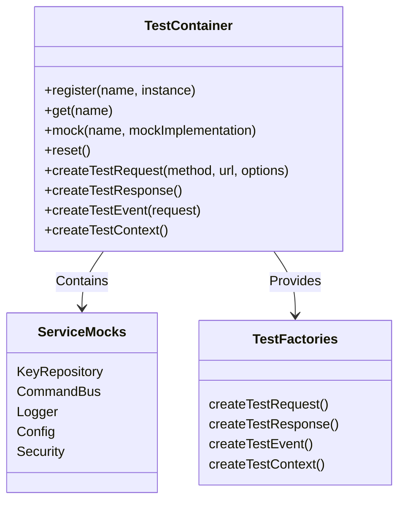

## Running the Tests

Run tests using npm with the following flow:

```mermaid
flowchart TD
    A[Start Testing] --> B{Choose Test Mode}
    B -->|All Tests| C[npm test]
    B -->|Coverage Report| D[npm run test:coverage]
    B -->|Watch Mode| E[npm run test:watch]
    B -->|Specific Test File| F[NODE_OPTIONS=--experimental-vm-modules jest path/to/test.js]
    B -->|Specific Test| G[NODE_OPTIONS=--experimental-vm-modules jest path/to/test.js -t "test name"]
    
    C --> H[View Results]
    D --> I[View Coverage Report]
    E --> J[Automatically Run Tests on Change]
    F --> K[Run Single File]
    G --> L[Run Single Test]
```

Basic test commands:

```bash
npm test                  # Run all tests
npm run test:coverage     # Generate coverage report
npm run test:watch        # Run tests in watch mode
```

For running specific tests:

```bash
NODE_OPTIONS=--experimental-vm-modules jest path/to/test.js            # Run specific file
NODE_OPTIONS=--experimental-vm-modules jest path/to/test.js -t "test name"  # Run specific test
```

## ES Module Testing Pattern

Since the codebase uses ES Modules, the testing approach requires special patterns for mocking:

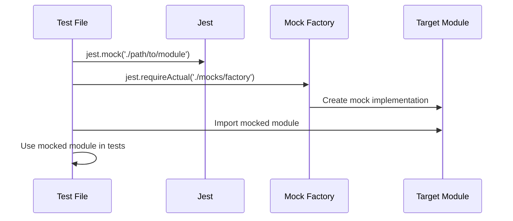

Example pattern for module mocking:

```javascript
// Mock module
jest.mock('../../../src/infrastructure/storage/KeyRepository', () => {
  return {
    KeyRepository: jest.fn().mockImplementation(() => ({
      getKey: jest.fn().mockResolvedValue(mockKey),
      listKeys: jest.fn().mockResolvedValue([mockKey]),
      saveKey: jest.fn().mockResolvedValue(true),
      deleteKey: jest.fn().mockResolvedValue(true)
    }))
  };
});

// Import the mocked module
import { KeyRepository } from '../../../src/infrastructure/storage/KeyRepository';
```

## Command Pattern Testing

The Command pattern requires specific testing approaches for both Commands and Handlers:

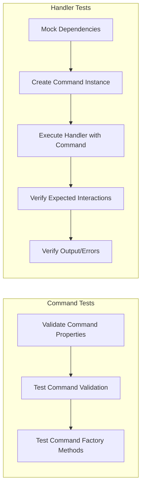

### Command Testing Example

```javascript
describe('CreateKeyCommand', () => {
  it('should validate required properties', () => {
    const command = new CreateKeyCommand({
      name: 'Test Key',
      owner: 'test-user@example.com',
      scopes: ['read:items', 'write:items']
    });
    
    expect(command.isValid()).toBe(true);
    expect(command.validate()).toEqual([]);
  });
  
  it('should return validation errors for missing properties', () => {
    const command = new CreateKeyCommand({
      name: 'Test Key'
      // missing owner and scopes
    });
    
    expect(command.isValid()).toBe(false);
    expect(command.validate()).toEqual([
      'owner is required',
      'scopes is required'
    ]);
  });
});
```

### Handler Testing Example

```javascript
describe('CreateKeyHandler', () => {
  let container;
  let handler;
  let mockRepository;
  
  beforeEach(() => {
    // Setup test container with mocks
    container = new TestContainer();
    mockRepository = {
      saveKey: jest.fn().mockResolvedValue(true)
    };
    container.register('keyRepository', mockRepository);
    
    // Create handler with injected dependencies
    handler = new CreateKeyHandler(container.get('keyRepository'));
  });
  
  it('should create a new API key', async () => {
    // Arrange
    const command = new CreateKeyCommand({
      name: 'Test Key',
      owner: 'test-user@example.com',
      scopes: ['read:items']
    });
    
    // Act
    const result = await handler.execute(command);
    
    // Assert
    expect(result).toBeDefined();
    expect(result.id).toBeDefined();
    expect(result.key).toBeDefined();
    expect(mockRepository.saveKey).toHaveBeenCalledWith(expect.objectContaining({
      name: 'Test Key',
      owner: 'test-user@example.com'
    }));
  });
});
```

## Integration Testing Approach

Integration tests verify the interactions between components:

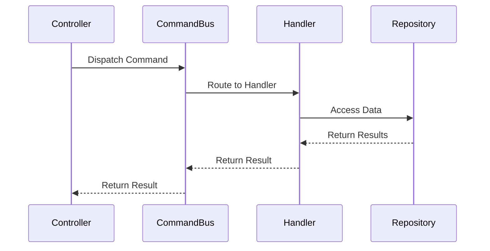

### Integration Test Example

```javascript
describe('KeysController Integration', () => {
  let container;
  let controller;
  let mockRepository;
  let commandBus;
  
  beforeEach(() => {
    container = new TestContainer();
    
    // Setup real command bus with real handlers
    commandBus = new CommandBus();
    commandBus.registerHandler(CreateKeyCommand.name, new CreateKeyHandler(container.get('keyRepository')));
    container.register('commandBus', commandBus);
    
    // Setup controller with real command bus
    controller = new KeysController(container.get('commandBus'));
  });
  
  it('should create a key and return it in the response', async () => {
    // Arrange
    const request = container.createTestRequest('POST', '/keys', {
      body: {
        name: 'Test Key',
        owner: 'test@example.com',
        scopes: ['read:items']
      }
    });
    const response = container.createTestResponse();
    
    // Act
    await controller.createKey(request, response);
    
    // Assert
    expect(response.status).toHaveBeenCalledWith(201);
    expect(response.json).toHaveBeenCalledWith(expect.objectContaining({
      name: 'Test Key',
      owner: 'test@example.com'
    }));
  });
});
```

## Testing API Gateway Proxy Features

Testing the proxy functionality requires special approaches:

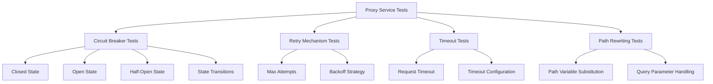

### Mocking Upstream Services

For testing proxy features, we mock upstream services:

```javascript
// Mock fetch for proxy tests
global.fetch = jest.fn().mockImplementation((url, options) => {
  if (url.includes('success-service')) {
    return Promise.resolve({
      ok: true,
      status: 200,
      headers: new Headers({ 'content-type': 'application/json' }),
      json: () => Promise.resolve({ success: true })
    });
  } else if (url.includes('error-service')) {
    return Promise.reject(new Error('Connection refused'));
  } else if (url.includes('timeout-service')) {
    return new Promise((resolve) => setTimeout(() => {
      resolve({
        ok: true,
        status: 200,
        json: () => Promise.resolve({ success: true })
      });
    }, 3000)); // Simulated delay
  }
});
```

## Debugging Test Failures

Use this decision tree to troubleshoot test failures:

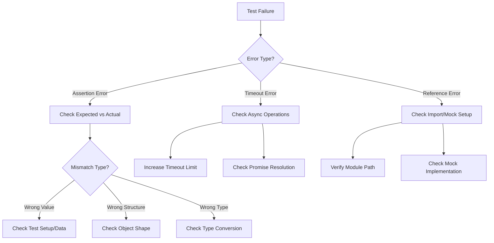

## Test Coverage Expectations

The project aims for the following test coverage targets:

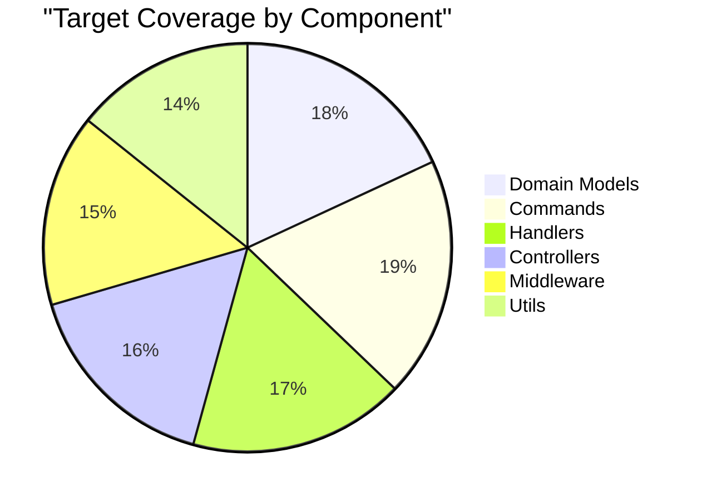

## Continuous Integration Testing

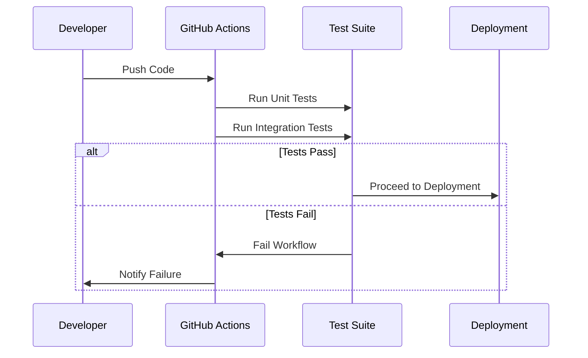

Our GitHub Actions workflow for testing:

```yaml
name: Test
on: [push, pull_request]
jobs:
  test:
    runs-on: ubuntu-latest
    steps:
      - uses: actions/checkout@v3
      - uses: actions/setup-node@v3
        with:
          node-version: '18.x'
      - run: npm ci
      - run: npm test
      - run: npm run test:coverage
```