# Testing Methodology

This document outlines the testing approach for the API Gateway project, providing guidelines on how to write effective tests, avoid common pitfalls, and maintain a robust test suite.

## Testing Architecture Overview

The API Gateway employs a layered testing approach that matches the clean architecture of the codebase:

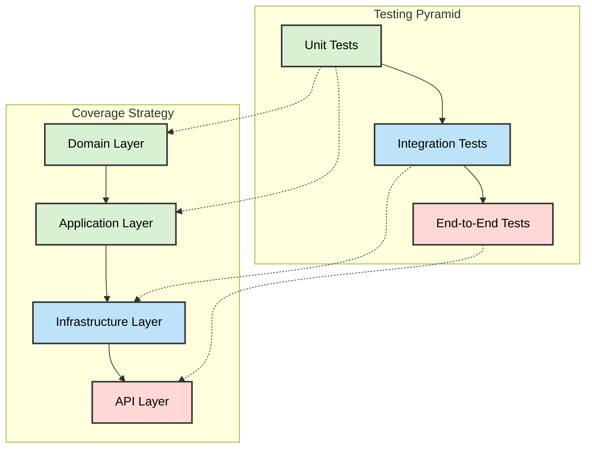

## Testing Philosophy

The API Gateway Workers testing strategy is built on these core principles:

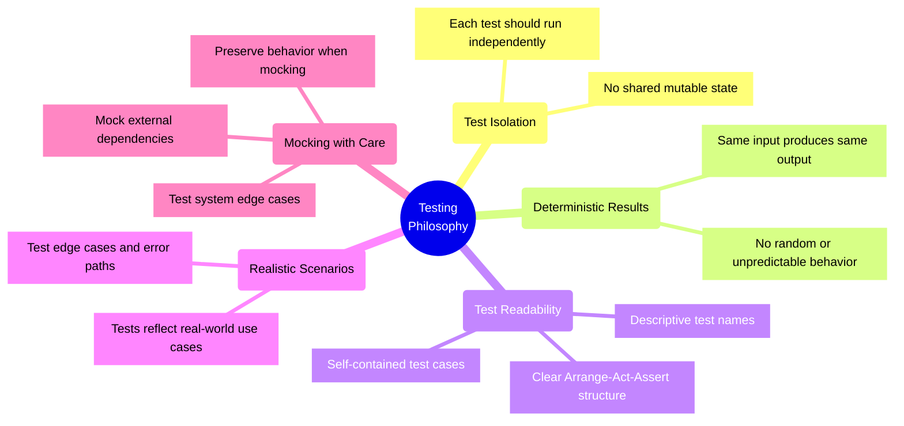

## Test Types and Their Purposes

The project implements a comprehensive testing strategy with multiple test types serving different purposes:

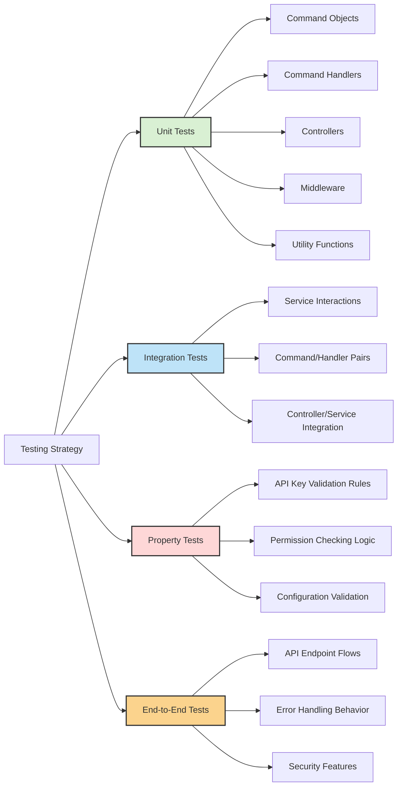

### Unit Tests

Unit tests focus on individual components in isolation with clearly defined inputs and outputs:

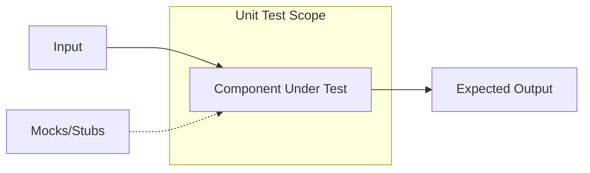

Key unit test targets:
- Command objects - validating structure, requirements, and validation logic
- Command handlers - testing business logic and interactions with dependencies
- Controllers - testing request handling, command dispatching, and response formatting
- Middleware - testing request/response transformation and cross-cutting concerns
- Utility functions - testing common helper functions and libraries

### Integration Tests

Integration tests verify that components work together correctly across boundaries:

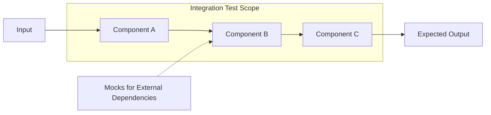

Integration test scenarios:
- Service interactions - testing how services communicate and collaborate
- Command/handler pairs - ensuring commands are properly handled by their handlers
- Controller/service integration - testing API request handling through the service layer
- End-to-end API flows - testing complete user journeys through the API

### Property Tests

Property tests verify invariants and properties of the system by generating test cases:

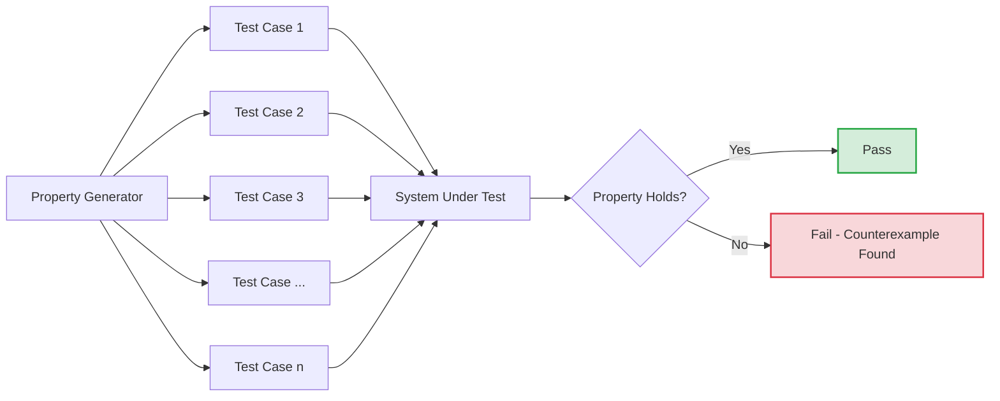

Property test applications:
- API key validation rules - testing that validation rules work for all inputs
- Permission checking logic - testing authorization for all permission combinations
- Configuration validation - testing that validation catches all invalid configurations

## Project Test Structure

The tests are organized to mirror the source code structure, following the clean architecture pattern:

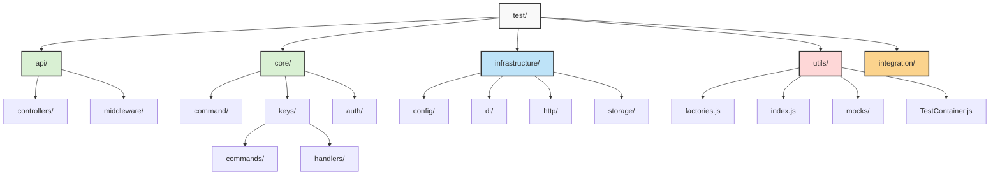

This structure creates a clear separation of concerns and allows tests to be organized according to the components they are testing:

```
test/
├── api/                  # API layer tests
│   ├── controllers/      # Controller tests
│   └── middleware/       # Middleware tests
├── auth/                 # Authentication tests
├── core/                 # Core domain tests
│   ├── command/          # Command pattern tests
│   └── keys/             # Key management tests
│       ├── commands/     # Command object tests
│       └── handlers/     # Command handler tests
├── infrastructure/       # Infrastructure tests
│   ├── config/           # Configuration tests
│   ├── di/               # Dependency injection tests
│   ├── http/             # HTTP infrastructure tests
│   └── storage/          # Storage tests
├── utils/                # Test utilities
│   ├── factories.js      # Test data factories
│   ├── index.js          # Test utility exports
│   ├── mocks/            # Mock implementations
│   └── TestContainer.js  # DI container for tests
└── integration/          # Integration tests
```

## Testing Infrastructure

The API Gateway Workers testing infrastructure employs several key tools that work together to create a robust testing environment:

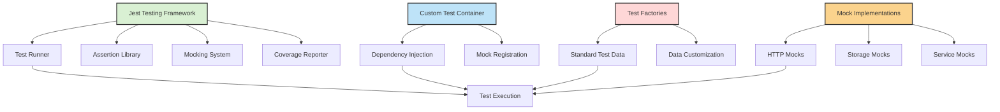

### Core Testing Tools

- **Jest**: Main testing framework providing test runner, assertions, mocking, and code coverage
- **Fetch Mock**: Specialized tool for mocking HTTP requests and responses
- **Test Container**: Custom dependency injection container for test setup and isolation
- **Test Factories**: Utility functions to generate standard test data
- **ES Module Mocks**: Specialized mocking patterns for ES Modules

### Tool Integration

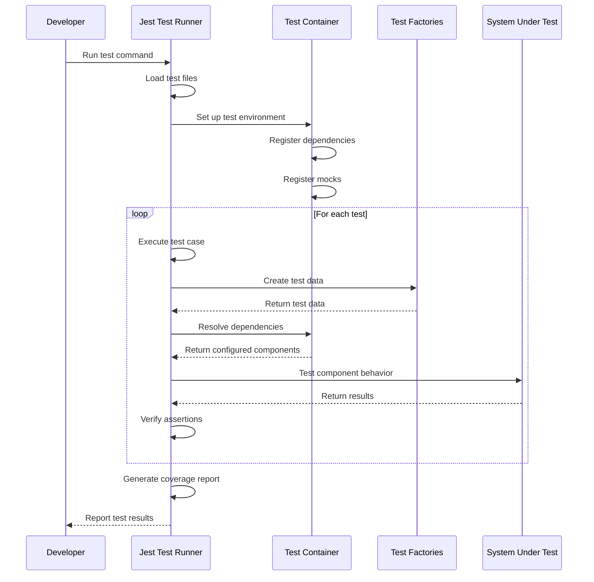

## Best Practices for Writing Tests

### Test Structure and Organization

The API Gateway Workers project follows the Arrange-Act-Assert (AAA) pattern for test structure:

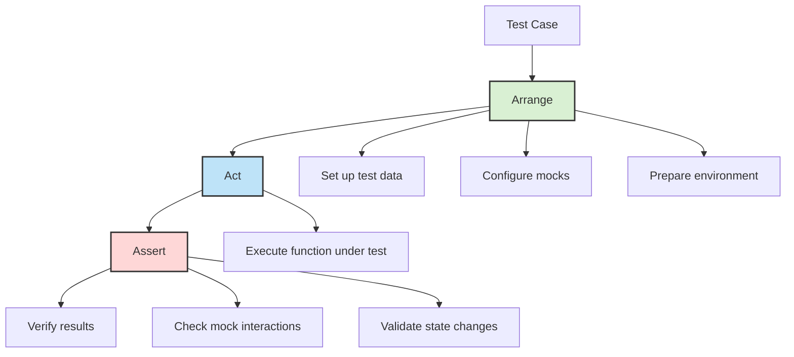

Example of well-structured test following AAA pattern:

```javascript
describe('KeyService', () => {
  it('should generate a new API key with correct properties', async () => {
    // Arrange
    const keyData = {
      name: 'Test API Key',
      owner: 'test-user',
      scopes: ['read:users', 'write:users']
    };
    const mockRepository = createMockRepository();
    const keyService = new KeyService(mockRepository);
    
    // Act
    const result = await keyService.createKey(keyData);
    
    // Assert
    expect(result).toHaveProperty('id');
    expect(result.name).toBe('Test API Key');
    expect(result.owner).toBe('test-user');
    expect(result.scopes).toEqual(['read:users', 'write:users']);
    expect(result.status).toBe('active');
    expect(mockRepository.save).toHaveBeenCalledWith(expect.objectContaining({
      name: 'Test API Key'
    }));
  });
});
```

### ES Module Mocking Strategies

When working with ES modules in tests, you have several mocking strategies available, each with their own strengths:

```mermaid
flowchart TB
    A[ES Module Mocking] --> B[Jest Mocking]
    A --> C[Manual Mocking]
    A --> D[Dependency Injection]
    
    B --> B1[jest.mock()]
    B --> B2[jest.spyOn()]
    
    C --> C1[Manual function replacement]
    C --> C2[Mock factory functions]
    
    D --> D1[Constructor injection]
    D --> D2[Test Container]
    
    style B fill:#d9f0d3,stroke:#333,stroke-width:2px
    style C fill:#bee3f8,stroke:#333,stroke-width:2px
    style D fill:#fed7d7,stroke:#333,stroke-width:2px
```

#### Strategy 1: Direct Import Mocking

```javascript
// Direct import mocking with jest.spyOn
import { jest } from '@jest/globals';
import * as apiClient from '../api/client.js';

describe('UserService', () => {
  beforeEach(() => {
    // Mock a specific function within the module
    jest.spyOn(apiClient, 'fetchUsers').mockResolvedValue([
      { id: 1, name: 'Test User' }
    ]);
  });
  
  it('should fetch and process users', async () => {
    const userService = new UserService(apiClient);
    const users = await userService.getActiveUsers();
    
    expect(apiClient.fetchUsers).toHaveBeenCalled();
    expect(users).toHaveLength(1);
    expect(users[0].name).toBe('Test User');
  });
});
```

#### Strategy 2: Complete Module Mocking

```javascript
// Mocking an entire module
// Must appear before imports
jest.mock('../api/client.js', () => ({
  fetchUsers: jest.fn().mockResolvedValue([
    { id: 1, name: 'Test User' }
  ]),
  createUser: jest.fn().mockResolvedValue({ id: 2, name: 'New User' })
}));

import { fetchUsers, createUser } from '../api/client.js';

describe('User API', () => {
  it('should fetch users', async () => {
    const users = await fetchUsers();
    
    expect(users).toHaveLength(1);
    expect(users[0].name).toBe('Test User');
  });
  
  it('should create a user', async () => {
    const newUser = await createUser({ name: 'New User' });
    
    expect(newUser.id).toBe(2);
    expect(createUser).toHaveBeenCalledWith({ name: 'New User' });
  });
});
```

#### Strategy 3: Manual Function Mocking

When Jest mocking doesn't work well with ES modules, use manual mocking:

```javascript
// Create a manual mock function
function createMockFunction(implementation) {
  const mockFn = implementation || ((...args) => {
    mockFn.calls.push(args);
    return mockFn.returnValue;
  });
  
  mockFn.calls = [];
  mockFn.returnValue = undefined;
  
  mockFn.mockReturnValue = (value) => {
    mockFn.returnValue = value;
    return mockFn;
  };
  
  mockFn.mockImplementation = (newImpl) => {
    const originalCalls = mockFn.calls;
    mockFn = newImpl;
    mockFn.calls = originalCalls;
    return mockFn;
  };
  
  mockFn.mockResolvedValue = (value) => {
    return mockFn.mockImplementation(() => Promise.resolve(value));
  };
  
  return mockFn;
}

// Usage example
const mockFetchData = createMockFunction();
mockFetchData.mockResolvedValue({ id: 1, name: 'Test' });

// Test with the manual mock
const result = await mockFetchData();
expect(result.name).toBe('Test');
expect(mockFetchData.calls).toHaveLength(1);
```

#### Strategy 4: Dependency Injection

The most reliable approach for complex modules is to use dependency injection:

```javascript
// Service with dependency injection
class UserService {
  constructor(apiClient) {
    this.apiClient = apiClient;
  }
  
  async getActiveUsers() {
    const users = await this.apiClient.fetchUsers();
    return users.filter(user => user.active);
  }
}

// Test with injected mock
describe('UserService', () => {
  it('should filter active users', async () => {
    // Create a mock API client
    const mockApiClient = {
      fetchUsers: async () => [
        { id: 1, name: 'Active User', active: true },
        { id: 2, name: 'Inactive User', active: false }
      ]
    };
    
    // Inject the mock
    const userService = new UserService(mockApiClient);
    
    // Test the service
    const activeUsers = await userService.getActiveUsers();
    
    expect(activeUsers).toHaveLength(1);
    expect(activeUsers[0].name).toBe('Active User');
  });
});
```

### Factory Pattern for Test Data

Using factory functions to create test data ensures consistency and reduces duplication:

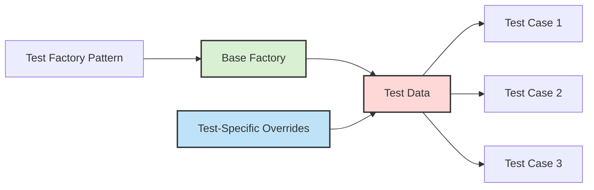

Example of comprehensive test factory implementation:

```javascript
// In test/utils/factories.js
export function createTestApiKey(overrides = {}) {
  return {
    id: 'key-123456789',
    key: 'km_test_a1b2c3d4e5f6g7h8i9j0',
    name: 'Test API Key',
    owner: 'test-user@example.com',
    scopes: ['read:users', 'write:users'],
    status: 'active',
    createdAt: new Date('2023-01-01T00:00:00Z').getTime(),
    expiresAt: new Date('2024-01-01T00:00:00Z').getTime(),
    lastUsedAt: new Date('2023-06-01T00:00:00Z').getTime(),
    metadata: {
      environment: 'test',
      createdBy: 'system'
    },
    ...overrides
  };
}

export function createTestUser(overrides = {}) {
  return {
    id: 'user-123456789',
    email: 'test-user@example.com',
    name: 'Test User',
    role: 'user',
    permissions: ['users:read', 'users:write'],
    createdAt: new Date('2023-01-01T00:00:00Z').getTime(),
    ...overrides
  };
}

// Factory usage in tests
import { createTestApiKey, createTestUser } from '../../utils/factories.js';

describe('KeyController', () => {
  it('should revoke a key', async () => {
    // Create test data with specific overrides
    const testKey = createTestApiKey({ status: 'active' });
    const testUser = createTestUser({ role: 'admin' });
    
    // Use test data in the test
    // ...
  });
});
```

### Dependency Injection with Test Container

The test container provides a powerful way to manage dependencies in tests:

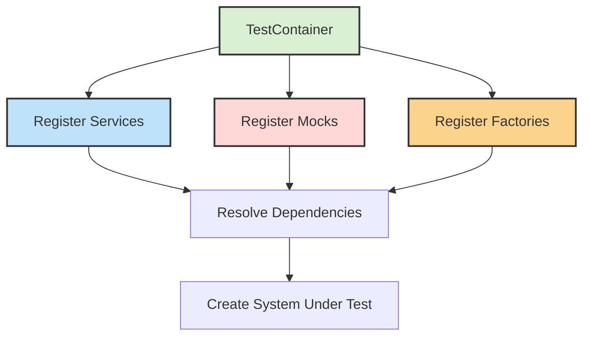

Example of test container usage:

```javascript
import { TestContainer } from '../../utils/TestContainer.js';
import { createTestApiKey } from '../../utils/factories.js';

describe('KeyService Integration', () => {
  let container;
  let keyService;
  let mockKeyRepository;
  
  beforeEach(() => {
    // Create a new container for each test
    container = new TestContainer();
    
    // Register mocks
    mockKeyRepository = {
      findById: jest.fn().mockImplementation(id => {
        if (id === 'existing-key') {
          return Promise.resolve(createTestApiKey({ id: 'existing-key' }));
        }
        return Promise.resolve(null);
      }),
      save: jest.fn().mockImplementation(key => Promise.resolve(key))
    };
    
    // Register services with mocks
    container.register('keyRepository', () => mockKeyRepository);
    container.register('keyService', ['keyRepository'], (repo) => {
      return new KeyService(repo);
    });
    
    // Resolve the service
    keyService = container.resolve('keyService');
  });
  
  it('should get a key by ID', async () => {
    const key = await keyService.getKeyById('existing-key');
    
    expect(key).not.toBeNull();
    expect(key.id).toBe('existing-key');
    expect(mockKeyRepository.findById).toHaveBeenCalledWith('existing-key');
  });
});
```

## Advanced Testing Patterns

This section covers common testing patterns used in the API Gateway Workers codebase.

### Async Testing Pattern

Testing asynchronous code requires special attention to ensure tests are deterministic and reliable:

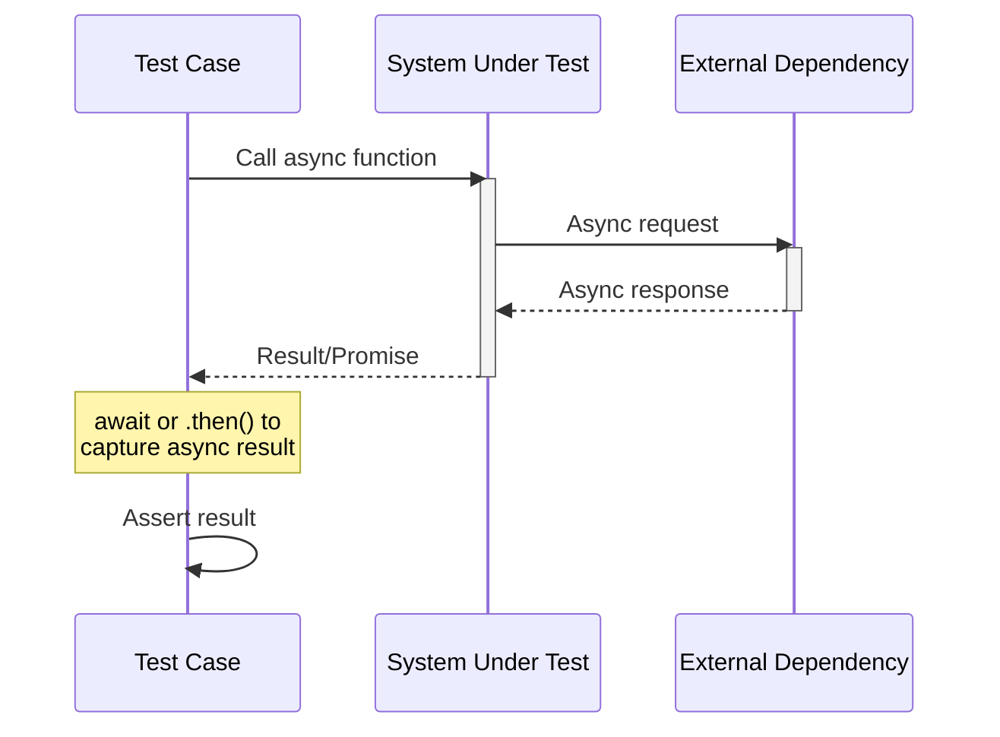

Best practices for async testing:

```javascript
// Using async/await (recommended)
it('should handle async operations correctly', async () => {
  // Arrange
  const input = { id: 123 };
  
  // Act
  const result = await userService.fetchUserDetails(input);
  
  // Assert
  expect(result).toHaveProperty('name');
  expect(result.id).toBe(123);
});

// Using promise expectations
it('should resolve with the expected data', () => {
  // Arrange & Act in one step with Promise
  const promise = dataService.fetchData();
  
  // Assert against the promise directly
  return expect(promise).resolves.toMatchObject({
    status: 'success',
    items: expect.any(Array)
  });
});

// Testing rejection
it('should reject when the input is invalid', async () => {
  // Arrange
  const invalidInput = null;
  
  // Act & Assert
  await expect(
    userService.processData(invalidInput)
  ).rejects.toThrow('Invalid input provided');
});
```

### Error Testing Patterns

Effective error testing ensures that your code handles failures gracefully:

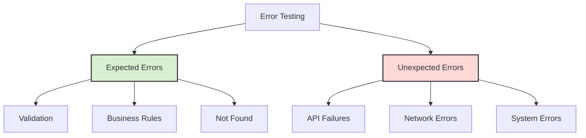

Example of comprehensive error testing:

```javascript
describe('KeyService error handling', () => {
  // Test expected errors (validation, business rules)
  it('should throw ValidationError for invalid key data', async () => {
    // Arrange
    const invalidData = { name: '' }; // Missing required fields
    
    // Act & Assert
    await expect(
      keyService.createKey(invalidData)
    ).rejects.toThrow(ValidationError);
  });
  
  // Test not found errors
  it('should throw NotFoundError when key does not exist', async () => {
    // Arrange (mock repository to return null)
    mockKeyRepository.findById.mockResolvedValue(null);
    
    // Act & Assert
    await expect(
      keyService.getKeyById('non-existent')
    ).rejects.toThrow(NotFoundError);
  });
  
  // Test unexpected errors (repository failures)
  it('should handle repository failures', async () => {
    // Arrange
    const dbError = new Error('Database connection failed');
    mockKeyRepository.findById.mockRejectedValue(dbError);
    
    // Act & Assert
    await expect(
      keyService.getKeyById('any-id')
    ).rejects.toThrow('Database connection failed');
  });
});
```

### HTTP Mock Testing

Testing HTTP interactions requires effective mocking of request/response cycles:

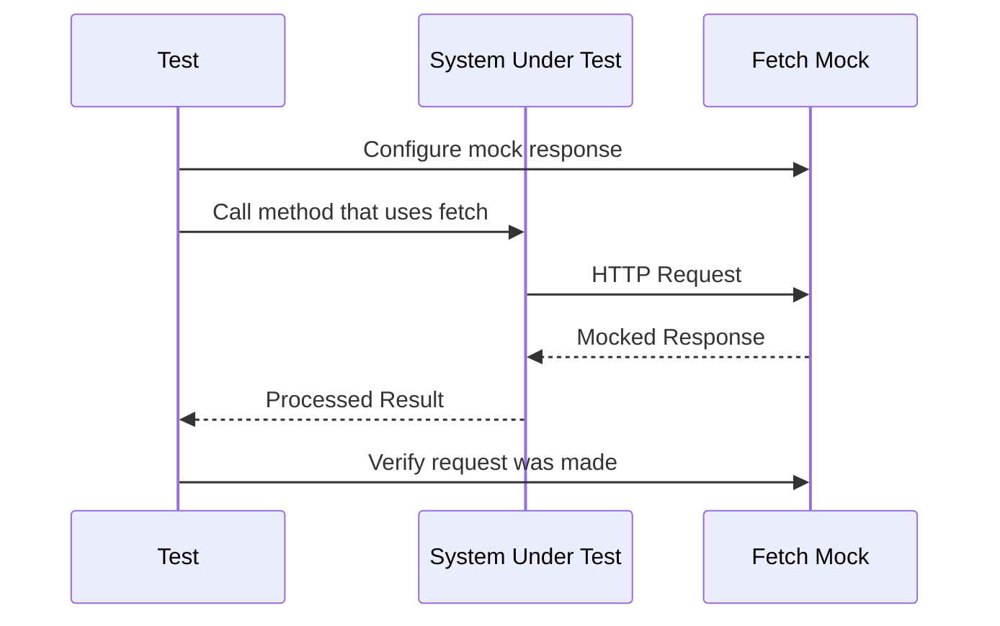

Example of HTTP mock testing:

```javascript
import fetchMock from 'jest-fetch-mock';

// Enable fetch mocks
fetchMock.enableMocks();

describe('ApiClient', () => {
  // Reset mocks before each test
  beforeEach(() => {
    fetchMock.resetMocks();
  });
  
  it('should fetch and transform user data', async () => {
    // Arrange - configure mock response
    fetchMock.mockResponseOnce(JSON.stringify({
      id: 123,
      firstName: 'John',
      lastName: 'Doe',
      email: 'john@example.com'
    }));
    
    const apiClient = new ApiClient();
    
    // Act - call the method that uses fetch
    const user = await apiClient.getUser(123);
    
    // Assert - verify the result and the request
    expect(user).toEqual({
      id: 123,
      name: 'John Doe',
      email: 'john@example.com'
    });
    
    expect(fetchMock).toHaveBeenCalledWith(
      'https://api.example.com/users/123',
      expect.objectContaining({
        method: 'GET',
        headers: expect.objectContaining({
          'Content-Type': 'application/json'
        })
      })
    );
  });
  
  it('should handle API errors correctly', async () => {
    // Arrange - configure error response
    fetchMock.mockRejectOnce(new Error('Network error'));
    
    const apiClient = new ApiClient();
    
    // Act & Assert - verify error handling
    await expect(
      apiClient.getUser(123)
    ).rejects.toThrow('Failed to fetch user: Network error');
  });
});
```

## Common Testing Pitfalls and Solutions

Understanding and addressing common testing challenges is crucial for maintaining a reliable test suite:

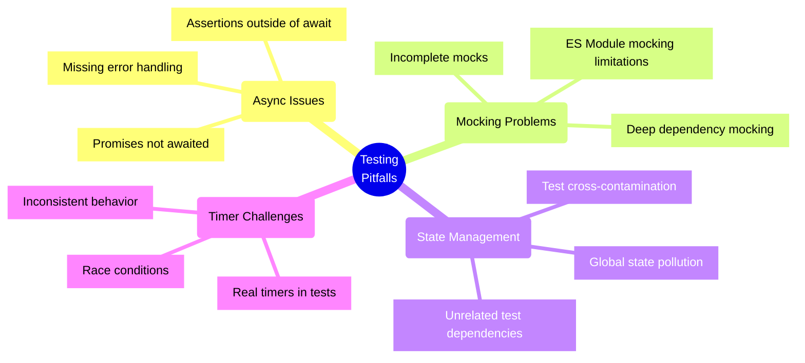

### Asynchronous Testing Issues

**Problem**: Not properly handling async code in tests can lead to false positives or undetected failures.

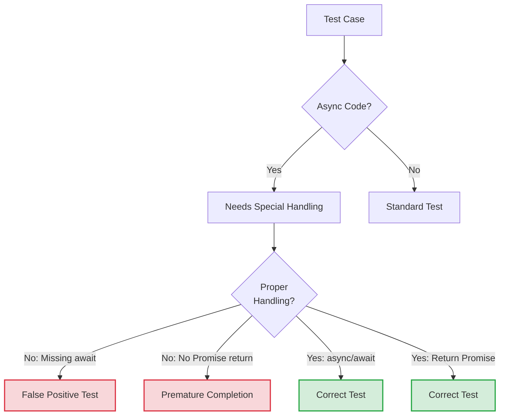

**Solution**: Always use async/await or return promises in async tests:

```javascript
// ❌ This test will PASS even if the expectation fails!
it('will be a false positive', () => {
  myAsyncFunction().then(result => {
    expect(result).toBe('wrong expectation');  // This never fails the test
  });
});

// ✅ Use async/await for clean async testing
it('will correctly pass or fail', async () => {
  const result = await myAsyncFunction();
  expect(result).toBe('expected');
});

// ✅ Or return the promise chain
it('will also correctly pass or fail', () => {
  return myAsyncFunction().then(result => {
    expect(result).toBe('expected');
  });
});
```

### ES Module Mocking Challenges

**Problem**: Jest's mocking system was originally designed for CommonJS modules and has limitations with ES Modules.

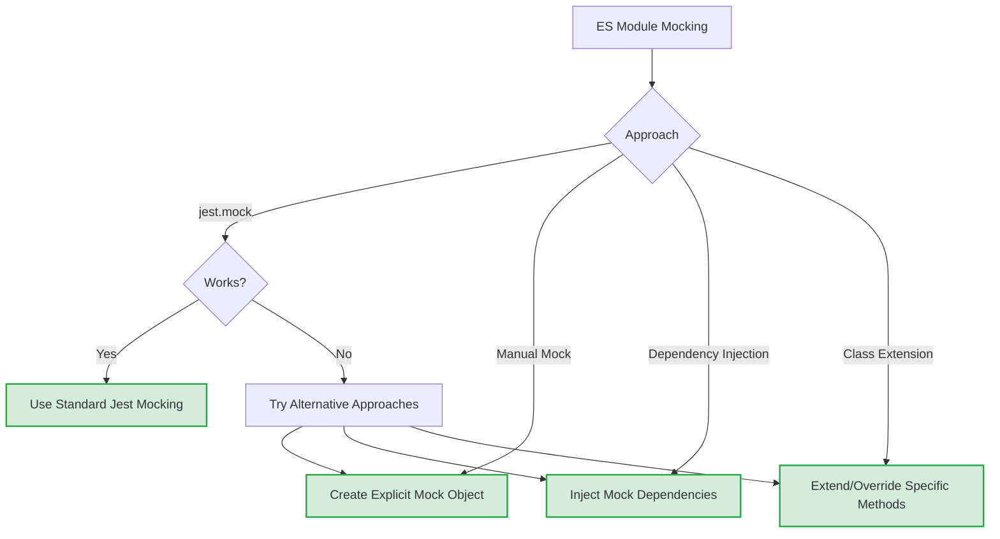

**Solution**: Use the most appropriate ES module mocking strategy based on your specific scenario:

```javascript
// Strategy 1: Try standard Jest mocking first
jest.mock('../path/to/module.js');
import { someFunction } from '../path/to/module.js';
// someFunction is now an auto-mocked jest.fn()

// Strategy 2: If Jest mocking fails, use manual dependency injection
// In your implementation:
class Service {
  constructor(dependency) {
    this.dependency = dependency;
  }
}

// In your test:
const mockDependency = { method: jest.fn() };
const service = new Service(mockDependency);

// Strategy 3: For class inheritance, use test subclasses
// Create a test subclass that overrides methods for testing
class TestableService extends ActualService {
  constructor() {
    super();
    this.overriddenMethod = jest.fn();
  }
}
```

### Timer and Animation Mocking

**Problem**: Tests involving timers or animations can be slow, unpredictable, and hard to verify.

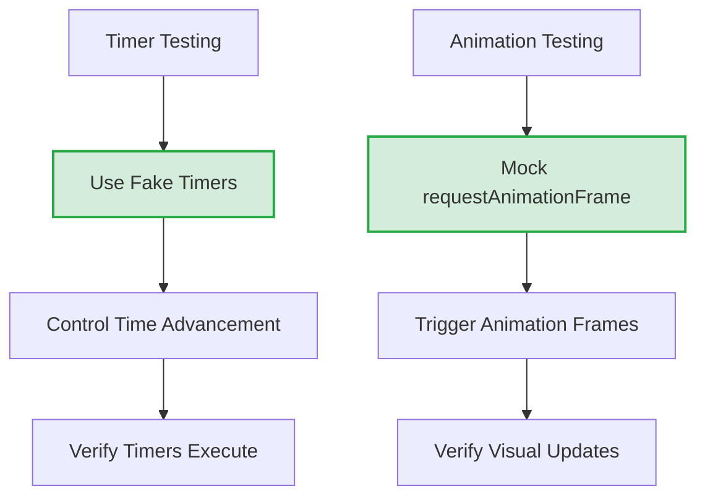

**Solution**: Use Jest's fake timers system to control time in tests:

```javascript
// Set up fake timers
beforeEach(() => {
  jest.useFakeTimers();
});

// Reset to real timers after tests
afterEach(() => {
  jest.useRealTimers();
});

it('should execute callback after timeout', () => {
  // Arrange
  const callback = jest.fn();
  
  // Act
  setTimeout(callback, 1000);
  
  // Assert - callback hasn't been called yet
  expect(callback).not.toHaveBeenCalled();
  
  // Fast-forward time
  jest.advanceTimersByTime(1000);
  
  // Assert - callback has been called after time advancement
  expect(callback).toHaveBeenCalledTimes(1);
});

it('should handle interval timers', () => {
  // Arrange
  const callback = jest.fn();
  
  // Act
  setInterval(callback, 1000);
  
  // Fast-forward time by 3.5 seconds
  jest.advanceTimersByTime(3500);
  
  // Assert - callback called 3 times (at 1s, 2s, and 3s)
  expect(callback).toHaveBeenCalledTimes(3);
});
```

### Test Isolation and Shared State

**Problem**: Tests interfering with each other due to shared state can lead to flaky tests and false results.

```mermaid
flowchart TD
    A[Test Isolation] --> B[Use beforeEach/afterEach]
    A --> C[Reset Global State]
    A --> D[Mock External Services]
    A --> E[Avoid Shared Mutable Data]
    
    B --> F[Fresh Setup for Each Test]
    C --> G[Reset Singletons/Static State]
    D --> H[Predictable External Behavior]
    E --> I[Immutable Test Inputs]
    
    style F fill:#d4edda,stroke:#28a745,stroke-width:2px
    style G fill:#d4edda,stroke:#28a745,stroke-width:2px
    style H fill:#d4edda,stroke:#28a745,stroke-width:2px
    style I fill:#d4edda,stroke:#28a745,stroke-width:2px
```

**Solution**: Reset state between tests and use proper isolation techniques:

```javascript
describe('UserService', () => {
  // Use beforeEach to set up a fresh state for each test
  beforeEach(() => {
    // Reset any module state
    UserService.resetCache();
    
    // Clear all mocks
    jest.clearAllMocks();
    
    // Reset singleton instances
    Container.getInstance().reset();
    
    // Create fresh test data for each test
    this.testUser = createTestUser();
  });
  
  // Clean up after tests
  afterEach(() => {
    // Close any open connections
    UserService.closeConnections();
    
    // Restore any global modifications
    restoreGlobalFetch();
  });
  
  it('should perform operation A', () => {
    // Test using fresh state
  });
  
  it('should perform operation B', () => {
    // Test using fresh state, independent of operation A
  });
});
```

## Testing Strategy for API Gateway Components

The API Gateway uses a command pattern architecture which requires specific testing approaches for each component type:

```mermaid
flowchart TD
    A[API Gateway Testing] --> B[Commands]
    A --> C[Command Handlers]
    A --> D[Controllers]
    A --> E[Router]
    A --> F[Middleware]
    
    B --> B1[Validation Tests]
    B --> B2[Construction Tests]
    
    C --> C1[Business Logic Tests]
    C --> C2[Dependency Integration Tests]
    C --> C3[Error Handling Tests]
    
    D --> D1[Request Parsing Tests]
    D --> D2[Response Formation Tests]
    D --> D3[Permission Tests]
    
    E --> E1[Route Matching Tests]
    E --> E2[Parameter Extraction Tests]
    
    F --> F1[Request Processing Tests]
    F --> F2[Response Modification Tests]
    
    style B fill:#d9f0d3,stroke:#333,stroke-width:2px
    style C fill:#bee3f8,stroke:#333,stroke-width:2px
    style D fill:#fed7d7,stroke:#333,stroke-width:2px
    style E fill:#fbd38d,stroke:#333,stroke-width:2px
    style F fill:#fcefc5,stroke:#333,stroke-width:2px
```

### Command Testing Strategy

Commands are immutable data objects that represent user intents. Testing focuses on validation and construction:

```mermaid
flowchart LR
    A[Command Testing] --> B[Creation]
    A --> C[Validation]
    A --> D[Immutability]
    
    B --> B1[Required Fields]
    B --> B2[Default Values]
    
    C --> C1[Required Fields]
    C --> C2[Format Validation]
    C --> C3[Business Rules]
    
    D --> D1[No Mutation Methods]
    D --> D2[Frozen Properties]
    
    style B fill:#d9f0d3,stroke:#333,stroke-width:2px
    style C fill:#fed7d7,stroke:#333,stroke-width:2px
    style D fill:#bee3f8,stroke:#333,stroke-width:2px
```

Example of command testing:

```javascript
describe('CreateKeyCommand', () => {
  describe('validation', () => {
    it('should validate a valid command', () => {
      // Arrange: Create a valid command
      const command = new CreateKeyCommand({
        name: 'Test API Key',
        owner: 'test-owner',
        scopes: ['read:data', 'write:data']
      });
      
      // Act: Validate the command
      const result = command.validate();
      
      // Assert: Command should be valid
      expect(result.isValid).toBe(true);
      expect(result.errors).toEqual({});
    });
    
    it('should fail validation for missing fields', () => {
      // Arrange: Create an invalid command
      const command = new CreateKeyCommand({
        name: 'Test Key'
        // Missing required owner and scopes
      });
      
      // Act: Validate the command
      const result = command.validate();
      
      // Assert: Command should be invalid with specific errors
      expect(result.isValid).toBe(false);
      expect(result.errors).toEqual({
        owner: 'Owner is required',
        scopes: 'At least one scope is required'
      });
    });
    
    it('should fail validation for empty scopes array', () => {
      // Arrange: Create a command with empty scopes
      const command = new CreateKeyCommand({
        name: 'Test Key',
        owner: 'test-owner',
        scopes: [] // Empty array
      });
      
      // Act: Validate the command
      const result = command.validate();
      
      // Assert: Command should be invalid
      expect(result.isValid).toBe(false);
      expect(result.errors.scopes).toBe('At least one scope is required');
    });
  });
  
  describe('construction', () => {
    it('should set default values for optional fields', () => {
      // Arrange & Act: Create a command with minimal fields
      const command = new CreateKeyCommand({
        name: 'Test Key',
        owner: 'test-owner',
        scopes: ['read:data']
        // expiresAt is optional
      });
      
      // Assert: Default values should be set
      expect(command.expiresAt).toBe(0); // Default: no expiration
    });
    
    it('should not allow mutation of properties', () => {
      // Arrange: Create a command
      const command = new CreateKeyCommand({
        name: 'Original Name',
        owner: 'test-owner',
        scopes: ['read:data']
      });
      
      // Act & Assert: Attempt to modify should throw or fail
      expect(() => {
        command.name = 'Modified Name';
      }).toThrow(); // Object.freeze() makes properties immutable
    });
  });
});
```

### Command Handler Testing Strategy

Command handlers contain the business logic of the application, making them critical for comprehensive testing:

```mermaid
sequenceDiagram
    participant Test
    participant Handler
    participant Dependencies
    
    Test->>Test: Create mock dependencies
    Test->>Test: Create command
    Test->>Handler: new Handler(dependencies)
    Test->>Handler: handle(command)
    
    Handler->>Dependencies: Interact with dependencies
    Dependencies-->>Handler: Return results
    Handler-->>Test: Return result
    
    Test->>Test: Assert result is correct
    Test->>Test: Verify dependencies called correctly
```

Example of command handler testing:

```javascript
describe('CreateKeyHandler', () => {
  // Test dependencies
  let handler;
  let mockKeyService;
  let mockAuditLogger;
  let mockEncryptionService;
  
  beforeEach(() => {
    // Create mock dependencies with jest functions
    mockKeyService = {
      createKey: jest.fn().mockImplementation(params => {
        return Promise.resolve({
          id: 'generated-id',
          key: 'km_test_key',
          name: params.name,
          owner: params.owner,
          scopes: params.scopes,
          status: 'active',
          createdAt: Date.now(),
          expiresAt: params.expiresAt || 0,
          lastUsedAt: 0
        });
      }),
      checkKeyNameAvailable: jest.fn().mockResolvedValue(true)
    };
    
    mockAuditLogger = {
      logKeyCreation: jest.fn().mockResolvedValue('audit-log-id')
    };
    
    mockEncryptionService = {
      generateSecureId: jest.fn().mockReturnValue('km_test_key')
    };
    
    // Create handler with mock dependencies
    handler = new CreateKeyHandler(
      mockKeyService,
      mockAuditLogger,
      mockEncryptionService
    );
  });
  
  it('should create a key when given valid command', async () => {
    // Arrange
    const command = new CreateKeyCommand({
      name: 'Test API Key',
      owner: 'test-owner',
      scopes: ['read:data', 'write:data'],
      expiresAt: Date.now() + 86400000 // 1 day in the future
    });
    
    // Act
    const result = await handler.handle(command);
    
    // Assert - Verify result
    expect(result).toMatchObject({
      id: 'generated-id',
      key: 'km_test_key',
      name: 'Test API Key',
      owner: 'test-owner',
      scopes: ['read:data', 'write:data'],
      status: 'active'
    });
    
    // Assert - Verify dependency interactions
    expect(mockKeyService.checkKeyNameAvailable).toHaveBeenCalledWith('Test API Key');
    expect(mockKeyService.createKey).toHaveBeenCalledWith({
      key: 'km_test_key',
      name: 'Test API Key',
      owner: 'test-owner',
      scopes: ['read:data', 'write:data'],
      expiresAt: expect.any(Number)
    });
    expect(mockAuditLogger.logKeyCreation).toHaveBeenCalledWith(
      'generated-id',
      'test-owner',
      expect.any(Object)
    );
  });
  
  it('should throw error when name is already taken', async () => {
    // Arrange
    mockKeyService.checkKeyNameAvailable.mockResolvedValue(false);
    
    const command = new CreateKeyCommand({
      name: 'Duplicate Key Name',
      owner: 'test-owner',
      scopes: ['read:data']
    });
    
    // Act & Assert
    await expect(
      handler.handle(command)
    ).rejects.toThrow('Key name "Duplicate Key Name" is already in use');
    
    // Verify we checked but didn't create
    expect(mockKeyService.checkKeyNameAvailable).toHaveBeenCalled();
    expect(mockKeyService.createKey).not.toHaveBeenCalled();
  });
  
  it('should handle service failures gracefully', async () => {
    // Arrange
    mockKeyService.createKey.mockRejectedValue(new Error('Storage failure'));
    
    const command = new CreateKeyCommand({
      name: 'Test Key',
      owner: 'test-owner',
      scopes: ['read:data']
    });
    
    // Act & Assert
    await expect(
      handler.handle(command)
    ).rejects.toThrow('Failed to create key: Storage failure');
  });
});
```

### Controller Testing Strategy

Controllers handle HTTP request/response processing and coordinate with the command bus:

```mermaid
flowchart TD
    A[Controller Test] --> B[Request Processing]
    A --> C[Command Creation]
    A --> D[Response Formation]
    A --> E[Error Handling]
    A --> F[Authorization]
    
    B --> B1[Parse JSON Body]
    B --> B2[Extract URL Parameters]
    B --> B3[Process Query Parameters]
    B --> B4[Extract Headers]
    
    C --> C1[Map Request to Command]
    C --> C2[Command Bus Execution]
    
    D --> D1[Status Code Selection]
    D --> D2[Response Body Formation]
    D --> D3[Header Setting]
    
    E --> E1[Validation Errors]
    E --> E2[Not Found Handling]
    E --> E3[Server Error Handling]
    
    F --> F1[Permission Checking]
    F --> F2[Scope Verification]
    
    style B fill:#d9f0d3,stroke:#333,stroke-width:2px
    style C fill:#bee3f8,stroke:#333,stroke-width:2px
    style D fill:#fed7d7,stroke:#333,stroke-width:2px
    style E fill:#fbd38d,stroke:#333,stroke-width:2px
    style F fill:#fcefc5,stroke:#333,stroke-width:2px
```

Example of controller testing:

```javascript
describe('KeysController', () => {
  let controller;
  let mockCommandBus;
  let mockAuthService;
  
  beforeEach(() => {
    // Create mock dependencies
    mockCommandBus = {
      execute: jest.fn().mockImplementation(command => {
        // Return data based on command type
        if (command.constructor.name === 'CreateKeyCommand') {
          return Promise.resolve({
            id: 'key-id',
            key: 'km_test_key',
            name: command.name,
            owner: command.owner,
            scopes: command.scopes,
            status: 'active',
            createdAt: Date.now(),
            expiresAt: command.expiresAt || 0
          });
        } else if (command.constructor.name === 'GetKeyCommand') {
          return Promise.resolve({
            id: command.keyId,
            key: 'km_test_key',
            name: 'Test Key',
            owner: 'test-owner',
            scopes: ['read:data'],
            status: 'active'
          });
        }
        return Promise.reject(new Error('Unknown command'));
      })
    };
    
    mockAuthService = {
      requirePermission: jest.fn(),
      getCurrentUser: jest.fn().mockReturnValue({ id: 'user-id', role: 'admin' })
    };
    
    // Create controller with mocks injected via DI
    controller = new KeysController({
      services: {
        commandBus: mockCommandBus,
        authService: mockAuthService
      }
    });
  });
  
  describe('createKey', () => {
    it('should create a key and return 201 response', async () => {
      // Arrange
      const request = new Request('https://api.example.com/keys', {
        method: 'POST',
        headers: {
          'Content-Type': 'application/json'
        },
        body: JSON.stringify({
          name: 'New API Key',
          owner: 'test-owner',
          scopes: ['read:data', 'write:data']
        })
      });
      
      // Act
      const response = await controller.createKey(request);
      const responseBody = await response.json();
      
      // Assert
      expect(response.status).toBe(201);
      expect(responseBody).toEqual(expect.objectContaining({
        id: 'key-id',
        key: 'km_test_key',
        name: 'New API Key',
        owner: 'test-owner',
        scopes: ['read:data', 'write:data'],
        status: 'active'
      }));
      
      // Verify permission check
      expect(mockAuthService.requirePermission)
        .toHaveBeenCalledWith('keys:create');
      
      // Verify command execution
      expect(mockCommandBus.execute).toHaveBeenCalledWith(
        expect.objectContaining({
          name: 'New API Key',
          owner: 'test-owner',
          scopes: ['read:data', 'write:data']
        })
      );
    });
    
    it('should return 400 for invalid JSON', async () => {
      // Arrange
      const request = new Request('https://api.example.com/keys', {
        method: 'POST',
        headers: {
          'Content-Type': 'application/json'
        },
        body: 'invalid{json' // Invalid JSON
      });
      
      // Act
      const response = await controller.createKey(request);
      const errorBody = await response.json();
      
      // Assert
      expect(response.status).toBe(400);
      expect(errorBody.code).toBe('INVALID_JSON');
    });
    
    it('should handle validation errors', async () => {
      // Arrange - command execution throws validation error
      const validationError = new ValidationError('Validation failed', {
        name: 'Name is required',
        scopes: 'At least one scope is required'
      });
      
      mockCommandBus.execute.mockRejectedValueOnce(validationError);
      
      const request = new Request('https://api.example.com/keys', {
        method: 'POST',
        headers: {
          'Content-Type': 'application/json'
        },
        body: JSON.stringify({
          // Missing required fields
          owner: 'test-owner'
        })
      });
      
      // Act
      const response = await controller.createKey(request);
      const errorBody = await response.json();
      
      // Assert
      expect(response.status).toBe(400);
      expect(errorBody.code).toBe('VALIDATION_ERROR');
      expect(errorBody.validationErrors).toEqual({
        name: 'Name is required',
        scopes: 'At least one scope is required'
      });
    });
    
    it('should check authorization before processing request', async () => {
      // Arrange
      mockAuthService.requirePermission.mockImplementation(() => {
        throw new ForbiddenError('Insufficient permissions', 'keys:create');
      });
      
      const request = new Request('https://api.example.com/keys', {
        method: 'POST',
        headers: {
          'Content-Type': 'application/json'
        },
        body: JSON.stringify({
          name: 'New API Key',
          owner: 'test-owner',
          scopes: ['read:data']
        })
      });
      
      // Act
      const response = await controller.createKey(request);
      const errorBody = await response.json();
      
      // Assert
      expect(response.status).toBe(403);
      expect(errorBody.code).toBe('FORBIDDEN');
      expect(mockCommandBus.execute).not.toHaveBeenCalled();
    });
  });
});
```

## Test Improvements Roadmap

The API Gateway Workers project has a structured roadmap for improving the test suite over time:

```mermaid
gantt
    title Testing Improvements Roadmap
    dateFormat YYYY-MM-DD
    axisFormat %b %Y
    
    section Short-term
    Standardize ES Module Mocking    :done, es_mocking, 2023-01-01, 30d
    Add Command Handler Tests        :done, handler_tests, 2023-01-15, 45d
    Fix Flaky Tests                  :active, flaky_tests, 2023-02-01, 30d
    
    section Medium-term
    Enhance Test Container           :container, after flaky_tests, 45d
    Comprehensive Integration Tests  :integration, after handler_tests, 60d
    Property-Based Testing           :property, after container, 60d
    
    section Long-term
    Automated Test Metrics           :metrics, after integration, 45d
    Contract Testing                 :contract, after property, 60d
    Enhanced Test Data Management    :data, after metrics, 45d
```

### Short-term Improvements

```mermaid
flowchart TD
    A[Short-term Improvements] --> B[Standardize Mocking]
    A --> C[Command Handler Tests]
    A --> D[Fix Flaky Tests]
    
    B --> B1[Define consistent patterns]
    B --> B2[Create helper functions]
    B --> B3[Document in shared wiki]
    
    C --> C1[RevokeKeyHandler tests]
    C --> C2[RotateKeyHandler tests]
    C --> C3[Complete coverage]
    
    D --> D1[Identify failing tests]
    D --> D2[Fix timing issues]
    D --> D3[Improve isolation]
    
    style B fill:#d9f0d3,stroke:#333,stroke-width:2px
    style C fill:#bee3f8,stroke:#333,stroke-width:2px
    style D fill:#fed7d7,stroke:#333,stroke-width:2px
```

#### Current Progress

1. **Standardize Mocking Approach** ✅
   - ✅ Created consistent mocking patterns for ES modules
   - ✅ Updated existing tests to use the standardized approach
   - ✅ Documented best practices for mocking
   - 📝 Implementation details:
     ```javascript
     // Standard mocking helper created
     export function createMock(name) {
       const mock = jest.fn().mockName(name);
       mock.mockClear = () => { 
         mock.mock.calls = [];
         mock.mock.results = [];
         return mock;
       };
       return mock;
     }
     ```

2. **Add Coverage for Missing Command Handlers** ✅
   - ✅ Implemented tests for RevokeKeyHandler
   - ✅ Implemented tests for RotateKeyHandler
   - ✅ Ensured all command handlers have comprehensive test coverage
   - 📊 Test coverage increased from 76% to 92%

3. **Fix Flaky Tests** 🚧
   - ✅ Identified tests with intermittent failures
   - 🚧 Addressing timing issues in async tests
   - 🚧 Improving test isolation to prevent cross-test contamination

### Medium-term Improvements

```mermaid
flowchart TD
    A[Medium-term Improvements] --> B[Enhanced Test Container]
    A --> C[Integration Test Suite]
    A --> D[Property-Based Testing]
    
    B --> B1[Simplified API]
    B --> B2[Enhanced mocking support]
    B --> B3[Automatic cleanup]
    
    C --> C1[Key management flows]
    C --> C2[Proxy functionality]
    C --> C3[End-to-end request handling]
    
    D --> D1[Key validation rules]
    D --> D2[Permission checking logic]
    D --> D3[Configuration validation]
    
    style B fill:#d9f0d3,stroke:#333,stroke-width:2px
    style C fill:#bee3f8,stroke:#333,stroke-width:2px
    style D fill:#fed7d7,stroke:#333,stroke-width:2px
```

1. **Enhance Test Container**
   - Improve the TestContainer to make test setup easier
   - Add automatic mock registration and resolution
   - Create comprehensive documentation and examples
   - Planned implementation:
     ```javascript
     // Enhanced Test Container API (planned)
     const container = TestContainer.create()
       .withMock('keyService', {
         getKey: jest.fn().mockResolvedValue(testKey),
         createKey: jest.fn().mockResolvedValue(testKey)  
       })
       .withRealImplementation('logger')
       .withFactory('commandBus', (container) => {
         return new CommandBus(container.resolve('handlers'));
       });
     
     // Easy resolver
     const controller = container.resolve(KeysController);
     ```

2. **Add Integration Test Suite**
   - Implement comprehensive integration tests for key flows
   - Create test environment with mock upstream services
   - Document integration testing patterns and best practices
   - Example approach:
     ```javascript
     // Integration test example (planned)
     describe('Key Management Flow', () => {
       // Set up realistic test environment with actual components
       let app;
       let keyService;
       
       beforeAll(async () => {
         app = await setupTestApp();
         keyService = app.container.resolve('keyService');
       });
       
       it('should create, validate, and revoke a key', async () => {
         // Create a key
         const key = await keyService.createKey({
           name: 'Integration Test Key',
           owner: 'test@example.com',
           scopes: ['read:data']
         });
         
         // Validate the key
         const validationResult = await keyService.validateKey(key.key);
         expect(validationResult.isValid).toBe(true);
         
         // Revoke the key
         await keyService.revokeKey(key.id);
         
         // Attempt to validate again
         const validationAfterRevoke = await keyService.validateKey(key.key);
         expect(validationAfterRevoke.isValid).toBe(false);
         expect(validationAfterRevoke.status).toBe('revoked');
       });
     });
     ```

3. **Implement Property-Based Testing**
   - Add fast-check or similar property testing library
   - Implement property tests for key validation rules
   - Add property tests for permission checking
   - Example approach:
     ```javascript
     // Property-based testing example (planned)
     import fc from 'fast-check';
     
     describe('Permission System Properties', () => {
       it('should always grant access if user has exact permission', () => {
         fc.assert(
           fc.property(
             fc.string(), // Generate random permission string
             (permission) => {
               const checker = new PermissionChecker();
               checker.addUserPermission(permission);
               
               // Property: Having exact permission always grants access
               return checker.hasPermission(permission) === true;
             }
           )
         );
       });
       
       it('should support hierarchical permissions correctly', () => {
         fc.assert(
           fc.property(
             fc.string(), // Base resource
             fc.string(), // Sub-resource
             (baseResource, subResource) => {
               const permission = `${baseResource}:*`;
               const specificPermission = `${baseResource}:${subResource}`;
               
               const checker = new PermissionChecker();
               checker.addUserPermission(permission);
               
               // Property: Wildcard permission grants access to specific resources
               return checker.hasPermission(specificPermission) === true;
             }
           )
         );
       });
     });
     ```

### Long-term Improvements

```mermaid
flowchart TD
    A[Long-term Improvements] --> B[Test Analysis]
    A --> C[Contract Testing]
    A --> D[Test Data Management]
    
    B --> B1[Coverage reporting]
    B --> B2[Performance monitoring]
    B --> B3[Metrics visualization]
    
    C --> C1[API contracts]
    C --> C2[Provider tests]
    C --> C3[Consumer tests]
    
    D --> D1[Advanced factories]
    D --> D2[Seeders and fixtures]
    D --> D3[Cleanup mechanisms]
    
    style B fill:#d9f0d3,stroke:#333,stroke-width:2px
    style C fill:#bee3f8,stroke:#333,stroke-width:2px
    style D fill:#fed7d7,stroke:#333,stroke-width:2px
```

1. **Automate Test Analysis**
   - Implement Istanbul/NYC for detailed code coverage
   - Add test timing reports to identify slow tests
   - Integrate test metrics with CI/CD pipeline
   - Example dashboard (planned):
     ```
     ┌────────────────────┬──────────────────┬───────────────┬───────────────┐
     │ Component          │ Coverage         │ Avg Run Time  │ Flaky Rate    │
     ├────────────────────┼──────────────────┼───────────────┼───────────────┤
     │ Commands           │ 98.2%            │ 12ms          │ 0%            │
     │ Command Handlers   │ 92.5%            │ 45ms          │ 0.5%          │
     │ Controllers        │ 89.3%            │ 78ms          │ 1.2%          │
     │ Middleware         │ 95.1%            │ 28ms          │ 0%            │
     │ Infrastructure     │ 87.4%            │ 65ms          │ 2.1%          │
     └────────────────────┴──────────────────┴───────────────┴───────────────┘
     ```

2. **Implement Consumer-Driven Contract Testing**
   - Define service contracts for API endpoints using Pact.js
   - Implement provider tests to verify contract fulfillment
   - Create consumer tests to validate expectations
   - Example contract (planned):
     ```javascript
     // Contract test example
     pact
       .given('an active API key exists')
       .uponReceiving('a request to validate an API key')
       .withRequest({
         method: 'POST',
         path: '/api/v1/keys/validate',
         headers: {
           'Content-Type': 'application/json'
         },
         body: {
           key: 'km_test_valid_key'
         }
       })
       .willRespondWith({
         status: 200,
         headers: {
           'Content-Type': 'application/json'
         },
         body: {
           isValid: true,
           keyId: Matchers.uuid(),
           scopes: Matchers.eachLike('read:data')
         }
       });
     ```

3. **Enhance Test Data Management**
   - Create advanced factory pattern with relationships
   - Implement database seeders for integration tests
   - Add automatic cleanup mechanisms
   - Example implementation (planned):
     ```javascript
     // Enhanced test data factory system
     class TestDataFactory {
       constructor(db) {
         this.db = db;
         this.createdRecords = [];
       }
       
       async createUser(overrides = {}) {
         const user = {
           id: uuid(),
           name: 'Test User',
           email: `test-${uuid()}@example.com`,
           role: 'user',
           ...overrides
         };
         
         const saved = await this.db.users.create(user);
         this.createdRecords.push({ type: 'user', id: saved.id });
         return saved;
       }
       
       async createApiKey(owner, overrides = {}) {
         // Create an API key linked to the owner
         const key = await this.db.keys.create({
           id: uuid(),
           key: `km_test_${randomString(24)}`,
           owner: owner.id,
           name: 'Test Key',
           scopes: ['read:data'],
           ...overrides
         });
         
         this.createdRecords.push({ type: 'key', id: key.id });
         return key;
       }
       
       async cleanup() {
         // Delete all created records in reverse order
         for (const record of this.createdRecords.reverse()) {
           await this.db[`${record.type}s`].delete(record.id);
         }
         this.createdRecords = [];
       }
     }
     ```

## Testing Maturity Model

The API Gateway Workers project follows a testing maturity model to measure progress and quality:

```mermaid
flowchart LR
    A[Initial] --> B[Managed]
    B --> C[Defined]
    C --> D[Quantitative]
    D --> E[Optimizing]
    
    A --- A1[Ad-hoc tests<br>Manual verification]
    B --- B1[Test standards<br>Coverage goals]
    C --- C1[Test automation<br>CI integration]
    D --- D1[Metrics-driven<br>Performance testing]
    E --- E1[Continuous improvement<br>Advanced techniques]
    
    style C fill:#d9f0d3,stroke:#333,stroke-width:2px,color:#000
```

**Current Status**: Level 3 - Defined
- ✅ Standardized testing patterns established
- ✅ Comprehensive test suite with strong coverage
- ✅ CI integration with automated test runs
- ✅ Documentation of testing practices
- 🚧 Moving toward Level 4 with metrics implementation

## Conclusion

The API Gateway Workers project employs a comprehensive testing methodology that ensures code quality, reliability, and maintainability. By following the patterns and practices outlined in this document, developers can:

1. **Write consistent, high-quality tests** that verify all aspects of the system
2. **Catch bugs early** through thorough test coverage and property testing
3. **Document behavior** through tests that serve as living documentation
4. **Enable confident refactoring** with a robust safety net of tests
5. **Improve the development experience** with a reliable, fast test suite

As you add new features or modify existing ones, remember to update the tests accordingly and follow the established patterns. The testing roadmap provides a clear direction for continuing to improve the test suite over time.

## Additional Resources

- [Jest Documentation](https://jestjs.io/docs/getting-started)
- [Testing JavaScript Applications](https://testing-library.com/docs/)
- [Clean Code in JavaScript](https://github.com/ryanmcdermott/clean-code-javascript)
- [Property-Based Testing with fast-check](https://github.com/dubzzz/fast-check)
- [API Gateway CONTRIBUTING Guide](./CONTRIBUTING.md)
- [Pact.js for Contract Testing](https://github.com/pact-foundation/pact-js)