# API Gateway Tutorials

This document provides step-by-step tutorials for common use cases of the API Gateway. These tutorials will help you understand how to use the key features of the API Gateway and integrate it into your workflow.

## Table of Contents

1. [Setting Up Your First API Key](#setting-up-your-first-api-key)
2. [Implementing Role-Based Access Control](#implementing-role-based-access-control)
3. [Configuring API Proxying](#configuring-api-proxying)
4. [Setting Up Rate Limiting](#setting-up-rate-limiting)
5. [Implementing Circuit Breaking](#implementing-circuit-breaking)
6. [Managing API Versions](#managing-api-versions)
7. [Rotating API Keys](#rotating-api-keys)
8. [Implementing Key Expiration](#implementing-key-expiration)
9. [Setting Up Monitoring](#setting-up-monitoring)
10. [Auditing API Usage](#auditing-api-usage)

## Setting Up Your First API Key

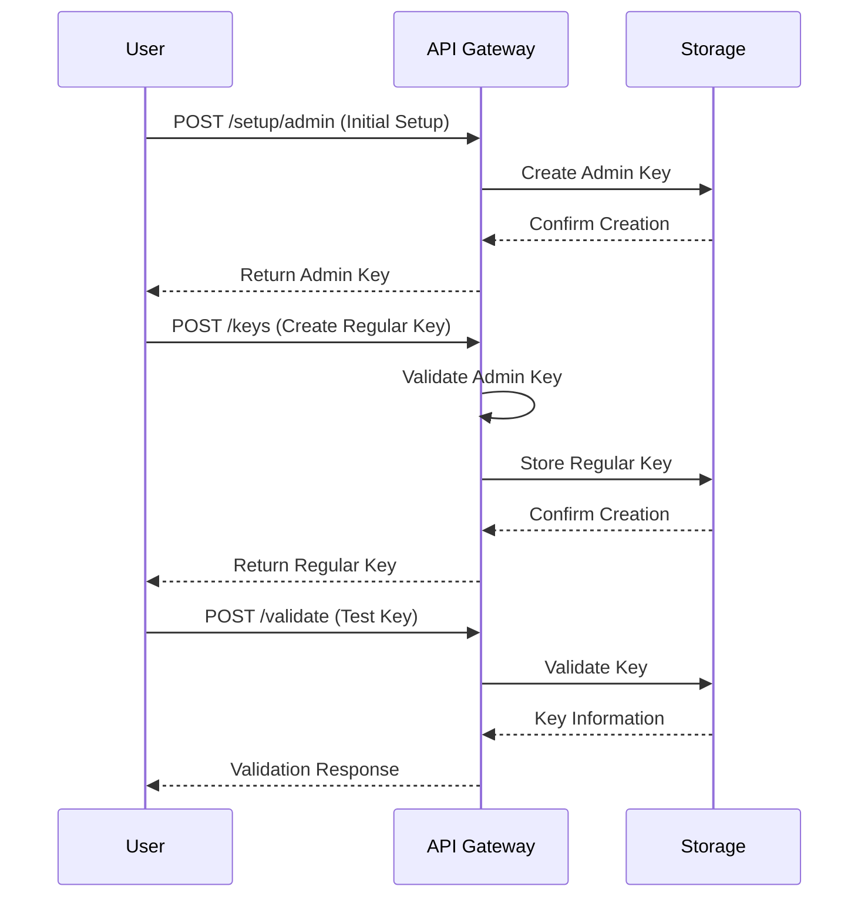
```mermaid
sequenceDiagram
    participant User as User
    participant Gateway as API Gateway
    participant Storage as Storage

    User->>Gateway: POST /setup/admin (Initial Setup)
    Gateway->>Storage: Create Admin Key
    Storage-->>Gateway: Confirm Creation
    Gateway-->>User: Return Admin Key
    
    User->>Gateway: POST /keys (Create Regular Key)
    Gateway->>Gateway: Validate Admin Key
    Gateway->>Storage: Store Regular Key
    Storage-->>Gateway: Confirm Creation
    Gateway-->>User: Return Regular Key
    
    User->>Gateway: POST /validate (Test Key)
    Gateway->>Storage: Validate Key
    Storage-->>Gateway: Key Information
    Gateway-->>User: Validation Response
```

This tutorial walks you through creating your first API key with appropriate scopes.

### Prerequisites

- The API Gateway Workers deployed and running
- Admin access to the API Gateway

### Step 1: Create an Admin Key

If you're starting with a fresh installation, you'll need to create an admin key first:

```bash
# Create the initial admin key using the setup endpoint
curl -X POST https://your-gateway.example.com/setup/admin \
  -H "Content-Type: application/json" \
  -d '{
    "name": "Initial Admin Key",
    "owner": "admin@example.com",
    "email": "admin@example.com"
  }'
```

The response will include your new admin key:

```json
{
  "key": "km_your_admin_key",
  "id": "admin-key-id",
  "name": "Initial Admin Key",
  "owner": "admin@example.com",
  "scopes": ["admin:keys:*"],
  "role": "KEY_ADMIN"
}
```

**Important**: Store this key securely, as it has full administrative privileges.

### Step 2: Create a Regular API Key

Once you have an admin key, you can create regular API keys with specific scopes:

```bash
curl -X POST https://your-gateway.example.com/keys \
  -H "Content-Type: application/json" \
  -H "X-API-Key: km_your_admin_key" \
  -d '{
    "name": "Product Service Key",
    "owner": "product-service",
    "scopes": ["read:products", "write:products"],
    "expiresAt": 1672531200000
  }'
```

The response will include the new API key:

```json
{
  "key": "km_your_new_api_key",
  "id": "key-id",
  "name": "Product Service Key",
  "owner": "product-service",
  "scopes": ["read:products", "write:products"],
  "status": "active",
  "createdAt": 1640995200000,
  "expiresAt": 1672531200000
}
```

### Step 3: Validate the Key

To validate that your key is working:

```bash
curl -X POST https://your-gateway.example.com/validate \
  -H "Content-Type: application/json" \
  -H "X-API-Key: km_your_new_api_key" \
  -d '{
    "scopes": ["read:products"]
  }'
```

A successful response indicates that your key is valid:

```json
{
  "valid": true,
  "keyId": "key-id",
  "name": "Product Service Key",
  "scopes": ["read:products", "write:products"]
}
```

## Implementing Role-Based Access Control

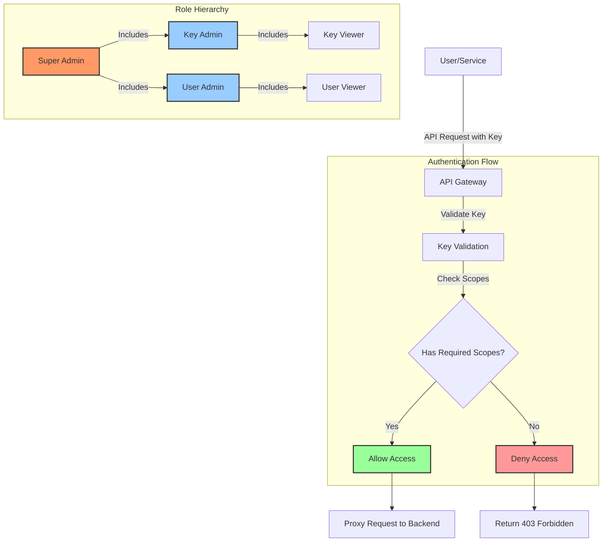
```mermaid
flowchart TD
    User[User/Service] -->|API Request with Key| Gateway[API Gateway]
    
    subgraph Authentication Flow
        Gateway -->|Validate Key| KeyValidation[Key Validation]
        KeyValidation -->|Check Scopes| ScopeCheck{Has Required Scopes?}
        ScopeCheck -->|Yes| AllowAccess[Allow Access]
        ScopeCheck -->|No| DenyAccess[Deny Access]
    end
    
    subgraph Role Hierarchy
        SuperAdmin[Super Admin] -->|Includes| KeyAdmin[Key Admin]
        SuperAdmin -->|Includes| UserAdmin[User Admin]
        KeyAdmin -->|Includes| KeyViewer[Key Viewer]
        UserAdmin -->|Includes| UserViewer[User Viewer]
    end
    
    AllowAccess --> ProxyRequest[Proxy Request to Backend]
    DenyAccess --> Return403[Return 403 Forbidden]
    
    style SuperAdmin fill:#f96,stroke:#333,stroke-width:2px
    style KeyAdmin fill:#9cf,stroke:#333,stroke-width:2px
    style UserAdmin fill:#9cf,stroke:#333,stroke-width:2px
    style AllowAccess fill:#9f9,stroke:#333,stroke-width:2px
    style DenyAccess fill:#f99,stroke:#333,stroke-width:2px
```

This tutorial demonstrates how to implement role-based access control (RBAC) using API key scopes.

### Step 1: Define Your Roles and Scopes

Plan your roles and corresponding scopes:

| Role | Scopes |
|------|--------|
| Admin | `admin:*` |
| User Manager | `read:users`, `write:users` |
| Content Editor | `read:content`, `write:content` |
| Reader | `read:content` |

### Step 2: Create Keys for Each Role

Create an API key for each role:

```bash
# Create a User Manager key
curl -X POST https://your-gateway.example.com/keys \
  -H "Content-Type: application/json" \
  -H "X-API-Key: km_your_admin_key" \
  -d '{
    "name": "User Manager Key",
    "owner": "user-service",
    "scopes": ["read:users", "write:users"],
    "role": "USER_MANAGER"
  }'

# Create a Content Editor key
curl -X POST https://your-gateway.example.com/keys \
  -H "Content-Type: application/json" \
  -H "X-API-Key: km_your_admin_key" \
  -d '{
    "name": "Content Editor Key",
    "owner": "content-service",
    "scopes": ["read:content", "write:content"],
    "role": "CONTENT_EDITOR"
  }'

# Create a Reader key
curl -X POST https://your-gateway.example.com/keys \
  -H "Content-Type: application/json" \
  -H "X-API-Key: km_your_admin_key" \
  -d '{
    "name": "Reader Key",
    "owner": "reader-service",
    "scopes": ["read:content"],
    "role": "READER"
  }'
```

### Step 3: Set Up Your API Routes with Required Scopes

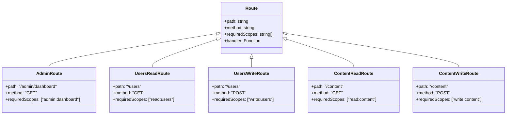
```mermaid
classDiagram
    class Route {
        +path: string
        +method: string
        +requiredScopes: string[]
        +handler: Function
    }
    
    class AdminRoute {
        +path: "/admin/dashboard"
        +method: "GET"
        +requiredScopes: ["admin:dashboard"]
    }
    
    class UsersReadRoute {
        +path: "/users"
        +method: "GET"
        +requiredScopes: ["read:users"]
    }
    
    class UsersWriteRoute {
        +path: "/users"
        +method: "POST"
        +requiredScopes: ["write:users"]
    }
    
    class ContentReadRoute {
        +path: "/content"
        +method: "GET"
        +requiredScopes: ["read:content"]
    }
    
    class ContentWriteRoute {
        +path: "/content"
        +method: "POST"
        +requiredScopes: ["write:content"]
    }
    
    Route <|-- AdminRoute
    Route <|-- UsersReadRoute
    Route <|-- UsersWriteRoute
    Route <|-- ContentReadRoute
    Route <|-- ContentWriteRoute
```

In your Cloudflare Worker, configure routes with required scopes:

```javascript
const router = new Router();

// Admin-only route
router.get('/admin/dashboard', async request => {
  // Check if the key has admin scopes
  await requirePermission(request, 'admin:dashboard');
  
  // If we get here, the key has the required permission
  return jsonResponse({ message: 'Admin dashboard data' });
});

// User management routes
router.get('/users', async request => {
  await requirePermission(request, 'read:users');
  return jsonResponse({ users: [] });
});

router.post('/users', async request => {
  await requirePermission(request, 'write:users');
  return jsonResponse({ message: 'User created' });
});

// Content routes
router.get('/content', async request => {
  await requirePermission(request, 'read:content');
  return jsonResponse({ content: [] });
});

router.post('/content', async request => {
  await requirePermission(request, 'write:content');
  return jsonResponse({ message: 'Content created' });
});
```

### Step 4: Test Access Control

Test that the appropriate keys can access their routes:

```bash
# Admin key should have access to everything
curl https://your-gateway.example.com/admin/dashboard \
  -H "X-API-Key: km_your_admin_key"

# User Manager key should have access to user routes
curl https://your-gateway.example.com/users \
  -H "X-API-Key: km_user_manager_key"

# Content Editor key should have access to content routes
curl https://your-gateway.example.com/content \
  -H "X-API-Key: km_content_editor_key"
curl -X POST https://your-gateway.example.com/content \
  -H "X-API-Key: km_content_editor_key" \
  -H "Content-Type: application/json" \
  -d '{ "title": "New Content" }'

# Reader key should only have read access to content
curl https://your-gateway.example.com/content \
  -H "X-API-Key: km_reader_key"
# This should fail
curl -X POST https://your-gateway.example.com/content \
  -H "X-API-Key: km_reader_key" \
  -H "Content-Type: application/json" \
  -d '{ "title": "New Content" }'
```

## Configuring API Proxying

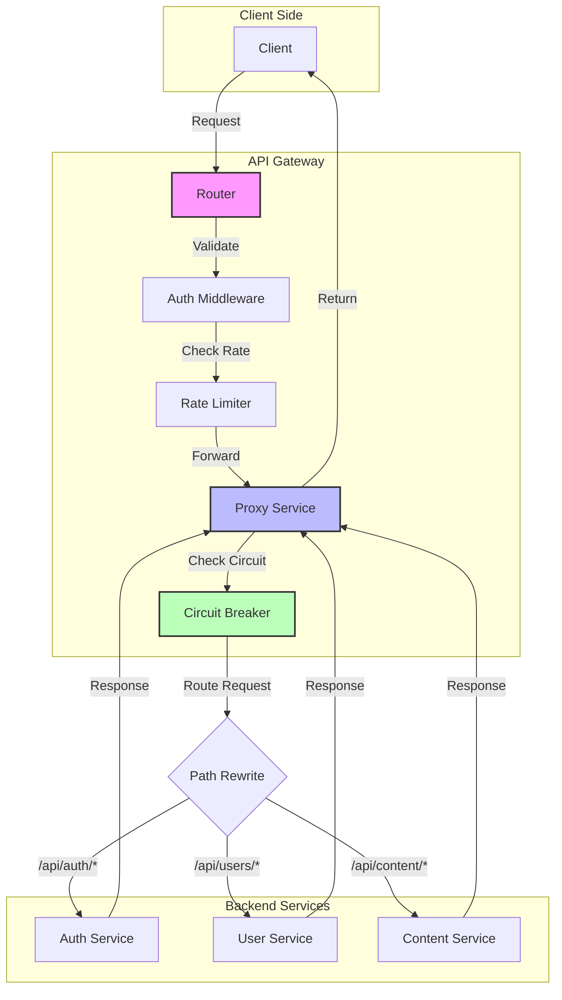
```mermaid
graph TD
    subgraph Client Side
        Client[Client]
    end
    
    subgraph API Gateway
        Router[Router]
        AuthMiddleware[Auth Middleware]
        RateLimiter[Rate Limiter]
        ProxyService[Proxy Service]
        CircuitBreaker[Circuit Breaker]
    end
    
    subgraph Backend Services
        AuthService[Auth Service]
        UserService[User Service]
        ContentService[Content Service]
    end
    
    Client -->|Request| Router
    Router -->|Validate| AuthMiddleware
    AuthMiddleware -->|Check Rate| RateLimiter
    RateLimiter -->|Forward| ProxyService
    ProxyService -->|Check Circuit| CircuitBreaker
    
    CircuitBreaker -->|Route Request| RewritePath{Path Rewrite}
    
    RewritePath -->|/api/auth/*| AuthService
    RewritePath -->|/api/users/*| UserService
    RewritePath -->|/api/content/*| ContentService
    
    AuthService -->|Response| ProxyService
    UserService -->|Response| ProxyService
    ContentService -->|Response| ProxyService
    
    ProxyService -->|Return| Client
    
    style Router fill:#f9f,stroke:#333,stroke-width:2px
    style ProxyService fill:#bbf,stroke:#333,stroke-width:2px
    style CircuitBreaker fill:#bfb,stroke:#333,stroke-width:2px
```

This tutorial demonstrates how to set up the API Gateway to proxy requests to backend services.

### Step 1: Configure Proxy Settings

Create or update your configuration file (`config.json`) with proxy settings:

```json
{
  "proxy": {
    "enabled": true,
    "services": {
      "auth": {
        "target": "https://auth-service.example.com",
        "pathRewrite": {
          "^/api/auth": ""
        },
        "headers": {
          "X-Internal-Service": "gateway"
        }
      },
      "users": {
        "target": "https://user-service.example.com",
        "timeout": 5000
      },
      "content": {
        "target": "https://content-service.example.com",
        "pathRewrite": {
          "^/api/content": "/v2"
        }
      }
    }
  }
}
```

### Step 2: Set Up Routes for Proxying

In your Cloudflare Worker code, configure routes for proxying:

```javascript
// Import the ProxyService
import { ProxyService } from './services/ProxyService.js';

// Create the router
const router = new Router();

// Set up proxy routes
router.all('/api/auth/:path*', async (request, { path }) => {
  const proxyService = container.resolve('proxyService');
  return await proxyService.proxyRequest(request, 'auth', `/${path || ''}`);
});

router.all('/api/users/:path*', async (request, { path }) => {
  const proxyService = container.resolve('proxyService');
  return await proxyService.proxyRequest(request, 'users', `/${path || ''}`);
});

router.all('/api/content/:path*', async (request, { path }) => {
  const proxyService = container.resolve('proxyService');
  return await proxyService.proxyRequest(request, 'content', `/${path || ''}`);
});
```

### Step 3: Test the Proxy

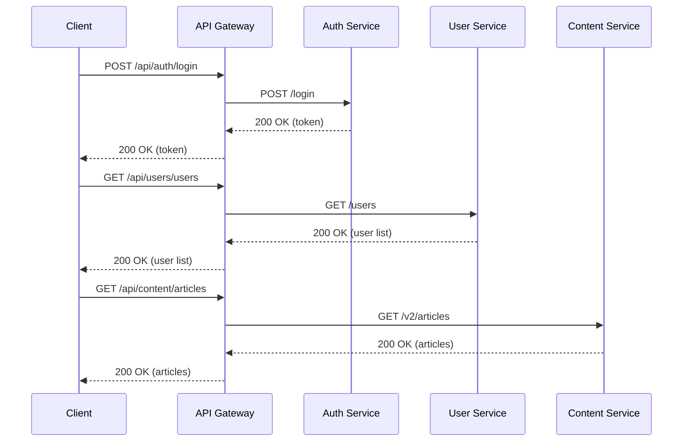
```mermaid
sequenceDiagram
    participant Client as Client
    participant Gateway as API Gateway
    participant Auth as Auth Service
    participant User as User Service
    participant Content as Content Service
    
    Client->>Gateway: POST /api/auth/login
    Gateway->>Auth: POST /login
    Auth-->>Gateway: 200 OK (token)
    Gateway-->>Client: 200 OK (token)
    
    Client->>Gateway: GET /api/users/users
    Gateway->>User: GET /users
    User-->>Gateway: 200 OK (user list)
    Gateway-->>Client: 200 OK (user list)
    
    Client->>Gateway: GET /api/content/articles
    Gateway->>Content: GET /v2/articles
    Content-->>Gateway: 200 OK (articles)
    Gateway-->>Client: 200 OK (articles)
```

Test that your proxy routes are working:

```bash
# This should proxy to auth-service.example.com/login
curl -X POST https://your-gateway.example.com/api/auth/login \
  -H "Content-Type: application/json" \
  -d '{ "username": "test", "password": "test" }'

# This should proxy to user-service.example.com/users
curl https://your-gateway.example.com/api/users/users \
  -H "X-API-Key: km_your_api_key"

# This should proxy to content-service.example.com/v2/articles
curl https://your-gateway.example.com/api/content/articles \
  -H "X-API-Key: km_your_api_key"
```

## Setting Up Rate Limiting

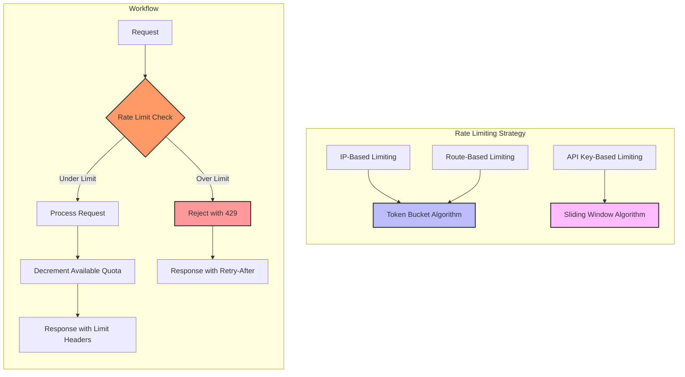
```mermaid
graph TD
    subgraph Rate Limiting Strategy
        direction TB
        IP[IP-Based Limiting]
        API[API Key-Based Limiting]
        Route[Route-Based Limiting]
        
        TokenBucket[Token Bucket Algorithm]
        SlidingWindow[Sliding Window Algorithm]
        
        IP --> TokenBucket
        API --> SlidingWindow
        Route --> TokenBucket
    end
    
    subgraph Workflow
        direction TB
        Request[Request] --> RateLimitCheck{Rate Limit Check}
        RateLimitCheck -->|Under Limit| ProcessRequest[Process Request]
        RateLimitCheck -->|Over Limit| Reject[Reject with 429]
        
        ProcessRequest --> DecrementCounter[Decrement Available Quota]
        DecrementCounter --> Response[Response with Limit Headers]
        
        Reject --> ResponseWithRetry[Response with Retry-After]
    end
    
    style TokenBucket fill:#bbf,stroke:#333,stroke-width:2px
    style SlidingWindow fill:#fbf,stroke:#333,stroke-width:2px
    style RateLimitCheck fill:#f96,stroke:#333,stroke-width:2px
    style Reject fill:#f99,stroke:#333,stroke-width:2px
```

This tutorial demonstrates how to configure rate limiting for your API endpoints.

### Step 1: Configure Rate Limiting

Update your configuration file with rate limiting settings:

```json
{
  "rateLimit": {
    "defaultLimit": 100,
    "defaultWindow": 60000,
    "endpoints": {
      "/api/auth/login": { 
        "limit": 10, 
        "window": 300000 
      },
      "/api/content/search": { 
        "limit": 30, 
        "window": 60000 
      }
    },
    "headers": {
      "limit": "X-RateLimit-Limit",
      "remaining": "X-RateLimit-Remaining",
      "reset": "X-RateLimit-Reset"
    }
  }
}
```

### Step 2: Apply Rate Limiting Middleware

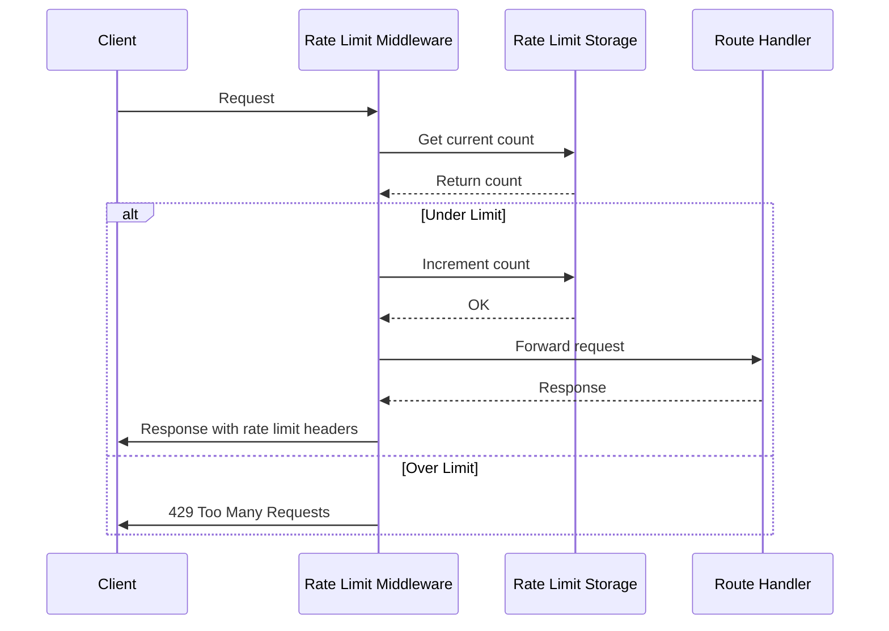
```mermaid
sequenceDiagram
    participant Client as Client
    participant Middleware as Rate Limit Middleware
    participant Storage as Rate Limit Storage
    participant Handler as Route Handler
    
    Client->>Middleware: Request
    Middleware->>Storage: Get current count
    Storage-->>Middleware: Return count
    
    alt Under Limit
        Middleware->>Storage: Increment count
        Storage-->>Middleware: OK
        Middleware->>Handler: Forward request
        Handler-->>Middleware: Response
        Middleware->>Client: Response with rate limit headers
    else Over Limit
        Middleware->>Client: 429 Too Many Requests
    end
```

In your Cloudflare Worker code, apply the rate limiting middleware:

```javascript
import { rateLimitMiddleware } from './middleware/rateLimitMiddleware.js';

// Create the router
const router = new Router();

// Apply rate limiting to routes
router.post('/api/auth/login', rateLimitMiddleware, async (request) => {
  // Login logic
});

router.get('/api/content/search', rateLimitMiddleware, async (request) => {
  // Search logic
});

// You can also apply rate limiting to all routes
router.use(rateLimitMiddleware);
```

### Step 3: Test Rate Limiting

Test that rate limiting is working by making multiple requests in quick succession:

```bash
# Make multiple requests to a rate-limited endpoint
for i in {1..15}; do
  curl -I https://your-gateway.example.com/api/content/search \
    -H "X-API-Key: km_your_api_key"
  echo ""
done
```

After exceeding the rate limit, you should see a 429 Too Many Requests response:

```
HTTP/2 429 
content-type: application/json
x-ratelimit-limit: 30
x-ratelimit-remaining: 0
x-ratelimit-reset: 1234567890
retry-after: 45
```

## Implementing Circuit Breaking

```mermaid
stateDiagram-v2
    [*] --> Closed
    
    Closed --> Open: Failures > Threshold
    Open --> HalfOpen: Timeout Expired
    HalfOpen --> Closed: Success
    HalfOpen --> Open: Failure
    
    state Closed {
        [*] --> Success
        Success --> [*]
        Success --> Failure: Error occurs
        Failure --> CountFailure: Increment counter
        CountFailure --> CheckThreshold
        CheckThreshold --> [*]: Counter < Threshold
    }
    
    state Open {
        [*] --> RejectAll: Fail fast
        RejectAll --> [*]
        [*] --> CheckTimer
        CheckTimer --> HalfOpen: Timer expired
    }
    
    state HalfOpen {
        [*] --> AllowTest: Allow single request
        AllowTest --> CheckResult
        CheckResult --> Closed: Success
        CheckResult --> Open: Failure
    }
```

This tutorial demonstrates how to configure circuit breaking for your API proxying to prevent cascading failures.

### Step 1: Configure Circuit Breaker

Update your configuration file with circuit breaker settings:

```json
{
  "proxy": {
    "enabled": true,
    "circuitBreaker": {
      "enabled": true,
      "failureThreshold": 5,
      "resetTimeout": 30000
    },
    "services": {
      "auth": {
        "target": "https://auth-service.example.com",
        "circuitBreaker": {
          "failureThreshold": 3,
          "resetTimeout": 10000
        }
      },
      "users": {
        "target": "https://user-service.example.com"
      }
    }
  }
}
```

### Step 2: Monitor Circuit Breaker State

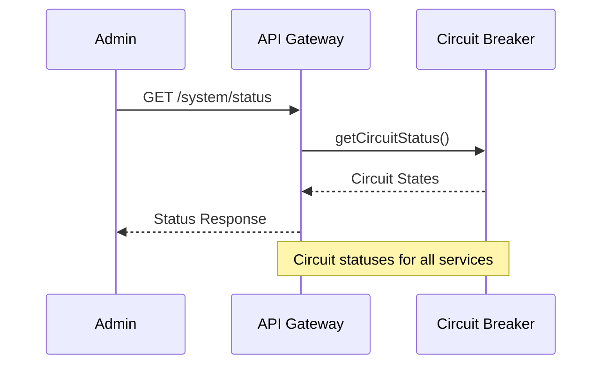
```mermaid
sequenceDiagram
    participant Admin as Admin
    participant Gateway as API Gateway
    participant CircuitBreaker as Circuit Breaker
    
    Admin->>Gateway: GET /system/status
    Gateway->>CircuitBreaker: getCircuitStatus()
    CircuitBreaker-->>Gateway: Circuit States
    Gateway-->>Admin: Status Response
    
    Note over Gateway,CircuitBreaker: Circuit statuses for all services
```

You can monitor the circuit breaker state through logs or by creating a status endpoint:

```javascript
router.get('/system/status', async (request) => {
  // Ensure only admins can access this endpoint
  await requirePermission(request, 'admin:system:read');
  
  const proxyService = container.resolve('proxyService');
  const circuitStatus = proxyService.getCircuitStatus();
  
  return jsonResponse({
    status: 'ok',
    circuits: circuitStatus
  });
});
```

### Step 3: Test Circuit Breaking

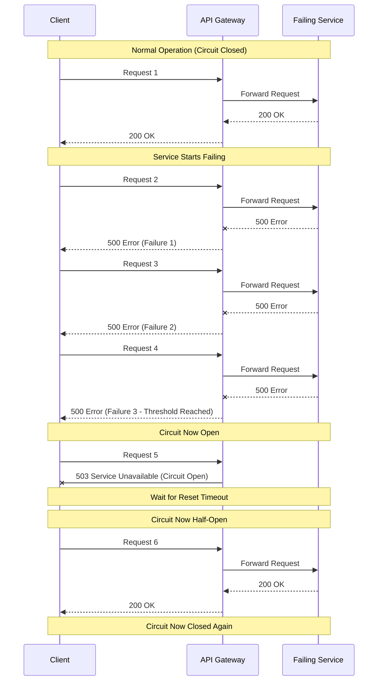
```mermaid
sequenceDiagram
    participant Client as Client
    participant Gateway as API Gateway
    participant Service as Failing Service
    
    Note over Client,Service: Normal Operation (Circuit Closed)
    Client->>Gateway: Request 1
    Gateway->>Service: Forward Request
    Service-->>Gateway: 200 OK
    Gateway-->>Client: 200 OK
    
    Note over Client,Service: Service Starts Failing
    Client->>Gateway: Request 2
    Gateway->>Service: Forward Request
    Service--xGateway: 500 Error
    Gateway-->>Client: 500 Error (Failure 1)
    
    Client->>Gateway: Request 3
    Gateway->>Service: Forward Request
    Service--xGateway: 500 Error
    Gateway-->>Client: 500 Error (Failure 2)
    
    Client->>Gateway: Request 4
    Gateway->>Service: Forward Request
    Service--xGateway: 500 Error
    Gateway-->>Client: 500 Error (Failure 3 - Threshold Reached)
    
    Note over Client,Service: Circuit Now Open
    Client->>Gateway: Request 5
    Gateway-xClient: 503 Service Unavailable (Circuit Open)
    
    Note over Client,Service: Wait for Reset Timeout
    Note over Client,Service: Circuit Now Half-Open
    
    Client->>Gateway: Request 6
    Gateway->>Service: Forward Request
    Service-->>Gateway: 200 OK
    Gateway-->>Client: 200 OK
    
    Note over Client,Service: Circuit Now Closed Again
```

You can test circuit breaking by simulating failures in an upstream service:

1. Set up a test service that fails after a certain number of requests
2. Configure the circuit breaker with a low failure threshold
3. Make multiple requests to trigger the circuit breaker
4. Observe the circuit breaker state change from CLOSED to OPEN
5. Wait for the reset timeout and observe the state change to HALF-OPEN
6. Make a successful request and observe the state change back to CLOSED

## Managing API Versions

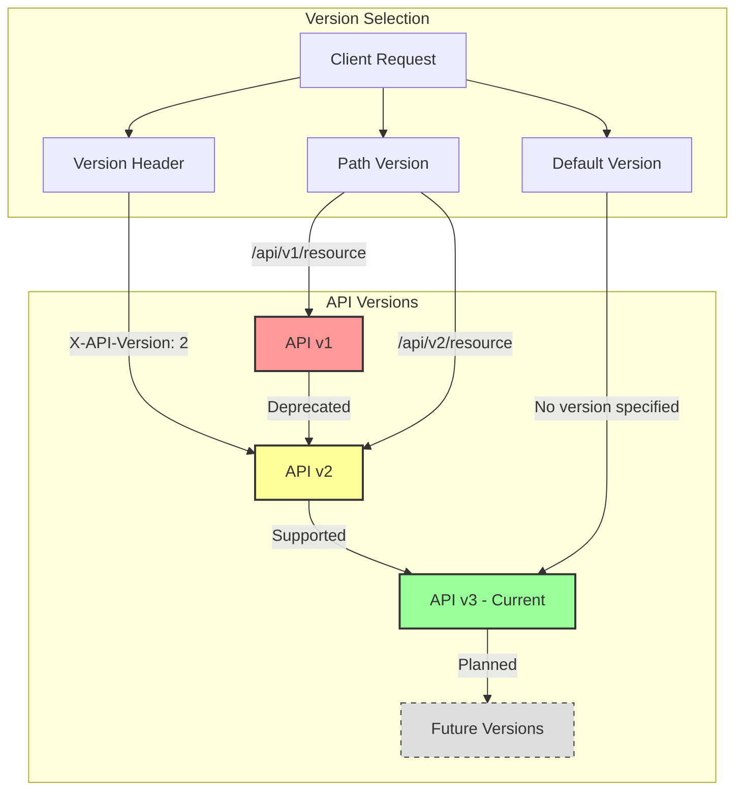
```mermaid
graph TD
    subgraph API Versions
        V1[API v1]
        V2[API v2]
        V3[API v3 - Current]
        Future[Future Versions]
        
        V1 -->|Deprecated| V2
        V2 -->|Supported| V3
        V3 -->|Planned| Future
        
        style V1 fill:#f99,stroke:#333,stroke-width:2px
        style V2 fill:#ff9,stroke:#333,stroke-width:2px
        style V3 fill:#9f9,stroke:#333,stroke-width:2px
        style Future fill:#ddd,stroke:#333,stroke-width:1px,stroke-dasharray: 5 5
    end
    
    subgraph Version Selection
        Client[Client Request]
        VersionHeader[Version Header]
        PathVersion[Path Version]
        DefaultVersion[Default Version]
        
        Client --> VersionHeader
        Client --> PathVersion
        Client --> DefaultVersion
        
        VersionHeader -->|X-API-Version: 2| V2
        PathVersion -->|/api/v1/resource| V1 
        PathVersion -->|/api/v2/resource| V2
        DefaultVersion -->|No version specified| V3
    end
```

This tutorial demonstrates how to set up and manage multiple API versions.

### Step 1: Configure API Versioning

Update your configuration file with versioning settings:

```json
{
  "routing": {
    "versioning": {
      "enabled": true,
      "current": "2",
      "supported": ["1", "2"],
      "deprecated": ["1"],
      "versionHeader": "X-API-Version"
    }
  }
}
```

### Step 2: Set Up Version-Specific Routes

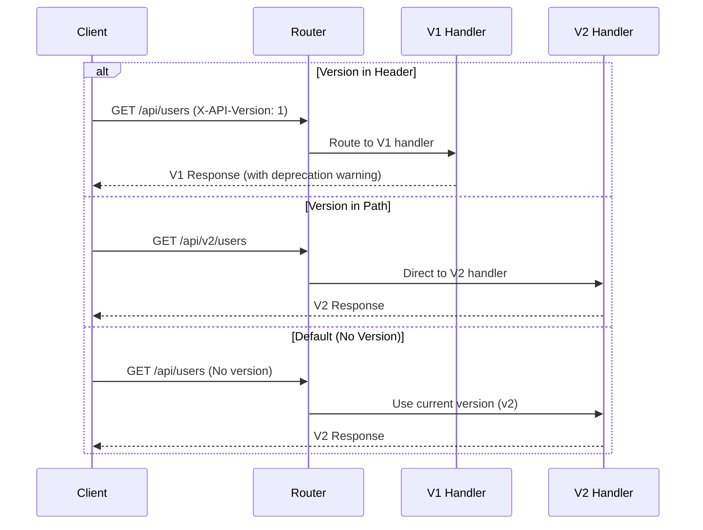
```mermaid
sequenceDiagram
    participant Client as Client
    participant Router as Router
    participant V1 as V1 Handler
    participant V2 as V2 Handler
    
    alt Version in Header
        Client->>Router: GET /api/users (X-API-Version: 1)
        Router->>V1: Route to V1 handler
        V1-->>Client: V1 Response (with deprecation warning)
    
    else Version in Path
        Client->>Router: GET /api/v2/users
        Router->>V2: Direct to V2 handler
        V2-->>Client: V2 Response
        
    else Default (No Version)
        Client->>Router: GET /api/users (No version)
        Router->>V2: Use current version (v2)
        V2-->>Client: V2 Response
    end
```

In your Cloudflare Worker code, configure version-specific routes:

```javascript
// Create the router
const router = new Router();

// V1 routes (deprecated)
router.get('/api/v1/users', async (request) => {
  return jsonResponse({ 
    users: [{ id: 1, name: 'User 1' }],
    _deprecation: {
      message: "This endpoint is deprecated. Please migrate to v2.",
      sunsetDate: "2023-12-31"
    }
  });
});

// V2 routes (current)
router.get('/api/v2/users', async (request) => {
  return jsonResponse({ 
    data: {
      users: [{ id: 1, name: 'User 1', email: 'user1@example.com' }]
    },
    meta: {
      total: 1,
      page: 1
    }
  });
});

// Version handling through header
router.get('/api/users', async (request) => {
  const version = request.headers.get('X-API-Version') || '2';
  
  if (version === '1') {
    return router.handleRequest(new Request(
      new URL('/api/v1/users', request.url),
      request
    ));
  } else {
    return router.handleRequest(new Request(
      new URL('/api/v2/users', request.url),
      request
    ));
  }
});
```

### Step 3: Test API Versioning

Test that version handling is working correctly:

```bash
# Default to the current version (v2)
curl https://your-gateway.example.com/api/users \
  -H "X-API-Key: km_your_api_key"

# Explicitly request v1 (deprecated)
curl https://your-gateway.example.com/api/users \
  -H "X-API-Key: km_your_api_key" \
  -H "X-API-Version: 1"

# Explicitly request v2
curl https://your-gateway.example.com/api/users \
  -H "X-API-Key: km_your_api_key" \
  -H "X-API-Version: 2"

# Use version-specific path
curl https://your-gateway.example.com/api/v2/users \
  -H "X-API-Key: km_your_api_key"
```

## Rotating API Keys

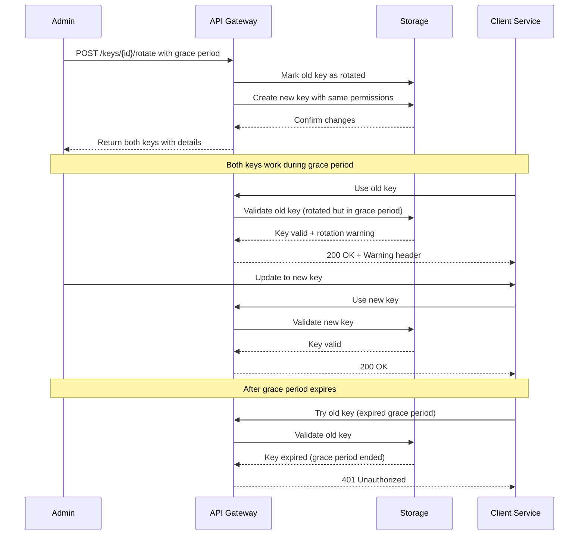
```mermaid
sequenceDiagram
    participant Admin as Admin
    participant Gateway as API Gateway
    participant Storage as Storage
    participant Service as Client Service
    
    Admin->>Gateway: POST /keys/{id}/rotate with grace period
    Gateway->>Storage: Mark old key as rotated
    Gateway->>Storage: Create new key with same permissions
    Storage-->>Gateway: Confirm changes
    Gateway-->>Admin: Return both keys with details
    
    Note over Admin,Service: Both keys work during grace period
    Service->>Gateway: Use old key
    Gateway->>Storage: Validate old key (rotated but in grace period)
    Storage-->>Gateway: Key valid + rotation warning
    Gateway-->>Service: 200 OK + Warning header
    
    Admin->>Service: Update to new key
    Service->>Gateway: Use new key
    Gateway->>Storage: Validate new key
    Storage-->>Gateway: Key valid
    Gateway-->>Service: 200 OK
    
    Note over Admin,Service: After grace period expires
    Service->>Gateway: Try old key (expired grace period)
    Gateway->>Storage: Validate old key
    Storage-->>Gateway: Key expired (grace period ended)
    Gateway-->>Service: 401 Unauthorized
```

This tutorial demonstrates how to safely rotate API keys.

### Step 1: Create a New Key with the Same Permissions

First, create a new key with the same scopes as the existing key:

```bash
curl -X POST https://your-gateway.example.com/keys \
  -H "Content-Type: application/json" \
  -H "X-API-Key: km_your_admin_key" \
  -d '{
    "name": "Product Service Key (New)",
    "owner": "product-service",
    "scopes": ["read:products", "write:products"]
  }'
```

### Step 2: Use the Rotation Endpoint

Alternatively, use the key rotation endpoint for a simpler process:

```bash
curl -X POST https://your-gateway.example.com/keys/key-id-to-rotate/rotate \
  -H "Content-Type: application/json" \
  -H "X-API-Key: km_your_admin_key" \
  -d '{
    "gracePeriodDays": 7
  }'
```

The response will include both the original (now rotated) key and the new key:

```json
{
  "originalKey": {
    "id": "old-key-id",
    "status": "rotated",
    "rotatedTo": "new-key-id",
    "validUntil": 1641599999000
  },
  "newKey": {
    "id": "new-key-id",
    "key": "km_new_api_key",
    "name": "Product Service Key",
    "owner": "product-service",
    "scopes": ["read:products", "write:products"],
    "status": "active",
    "createdAt": 1640995200000
  }
}
```

### Step 3: Update Clients

Update all clients to use the new key. During the grace period, both the old and new keys will work.

### Step 4: Verify that All Clients Are Using the New Key

Monitor the usage of the old key to ensure that all clients have migrated:

```bash
curl https://your-gateway.example.com/keys/old-key-id/usage \
  -H "X-API-Key: km_your_admin_key"
```

### Step 5: Revoke the Old Key

Once all clients have migrated, revoke the old key:

```bash
curl -X POST https://your-gateway.example.com/keys/old-key-id/revoke \
  -H "Content-Type: application/json" \
  -H "X-API-Key: km_your_admin_key" \
  -d '{
    "reason": "Rotation completed"
  }'
```

## Implementing Key Expiration

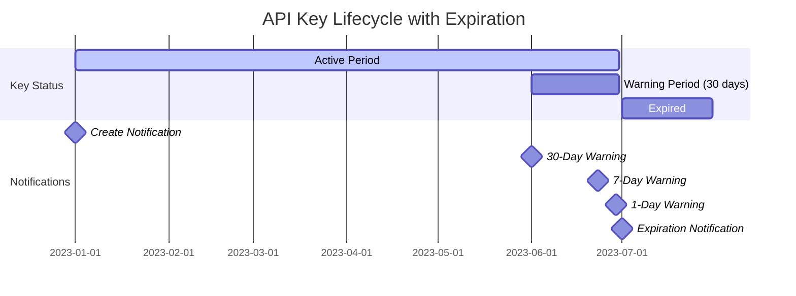
```mermaid
gantt
    title API Key Lifecycle with Expiration
    dateFormat  YYYY-MM-DD
    axisFormat  %Y-%m-%d
    
    section Key Status
    Active Period           :active,    2023-01-01, 2023-06-30
    Warning Period (30 days)  :warning,   2023-06-01, 2023-06-30
    Expired                 :expired,   2023-07-01, 2023-07-31
    
    section Notifications
    Create Notification     :milestone, 2023-01-01, 0d
    30-Day Warning          :milestone, 2023-06-01, 0d
    7-Day Warning           :milestone, 2023-06-23, 0d
    1-Day Warning           :milestone, 2023-06-29, 0d
    Expiration Notification :milestone, 2023-07-01, 0d
```

This tutorial demonstrates how to set up API keys with expiration.

### Step 1: Create a Key with an Expiration Date

Create an API key that will expire at a specific time:

```bash
curl -X POST https://your-gateway.example.com/keys \
  -H "Content-Type: application/json" \
  -H "X-API-Key: km_your_admin_key" \
  -d '{
    "name": "Temporary Access Key",
    "owner": "temp-user",
    "scopes": ["read:data"],
    "expiresAt": 1672531200000
  }'
```

The expiration timestamp (`expiresAt`) is specified in milliseconds since the Unix epoch.

### Step 2: Test Key before Expiration

Verify that the key works before it expires:

```bash
curl -X POST https://your-gateway.example.com/validate \
  -H "Content-Type: application/json" \
  -H "X-API-Key: km_temporary_key" \
  -d '{
    "scopes": ["read:data"]
  }'
```

### Step 3: Set Up Expiration Notification

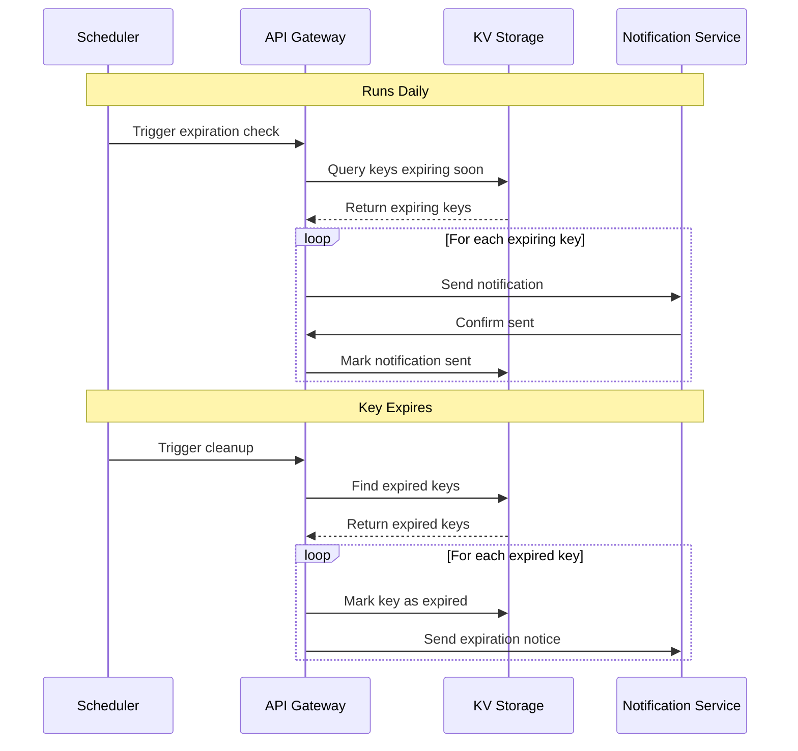
```mermaid
sequenceDiagram
    participant Scheduler as Scheduler
    participant Service as API Gateway
    participant Storage as KV Storage
    participant Notifier as Notification Service
    
    Note over Scheduler,Notifier: Runs Daily
    Scheduler->>Service: Trigger expiration check
    Service->>Storage: Query keys expiring soon
    Storage-->>Service: Return expiring keys
    
    loop For each expiring key
        Service->>Notifier: Send notification
        Notifier->>Service: Confirm sent
        Service->>Storage: Mark notification sent
    end
    
    Note over Scheduler,Notifier: Key Expires
    Scheduler->>Service: Trigger cleanup
    Service->>Storage: Find expired keys
    Storage-->>Service: Return expired keys
    
    loop For each expired key
        Service->>Storage: Mark key as expired
        Service->>Notifier: Send expiration notice
    end
```

You might want to set up a notification system to alert users when their keys are about to expire:

1. Create a Cloudflare Worker scheduled task or cron job
2. Query for keys that will expire soon
3. Send notifications to the key owners

```javascript
// Example of a scheduled function
async function checkExpiringKeys(event) {
  const now = Date.now();
  const oneDayFromNow = now + 24 * 60 * 60 * 1000;
  
  const keyService = container.resolve('keyService');
  const expiringKeys = await keyService.listKeys({
    status: 'active',
    expiresAtBefore: oneDayFromNow,
    expiresAtAfter: now
  });
  
  for (const key of expiringKeys.items) {
    // Send notification to key owner
    await notificationService.sendExpirationNotice(key);
  }
}
```

### Step 4: Verify Key after Expiration

After the expiration time has passed, verify that the key no longer works:

```bash
curl -X POST https://your-gateway.example.com/validate \
  -H "Content-Type: application/json" \
  -H "X-API-Key: km_temporary_key" \
  -d '{
    "scopes": ["read:data"]
  }'
```

You should receive an error response:

```json
{
  "error": "API key has expired",
  "code": "EXPIRED_API_KEY",
  "requestId": "request-id-123"
}
```

## Setting Up Monitoring

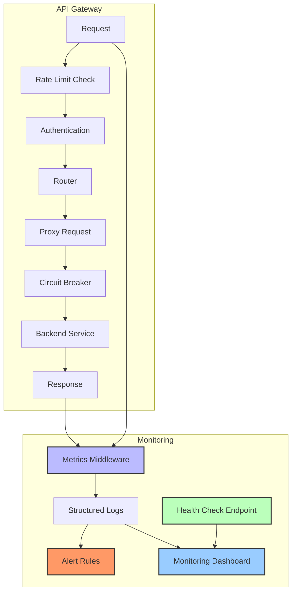
```mermaid
graph TD
    subgraph API Gateway
        Req[Request] --> RateLimit[Rate Limit Check]
        RateLimit --> Auth[Authentication]
        Auth --> Router[Router]
        Router --> ProxyReq[Proxy Request]
        ProxyReq --> CircuitBreaker[Circuit Breaker]
        CircuitBreaker --> Backend[Backend Service]
        Backend --> Response[Response]
    end
    
    subgraph Monitoring
        MetricsMiddleware[Metrics Middleware]
        HealthCheck[Health Check Endpoint]
        Logs[Structured Logs]
        AlertRules[Alert Rules]
        Dashboard[Monitoring Dashboard]
        
        MetricsMiddleware --> Logs
        HealthCheck --> Dashboard
        Logs --> AlertRules
        Logs --> Dashboard
    end
    
    Req --> MetricsMiddleware
    Response --> MetricsMiddleware
    
    style MetricsMiddleware fill:#bbf,stroke:#333,stroke-width:2px
    style HealthCheck fill:#bfb,stroke:#333,stroke-width:2px
    style AlertRules fill:#f96,stroke:#333,stroke-width:2px
    style Dashboard fill:#9cf,stroke:#333,stroke-width:2px
```

This tutorial demonstrates how to set up monitoring for the API Gateway.

### Step 1: Configure Logging

Update your configuration file with logging settings:

```json
{
  "logging": {
    "level": "info",
    "includeTrace": true,
    "requestIdHeader": "X-Request-ID"
  }
}
```

### Step 2: Set Up a Monitoring Endpoint

Create a health check endpoint:

```javascript
router.get('/health', async () => {
  // Check critical dependencies
  const storage = container.resolve('storage');
  const isStorageHealthy = await storage.ping();
  
  if (!isStorageHealthy) {
    return jsonResponse({
      status: 'unhealthy',
      components: {
        storage: 'unhealthy'
      }
    }, { status: 503 });
  }
  
  return jsonResponse({
    status: 'healthy',
    version: '1.0.0',
    components: {
      storage: 'healthy'
    }
  });
});
```

### Step 3: Set Up Metrics Collection

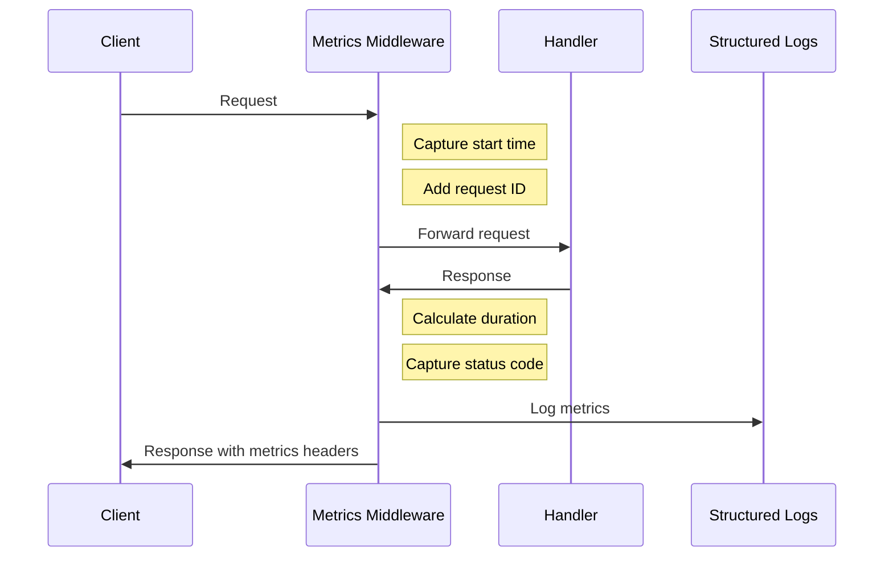
```mermaid
sequenceDiagram
    participant Client as Client
    participant Middleware as Metrics Middleware
    participant Handler as Handler
    participant Logs as Structured Logs
    
    Client->>Middleware: Request
    Note right of Middleware: Capture start time
    Note right of Middleware: Add request ID
    
    Middleware->>Handler: Forward request
    Handler->>Middleware: Response
    
    Note right of Middleware: Calculate duration
    Note right of Middleware: Capture status code
    Middleware->>Logs: Log metrics
    Middleware->>Client: Response with metrics headers
```

Implement a metrics collector middleware:

```javascript
function metricsMiddleware(request, next) {
  const startTime = Date.now();
  const requestId = request.headers.get('X-Request-ID') || crypto.randomUUID();
  
  // Add request ID to all responses
  const response = await next({
    ...request,
    headers: {
      ...request.headers,
      'X-Request-ID': requestId
    }
  });
  
  const endTime = Date.now();
  const duration = endTime - startTime;
  
  // Log metrics
  console.log(JSON.stringify({
    timestamp: new Date().toISOString(),
    requestId: requestId,
    method: request.method,
    url: request.url,
    statusCode: response.status,
    duration: duration,
    userAgent: request.headers.get('User-Agent')
  }));
  
  return response;
}

// Apply to router
router.use(metricsMiddleware);
```

### Step 4: Set Up Alerts

Configure alerts for critical issues:

1. Set up a monitoring service (e.g., Datadog, New Relic, Cloudflare Analytics)
2. Configure alerts for:
   - High error rates
   - Increased latency
   - Circuit breaker trips
   - Rate limiting events
   - Authentication failures

## Auditing API Usage

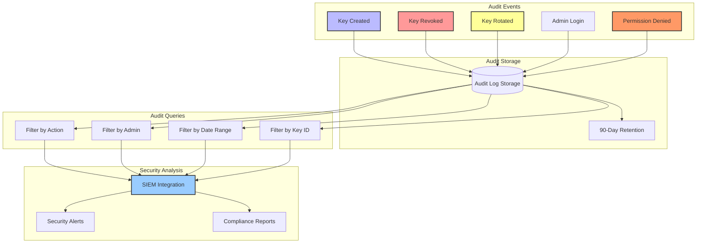
```mermaid
graph TD
    subgraph Audit Events
        KeyCreated[Key Created]
        KeyRevoked[Key Revoked]
        KeyRotated[Key Rotated]
        AdminLogin[Admin Login]
        PermissionDenied[Permission Denied]
    end
    
    subgraph Audit Storage
        Storage[(Audit Log Storage)]
        Retention[90-Day Retention]
    end
    
    subgraph Audit Queries
        ByAction[Filter by Action]
        ByAdmin[Filter by Admin]
        ByDate[Filter by Date Range]
        ByKey[Filter by Key ID]
    end
    
    subgraph Security Analysis
        SIEM[SIEM Integration]
        SecurityAlerts[Security Alerts]
        ComplianceReports[Compliance Reports]
    end
    
    KeyCreated --> Storage
    KeyRevoked --> Storage
    KeyRotated --> Storage
    AdminLogin --> Storage
    PermissionDenied --> Storage
    
    Storage --> Retention
    
    Storage --> ByAction
    Storage --> ByAdmin
    Storage --> ByDate
    Storage --> ByKey
    
    ByAction --> SIEM
    ByAdmin --> SIEM
    ByDate --> SIEM
    ByKey --> SIEM
    
    SIEM --> SecurityAlerts
    SIEM --> ComplianceReports
    
    style KeyCreated fill:#bbf,stroke:#333,stroke-width:2px
    style KeyRevoked fill:#f99,stroke:#333,stroke-width:2px
    style KeyRotated fill:#ff9,stroke:#333,stroke-width:2px
    style PermissionDenied fill:#f96,stroke:#333,stroke-width:2px
    style SIEM fill:#9cf,stroke:#333,stroke-width:2px
```

This tutorial demonstrates how to set up and query the audit log for API usage.

### Step 1: Configure Audit Logging

Ensure audit logging is properly configured:

```json
{
  "audit": {
    "enabled": true,
    "storageRetentionDays": 90,
    "logActions": [
      "key_created",
      "key_revoked",
      "key_rotated",
      "admin_login",
      "permission_denied"
    ]
  }
}
```

### Step 2: Query the Audit Log

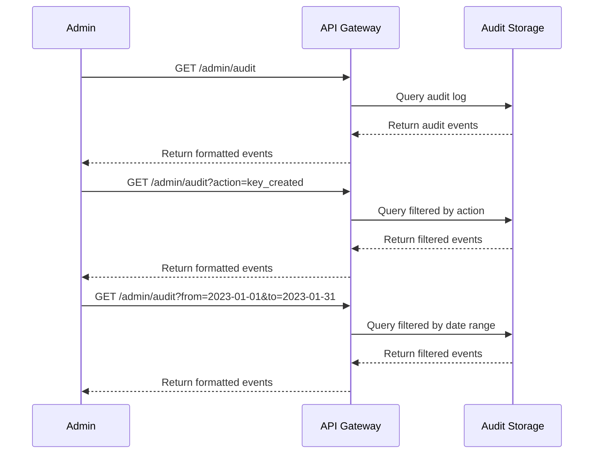
```mermaid
sequenceDiagram
    participant Admin as Admin
    participant Gateway as API Gateway
    participant Storage as Audit Storage
    
    Admin->>Gateway: GET /admin/audit
    Gateway->>Storage: Query audit log
    Storage-->>Gateway: Return audit events
    Gateway-->>Admin: Return formatted events
    
    Admin->>Gateway: GET /admin/audit?action=key_created
    Gateway->>Storage: Query filtered by action
    Storage-->>Gateway: Return filtered events
    Gateway-->>Admin: Return formatted events
    
    Admin->>Gateway: GET /admin/audit?from=2023-01-01&to=2023-01-31
    Gateway->>Storage: Query filtered by date range
    Storage-->>Gateway: Return filtered events
    Gateway-->>Admin: Return formatted events
```

Use the admin API to query the audit log:

```bash
# Get all audit events
curl https://your-gateway.example.com/admin/audit \
  -H "X-API-Key: km_your_admin_key"

# Filter by action type
curl https://your-gateway.example.com/admin/audit?action=key_created \
  -H "X-API-Key: km_your_admin_key"

# Filter by admin ID
curl https://your-gateway.example.com/admin/audit?adminId=admin-id \
  -H "X-API-Key: km_your_admin_key"

# Filter by date range
curl "https://your-gateway.example.com/admin/audit?from=2023-01-01&to=2023-01-31" \
  -H "X-API-Key: km_your_admin_key"
```

### Step 3: Set Up Regular Audit Reviews

Implement a process for regularly reviewing audit logs:

1. Export audit logs to a secure location
2. Review logs for suspicious activity
3. Implement automated analysis for common security patterns

### Step 4: Integrate with SIEM

For larger deployments, integrate audit logs with a Security Information and Event Management (SIEM) system:

1. Set up a scheduled task to export audit logs
2. Format logs for your SIEM system
3. Configure SIEM rules for security events

## Conclusion

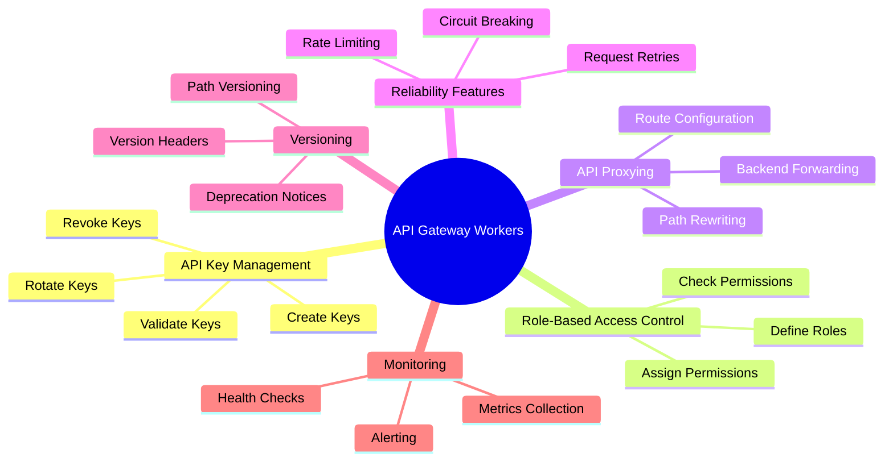
```mermaid
mindmap
    root((API Gateway Workers))
        API Key Management
            Create Keys
            Validate Keys
            Rotate Keys
            Revoke Keys
        Role-Based Access Control
            Define Roles
            Assign Permissions
            Check Permissions
        API Proxying
            Route Configuration
            Path Rewriting
            Backend Forwarding
        Reliability Features
            Circuit Breaking
            Rate Limiting
            Request Retries
        Versioning
            Version Headers
            Path Versioning
            Deprecation Notices
        Monitoring
            Health Checks
            Metrics Collection
            Alerting
```

These tutorials cover the most common use cases for the API Gateway Workers. For more specific scenarios or advanced configurations, refer to the other documentation pages or contact the API Gateway team.

## Further Reading

- [Configuration Guide](./CONFIGURATION.md) - Detailed configuration options
- [API Reference](./API.md) - Complete API reference
- [Security Guide](./SECURITY.md) - Security best practices
- [Gateway Documentation](./GATEWAY.md) - API Gateway proxy features