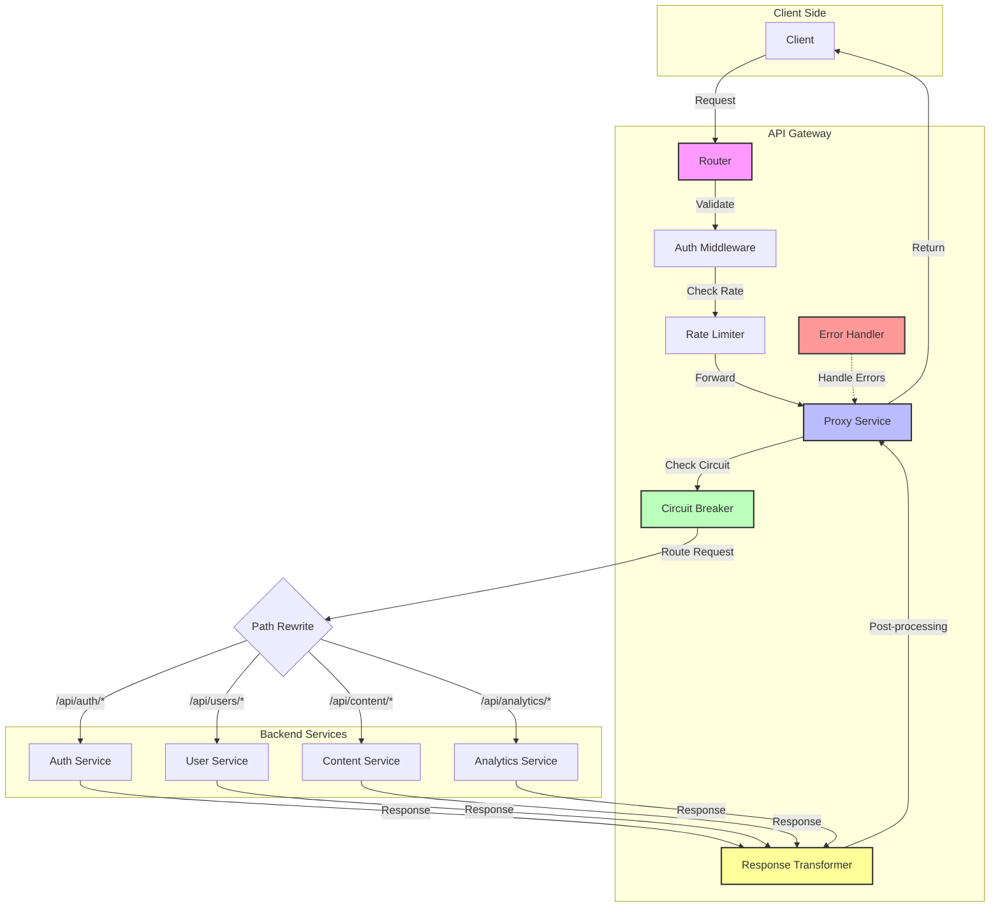
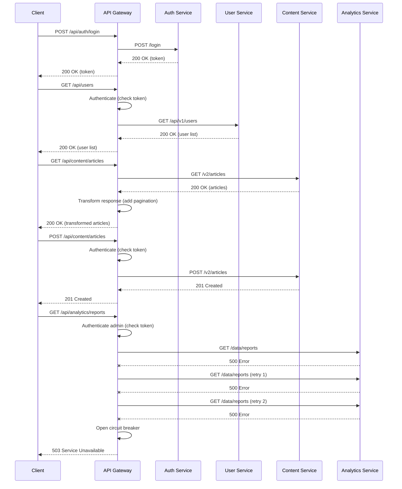

# API Gateway Tutorials

This document provides step-by-step tutorials for common use cases of the API Gateway. These tutorials will help you understand how to use the key features of the API Gateway and integrate it into your workflow.

## Table of Contents

1. [Setting Up Your First API Key](#setting-up-your-first-api-key)
2. [Implementing Role-Based Access Control](#implementing-role-based-access-control)
3. [Configuring API Proxying](#configuring-api-proxying)
4. [Setting Up Rate Limiting](#setting-up-rate-limiting)
5. [Implementing Circuit Breaking](#implementing-circuit-breaking)
6. [Managing API Versions](#managing-api-versions)
7. [Rotating API Keys](#rotating-api-keys)
8. [Implementing Key Expiration](#implementing-key-expiration)
9. [Setting Up Monitoring](#setting-up-monitoring)
10. [Auditing API Usage](#auditing-api-usage)

## Setting Up Your First API Key


This tutorial walks you through creating your first API key with appropriate scopes.

### Prerequisites

- The API Gateway Workers deployed and running
- Admin access to the API Gateway

### Step 1: Create an Admin Key

If you're starting with a fresh installation, you'll need to create an admin key first:

```bash
# Create the initial admin key using the setup endpoint
curl -X POST https://your-gateway.example.com/setup/admin \
  -H "Content-Type: application/json" \
  -d '{
    "name": "Initial Admin Key",
    "owner": "admin@example.com",
    "email": "admin@example.com"
  }'
```

The response will include your new admin key:

```json
{
  "key": "km_your_admin_key",
  "id": "admin-key-id",
  "name": "Initial Admin Key",
  "owner": "admin@example.com",
  "scopes": ["admin:keys:*"],
  "role": "KEY_ADMIN"
}
```

**Important**: Store this key securely, as it has full administrative privileges.

### Step 2: Create a Regular API Key

Once you have an admin key, you can create regular API keys with specific scopes:

```bash
curl -X POST https://your-gateway.example.com/keys \
  -H "Content-Type: application/json" \
  -H "X-API-Key: km_your_admin_key" \
  -d '{
    "name": "Product Service Key",
    "owner": "product-service",
    "scopes": ["read:products", "write:products"],
    "expiresAt": 1672531200000
  }'
```

The response will include the new API key:

```json
{
  "key": "km_your_new_api_key",
  "id": "key-id",
  "name": "Product Service Key",
  "owner": "product-service",
  "scopes": ["read:products", "write:products"],
  "status": "active",
  "createdAt": 1640995200000,
  "expiresAt": 1672531200000
}
```

### Step 3: Validate the Key

To validate that your key is working:

```bash
curl -X POST https://your-gateway.example.com/validate \
  -H "Content-Type: application/json" \
  -H "X-API-Key: km_your_new_api_key" \
  -d '{
    "scopes": ["read:products"]
  }'
```

A successful response indicates that your key is valid:

```json
{
  "valid": true,
  "keyId": "key-id",
  "name": "Product Service Key",
  "scopes": ["read:products", "write:products"]
}
```

## Implementing Role-Based Access Control


This tutorial demonstrates how to implement role-based access control (RBAC) using API key scopes.

### Step 1: Define Your Roles and Scopes

Plan your roles and corresponding scopes:

| Role | Scopes |
|------|--------|
| Admin | `admin:*` |
| User Manager | `read:users`, `write:users` |
| Content Editor | `read:content`, `write:content` |
| Reader | `read:content` |

### Step 2: Create Keys for Each Role

Create an API key for each role:

```bash
# Create a User Manager key
curl -X POST https://your-gateway.example.com/keys \
  -H "Content-Type: application/json" \
  -H "X-API-Key: km_your_admin_key" \
  -d '{
    "name": "User Manager Key",
    "owner": "user-service",
    "scopes": ["read:users", "write:users"],
    "role": "USER_MANAGER"
  }'

# Create a Content Editor key
curl -X POST https://your-gateway.example.com/keys \
  -H "Content-Type: application/json" \
  -H "X-API-Key: km_your_admin_key" \
  -d '{
    "name": "Content Editor Key",
    "owner": "content-service",
    "scopes": ["read:content", "write:content"],
    "role": "CONTENT_EDITOR"
  }'

# Create a Reader key
curl -X POST https://your-gateway.example.com/keys \
  -H "Content-Type: application/json" \
  -H "X-API-Key: km_your_admin_key" \
  -d '{
    "name": "Reader Key",
    "owner": "reader-service",
    "scopes": ["read:content"],
    "role": "READER"
  }'
```

### Step 3: Set Up Your API Routes with Required Scopes


In your Cloudflare Worker, configure routes with required scopes:

```javascript
const router = new Router();

// Admin-only route
router.get('/admin/dashboard', async request => {
  // Check if the key has admin scopes
  await requirePermission(request, 'admin:dashboard');
  
  // If we get here, the key has the required permission
  return jsonResponse({ message: 'Admin dashboard data' });
});

// User management routes
router.get('/users', async request => {
  await requirePermission(request, 'read:users');
  return jsonResponse({ users: [] });
});

router.post('/users', async request => {
  await requirePermission(request, 'write:users');
  return jsonResponse({ message: 'User created' });
});

// Content routes
router.get('/content', async request => {
  await requirePermission(request, 'read:content');
  return jsonResponse({ content: [] });
});

router.post('/content', async request => {
  await requirePermission(request, 'write:content');
  return jsonResponse({ message: 'Content created' });
});
```

### Step 4: Test Access Control

Test that the appropriate keys can access their routes:

```bash
# Admin key should have access to everything
curl https://your-gateway.example.com/admin/dashboard \
  -H "X-API-Key: km_your_admin_key"

# User Manager key should have access to user routes
curl https://your-gateway.example.com/users \
  -H "X-API-Key: km_user_manager_key"

# Content Editor key should have access to content routes
curl https://your-gateway.example.com/content \
  -H "X-API-Key: km_content_editor_key"
curl -X POST https://your-gateway.example.com/content \
  -H "X-API-Key: km_content_editor_key" \
  -H "Content-Type: application/json" \
  -d '{ "title": "New Content" }'

# Reader key should only have read access to content
curl https://your-gateway.example.com/content \
  -H "X-API-Key: km_reader_key"
# This should fail
curl -X POST https://your-gateway.example.com/content \
  -H "X-API-Key: km_reader_key" \
  -H "Content-Type: application/json" \
  -d '{ "title": "New Content" }'
```

## Configuring API Proxying



This tutorial provides a comprehensive guide to setting up the API Gateway's powerful proxying capabilities, allowing you to route client requests to multiple backend services with additional features like rate limiting, circuit breaking, and response transformation.

### Prerequisites

- API Gateway deployed and running
- Backend services that you want to proxy to
- Admin access to the API Gateway
- Basic understanding of regex for path matching

### Step 1: Plan Your API Structure

Before configuring proxying, plan your API structure by mapping out:

1. **Base Paths**: What URL patterns will map to which services
2. **Authentication Requirements**: Which endpoints need authentication
3. **Rate Limiting**: Which endpoints need rate limiting
4. **Path Transformations**: How paths should be rewritten for backend services

Example API structure:

| Gateway Path | Backend Service | Path Rewrite | Auth Required | Rate Limit |
|-------------|-----------------|--------------|--------------|------------|
| `/api/auth/*` | Auth Service | Remove `/api/auth` prefix | No for login, Yes for others | 10 req/min |
| `/api/users/*` | User Service | Pass as-is | Yes | 50 req/min |
| `/api/content/*` | Content Service | Map to `/v2/*` | Yes for write, No for read | 100 req/min |
| `/api/analytics/*` | Analytics Service | Pass as-is | Yes (admin only) | 20 req/min |

### Step 2: Configure Proxy Settings

Create or update your configuration file (`config.json`) with detailed proxy settings:

```json
{
  "proxy": {
    "enabled": true,
    "timeout": 30000,
    "retry": {
      "enabled": true,
      "maxAttempts": 3,
      "initialDelay": 100,
      "maxDelay": 1000,
      "backoffFactor": 1.5
    },
    "circuitBreaker": {
      "enabled": true,
      "failureThreshold": 5,
      "resetTimeout": 30000,
      "halfOpenMaxRequests": 3
    },
    "services": {
      "auth": {
        "target": "https://auth-service.example.com",
        "pathRewrite": {
          "^/api/auth": ""
        },
        "headers": {
          "X-Internal-Service": "gateway",
          "X-Gateway-Version": "1.0.0"
        },
        "timeout": 15000,
        "retry": {
          "enabled": true,
          "maxAttempts": 2
        },
        "circuitBreaker": {
          "enabled": true,
          "failureThreshold": 3
        }
      },
      "users": {
        "target": "https://user-service.example.com",
        "pathRewrite": {
          "^/api/users": "/api/v1/users"
        },
        "timeout": 5000,
        "retry": {
          "enabled": true,
          "statusCodes": [408, 500, 502, 503, 504]
        }
      },
      "content": {
        "target": "https://content-service.example.com",
        "pathRewrite": {
          "^/api/content": "/v2"
        },
        "transformResponse": true,
        "cacheConfig": {
          "enabled": true,
          "ttl": 300,
          "methods": ["GET"],
          "maxSize": 100
        }
      },
      "analytics": {
        "target": "https://analytics-service.example.com",
        "pathRewrite": {
          "^/api/analytics": "/data"
        },
        "timeout": 10000,
        "responseType": "json",
        "credentials": "include"
      }
    },
    "rateLimit": {
      "enabled": true,
      "defaultLimit": 100,
      "defaultWindow": 60000,
      "endpoints": {
        "/api/auth/login": {
          "limit": 10,
          "window": 300000
        },
        "/api/users": {
          "limit": 50,
          "window": 60000
        },
        "/api/analytics": {
          "limit": 20,
          "window": 60000
        }
      }
    }
  }
}
```

### Step 3: Set Up Enhanced Router for Proxying

Create a more sophisticated router setup in your application code:

```javascript
// Import necessary modules
import { Router } from './infrastructure/router/Router.js';
import { ProxyService } from './services/ProxyService.js';
import { authMiddleware } from './middleware/authMiddleware.js';
import { rateLimitMiddleware } from './middleware/rateLimitMiddleware.js';
import { responseTransformer } from './transformers/responseTransformer.js';
import { ErrorHandler } from './handlers/ErrorHandler.js';

// Create the router and container
const router = new Router();
const container = setupContainer();

// Authentication middleware factory
const requireAuth = (scopes = []) => async (request, env, ctx) => {
  return await authMiddleware(request, env, ctx, { requiredScopes: scopes });
};

// ---------- AUTH SERVICE ROUTES ----------
// Public login endpoint - no auth required
router.post('/api/auth/login', 
  rateLimitMiddleware({ endpoint: '/api/auth/login' }),
  async (request, env, ctx) => {
    const proxyService = container.resolve('proxyService');
    return await proxyService.proxyRequest(request, 'auth', '/login');
  }
);

// Protected auth routes
router.all('/api/auth/:path*', 
  requireAuth(['read:auth']),
  rateLimitMiddleware(),
  async (request, { path }, env, ctx) => {
    const proxyService = container.resolve('proxyService');
    return await proxyService.proxyRequest(request, 'auth', `/${path || ''}`);
  }
);

// ---------- USER SERVICE ROUTES ----------
// List users - needs read:users permission
router.get('/api/users', 
  requireAuth(['read:users']),
  rateLimitMiddleware({ endpoint: '/api/users' }),
  async (request, env, ctx) => {
    const proxyService = container.resolve('proxyService');
    return await proxyService.proxyRequest(request, 'users', '');
  }
);

// Get specific user - needs read:users permission
router.get('/api/users/:userId', 
  requireAuth(['read:users']),
  rateLimitMiddleware({ endpoint: '/api/users' }),
  async (request, { userId }, env, ctx) => {
    const proxyService = container.resolve('proxyService');
    return await proxyService.proxyRequest(request, 'users', `/${userId}`);
  }
);

// Create/update user - needs write:users permission
router.post('/api/users', 
  requireAuth(['write:users']),
  rateLimitMiddleware({ endpoint: '/api/users' }),
  async (request, env, ctx) => {
    const proxyService = container.resolve('proxyService');
    return await proxyService.proxyRequest(request, 'users', '');
  }
);

// ---------- CONTENT SERVICE ROUTES ----------
// All content routes with both read-only and write paths
router.all('/api/content/:path*', 
  async (request, { path }, env, ctx) => {
    // Only require authentication for write operations
    if (['POST', 'PUT', 'PATCH', 'DELETE'].includes(request.method)) {
      await requireAuth(['write:content'])(request, env, ctx);
    }
    
    const proxyService = container.resolve('proxyService');
    const response = await proxyService.proxyRequest(request, 'content', `/${path || ''}`);
    
    // Apply response transformation for this specific service
    if (request.method === 'GET') {
      return responseTransformer(response, {
        // Transform response to add pagination links
        addPaginationLinks: true,
        // Transform data structure if needed
        dataTransform: (data) => {
          if (Array.isArray(data)) {
            return { 
              items: data,
              count: data.length,
              _metadata: { served_by: 'api-gateway' }
            };
          }
          return data;
        }
      });
    }
    
    return response;
  }
);

// ---------- ANALYTICS SERVICE ROUTES ----------
// Admin-only analytics routes
router.all('/api/analytics/:path*', 
  requireAuth(['admin:analytics']),
  rateLimitMiddleware({ endpoint: '/api/analytics' }),
  async (request, { path }, env, ctx) => {
    const proxyService = container.resolve('proxyService');
    return await proxyService.proxyRequest(request, 'analytics', `/${path || ''}`);
  }
);

// ---------- ERROR HANDLER ----------
// Global error handler for all proxy routes
router.setErrorHandler(async (error, request) => {
  const errorHandler = container.resolve('errorHandler');
  return errorHandler.handleProxyError(error, request);
});
```

### Step 4: Implement the ProxyService with Advanced Features

Create a more powerful `ProxyService` implementation that supports the features we've configured:

```javascript
// ProxyService.js
import { CircuitBreaker } from './CircuitBreaker.js';

export class ProxyService {
  constructor(config, logger) {
    this.config = config;
    this.logger = logger;
    this.circuitBreakers = new Map();
    
    // Initialize circuit breakers for each service
    if (this.config.proxy.circuitBreaker.enabled) {
      Object.keys(this.config.proxy.services).forEach(serviceName => {
        const serviceConfig = this.config.proxy.services[serviceName];
        const cbConfig = {
          ...this.config.proxy.circuitBreaker,
          ...(serviceConfig.circuitBreaker || {})
        };
        
        if (cbConfig.enabled) {
          this.circuitBreakers.set(serviceName, new CircuitBreaker(cbConfig));
        }
      });
    }
    
    // Initialize cache if needed
    this.cache = new Map();
  }
  
  async proxyRequest(request, serviceName, path = '') {
    const service = this.config.proxy.services[serviceName];
    
    if (!service) {
      throw new Error(`Service '${serviceName}' is not configured`);
    }
    
    // Clone the request
    const proxyRequest = new Request(request);
    
    // Build the target URL by applying path rewriting
    let targetPath = path;
    if (service.pathRewrite) {
      const requestUrl = new URL(request.url);
      const requestPath = requestUrl.pathname;
      
      // Apply each rewrite rule
      for (const [pattern, replacement] of Object.entries(service.pathRewrite)) {
        const regex = new RegExp(pattern);
        if (regex.test(requestPath)) {
          targetPath = requestPath.replace(regex, replacement);
          break;
        }
      }
    }
    
    const targetUrl = new URL(targetPath, service.target);
    
    // Copy query parameters
    const originalUrl = new URL(request.url);
    originalUrl.searchParams.forEach((value, key) => {
      targetUrl.searchParams.set(key, value);
    });
    
    // Create new request with correct URL and method
    const newRequest = new Request(targetUrl.toString(), {
      method: request.method,
      headers: request.headers,
      body: request.body,
      redirect: 'follow',
      credentials: service.credentials || 'same-origin'
    });
    
    // Add custom headers if configured
    if (service.headers) {
      Object.entries(service.headers).forEach(([name, value]) => {
        newRequest.headers.set(name, value);
      });
    }
    
    // Check cache for GET requests if caching is enabled
    if (request.method === 'GET' && 
        service.cacheConfig?.enabled && 
        service.cacheConfig.methods.includes('GET')) {
      
      const cacheKey = targetUrl.toString();
      const cachedResponse = this.cache.get(cacheKey);
      
      if (cachedResponse && cachedResponse.expires > Date.now()) {
        this.logger.debug(`Cache hit for ${cacheKey}`);
        return cachedResponse.response.clone();
      }
    }
    
    // Use circuit breaker if enabled
    const circuitBreaker = this.circuitBreakers.get(serviceName);
    if (circuitBreaker) {
      return await this.executeWithCircuitBreaker(
        circuitBreaker,
        newRequest,
        service,
        targetUrl.toString()
      );
    }
    
    // Otherwise execute normally
    return await this.executeRequest(newRequest, service, targetUrl.toString());
  }
  
  async executeWithCircuitBreaker(circuitBreaker, request, service, targetUrl) {
    try {
      return await circuitBreaker.execute(async () => {
        return await this.executeRequest(request, service, targetUrl);
      });
    } catch (error) {
      this.logger.error(`Circuit breaker error for ${targetUrl}:`, error);
      
      if (error.name === 'CircuitBreakerOpenError') {
        return new Response(JSON.stringify({
          error: 'Service temporarily unavailable',
          code: 'CIRCUIT_OPEN',
          message: 'Too many failed requests, service has been temporarily disabled'
        }), {
          status: 503,
          headers: {
            'Content-Type': 'application/json',
            'Retry-After': Math.ceil(circuitBreaker.resetTimeout / 1000).toString()
          }
        });
      }
      
      throw error;
    }
  }
  
  async executeRequest(request, service, targetUrl) {
    const timeout = service.timeout || this.config.proxy.timeout || 30000;
    const retryConfig = {
      ...this.config.proxy.retry,
      ...(service.retry || {})
    };
    
    let attempt = 0;
    let lastError;
    
    // Retry loop
    while (attempt < (retryConfig.enabled ? retryConfig.maxAttempts : 1)) {
      attempt++;
      
      try {
        // Execute the fetch with timeout
        const abortController = new AbortController();
        const timeoutId = setTimeout(() => abortController.abort(), timeout);
        
        try {
          const response = await fetch(request, {
            signal: abortController.signal
          });
          
          clearTimeout(timeoutId);
          
          // Store in cache if it's a successful GET request
          if (request.method === 'GET' && 
              response.ok && 
              service.cacheConfig?.enabled && 
              service.cacheConfig.methods.includes('GET')) {
            
            const cacheKey = targetUrl;
            const clonedResponse = response.clone();
            const ttl = service.cacheConfig.ttl || 60; // Default 60 seconds
            
            // Manage cache size
            if (this.cache.size >= (service.cacheConfig.maxSize || 100)) {
              // Remove oldest entry
              const oldestKey = this.cache.keys().next().value;
              this.cache.delete(oldestKey);
            }
            
            this.cache.set(cacheKey, {
              response: clonedResponse,
              expires: Date.now() + (ttl * 1000)
            });
          }
          
          return response;
        } finally {
          clearTimeout(timeoutId);
        }
      } catch (error) {
        lastError = error;
        
        // Check if we should retry this error
        const shouldRetry = retryConfig.enabled && (
          error.name === 'AbortError' || // Timeout errors
          (error.status && retryConfig.statusCodes?.includes(error.status))
        );
        
        if (!shouldRetry || attempt >= retryConfig.maxAttempts) {
          break;
        }
        
        // Calculate backoff delay
        const delay = Math.min(
          retryConfig.maxDelay,
          retryConfig.initialDelay * Math.pow(retryConfig.backoffFactor, attempt - 1)
        );
        
        this.logger.info(`Retrying request to ${targetUrl} after ${delay}ms (attempt ${attempt}/${retryConfig.maxAttempts})`);
        
        // Wait before the next retry
        await new Promise(resolve => setTimeout(resolve, delay));
      }
    }
    
    // If we got here, all retries failed
    this.logger.error(`All retry attempts failed for ${targetUrl}:`, lastError);
    
    return new Response(JSON.stringify({
      error: 'Upstream service error',
      code: lastError.name === 'AbortError' ? 'TIMEOUT' : 'SERVICE_ERROR',
      message: lastError.message || 'Failed to reach upstream service'
    }), {
      status: lastError.name === 'AbortError' ? 504 : 502,
      headers: {
        'Content-Type': 'application/json'
      }
    });
  }
  
  getCircuitStatus() {
    const status = {};
    
    for (const [service, breaker] of this.circuitBreakers.entries()) {
      status[service] = {
        state: breaker.state,
        failures: breaker.failureCount,
        lastFailure: breaker.lastFailureTime,
        totalSuccesses: breaker.successCount,
        totalFailures: breaker.totalFailures
      };
    }
    
    return status;
  }
}
```

### Step 5: Implement a Basic Circuit Breaker

Create the `CircuitBreaker` class:

```javascript
// CircuitBreaker.js
export class CircuitBreaker {
  constructor(options) {
    // Circuit breaker configuration
    this.failureThreshold = options.failureThreshold || 5;
    this.resetTimeout = options.resetTimeout || 30000;
    this.halfOpenMaxRequests = options.halfOpenMaxRequests || 3;
    
    // Circuit state (CLOSED, OPEN, HALF_OPEN)
    this.state = 'CLOSED';
    
    // Counters
    this.failureCount = 0;
    this.successCount = 0;
    this.halfOpenSuccesses = 0;
    this.halfOpenFailures = 0;
    this.totalFailures = 0;
    this.lastFailureTime = null;
    this.openTime = null;
    this.halfOpenRequests = 0;
  }
  
  async execute(func) {
    switch (this.state) {
      case 'OPEN':
        // Check if reset timeout has elapsed
        if (Date.now() - this.openTime >= this.resetTimeout) {
          this.transitionToHalfOpen();
        } else {
          // Circuit is open, fast fail
          const error = new Error('Circuit breaker is open');
          error.name = 'CircuitBreakerOpenError';
          throw error;
        }
        break;
        
      case 'HALF_OPEN':
        // Only allow a limited number of test requests
        if (this.halfOpenRequests >= this.halfOpenMaxRequests) {
          const error = new Error('Too many requests in half-open state');
          error.name = 'CircuitBreakerOpenError';
          throw error;
        }
        this.halfOpenRequests++;
        break;
    }
    
    try {
      // Execute the protected function
      const result = await func();
      
      // Handle success
      if (this.state === 'CLOSED') {
        // Reset failure count on success
        this.failureCount = 0;
        this.successCount++;
      } else if (this.state === 'HALF_OPEN') {
        this.halfOpenSuccesses++;
        this.halfOpenRequests--;
        
        // If we've seen enough successes in half-open state, close the circuit
        if (this.halfOpenSuccesses >= this.halfOpenMaxRequests) {
          this.transitionToClosed();
        }
      }
      
      return result;
    } catch (error) {
      // Handle failure
      if (this.state === 'CLOSED') {
        this.failureCount++;
        this.totalFailures++;
        this.lastFailureTime = Date.now();
        
        // If failures exceed threshold, open the circuit
        if (this.failureCount >= this.failureThreshold) {
          this.transitionToOpen();
        }
      } else if (this.state === 'HALF_OPEN') {
        this.halfOpenFailures++;
        this.halfOpenRequests--;
        this.totalFailures++;
        this.lastFailureTime = Date.now();
        
        // Any failure in half-open state opens the circuit again
        this.transitionToOpen();
      }
      
      throw error;
    }
  }
  
  transitionToOpen() {
    this.state = 'OPEN';
    this.openTime = Date.now();
    this.halfOpenSuccesses = 0;
    this.halfOpenFailures = 0;
    this.halfOpenRequests = 0;
    console.log(`Circuit breaker transitioned to OPEN state, will try again in ${this.resetTimeout}ms`);
  }
  
  transitionToHalfOpen() {
    this.state = 'HALF_OPEN';
    this.halfOpenSuccesses = 0;
    this.halfOpenFailures = 0;
    this.halfOpenRequests = 0;
    console.log('Circuit breaker transitioned to HALF_OPEN state');
  }
  
  transitionToClosed() {
    this.state = 'CLOSED';
    this.failureCount = 0;
    this.halfOpenSuccesses = 0;
    this.halfOpenFailures = 0;
    this.halfOpenRequests = 0;
    console.log('Circuit breaker transitioned to CLOSED state');
  }
}
```

### Step 6: Create a Response Transformer

Implement the `responseTransformer` for modifying API responses:

```javascript
// responseTransformer.js
export async function responseTransformer(response, options = {}) {
  // If response isn't JSON or there's no transformation needed, return as-is
  if (!response.headers.get('content-type')?.includes('application/json') || !options) {
    return response;
  }
  
  // Clone the response so we can read it and still return a full response
  const clonedResponse = response.clone();
  const originalData = await clonedResponse.json();
  
  // Apply transformations
  let transformedData = originalData;
  
  // Apply custom data transformation if provided
  if (typeof options.dataTransform === 'function') {
    transformedData = options.dataTransform(transformedData);
  }
  
  // Add pagination links if requested and data appears to be paginated
  if (options.addPaginationLinks && 
      transformedData.items && 
      (transformedData.page !== undefined || transformedData.offset !== undefined)) {
    
    const url = new URL(response.url);
    const page = transformedData.page || 1;
    const pageSize = transformedData.pageSize || transformedData.limit || 20;
    const totalItems = transformedData.totalItems || transformedData.total || 0;
    const totalPages = Math.ceil(totalItems / pageSize);
    
    // Create _links object for HATEOAS-style navigation
    transformedData._links = {
      self: { href: response.url },
    };
    
    // Add next/prev links as appropriate
    if (page < totalPages) {
      url.searchParams.set('page', (page + 1).toString());
      transformedData._links.next = { href: url.toString() };
    }
    
    if (page > 1) {
      url.searchParams.set('page', (page - 1).toString());
      transformedData._links.prev = { href: url.toString() };
    }
    
    // Add first/last links
    url.searchParams.set('page', '1');
    transformedData._links.first = { href: url.toString() };
    
    url.searchParams.set('page', totalPages.toString());
    transformedData._links.last = { href: url.toString() };
  }
  
  // Create a new response with the transformed data
  return new Response(JSON.stringify(transformedData), {
    status: response.status,
    statusText: response.statusText,
    headers: response.headers
  });
}
```

### Step 7: Create the Error Handler

Implement the `ErrorHandler` to provide consistent error responses:

```javascript
// ErrorHandler.js
export class ErrorHandler {
  constructor(logger) {
    this.logger = logger;
  }
  
  handleProxyError(error, request) {
    this.logger.error(`Proxy error for ${request.url}:`, error);
    
    // Default error response
    const errorResponse = {
      error: 'Internal server error',
      code: 'INTERNAL_ERROR',
      message: 'An unexpected error occurred while processing your request',
      requestId: request.headers.get('x-request-id') || crypto.randomUUID()
    };
    
    let status = 500;
    
    // Handle specific error types
    if (error.name === 'AbortError') {
      errorResponse.error = 'Gateway timeout';
      errorResponse.code = 'GATEWAY_TIMEOUT';
      errorResponse.message = 'The request timed out while waiting for the upstream service';
      status = 504;
    } else if (error.name === 'CircuitBreakerOpenError') {
      errorResponse.error = 'Service unavailable';
      errorResponse.code = 'CIRCUIT_OPEN';
      errorResponse.message = 'The service is temporarily unavailable due to too many errors';
      status = 503;
    } else if (error.status) {
      // Pass through status code from upstream if available
      status = error.status;
      
      if (status === 404) {
        errorResponse.error = 'Not found';
        errorResponse.code = 'NOT_FOUND';
        errorResponse.message = 'The requested resource was not found';
      } else if (status === 401) {
        errorResponse.error = 'Unauthorized';
        errorResponse.code = 'UNAUTHORIZED';
        errorResponse.message = 'Authentication is required to access this resource';
      } else if (status === 403) {
        errorResponse.error = 'Forbidden';
        errorResponse.code = 'FORBIDDEN';
        errorResponse.message = 'You do not have permission to access this resource';
      }
    }
    
    return new Response(JSON.stringify(errorResponse), {
      status: status,
      headers: {
        'Content-Type': 'application/json',
        'X-Request-ID': errorResponse.requestId
      }
    });
  }
}
```

### Step 8: Test the Complete Proxy Setup



Test that your proxy routes are working with the full feature set:

```bash
# 1. Login and get a token (no auth required)
curl -X POST https://your-gateway.example.com/api/auth/login \
  -H "Content-Type: application/json" \
  -d '{
    "username": "test",
    "password": "password123"
  }'

# Save the token from the response
TOKEN="your-auth-token-here"

# 2. Get users list (authenticated)
curl https://your-gateway.example.com/api/users \
  -H "X-API-Key: km_your_api_key" \
  -H "Authorization: Bearer $TOKEN"

# 3. Get content articles (no auth required for GET)
curl https://your-gateway.example.com/api/content/articles \
  -H "X-API-Key: km_your_api_key"

# 4. Create a new article (authenticated)
curl -X POST https://your-gateway.example.com/api/content/articles \
  -H "X-API-Key: km_your_api_key" \
  -H "Authorization: Bearer $TOKEN" \
  -H "Content-Type: application/json" \
  -d '{
    "title": "New Article",
    "content": "This is a test article created through the API Gateway"
  }'

# 5. Try to access analytics (admin only)
curl https://your-gateway.example.com/api/analytics/reports \
  -H "X-API-Key: km_your_admin_key" \
  -H "Authorization: Bearer $ADMIN_TOKEN"
```

### Step 9: Monitor Your Proxy Service Status

Create a monitoring dashboard to track the health of your proxied services:

```bash
# Check the status of the circuit breakers
curl https://your-gateway.example.com/system/circuit-status \
  -H "X-API-Key: km_your_admin_key"
```

This should return a response like:

```json
{
  "status": "ok",
  "circuits": {
    "auth": {
      "state": "CLOSED",
      "failures": 0,
      "lastFailure": null,
      "totalSuccesses": 42,
      "totalFailures": 0
    },
    "users": {
      "state": "CLOSED",
      "failures": 0,
      "lastFailure": null,
      "totalSuccesses": 128,
      "totalFailures": 0
    },
    "content": {
      "state": "CLOSED",
      "failures": 0,
      "lastFailure": null,
      "totalSuccesses": 256,
      "totalFailures": 0
    },
    "analytics": {
      "state": "OPEN",
      "failures": 5,
      "lastFailure": 1673276400000,
      "totalSuccesses": 85,
      "totalFailures": 15
    }
  }
}
```

### Additional Configuration Options

Your API Gateway proxying can be further enhanced with these options:

1. **Response Caching**: Cache responses for specific endpoints
2. **Request Transformation**: Modify request bodies or headers before sending to backends
3. **Service Discovery**: Dynamically discover backend services
4. **Load Balancing**: Distribute requests across multiple backend instances
5. **Header Propagation**: Configure which headers to pass, add, or remove
6. **Mock Responses**: Configure mock responses for testing or unavailable services
7. **Traffic Splitting**: Implement canary releases by splitting traffic between versions

These can be added to your configuration and implemented in the ProxyService as needed.

## Setting Up Rate Limiting


This tutorial demonstrates how to configure rate limiting for your API endpoints.

### Step 1: Configure Rate Limiting

Update your configuration file with rate limiting settings:

```json
{
  "rateLimit": {
    "defaultLimit": 100,
    "defaultWindow": 60000,
    "endpoints": {
      "/api/auth/login": { 
        "limit": 10, 
        "window": 300000 
      },
      "/api/content/search": { 
        "limit": 30, 
        "window": 60000 
      }
    },
    "headers": {
      "limit": "X-RateLimit-Limit",
      "remaining": "X-RateLimit-Remaining",
      "reset": "X-RateLimit-Reset"
    }
  }
}
```

### Step 2: Apply Rate Limiting Middleware


In your Cloudflare Worker code, apply the rate limiting middleware:

```javascript
import { rateLimitMiddleware } from './middleware/rateLimitMiddleware.js';

// Create the router
const router = new Router();

// Apply rate limiting to routes
router.post('/api/auth/login', rateLimitMiddleware, async (request) => {
  // Login logic
});

router.get('/api/content/search', rateLimitMiddleware, async (request) => {
  // Search logic
});

// You can also apply rate limiting to all routes
router.use(rateLimitMiddleware);
```

### Step 3: Test Rate Limiting

Test that rate limiting is working by making multiple requests in quick succession:

```bash
# Make multiple requests to a rate-limited endpoint
for i in {1..15}; do
  curl -I https://your-gateway.example.com/api/content/search \
    -H "X-API-Key: km_your_api_key"
  echo ""
done
```

After exceeding the rate limit, you should see a 429 Too Many Requests response:

```
HTTP/2 429 
content-type: application/json
x-ratelimit-limit: 30
x-ratelimit-remaining: 0
x-ratelimit-reset: 1234567890
retry-after: 45
```

## Implementing Circuit Breaking

```mermaid
stateDiagram-v2
    [*] --> Closed
    
    Closed --> Open: Failures > Threshold
    Open --> HalfOpen: Timeout Expired
    HalfOpen --> Closed: Success
    HalfOpen --> Open: Failure
    
    state Closed {
        [*] --> Success
        Success --> [*]
        Success --> Failure: Error occurs
        Failure --> CountFailure: Increment counter
        CountFailure --> CheckThreshold
        CheckThreshold --> [*]: Counter < Threshold
    }
    
    state Open {
        [*] --> RejectAll: Fail fast
        RejectAll --> [*]
        [*] --> CheckTimer
        CheckTimer --> HalfOpen: Timer expired
    }
    
    state HalfOpen {
        [*] --> AllowTest: Allow single request
        AllowTest --> CheckResult
        CheckResult --> Closed: Success
        CheckResult --> Open: Failure
    }
```

This tutorial demonstrates how to configure circuit breaking for your API proxying to prevent cascading failures.

### Step 1: Configure Circuit Breaker

Update your configuration file with circuit breaker settings:

```json
{
  "proxy": {
    "enabled": true,
    "circuitBreaker": {
      "enabled": true,
      "failureThreshold": 5,
      "resetTimeout": 30000
    },
    "services": {
      "auth": {
        "target": "https://auth-service.example.com",
        "circuitBreaker": {
          "failureThreshold": 3,
          "resetTimeout": 10000
        }
      },
      "users": {
        "target": "https://user-service.example.com"
      }
    }
  }
}
```

### Step 2: Monitor Circuit Breaker State


You can monitor the circuit breaker state through logs or by creating a status endpoint:

```javascript
router.get('/system/status', async (request) => {
  // Ensure only admins can access this endpoint
  await requirePermission(request, 'admin:system:read');
  
  const proxyService = container.resolve('proxyService');
  const circuitStatus = proxyService.getCircuitStatus();
  
  return jsonResponse({
    status: 'ok',
    circuits: circuitStatus
  });
});
```

### Step 3: Test Circuit Breaking


You can test circuit breaking by simulating failures in an upstream service:

1. Set up a test service that fails after a certain number of requests
2. Configure the circuit breaker with a low failure threshold
3. Make multiple requests to trigger the circuit breaker
4. Observe the circuit breaker state change from CLOSED to OPEN
5. Wait for the reset timeout and observe the state change to HALF-OPEN
6. Make a successful request and observe the state change back to CLOSED

## Managing API Versions


This tutorial demonstrates how to set up and manage multiple API versions.

### Step 1: Configure API Versioning

Update your configuration file with versioning settings:

```json
{
  "routing": {
    "versioning": {
      "enabled": true,
      "current": "2",
      "supported": ["1", "2"],
      "deprecated": ["1"],
      "versionHeader": "X-API-Version"
    }
  }
}
```

### Step 2: Set Up Version-Specific Routes


In your Cloudflare Worker code, configure version-specific routes:

```javascript
// Create the router
const router = new Router();

// V1 routes (deprecated)
router.get('/api/v1/users', async (request) => {
  return jsonResponse({ 
    users: [{ id: 1, name: 'User 1' }],
    _deprecation: {
      message: "This endpoint is deprecated. Please migrate to v2.",
      sunsetDate: "2023-12-31"
    }
  });
});

// V2 routes (current)
router.get('/api/v2/users', async (request) => {
  return jsonResponse({ 
    data: {
      users: [{ id: 1, name: 'User 1', email: 'user1@example.com' }]
    },
    meta: {
      total: 1,
      page: 1
    }
  });
});

// Version handling through header
router.get('/api/users', async (request) => {
  const version = request.headers.get('X-API-Version') || '2';
  
  if (version === '1') {
    return router.handleRequest(new Request(
      new URL('/api/v1/users', request.url),
      request
    ));
  } else {
    return router.handleRequest(new Request(
      new URL('/api/v2/users', request.url),
      request
    ));
  }
});
```

### Step 3: Test API Versioning

Test that version handling is working correctly:

```bash
# Default to the current version (v2)
curl https://your-gateway.example.com/api/users \
  -H "X-API-Key: km_your_api_key"

# Explicitly request v1 (deprecated)
curl https://your-gateway.example.com/api/users \
  -H "X-API-Key: km_your_api_key" \
  -H "X-API-Version: 1"

# Explicitly request v2
curl https://your-gateway.example.com/api/users \
  -H "X-API-Key: km_your_api_key" \
  -H "X-API-Version: 2"

# Use version-specific path
curl https://your-gateway.example.com/api/v2/users \
  -H "X-API-Key: km_your_api_key"
```

## Rotating API Keys


This tutorial demonstrates how to safely rotate API keys.

### Step 1: Create a New Key with the Same Permissions

First, create a new key with the same scopes as the existing key:

```bash
curl -X POST https://your-gateway.example.com/keys \
  -H "Content-Type: application/json" \
  -H "X-API-Key: km_your_admin_key" \
  -d '{
    "name": "Product Service Key (New)",
    "owner": "product-service",
    "scopes": ["read:products", "write:products"]
  }'
```

### Step 2: Use the Rotation Endpoint

Alternatively, use the key rotation endpoint for a simpler process:

```bash
curl -X POST https://your-gateway.example.com/keys/key-id-to-rotate/rotate \
  -H "Content-Type: application/json" \
  -H "X-API-Key: km_your_admin_key" \
  -d '{
    "gracePeriodDays": 7
  }'
```

The response will include both the original (now rotated) key and the new key:

```json
{
  "originalKey": {
    "id": "old-key-id",
    "status": "rotated",
    "rotatedTo": "new-key-id",
    "validUntil": 1641599999000
  },
  "newKey": {
    "id": "new-key-id",
    "key": "km_new_api_key",
    "name": "Product Service Key",
    "owner": "product-service",
    "scopes": ["read:products", "write:products"],
    "status": "active",
    "createdAt": 1640995200000
  }
}
```

### Step 3: Update Clients

Update all clients to use the new key. During the grace period, both the old and new keys will work.

### Step 4: Verify that All Clients Are Using the New Key

Monitor the usage of the old key to ensure that all clients have migrated:

```bash
curl https://your-gateway.example.com/keys/old-key-id/usage \
  -H "X-API-Key: km_your_admin_key"
```

### Step 5: Revoke the Old Key

Once all clients have migrated, revoke the old key:

```bash
curl -X POST https://your-gateway.example.com/keys/old-key-id/revoke \
  -H "Content-Type: application/json" \
  -H "X-API-Key: km_your_admin_key" \
  -d '{
    "reason": "Rotation completed"
  }'
```

## Implementing Key Expiration


This tutorial demonstrates how to set up API keys with expiration.

### Step 1: Create a Key with an Expiration Date

Create an API key that will expire at a specific time:

```bash
curl -X POST https://your-gateway.example.com/keys \
  -H "Content-Type: application/json" \
  -H "X-API-Key: km_your_admin_key" \
  -d '{
    "name": "Temporary Access Key",
    "owner": "temp-user",
    "scopes": ["read:data"],
    "expiresAt": 1672531200000
  }'
```

The expiration timestamp (`expiresAt`) is specified in milliseconds since the Unix epoch.

### Step 2: Test Key before Expiration

Verify that the key works before it expires:

```bash
curl -X POST https://your-gateway.example.com/validate \
  -H "Content-Type: application/json" \
  -H "X-API-Key: km_temporary_key" \
  -d '{
    "scopes": ["read:data"]
  }'
```

### Step 3: Set Up Expiration Notification


You might want to set up a notification system to alert users when their keys are about to expire:

1. Create a Cloudflare Worker scheduled task or cron job
2. Query for keys that will expire soon
3. Send notifications to the key owners

```javascript
// Example of a scheduled function
async function checkExpiringKeys(event) {
  const now = Date.now();
  const oneDayFromNow = now + 24 * 60 * 60 * 1000;
  
  const keyService = container.resolve('keyService');
  const expiringKeys = await keyService.listKeys({
    status: 'active',
    expiresAtBefore: oneDayFromNow,
    expiresAtAfter: now
  });
  
  for (const key of expiringKeys.items) {
    // Send notification to key owner
    await notificationService.sendExpirationNotice(key);
  }
}
```

### Step 4: Verify Key after Expiration

After the expiration time has passed, verify that the key no longer works:

```bash
curl -X POST https://your-gateway.example.com/validate \
  -H "Content-Type: application/json" \
  -H "X-API-Key: km_temporary_key" \
  -d '{
    "scopes": ["read:data"]
  }'
```

You should receive an error response:

```json
{
  "error": "API key has expired",
  "code": "EXPIRED_API_KEY",
  "requestId": "request-id-123"
}
```

## Setting Up Monitoring


This tutorial demonstrates how to set up monitoring for the API Gateway.

### Step 1: Configure Logging

Update your configuration file with logging settings:

```json
{
  "logging": {
    "level": "info",
    "includeTrace": true,
    "requestIdHeader": "X-Request-ID"
  }
}
```

### Step 2: Set Up a Monitoring Endpoint

Create a health check endpoint:

```javascript
router.get('/health', async () => {
  // Check critical dependencies
  const storage = container.resolve('storage');
  const isStorageHealthy = await storage.ping();
  
  if (!isStorageHealthy) {
    return jsonResponse({
      status: 'unhealthy',
      components: {
        storage: 'unhealthy'
      }
    }, { status: 503 });
  }
  
  return jsonResponse({
    status: 'healthy',
    version: '1.0.0',
    components: {
      storage: 'healthy'
    }
  });
});
```

### Step 3: Set Up Metrics Collection


Implement a metrics collector middleware:

```javascript
function metricsMiddleware(request, next) {
  const startTime = Date.now();
  const requestId = request.headers.get('X-Request-ID') || crypto.randomUUID();
  
  // Add request ID to all responses
  const response = await next({
    ...request,
    headers: {
      ...request.headers,
      'X-Request-ID': requestId
    }
  });
  
  const endTime = Date.now();
  const duration = endTime - startTime;
  
  // Log metrics
  console.log(JSON.stringify({
    timestamp: new Date().toISOString(),
    requestId: requestId,
    method: request.method,
    url: request.url,
    statusCode: response.status,
    duration: duration,
    userAgent: request.headers.get('User-Agent')
  }));
  
  return response;
}

// Apply to router
router.use(metricsMiddleware);
```

### Step 4: Set Up Alerts

Configure alerts for critical issues:

1. Set up a monitoring service (e.g., Datadog, New Relic, Cloudflare Analytics)
2. Configure alerts for:
   - High error rates
   - Increased latency
   - Circuit breaker trips
   - Rate limiting events
   - Authentication failures

## Auditing API Usage


This tutorial demonstrates how to set up and query the audit log for API usage.

### Step 1: Configure Audit Logging

Ensure audit logging is properly configured:

```json
{
  "audit": {
    "enabled": true,
    "storageRetentionDays": 90,
    "logActions": [
      "key_created",
      "key_revoked",
      "key_rotated",
      "admin_login",
      "permission_denied"
    ]
  }
}
```

### Step 2: Query the Audit Log


Use the admin API to query the audit log:

```bash
# Get all audit events
curl https://your-gateway.example.com/admin/audit \
  -H "X-API-Key: km_your_admin_key"

# Filter by action type
curl https://your-gateway.example.com/admin/audit?action=key_created \
  -H "X-API-Key: km_your_admin_key"

# Filter by admin ID
curl https://your-gateway.example.com/admin/audit?adminId=admin-id \
  -H "X-API-Key: km_your_admin_key"

# Filter by date range
curl "https://your-gateway.example.com/admin/audit?from=2023-01-01&to=2023-01-31" \
  -H "X-API-Key: km_your_admin_key"
```

### Step 3: Set Up Regular Audit Reviews

Implement a process for regularly reviewing audit logs:

1. Export audit logs to a secure location
2. Review logs for suspicious activity
3. Implement automated analysis for common security patterns

### Step 4: Integrate with SIEM

For larger deployments, integrate audit logs with a Security Information and Event Management (SIEM) system:

1. Set up a scheduled task to export audit logs
2. Format logs for your SIEM system
3. Configure SIEM rules for security events

## Conclusion


These tutorials cover the most common use cases for the API Gateway Workers. For more specific scenarios or advanced configurations, refer to the other documentation pages or contact the API Gateway team.

## Further Reading

- [Configuration Guide](./CONFIGURATION.md) - Detailed configuration options
- [API Reference](./API.md) - Complete API reference
- [Security Guide](./SECURITY.md) - Security best practices
- [Gateway Documentation](./GATEWAY.md) - API Gateway proxy features