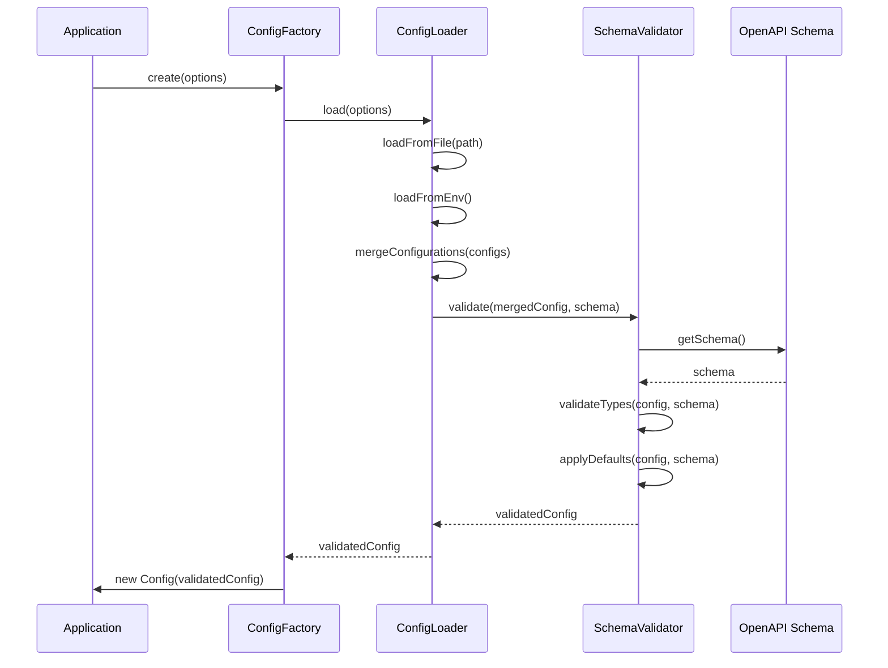

# API Gateway Configuration System Improvements

## Overview

This document summarizes the implementation of a comprehensive, OpenAPI-validated configuration system for the API Gateway project. The new configuration system enhances the gateway's customizability by replacing hardcoded values with configurable settings.


## Key Improvements


1. **OpenAPI Schema-Based Validation**: Added a schema to validate configuration and provide type safety
2. **Multiple Configuration Sources**: Support for JSON files and environment variables
3. **Configuration Hierarchy**: Default values defined in schema, overridable by config file and environment variables
4. **Flexible Header Customization**: Configurable API key, version, and CORS headers
5. **Environment-Specific Settings**: Production vs. development mode configurations
6. **Documentation**: Comprehensive documentation of all configuration options

## Implementation Details

### Configuration System Architecture


### Configuration Components



1. **SchemaValidator**: Validates configuration against OpenAPI schema
   - Type checking and validation
   - Default value application
   - Detailed error reporting

2. **ConfigLoader**: Loads configuration from multiple sources
   - JSON file loading with error handling
   - Environment variable loading with automatic type conversion
   - Merging of configuration from different sources

3. **ConfigFactory**: Factory for creating Config instances
   - Creates centralized configuration instances
   - Provides default configuration when needed
   - Supports environment-specific behavior

### Modified Components


The following components were updated to use the configuration system:

1. **Auth Middleware**: Uses configurable API key header name
   - Replaced hardcoded "X-API-Key" with config.get('security.apiKeyHeader')
   - Ensures backward compatibility with default value

2. **CORS Middleware**: Uses configurable CORS settings
   - Configurable allowOrigin, allowMethods, and allowHeaders
   - Configurable maxAge for preflight responses

3. **Response Middleware**: Uses configurable headers
   - Security headers from configuration
   - CORS headers from configuration

4. **Router**: Uses configurable version format
   - Format for API version in URL path
   - Version header configuration

5. **Logger**: Uses configurable logging settings
   - Log level configuration
   - Request ID header configuration
   - Stack trace inclusion control

6. **Index.js**: Uses configurable timeout and headers
   - API key header from configuration
   - Request timeout from configuration

### Configuration Schema Updates


Added OpenAPI schema with the following sections:

1. **Core Configuration**:
   - Encryption settings
   - HMAC security settings
   - Key format settings

2. **Logging Configuration**:
   - Log levels
   - Stack trace inclusion
   - Request ID header

3. **Security Configuration**:
   - API key header
   - CORS settings
   - Security headers

4. **API Configuration**:
   - API versioning settings
   - Version format and headers

5. **Proxy Configuration**:
   - Timeout settings
   - Retry mechanism
   - Circuit breaker

### Environment Variable Mapping

```mermaid
flowchart TD
    subgraph "Environment Variables"
        ENV1["CONFIG_LOGGING_LEVEL=debug"]
        ENV2["CONFIG_SECURITY_CORS_ALLOW_ORIGIN=*"]
        ENV3["CONFIG_PROXY_TIMEOUT=30000"]
    end
    
    subgraph "Internal Configuration Object"
        CONFIG["
        {
          logging: {
            level: 'debug'
          },
          security: {
            cors: {
              allowOrigin: '*'
            }
          },
          proxy: {
            timeout: 30000
          }
        }
        "]
    end
    
    ENV1 -->|Parse Key| KEY1["logging.level"]
    ENV2 -->|Parse Key| KEY2["security.cors.allowOrigin"]
    ENV3 -->|Parse Key| KEY3["proxy.timeout"]
    
    KEY1 -->|Set Value| CONFIG
    KEY2 -->|Set Value| CONFIG
    KEY3 -->|Set Value| CONFIG
    
    style "Environment Variables" fill:#f9f,stroke:#333,stroke-width:2px
    style "Internal Configuration Object" fill:#bbf,stroke:#333,stroke-width:2px
```

## Documentation Updates

```mermaid
graph TD
    subgraph "Documentation Artifacts"
        ConfigMD[CONFIGURATION.md]
        ReadmeMD[README.md]
        ExampleJSON[config.example.json]
    end
    
    ConfigMD -->|Contains| ConfigTable[Configuration Tables]
    ConfigMD -->|Contains| EnvMapping[Env Variable Mapping]
    ConfigMD -->|Contains| BestPractices[Production Best Practices]
    
    ReadmeMD -->|Contains| Summary[Configuration Summary]
    ReadmeMD -->|Contains| DocLink[Link to Detailed Docs]
    ReadmeMD -->|Contains| Structure[Updated Project Structure]
    
    ExampleJSON -->|Contains| Examples[Example Configuration]
    ExampleJSON -->|Contains| Comments[Commented Options]
    
    style "Documentation Artifacts" fill:#f9f,stroke:#333,stroke-width:2px
    style ConfigMD fill:#bbf,stroke:#333,stroke-width:1px
    style ReadmeMD fill:#bbf,stroke:#333,stroke-width:1px
    style ExampleJSON fill:#bbf,stroke:#333,stroke-width:1px
```

1. Created detailed configuration documentation:
   - `docs/CONFIGURATION.md` with comprehensive options
   - Configuration tables with defaults and environment variable mappings
   - Production best practices

2. Updated README.md with:
   - Summary of configuration capabilities
   - Link to detailed configuration docs
   - Updated project structure

3. Created example configuration file:
   - `config.example.json` with all available options

## Testing

```mermaid
graph TB
    subgraph "Test Coverage"
        Loader[ConfigLoader Tests]
        Validator[SchemaValidator Tests]
        Integration[Middleware Integration Tests]
    end
    
    Loader -->|Tests| LoadFile[File Loading]
    Loader -->|Tests| LoadEnv[Environment Variables]
    Loader -->|Tests| Merge[Configuration Merging]
    
    Validator -->|Tests| Validation[Schema Validation]
    Validator -->|Tests| Defaults[Default Application]
    Validator -->|Tests| Errors[Error Reporting]
    
    Integration -->|Tests| AuthInt[Auth Middleware]
    Integration -->|Tests| CORSInt[CORS Middleware]
    Integration -->|Tests| RouterInt[Router Configuration]
    
    style "Test Coverage" fill:#f9f,stroke:#333,stroke-width:2px
    style Loader fill:#bbf,stroke:#333,stroke-width:1px
    style Validator fill:#bbf,stroke:#333,stroke-width:1px
    style Integration fill:#bbf,stroke:#333,stroke-width:1px
```

1. Added unit tests for:
   - ConfigLoader component
   - SchemaValidator component
   - Configuration integration with middleware

2. All existing tests pass with the new configuration system.

## Benefits


The new configuration system provides several benefits:

1. **Enhanced Customization**: Users can customize the behavior of the API Gateway without modifying code
2. **Documentation as Code**: Configuration schema serves as both validation and documentation
3. **Type Safety**: Configuration errors are caught early with schema validation
4. **Default Values**: Sensible defaults reduce the need for extensive configuration
5. **Flexibility**: Multiple ways to configure the system (files, environment variables)
6. **Deployment Flexibility**: Easy to configure for different environments