# Test Fixes and Best Practices for ES Modules in Jest

## Overview

This document outlines the fixes applied to the test suite and provides best practices for maintaining tests in the API Gateway project. The primary issues were related to ES Modules and Jest mocking functionality, which required explicit imports of Jest globals.

Additionally, tests for previously missing handlers (RevokeKeyHandler and RotateKeyHandler) have been implemented to complete the test coverage.

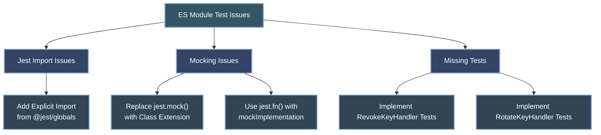

## Test Progress Dashboard

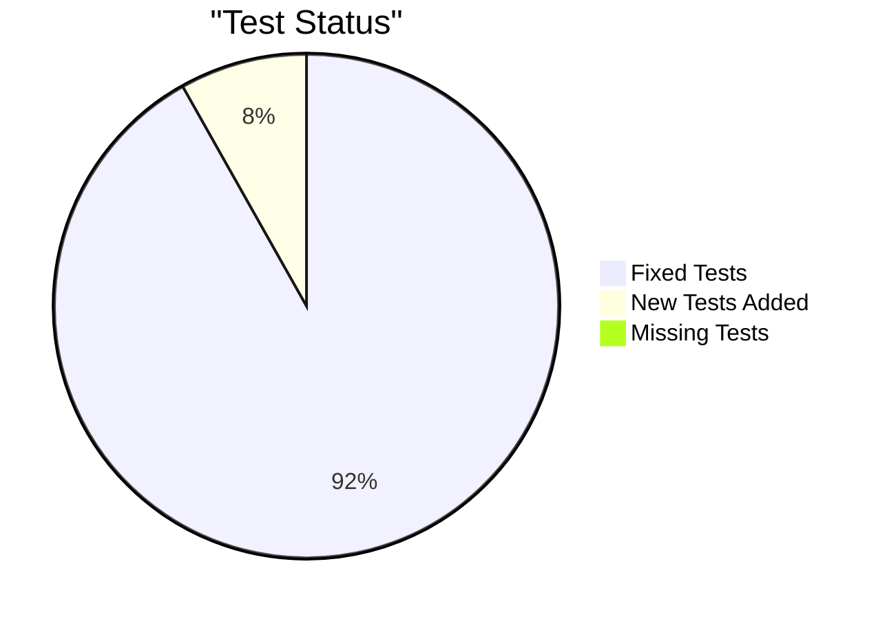

## Issues Fixed

### 1. Missing Jest imports in ES Modules

In ES Modules, Jest globals (jest, describe, it, expect, etc.) need to be explicitly imported from `@jest/globals` since they're not automatically available in the global scope.

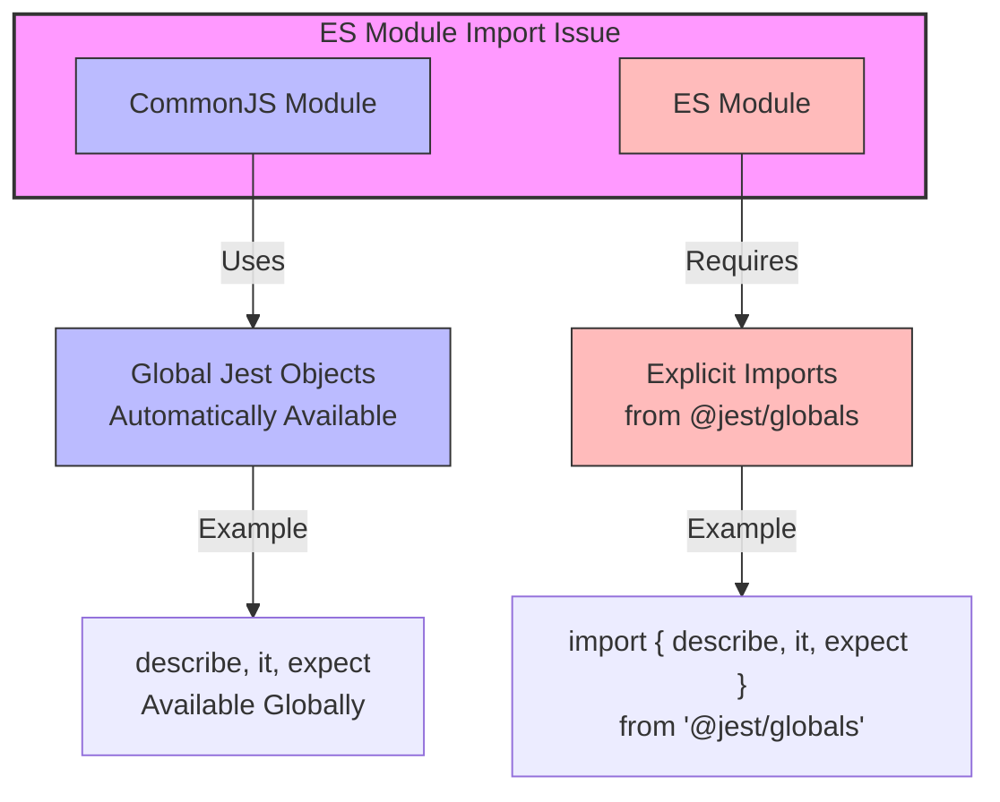

**Problem:**
```javascript
// This would fail in ES Modules
describe('MyTest', () => {
  it('should do something', () => {
    expect(true).toBe(true);
  });
});
```

**Solution:**
```javascript
// Add explicit imports
import { jest, describe, it, expect, beforeEach } from '@jest/globals';

describe('MyTest', () => {
  it('should do something', () => {
    expect(true).toBe(true);
  });
});
```

### 2. Mock implementation issues

The project's mocks used regular functions instead of proper Jest mock functions. These were updated to use `jest.fn()` with appropriate implementations.

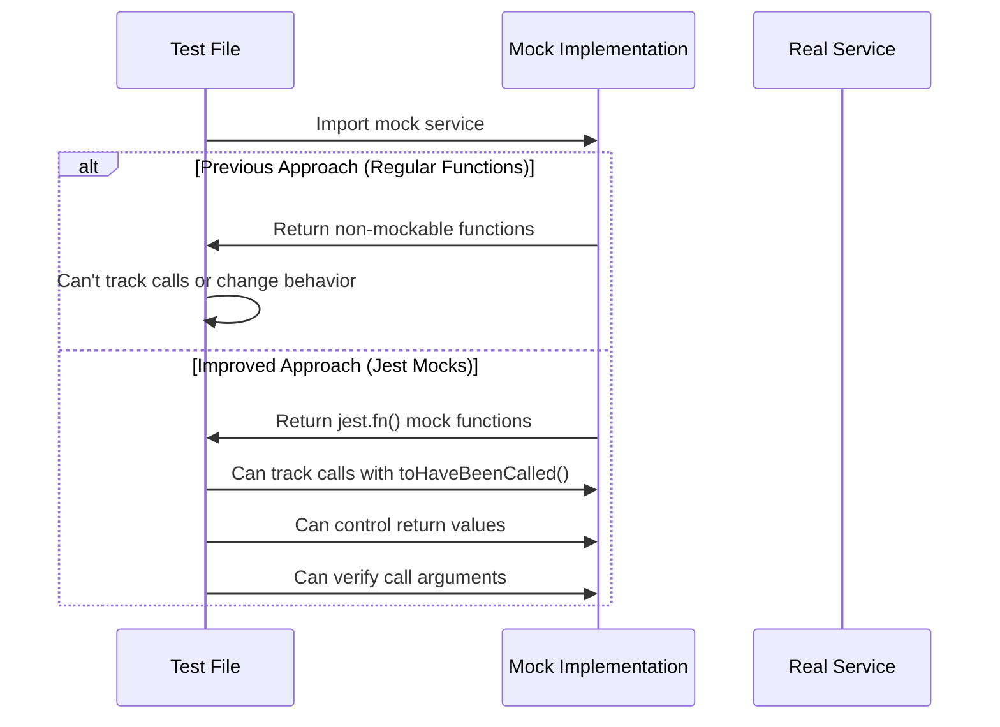

**Problem:**
```javascript
function createMockService() {
  return {
    doSomething: () => {
      return { result: 'success' };
    }
  };
}
```

**Solution:**
```javascript
function createMockService() {
  return {
    doSomething: jest.fn().mockImplementation(() => {
      return { result: 'success' };
    })
  };
}
```

### 3. Missing Jest in utility/mock files

Key mock files like `http.js`, `storage.js`, and `services.js` were missing Jest imports, leading to runtime errors.

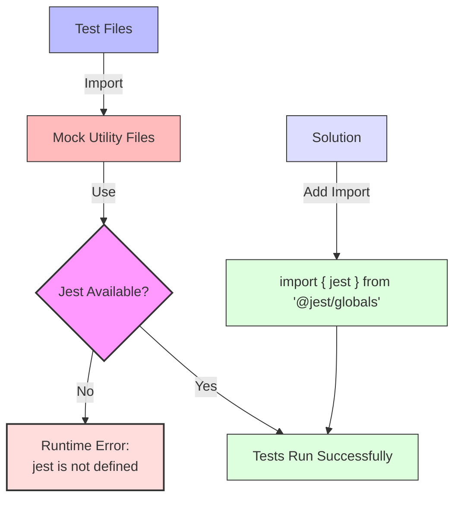

**Problem:**
```javascript
// In test/utils/mocks/http.js
export function createMockRequest() {
  // ...
  request.json = jest.fn().mockResolvedValue(body); // Jest not imported
  // ...
}
```

**Solution:**
```javascript
// In test/utils/mocks/http.js
import { jest } from '@jest/globals';

export function createMockRequest() {
  // ...
  request.json = jest.fn().mockResolvedValue(body); // Jest properly imported
  // ...
}
```

## Test Suite Structure

The test suite is organized to mirror the source code structure, with additional tests now added for previously missing components:

```mermaid
flowchart TB
    A["test/"] --> B["api/"]
    A --> C["core/"]
    A --> D["infrastructure/"]
    A --> E["utils/"]
    
    C --> C1["command/"]
    C --> C2["keys/"]
    C2 --> C2a["commands/"]
    C2 --> C2b["handlers/"]
    
    C2a --> C2a1["CreateKeyCommand.test.js"]
    C2a --> C2a2["GetKeyCommand.test.js"]
    C2a --> C2a3["ListKeysCommand.test.js"]
    C2a --> C2a4["ValidateKeyCommand.test.js"]
    C2a --> C2a5["RevokeKeyCommand.test.js <br><i>(Added)</i>"]
    C2a --> C2a6["RotateKeyCommand.test.js <br><i>(Added)</i>"]
    
    C2b --> C2b1["CreateKeyHandler.test.js"]
    C2b --> C2b2["GetKeyHandler.test.js"]
    C2b --> C2b3["ListKeysHandler.test.js"]
    C2b --> C2b4["ValidateKeyHandler.test.js"]
    C2b --> C2b5["RevokeKeyHandler.test.js <br><i>(Added)</i>"]
    C2b --> C2b6["RotateKeyHandler.test.js <br><i>(Added)</i>"]
    
    style A fill:#335566,stroke:#88aacc,stroke-width:2px,color:#ffffff
    style B fill:#334466,stroke:#88aacc,stroke-width:2px,color:#ffffff
    style C fill:#334466,stroke:#88aacc,stroke-width:2px,color:#ffffff
    style D fill:#334466,stroke:#88aacc,stroke-width:2px,color:#ffffff
    style E fill:#334466,stroke:#88aacc,stroke-width:2px,color:#ffffff
    style C1 fill:#334455,stroke:#88aacc,stroke-width:2px,color:#ffffff
    style C2 fill:#334455,stroke:#88aacc,stroke-width:2px,color:#ffffff
    style C2a fill:#333366,stroke:#88aacc,stroke-width:2px,color:#ffffff
    style C2b fill:#333366,stroke:#88aacc,stroke-width:2px,color:#ffffff
    style C2a5 fill:#553333,stroke:#cc8888,stroke-width:2px,color:#ffffff
    style C2a6 fill:#553333,stroke:#cc8888,stroke-width:2px,color:#ffffff
    style C2b5 fill:#553333,stroke:#cc8888,stroke-width:2px,color:#ffffff
    style C2b6 fill:#553333,stroke:#cc8888,stroke-width:2px,color:#ffffff
```

## Files Modified and Added

```mermaid
graph TD
    subgraph "Files Modified"
        M1["/test/utils/mocks/http.js"]
        M2["/test/utils/mocks/services.js"]
        M3["/test/utils/mocks/storage.js"]
        M4["/test/utils/index.js"]
        M5["/test/core/keys/handlers/ValidateKeyHandler.test.js"]
        M6["/test/core/keys/commands/CreateKeyCommand.test.js"]
        M7["/test/core/keys/handlers/GetKeyHandler.test.js"]
        M8["/test/mocks/src/auth/auditLogger.js"]
    end
    
    subgraph "Files Added"
        A1["/test/core/keys/commands/RevokeKeyCommand.test.js"]
        A2["/test/core/keys/commands/RotateKeyCommand.test.js"]
        A3["/test/core/keys/handlers/RevokeKeyHandler.test.js"]
        A4["/test/core/keys/handlers/RotateKeyHandler.test.js"]
    end
    
    M1 -->|Added| M1a["Jest Import"]
    M2 -->|Added| M2a["Jest Import"]
    M2 -->|Improved| M2b["Mock Implementations"]
    M3 -->|Added| M3a["Jest Import"]
    M4 -->|Added| M4a["Jest Import"]
    M5 -->|Added| M5a["Jest Import"]
    M6 -->|Added| M6a["Jest Import"]
    M7 -->|Added| M7a["Jest Import"]
    M8 -->|Added| M8a["Jest Import"]
    
    A1 -->|New Tests| A1a["RevokeKeyCommand Tests"]
    A2 -->|New Tests| A2a["RotateKeyCommand Tests"]
    A3 -->|New Tests| A3a["RevokeKeyHandler Tests"]
    A4 -->|New Tests| A4a["RotateKeyHandler Tests"]
    
    style "Files Modified" fill:#f9f,stroke:#333,stroke-width:2px
    style "Files Added" fill:#bbf,stroke:#333,stroke-width:2px
```

1. Modified files:
   - `/test/utils/mocks/http.js` - Added Jest import and ensured proper mock setup
   - `/test/utils/mocks/services.js` - Added Jest import and updated mock implementations
   - `/test/utils/mocks/storage.js` - Added Jest import for storage mock functions
   - `/test/utils/index.js` - Added Jest import for utility functions
   - `/test/core/keys/handlers/ValidateKeyHandler.test.js` - Added Jest imports
   - `/test/core/keys/commands/CreateKeyCommand.test.js` - Added Jest imports
   - `/test/core/keys/handlers/GetKeyHandler.test.js` - Added Jest imports
   - `/test/mocks/src/auth/auditLogger.js` - Added Jest import for audit log mocks

2. Added files:
   - `/test/core/keys/commands/RevokeKeyCommand.test.js` - New tests for RevokeKeyCommand
   - `/test/core/keys/commands/RotateKeyCommand.test.js` - New tests for RotateKeyCommand
   - `/test/core/keys/handlers/RevokeKeyHandler.test.js` - New tests for RevokeKeyHandler
   - `/test/core/keys/handlers/RotateKeyHandler.test.js` - New tests for RotateKeyHandler

## Key Lessons Learned

### 1. Module Path Resolution Challenges

When using `jest.mock()` in ES Modules, we encountered path resolution issues where Jest attempted to resolve paths from `jest-setup-fix.js` instead of the test file itself.

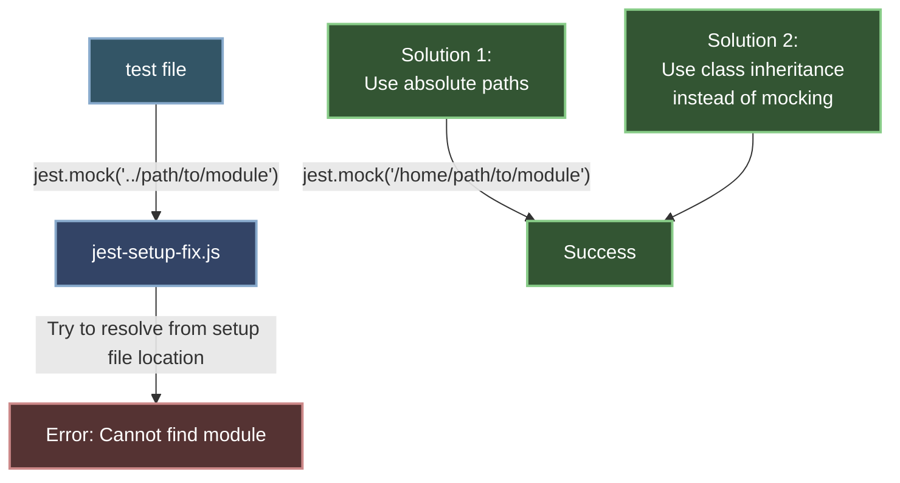

**Problem Example:**
```javascript
// In test/core/keys/commands/RotateKeyCommand.test.js
jest.mock('../../../../src/utils/validation.js', () => ({
  // Mock implementation
}));
// Error: Cannot find module '../../../../src/utils/validation.js' from 'test/jest-setup-fix.js'
```

### 2. Alternative to jest.mock()

For complex mocking cases, extending the original class and overriding methods proved more reliable than using `jest.mock()`.

```mermaid
graph TD
    subgraph "Traditional Mocking"
        T1[jest.mock] -->|Replace Module| T2[Mock Implementation]
        T2 -->|Issues With| T3[ES Module Path Resolution]
        T3 -->|Results In| T4[Hard-to-Debug Errors]
    end
    
    subgraph "Alternative Approach"
        A1[Import Real Module] --> A2[Extend Original Class]
        A2 -->|Override Methods| A3[Custom Test Implementation]
        A3 -->|Results In| A4[More Predictable Behavior]
    end
    
    style "Traditional Mocking" fill:#fdd,stroke:#333,stroke-width:2px
    style "Alternative Approach" fill:#dfd,stroke:#333,stroke-width:2px
```

**Solution Example from RotateKeyCommand.test.js:**
```javascript
// Instead of jest.mock, extend the class
class TestRotateKeyCommand extends RotateKeyCommand {
  validate() {
    // Custom implementation for testing
    const errors = {};
    
    // Validation logic...
    if (!this.keyId) {
      errors.keyId = "Key ID is required";
    } else if (!/^[0-9a-f]{8}-[0-9a-f]{4}-[0-9a-f]{4}-[0-9a-f]{4}-[0-9a-f]{12}$/i.test(this.keyId)) {
      errors.keyId = "Invalid key ID format";
    }
    
    // Return validation result
    return { 
      isValid: Object.keys(errors).length === 0, 
      errors 
    };
  }
}

// Then use TestRotateKeyCommand in tests instead of mocking
const command = new TestRotateKeyCommand({ keyId: 'test-key-id' });
const result = command.validate();
```

## Best Practices for Tests in ES Modules

### Jest Import Pattern

```mermaid
graph LR
    subgraph "Required Imports"
        I1["jest"] 
        I2["describe"]
        I3["it / test"]
        I4["expect"]
        I5["beforeEach / afterEach"]
        I6["beforeAll / afterAll"]
    end
    
    I1 --> Import["import { jest, describe, it, expect, beforeEach, afterEach } from '@jest/globals';"]
    I2 --> Import
    I3 --> Import
    I4 --> Import
    I5 --> Import
    I6 --> Import
    
    style "Required Imports" fill:#f9f,stroke:#333,stroke-width:2px
    style Import fill:#dfd,stroke:#333,stroke-width:1px
```

### 1. Always import Jest globals

```javascript
import { jest, describe, it, expect, beforeEach, afterEach } from '@jest/globals';
```

### 2. Create proper mock functions

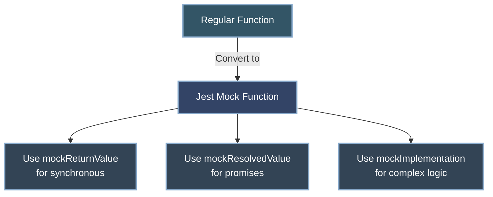

**Example:**
```javascript
// ❌ Bad: Using regular functions
function createMockService() {
  return {
    getKey: async (id) => { return { id, name: 'Test' }; }
  };
}

// ✅ Good: Using jest.fn() with mockImplementation/mockResolvedValue
function createMockService() {
  return {
    // For simple resolved values
    getKey: jest.fn().mockResolvedValue({ id: 'test-id', name: 'Test' }),
    
    // For complex implementations
    createKey: jest.fn().mockImplementation(async (params) => {
      if (!params.name) throw new Error('Name required');
      return { id: 'new-id', name: params.name };
    })
  };
}
```

### 3. Properly initialize and reset mocks

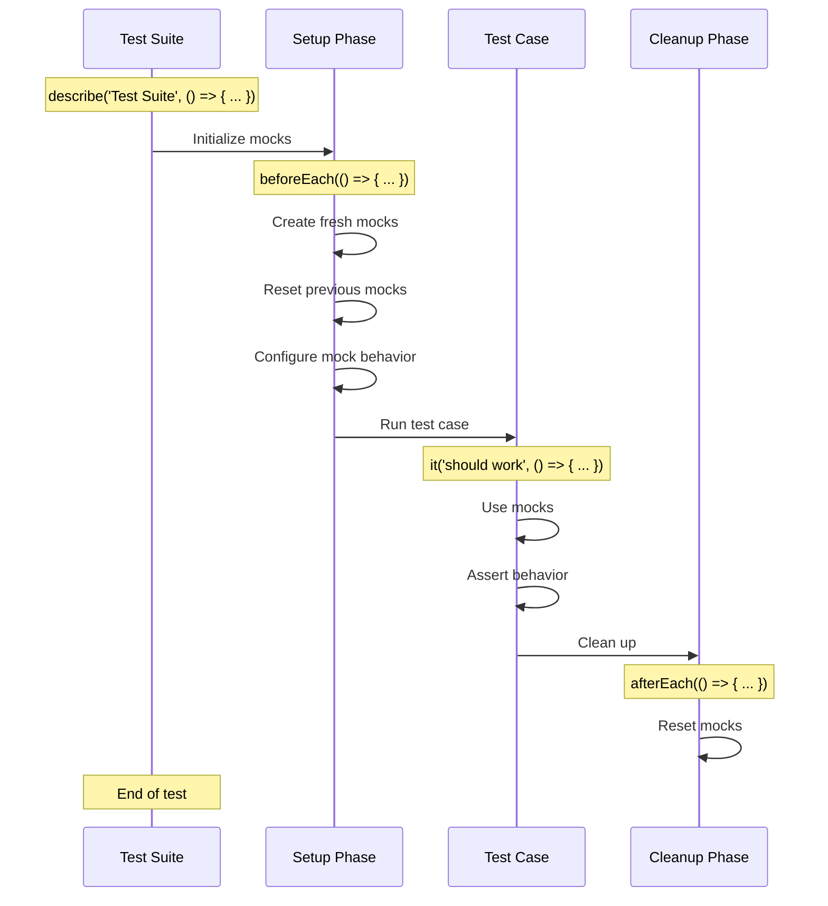

```javascript
describe('MyTest', () => {
  let mockService;
  
  beforeEach(() => {
    // Initialize mock
    mockService = createMockService();
    
    // Reset all mocks
    jest.clearAllMocks();
  });
  
  it('should do something', () => {
    // Test with fresh mock
    mockService.doSomething();
    expect(mockService.doSomething).toHaveBeenCalled();
  });
});
```

### 4. Best practice for mock services

```mermaid
graph TD
    subgraph "Mock Service Factory"
        Factory["createMockKeyService()"]
    end
    
    Factory --> Simple["Simple Resolved Values<br>mockResolvedValue()"]
    Factory --> Conditional["Conditional Responses<br>mockImplementation()"]
    Factory --> Error["Error Cases<br>mockRejectedValue()"]
    
    Simple -->|For| Simple1["getKey() - Simple Read"]
    Simple -->|For| Simple2["listKeys() - Data Lists"]
    
    Conditional -->|For| Cond1["validateKey() - Input-Dependent"]
    Conditional -->|For| Cond2["createKey() - Parameter Processing"]
    
    Error -->|For| Err1["Error Conditions"]
    Error -->|For| Err2["Network Failures"]
    
    style "Mock Service Factory" fill:#f9f,stroke:#333,stroke-width:2px
    style Factory fill:#bbf,stroke:#333,stroke-width:1px
    style Simple fill:#dfd,stroke:#333,stroke-width:1px
    style Conditional fill:#ddf,stroke:#333,stroke-width:1px
    style Error fill:#fdd,stroke:#333,stroke-width:1px
```

```javascript
function createMockKeyService() {
  return {
    // Success case with different inputs
    createKey: jest.fn().mockImplementation(async (params) => {
      return {
        id: 'new-key-id',
        name: params.name || 'Default Key',
        owner: params.owner || 'test-owner',
        scopes: params.scopes || ['default:scope'],
        status: 'active',
        createdAt: Date.now(),
        expiresAt: params.expiresAt || 0
      };
    }),
    
    // Conditional responses based on input
    getKey: jest.fn().mockImplementation(async (id) => {
      if (id === 'not-found') return null;
      if (id === 'error') throw new Error('Test error');
      
      return {
        id: id,
        name: 'Test Key',
        status: 'active'
      };
    }),
    
    // Simple resolved values
    validateKey: jest.fn().mockResolvedValue({
      valid: true,
      keyId: 'test-key-id',
      scopes: ['read:data']
    })
  };
}
```

### 5. Testing asynchronous code

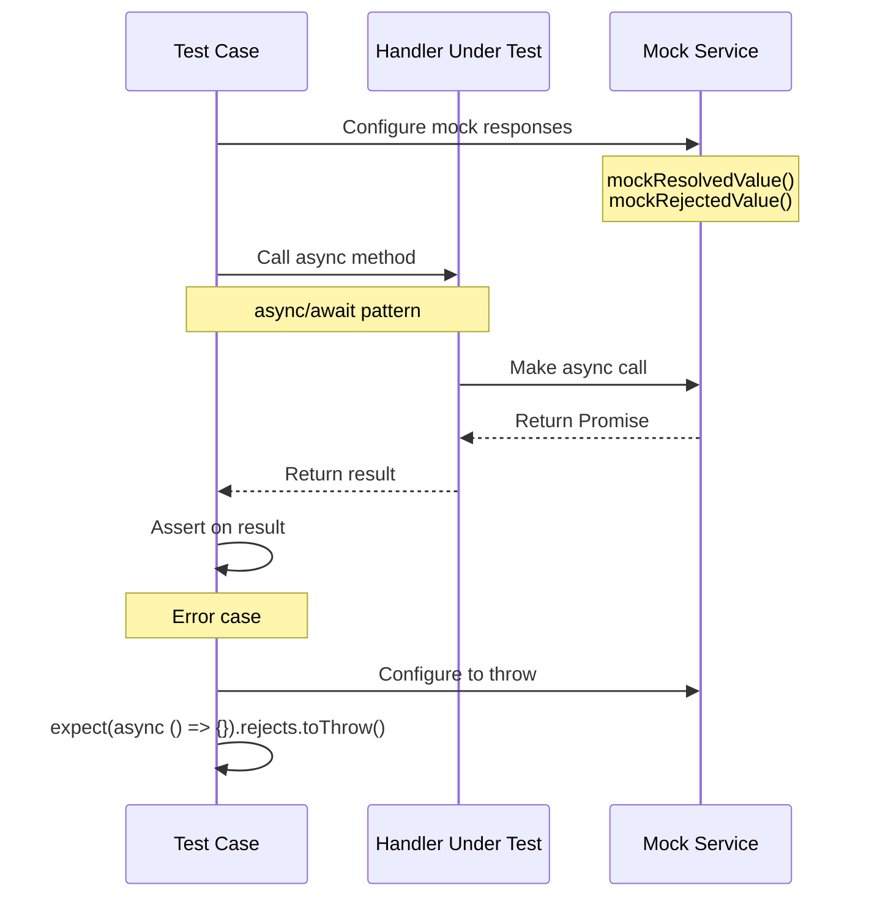

Use async/await for clarity and readability:

```javascript
it('should handle async operations', async () => {
  // Arrange
  const command = new CreateKeyCommand({ name: 'Test Key' });
  keyService.createKey.mockResolvedValue({ id: 'new-id', name: 'Test Key' });
  
  // Act
  const result = await handler.handle(command);
  
  // Assert
  expect(result.id).toBe('new-id');
  expect(keyService.createKey).toHaveBeenCalledWith(expect.objectContaining({
    name: 'Test Key'
  }));
});
```

For testing rejected promises:

```javascript
it('should handle errors', async () => {
  // Arrange
  const command = new CreateKeyCommand({ name: 'Test Key' });
  keyService.createKey.mockRejectedValue(new Error('Test error'));
  
  // Act & Assert
  await expect(handler.handle(command)).rejects.toThrow('Test error');
});
```

## Testing Command Handlers

The new RevokeKeyHandler and RotateKeyHandler tests follow this pattern:

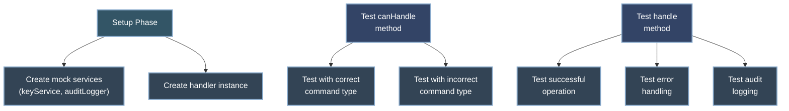

### Command Handler Test Pattern

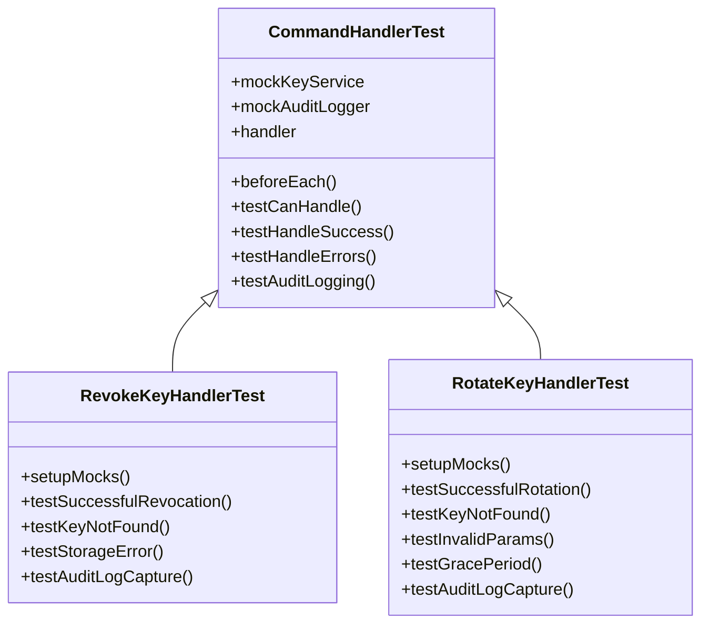

**Example from RevokeKeyHandler.test.js:**

```javascript
describe('RevokeKeyHandler', () => {
  let handler;
  let keyService;
  let auditLogger;
  
  beforeEach(() => {
    // Setup phase - Create mocks and handler
    keyService = createMockKeyService();
    auditLogger = createMockAuditLogger();
    handler = new RevokeKeyHandler(keyService, auditLogger);
    
    // Configure specific mock behavior for this handler
    keyService.revokeKey.mockImplementation((keyId, reason, revokedBy) => {
      if (keyId === 'not-found-key') {
        return Promise.resolve({
          success: false,
          error: 'API key not found'
        });
      }
      // Other mock implementations...
    });
  });
  
  describe('canHandle', () => {
    // Test canHandle functionality
    it('should return true for RevokeKeyCommand', () => {
      const command = new RevokeKeyCommand({ keyId: 'test-key-id' });
      expect(handler.handle(command)).toBe(true);
    });
    // Other canHandle tests...
  });
  
  describe('handle', () => {
    // Test successful operation
    it('should revoke the key using the key service', async () => {
      const command = new RevokeKeyCommand({
        keyId: 'test-key-id',
        reason: 'Security breach',
        revokedBy: 'admin-id'
      });
      
      const result = await handler.handle(command);
      
      expect(keyService.revokeKey).toHaveBeenCalledWith(
        'test-key-id',
        'Security breach',
        'admin-id'
      );
      
      expect(result.success).toBe(true);
    });
    
    // Test error handling
    it('should throw NotFoundError if key does not exist', async () => {
      const command = new RevokeKeyCommand({ 
        keyId: 'not-found-key',
        revokedBy: 'admin-id'
      });
      
      await expect(handler.handle(command)).rejects.toThrow(NotFoundError);
    });
    
    // Test audit logging
    it('should log the action if revokedBy is provided', async () => {
      const command = new RevokeKeyCommand({ 
        keyId: 'test-key-id',
        reason: 'Security breach',
        revokedBy: 'admin-id'
      });
      
      const context = { 
        env: { KV: {} },
        request: { headers: new Map() }
      };
      
      await handler.handle(command, context);
      
      expect(auditLogger.logAdminAction).toHaveBeenCalledWith(
        'admin-id',
        'revoke_key',
        { 
          keyId: 'test-key-id',
          reason: 'Security breach'
        },
        context.env,
        context.request
      );
    });
  });
});
```

## Ongoing Maintenance

### 1. Update jest-setup-fix.js when needed

```mermaid
graph TD
    subgraph "jest-setup-fix.js"
        A1[Import Jest]
        A2[Fix for messageParent]
        A3[Import Crypto Mock]
        A4[Set Environment]
        A5[Mock Cloudflare Objects]
    end
    
    B[Jest Version Updates] -->|May Require| C[Updates to jest-setup-fix.js]
    D[New Cloudflare APIs] -->|May Require| E[New Mock Implementations]
    
    style "jest-setup-fix.js" fill:#f9f,stroke:#333,stroke-width:2px
    style A1 fill:#bbf,stroke:#333,stroke-width:1px
    style A2 fill:#bbf,stroke:#333,stroke-width:1px
    style A3 fill:#bbf,stroke:#333,stroke-width:1px
    style A4 fill:#bbf,stroke:#333,stroke-width:1px
    style A5 fill:#bbf,stroke:#333,stroke-width:1px
```

This file contains compatibility fixes for Jest in ES Module mode. When updating Jest or encountering new issues, update this file to provide the necessary fixes.

**Current jest-setup-fix.js:**
```javascript
// Import Jest global
import { jest } from '@jest/globals';

// Fix for messageParent error in jest-worker
if (typeof global.process !== 'undefined') {
  const originalMessageParent = global.process.send;
  if (!originalMessageParent) {
    global.process.send = () => {};
  }
}

// Import crypto mock
import './crypto-mock.js';

// We need the Node.js URL object for our mocks
import { URL as NodeURL } from "url";
global.NodeURL = NodeURL;

// Set test environment
process.env.NODE_ENV = "test";

// Define DurableObject for the test environment
global.DurableObject = class DurableObject {
  constructor(state, env) {
    this.state = state;
    this.env = env;
  }
};

// Mock TextEncoder and TextDecoder if needed
if (typeof TextEncoder === "undefined") {
  global.TextEncoder = class TextEncoder {
    encode(text) {
      const buf = Buffer.from(text);
      return new Uint8Array(buf);
    }
  };
}

// Additional mocks...
```

### 2. Keep mock implementations aligned with real services

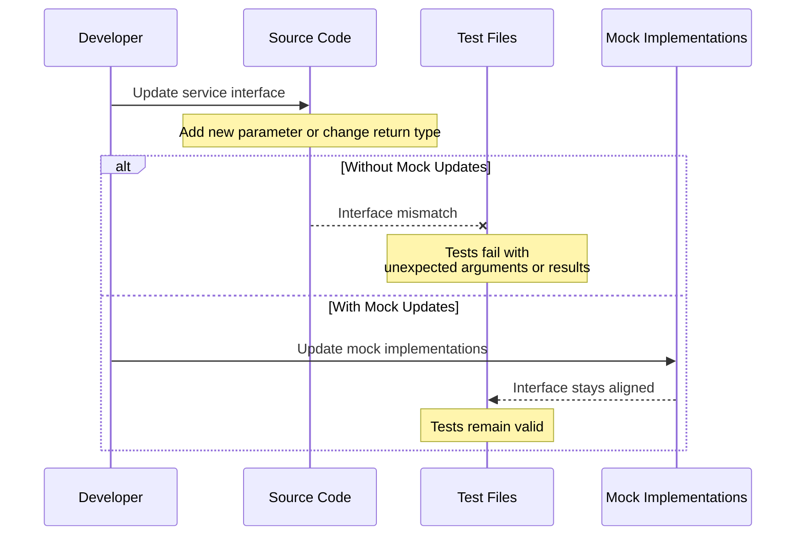

When service interfaces change, make sure to update the mock implementations to match:

```javascript
// Before service interface change
keyService.createKey = jest.fn().mockImplementation(async (name, owner, scopes) => {
  return { id: 'new-id', name, owner, scopes };
});

// After service interface change (added metadata parameter)
keyService.createKey = jest.fn().mockImplementation(async (name, owner, scopes, metadata) => {
  return { id: 'new-id', name, owner, scopes, metadata: metadata || {} };
});
```

### 3. Monitor console warnings

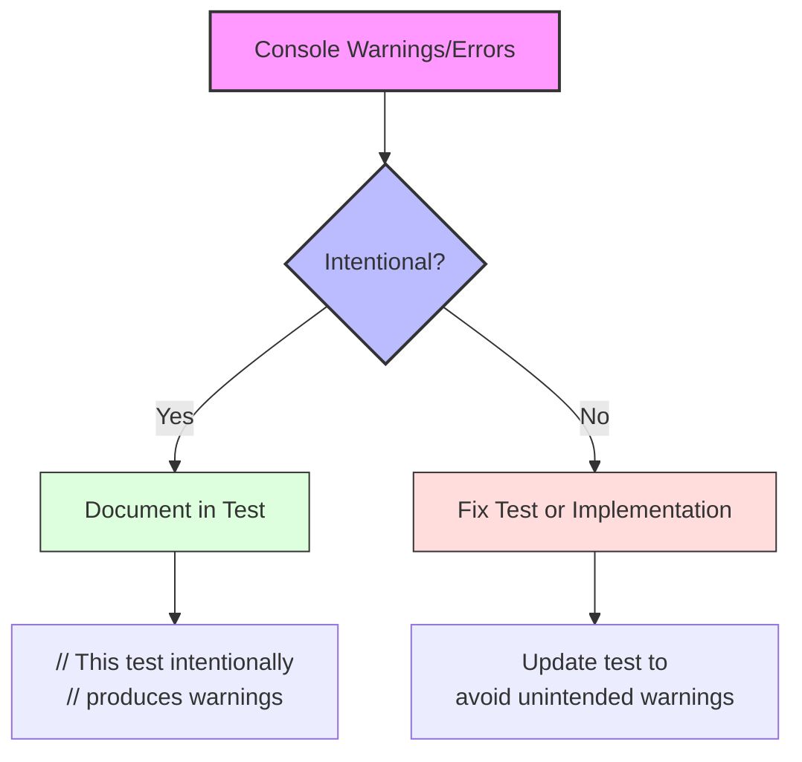

Some tests intentionally produce warnings/errors as part of testing error handling. Document these in the test files to avoid confusion:

```javascript
// This test produces a warning log intentionally to test error handling
it('should handle storage errors gracefully', async () => {
  storage.get.mockRejectedValue(new Error('Storage failure'));
  
  // This will trigger a console.error in the implementation
  // which is expected as part of the test
  await expect(apiKeyManager.getKey('test-id')).rejects.toThrow();
});
```

## Next Steps

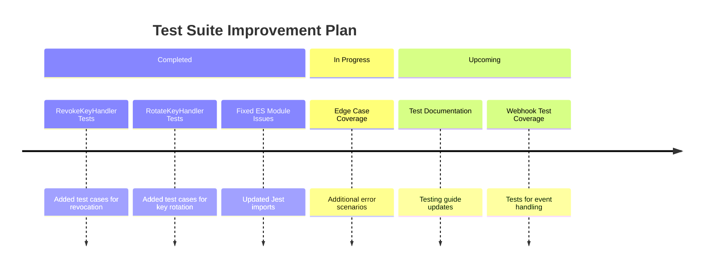

1. ✅ Implement missing tests for RevokeKeyHandler and RotateKeyHandler *(Done)*
2. Continue to enhance test coverage for edge cases and error conditions
3. Update documentation as the API Gateway functionality expands
4. Consider implementing webhooks for key lifecycle events

## Resources

- [Jest Documentation](https://jestjs.io/docs/getting-started)
- [Testing ES Modules](https://jestjs.io/docs/ecmascript-modules)
- [Jest Mock Functions](https://jestjs.io/docs/mock-functions)
- [Testing Asynchronous Code](https://jestjs.io/docs/asynchronous)
- [Jest Configuration](https://jestjs.io/docs/configuration)