# API Gateway Functionality

This API Gateway service, built on Cloudflare Workers, combines comprehensive key management with full-fledged API gateway capabilities. This document provides detailed information about these gateway features, their implementation, and how to use them effectively.

## Overview

The API Gateway functionality includes:

1. **Enhanced Routing**
   - Regular expression-based pattern matching
   - Validation for path parameters
   - API versioning support

2. **Proxy Capabilities**
   - Request forwarding to upstream services
   - Path rewriting and transformation
   - Header manipulation
   - Retry mechanisms with backoff
   - Circuit breaker for fault tolerance

3. **Configuration-Driven Architecture**
   - Centralized configuration for routing and proxying
   - Environment-based configuration overrides
   - Service registration for upstream endpoints

## Architecture

The gateway functionality follows the same clean architecture principles that guide the rest of the codebase:

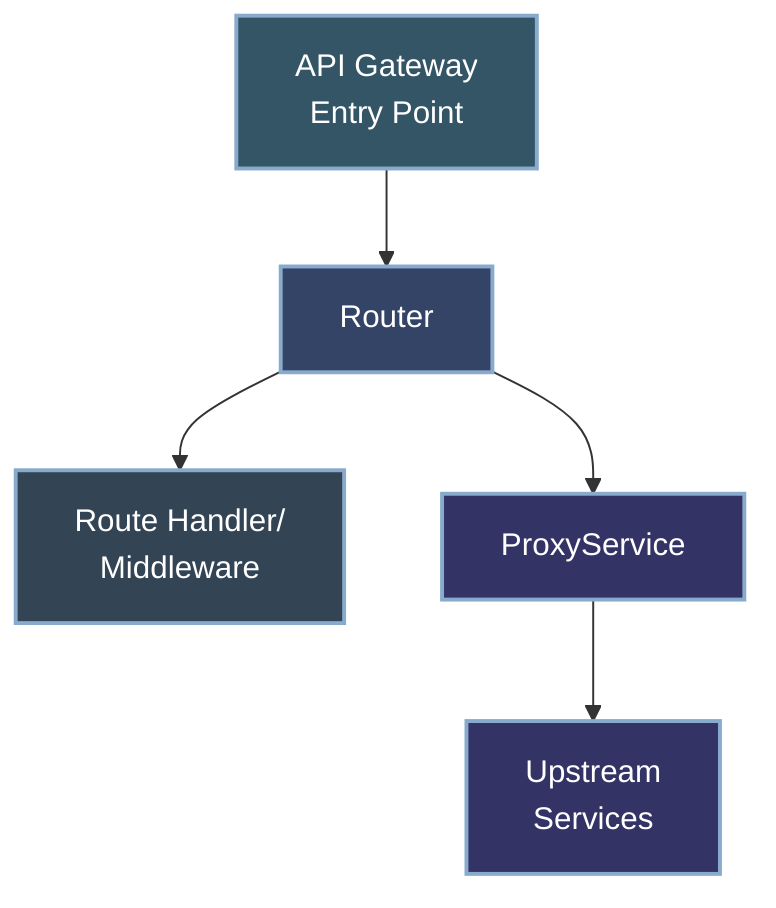

### Key Components

1. **Enhanced Router** (`src/infrastructure/http/Router.js`)
   - Handles HTTP requests with advanced routing capabilities
   - Supports regex patterns, path parameters, and API versioning
   - Forwards proxy requests to the ProxyService

2. **ProxyService** (`src/core/proxy/ProxyService.js`)
   - Handles forwarding requests to upstream services
   - Manages retries, timeouts, and circuit breaking
   - Implements path rewriting and header manipulation

3. **Configuration** (`src/infrastructure/config/Config.js`)
   - Centralized configuration for routing and proxy settings
   - Service definitions and routing patterns
   - Environment-specific overrides

## Enhanced Routing Features

### Regex Pattern Matching

The router now supports three types of route matching with configurable priority:

1. **Exact Path Matching** (highest priority)
   ```javascript
   router.add('GET', '/users', handleGetUsers);
   ```

2. **Path Parameter Matching** (medium priority)
   ```javascript
   router.add('GET', '/users/:id', handleGetUser);
   ```

3. **Regex Pattern Matching** (lowest priority)
   ```javascript
   router.addRegex('GET', /^\/users\/(\d+)\/posts$/, handleUserPosts);
   ```

### Path Parameter Validation

The router supports validated path parameters using patterns defined in the configuration:

```javascript
// Define validation patterns in config
const config = {
  routing: {
    paramValidation: {
      id: "[a-f0-9]{8}-[a-f0-9]{4}-[a-f0-9]{4}-[a-f0-9]{4}-[a-f0-9]{12}", // UUID format
      date: "\\d{4}-\\d{2}-\\d{2}" // YYYY-MM-DD format
    }
  }
}

// Use pattern validation in routes
router.addValidated('GET', '/users/:id', 'id', 'id', handleGetUser);
router.addValidated('GET', '/logs/:date', 'date', 'date', handleGetLogs);
```

This ensures that path parameters match the expected format before the route handler is invoked.

### API Versioning

The router supports API versioning with configuration-driven version management:

```javascript
// Define API version config
const config = {
  routing: {
    versioning: {
      enabled: true,
      current: "1",
      supported: ["1", "2"],
      deprecated: [],
      versionHeader: "X-API-Version"
    }
  }
}

// Create versioned routes
router.addVersioned('GET', '/users', handleGetUsers);
// Generates routes for /v1/users and /v2/users automatically
```

You can also combine versioning with validated parameters:

```javascript
router.addVersionedValidated('GET', '/users/:id', 'id', 'id', handleGetUser);
// Generates routes for /v1/users/:id and /v2/users/:id with UUID validation
```

## Proxy Functionality

The proxy functionality allows the gateway to forward requests to upstream services.

### Configuration

Proxy configuration is centralized in the `Config` class:

```javascript
const config = {
  proxy: {
    // Master switch for proxy functionality
    enabled: true,
    // Default timeout for proxied requests (ms)
    timeout: 30000,
    // Default headers to add to proxied requests
    headers: {
      "X-Forwarded-By": "key-manager-gateway"
    },
    // Circuit breaker configuration
    circuitBreaker: {
      enabled: true,
      failureThreshold: 5,
      resetTimeout: 30000
    },
    // Retry configuration
    retry: {
      enabled: true,
      maxAttempts: 3,
      backoff: 1000 // Initial backoff in ms (doubles with each retry)
    },
    // Upstream services configuration
    services: {
      // No services defined by default
    }
  }
};
```

### Service Registration

Upstream services must be registered in the configuration before they can be used:

```javascript
config.registerProxyService('userService', {
  target: 'https://api.example.com/users',
  pathRewrite: { '^/api/users': '' },
  headers: { 'X-Service-Key': 'abc123' },
  timeout: 5000 // Service-specific timeout
});
```

### Adding Proxy Routes

Once a service is registered, you can create proxy routes:

```javascript
router.addProxy('/api/users/*', 'userService', {
  stripPrefix: '/api/users' // Optional prefix to remove
});
```

This creates routes for all HTTP methods (GET, POST, PUT, DELETE, etc.) and forwards matching requests to the specified service.

### Proxy Request Flow

### Basic Flow Diagram

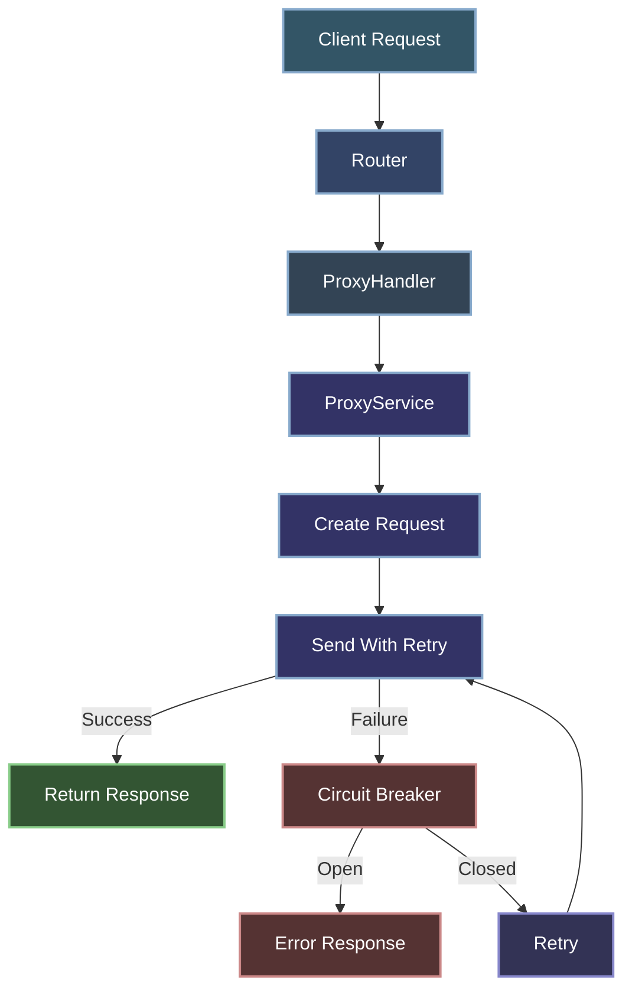

### Detailed Sequence Diagram

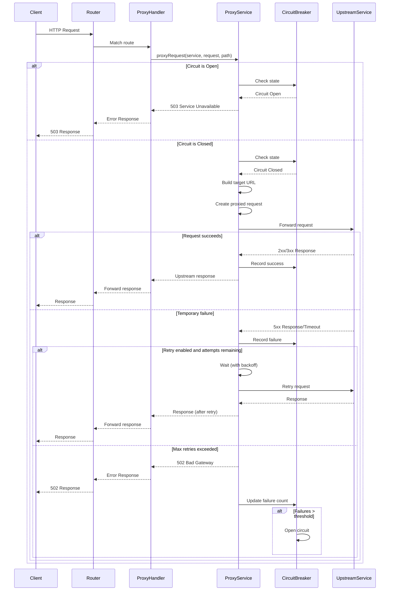

### Circuit Breaker State Machine

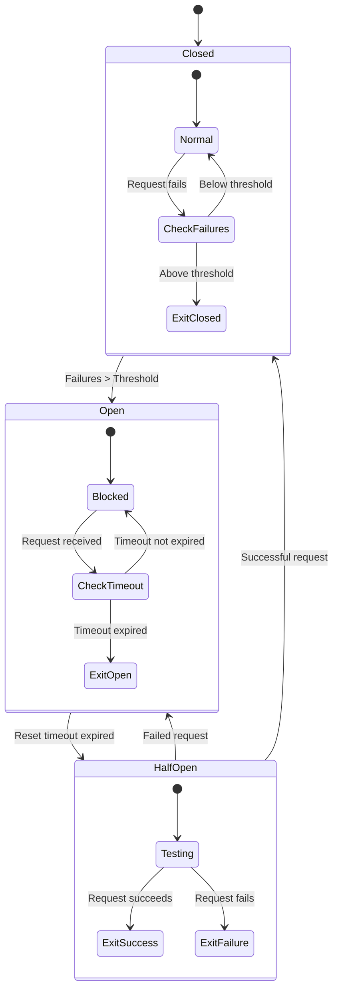

1. Client sends a request to the gateway
2. Router matches the request to a proxy route
3. ProxyHandler extracts the service name and path information
4. ProxyService creates a new request for the upstream service
5. Request is sent with retry logic if configured
6. Circuit breaker monitors for failures
7. Response from upstream service is returned to the client

### Path Rewriting

The proxy supports path rewriting to transform request paths before forwarding:

1. **Service-Level Rewriting**: Defined when registering a service
   ```javascript
   config.registerProxyService('userService', {
     target: 'https://api.example.com',
     pathRewrite: { '^/api/users': '/v2/users' }
   });
   ```

2. **Route-Level Prefix Stripping**: Defined when creating a proxy route
   ```javascript
   router.addProxy('/api/users/*', 'userService', {
     stripPrefix: '/api/users'
   });
   ```

### Header Manipulation

Headers can be added at multiple levels:

1. **Global Headers**: Applied to all proxy requests
   ```javascript
   config.proxy.headers = {
     'X-Forwarded-By': 'key-manager-gateway'
   };
   ```

2. **Service-Specific Headers**: Applied to requests for a specific service
   ```javascript
   config.registerProxyService('userService', {
     headers: { 'X-Service-Key': 'abc123' }
   });
   ```

3. **Route-Specific Headers**: Applied to requests for a specific route
   ```javascript
   router.addProxy('/api/users/*', 'userService', {
     headers: { 'X-Route-Specific': 'value' }
   });
   ```

### Fault Tolerance

The proxy implementation includes several fault tolerance mechanisms:

1. **Retry Logic**
   - Configurable number of retry attempts
   - Exponential backoff with configurable initial delay
   - Success response short-circuits retry loop

2. **Circuit Breaker**
   - Tracks failure counts per service
   - Opens circuit after threshold is reached
   - Automatically resets after timeout period
   - Half-open state to test recovery

3. **Timeouts**
   - Global default timeout
   - Service-specific timeout overrides
   - Request cancellation via AbortController

## Implementation Details

### Router Implementation

The enhanced router now prioritizes routes based on configuration:

```javascript
findRoute(method, path) {
  // Routes are checked in order of priority
  // 1. Exact path match (highest priority)
  // 2. Parameter path match (medium priority)
  // 3. Regex path match (lowest priority)
  
  // Start with exact path matches
  for (const route of this.routes) {
    if (route.method !== method) continue;
    if (!route.isRegex && route.path === path) {
      return { ...route, params: {} };
    }
  }
  
  // Then check parameter paths
  // ...
  
  // Finally check regex paths
  // ...
}
```

### ProxyService Implementation

The ProxyService handles the complexities of forwarding requests:

```javascript
async proxyRequest(serviceName, request, path) {
  // Check if proxy is enabled
  if (!this.proxyConfig.enabled) {
    return new Response(
      JSON.stringify({ error: 'Proxy functionality is disabled' }),
      { status: 501, headers: { 'Content-Type': 'application/json' }}
    );
  }
  
  // Get service configuration
  const serviceConfig = this.proxyConfig.services?.[serviceName];
  if (!serviceConfig) {
    return new Response(
      JSON.stringify({ error: `Unknown proxy service: ${serviceName}` }),
      { status: 502, headers: { 'Content-Type': 'application/json' }}
    );
  }
  
  // Check circuit breaker
  if (this.isCircuitOpen(serviceName)) {
    return new Response(
      JSON.stringify({ error: 'Service temporarily unavailable' }),
      { status: 503, headers: { 'Content-Type': 'application/json' }}
    );
  }
  
  // Create the proxied request
  const proxiedRequest = await this.createProxiedRequest(
    this.buildTargetUrl(serviceConfig, path || requestUrl.pathname, requestUrl.search),
    request,
    serviceConfig
  );
  
  // Send the request with retry logic
  return this.sendWithRetry(serviceName, proxiedRequest);
}
```

## Configuration Reference

### Routing Configuration

```javascript
routing: {
  // API versioning configuration
  versioning: {
    enabled: true,          // Enable/disable versioning
    current: "1",           // Current API version
    supported: ["1"],       // All supported versions
    deprecated: [],         // Deprecated versions
    versionHeader: "X-API-Version"  // Response header
  },
  // Path parameter validation patterns
  paramValidation: {
    id: "[a-f0-9]{8}-[a-f0-9]{4}-[a-f0-9]{4}-[a-f0-9]{4}-[a-f0-9]{12}", // UUID format
    date: "\\d{4}-\\d{2}-\\d{2}", // YYYY-MM-DD format
    status: "(active|revoked|expired)" // Valid status values
  },
  // Route priority (lower number = higher priority)
  priority: {
    exact: 1,
    parameter: 2,
    regex: 3
  }
}
```

### Proxy Configuration

```javascript
proxy: {
  // Master switch for proxy functionality
  enabled: false,
  // Default timeout for proxied requests (ms)
  timeout: 30000,
  // Default headers to add to proxied requests
  headers: {
    "X-Forwarded-By": "key-manager-gateway"
  },
  // Circuit breaker configuration
  circuitBreaker: {
    enabled: true,
    failureThreshold: 5,
    resetTimeout: 30000
  },
  // Retry configuration
  retry: {
    enabled: true,
    maxAttempts: 3,
    backoff: 1000 // Initial backoff in ms (doubles with each retry)
  },
  // Upstream services configuration
  services: {
    // Services registered via registerProxyService
  }
}
```

## Environment Variables

The gateway functionality can be configured using environment variables:

| Variable | Description | Default |
|----------|-------------|---------|
| ROUTING_API_VERSIONING_ENABLED | Enable/disable API versioning | true |
| API_VERSION_CURRENT | Current API version | "1" |
| API_VERSIONS_SUPPORTED | Comma-separated list of supported versions | "1" |
| API_VERSIONS_DEPRECATED | Comma-separated list of deprecated versions | "" |
| API_VERSION_HEADER | Header for API version | "X-API-Version" |
| PROXY_ENABLED | Enable/disable proxy functionality | false |
| PROXY_TIMEOUT | Default proxy timeout in ms | 30000 |
| PROXY_RETRY_ENABLED | Enable/disable retry mechanism | true |
| PROXY_RETRY_MAX_ATTEMPTS | Maximum retry attempts | 3 |
| PROXY_CIRCUIT_BREAKER_ENABLED | Enable/disable circuit breaker | true |

## Usage Examples

### Basic Routing Examples

```javascript
// Standard route
router.add('GET', '/users', handleGetUsers);

// Route with path parameter
router.add('GET', '/users/:id', handleGetUser);

// Route with regex pattern
router.addRegex('GET', /^\/users\/(\d+)\/posts$/, handleUserPosts);

// Route with validated parameter
router.addValidated('GET', '/users/:id', 'id', 'id', handleGetUser);

// Versioned route
router.addVersioned('GET', '/users', handleGetUsers);

// Versioned route with validated parameter
router.addVersionedValidated('GET', '/users/:id', 'id', 'id', handleGetUser);
```

### Proxy Examples

```javascript
// Register an upstream service
config.registerProxyService('userService', {
  target: 'https://api.example.com',
  pathRewrite: { '^/api/users': '/v2/users' },
  headers: { 'X-Service-Key': 'abc123' }
});

// Create a proxy route
router.addProxy('/api/users/*', 'userService', {
  stripPrefix: '/api/users'
});

// Create a proxy route with regex pattern
router.addRegex('GET', /^\/api\/users\/(\d+)$/, (req, ctx) => {
  return ctx.proxyService.proxyRequest('userService', req, `/users/${ctx.params[0]}`);
});
```

## Gateway Features Roadmap

### Phase 1: Foundation (Implemented)
- ✅ Improved request routing with regex patterns and path variables
- ✅ Enhanced path parameter validation
- ✅ API versioning support
- ✅ Basic proxy functionality for backend services

### Phase 2: Advanced Features (Planned)
- ⬜ Service discovery and registration
- ⬜ Load balancing across multiple backend services
- ⬜ Request/response transformation capabilities
- ⬜ Advanced traffic management (throttling, circuit breaking)

### Phase 3: Enterprise Capabilities (Future)
- ⬜ Support for multiple protocols (gRPC, WebSockets)
- ⬜ API composition and aggregation
- ⬜ Performance analytics dashboard
- ⬜ Blue/green and canary deployment capabilities

## Monitoring and Observability

The API Gateway provides robust monitoring and observability capabilities to track its performance and health:

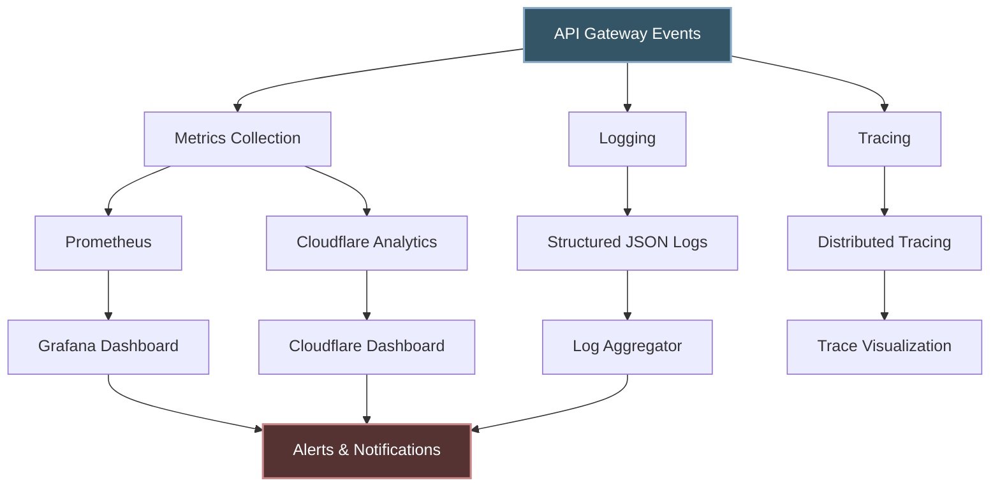

### Key Metrics

The gateway exports the following key metrics:

| Metric | Description | Type |
|--------|-------------|------|
| `gateway_requests_total` | Total number of requests processed | Counter |
| `gateway_request_duration_ms` | Request processing time | Histogram |
| `gateway_errors_total` | Total number of errors by type | Counter |
| `gateway_circuit_breaker_state` | Circuit breaker state by service (0=closed, 1=open, 0.5=half-open) | Gauge |
| `gateway_proxy_requests_total` | Total number of proxied requests by service | Counter |
| `gateway_retry_attempts_total` | Total number of retry attempts by service | Counter |
| `gateway_upstream_latency_ms` | Upstream service response time | Histogram |

### Sample Metrics Dashboard

```mermaid
graph TB
    subgraph "API Gateway Overview"
        A[Request Rate] --> B[Current: 120 req/s]
        C[Error Rate] --> D[Current: 0.5%]
        E[P95 Latency] --> F[Current: 87ms]
        G[Circuit Breakers] --> H[Open: 0/5]
    end
    
    subgraph "Service Health"
        I[Auth Service] --> I1[Status: Healthy]
        J[User Service] --> J1[Status: Healthy]
        K[Product Service] --> K1[Status: Degraded]
        L[Search Service] --> L1[Status: Healthy]
    end
    
    subgraph "Top Routes"
        M[/api/users/*] --> M1[Rate: 45 req/s]
        N[/api/products/*] --> N1[Rate: 35 req/s]
        O[/api/auth/*] --> O1[Rate: 22 req/s]
        P[/api/search/*] --> P1[Rate: 18 req/s]
    end
    
    style C fill:#ff9999,stroke:#333,stroke-width:2px
    style K fill:#ffcc99,stroke:#333,stroke-width:2px
    style K1 fill:#ffcc99,stroke:#333,stroke-width:2px
```

### Request Tracing

The gateway adds trace headers to proxied requests for distributed tracing:

```
X-Request-ID: abc-123-xyz
X-Trace-ID: trace-789
X-Gateway-Service: api-gateway-workers
X-Gateway-Version: 1.2.3
X-Route-Pattern: /api/users/:id
```

## Troubleshooting

### Common Issues with Solutions

#### Proxy Services Not Working

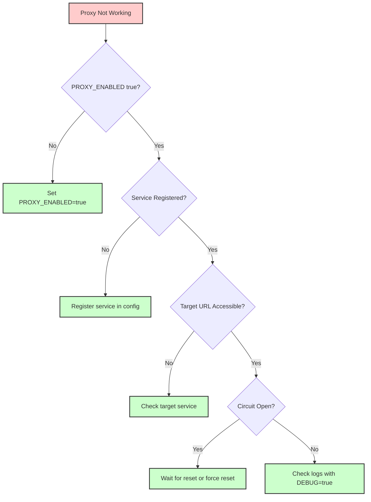

**Diagnostic Commands:**
```bash
# Check if proxy is enabled
curl https://your-gateway.com/system/config \
  -H "X-API-Key: admin-key" | jq .proxy.enabled

# Test upstream service directly
curl https://upstream-service.com/path \
  -H "Content-Type: application/json"

# Force reset circuit breaker (admin only)
curl -X POST https://your-gateway.com/system/circuit-reset/serviceId \
  -H "X-API-Key: admin-key"
```

#### Route Not Matching

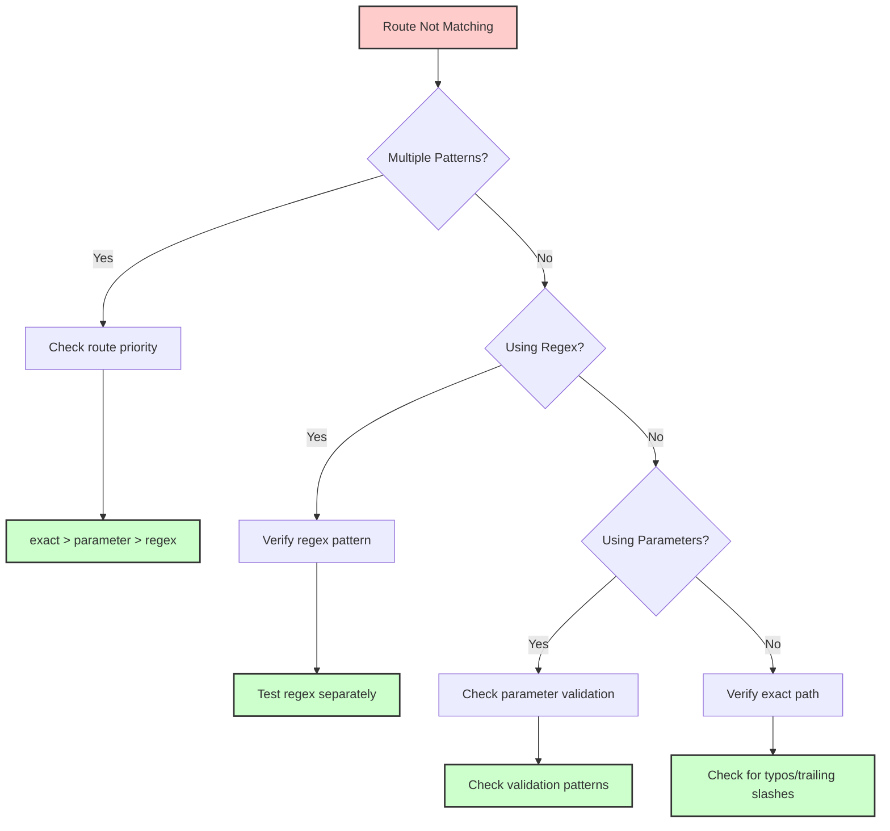

**Testing Route Patterns:**
```javascript
// Test a regex pattern
const pattern = /^\/users\/(\d+)\/posts$/;
console.log(pattern.test('/users/123/posts')); // Should be true
console.log(pattern.test('/users/abc/posts')); // Should be false

// Test parameter validation
const idPattern = new RegExp('[a-f0-9]{8}-[a-f0-9]{4}-[a-f0-9]{4}-[a-f0-9]{4}-[a-f0-9]{12}');
console.log(idPattern.test('550e8400-e29b-41d4-a716-446655440000')); // Should be true
console.log(idPattern.test('invalid-id')); // Should be false
```

#### Performance Issues

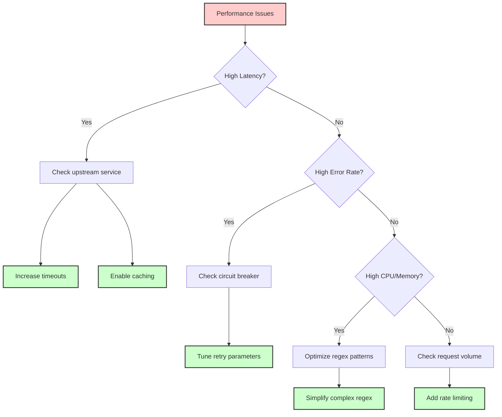

**Performance Tuning:**
```javascript
// Optimize timeout configuration
config.proxy.timeout = 15000; // Reduce default timeout

// Service-specific optimization
config.registerProxyService('criticalService', {
  timeout: 5000,
  retry: {
    maxAttempts: 2,
    backoff: 500
  }
});

// Optimize regex pattern
// Instead of: /^\/users\/(.*)\/posts\/(.*)$/
// Use more specific: /^\/users\/([a-zA-Z0-9]+)\/posts\/([a-zA-Z0-9\-]+)$/
```

### Debugging

Set the `DEBUG=true` environment variable to enable detailed logging, including:

```json
{
  "timestamp": "2023-07-21T14:32:10.243Z",
  "level": "debug",
  "service": "api-gateway",
  "component": "router",
  "message": "Route matching",
  "method": "GET",
  "path": "/api/users/123",
  "matchedPattern": "/api/users/:id",
  "params": {"id": "123"},
  "requestId": "req-abc-123"
}
```

Additional debug information includes:
- Route matching attempts and priorities
- Proxy request details and transformations
- Circuit breaker state changes and decisions
- Retry attempts with backoff timing
- Upstream service response details

## Security Considerations

When using the gateway functionality, consider the following security aspects:

### Authentication and Authorization Flow

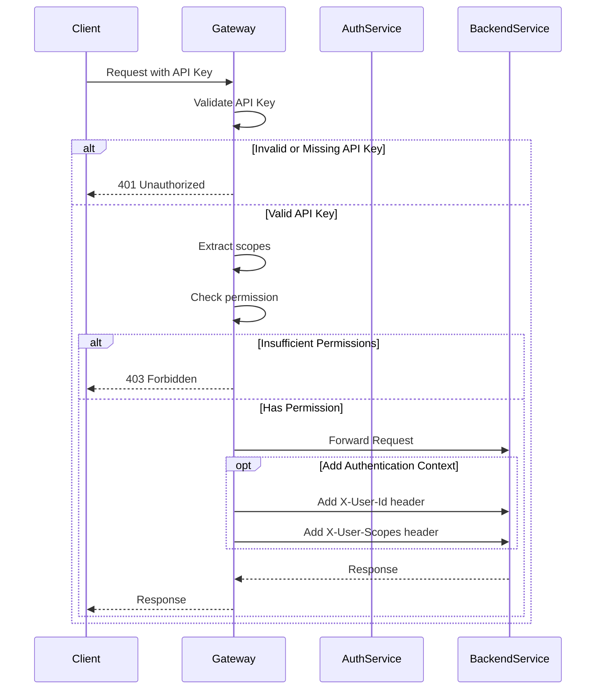

Security best practices:

1. **Authentication and Authorization**
   - The gateway forwards requests as-is by default
   - Add authentication middleware for all proxy routes
   - Use service-specific API keys in headers when needed
   - Implement scope-based permission checks

   ```javascript
   // Example of secure proxy routing with auth
   router.addProxy('/api/users/*', 'userService', {
     middleware: [
       authMiddleware({ requiredScope: 'users:read' }),
       auditLogMiddleware()
     ]
   });
   ```

2. **Rate Limiting with Tiered Approach**

   ```mermaid
   flowchart TD
       A[Incoming Request] --> B{Has API Key?}
       B -->|No| C[Apply IP-based limits]
       B -->|Yes| D[Apply key-based limits]
       
       C --> E[10 req/min]
       D --> F{Key Type?}
       
       F -->|Basic| G[100 req/min]
       F -->|Premium| H[1000 req/min]
       F -->|Admin| I[5000 req/min]
       
       E --> J{Check Endpoint Limits}
       G --> J
       H --> J
       I --> J
       
       J -->|Exceeded| K[429 Too Many Requests]
       J -->|Within Limits| L[Process Request]
       
       style K fill:#ff9999,stroke:#333,stroke-width:2px
   ```

   ```javascript
   // Example tiered rate limiting configuration
   const rateLimitConfig = {
     defaultLimit: 100,
     ipLimit: 10,
     keyTypeLimits: {
       basic: 100,
       premium: 1000,
       admin: 5000
     },
     endpoints: {
       '/api/search': { limit: 5 }, // Expensive operation
       '/api/health': { limit: 0 }  // No limit for health checks
     }
   };
   ```

3. **Request/Response Validation**

   ```mermaid
   flowchart LR
       A[Client Request] --> B[Gateway]
       B --> C{Validate Request}
       C -->|Invalid| D[400 Bad Request]
       C -->|Valid| E[Backend Service]
       E --> F{Validate Response}
       F -->|Invalid| G[502 Bad Gateway]
       F -->|Valid| H[Return to Client]
       
       style D fill:#ff9999,stroke:#333,stroke-width:2px
       style G fill:#ff9999,stroke:#333,stroke-width:2px
   ```

   ```javascript
   // Example JSON schema validation
   router.addProxy('/api/users', 'userService', {
     requestValidation: {
       'POST': userCreateSchema,
       'PUT': userUpdateSchema
     },
     responseValidation: {
       '2xx': responseSchema
     }
   });
   ```

4. **TLS/SSL Security**
   - Ensure upstream services use HTTPS
   - Validate certificates when connecting to services
   - Implement certificate pinning for critical services

   ```javascript
   // Example of certificate validation configuration
   config.registerProxyService('paymentService', {
     target: 'https://payments.example.com',
     tls: {
       validateCertificates: true,
       pinnedCertificate: 'sha256/AAAAAAAAAAAAAAAAAAAAAAAAAAAAAAAAAAAAAAAAAAA='
     }
   });
   ```

5. **Header Security and Sanitization**

   ```mermaid
   flowchart LR
       A[Request Headers] --> B{Sanitize Headers}
       B --> C[Remove Sensitive Headers]
       C --> D[Add Security Headers]
       D --> E[Forward to Backend]
       
       F[Response Headers] --> G{Sanitize Headers}
       G --> H[Remove Internal Headers]
       H --> I[Add Security Headers]
       I --> J[Return to Client]
   ```

   ```javascript
   // Example header security configuration
   const headerSecurity = {
     // Headers to remove before forwarding
     removeRequestHeaders: [
       'Cookie', 
       'Authorization',
       'X-Real-IP'
     ],
     // Headers to add to requests
     addRequestHeaders: {
       'X-Forwarded-By': 'api-gateway',
       'X-Request-ID': '${requestId}'  // Template values supported
     },
     // Headers to remove from responses
     removeResponseHeaders: [
       'Server',
       'X-Powered-By',
       'X-Internal-Token'
     ],
     // Headers to add to responses
     addResponseHeaders: {
       'Strict-Transport-Security': 'max-age=31536000; includeSubDomains',
       'X-Content-Type-Options': 'nosniff',
       'X-Frame-Options': 'DENY',
       'Content-Security-Policy': "default-src 'self'"
     }
   };
   ```

6. **Comprehensive Security Audit Logging**

   ```javascript
   // Example security event logging
   const securityEvents = {
     // Log authentication attempts
     'AUTH_ATTEMPT': { level: 'info', includeHeaders: ['User-Agent'] },
     'AUTH_SUCCESS': { level: 'info', includeContext: true },
     'AUTH_FAILURE': { level: 'warning', includeContext: true, includeHeaders: true },
     
     // Log authorization decisions
     'ACCESS_DENIED': { level: 'warning', includeContext: true, notifyAdmin: true },
     
     // Log rate limiting events
     'RATE_LIMIT_EXCEEDED': { level: 'warning', includeContext: true },
     
     // Log suspicious activities
     'SUSPICIOUS_ACTIVITY': { level: 'alert', includeContext: true, notifyAdmin: true },
     
     // Log configuration changes
     'CONFIG_CHANGED': { level: 'alert', includeContext: true, notifyAdmin: true }
   };
   ```

## Best Practices

### API Design Best Practices

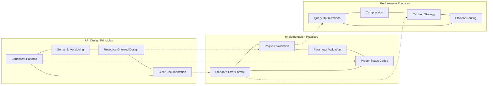

### 1. Route Organization and API Design

- Group related routes by resource and functionality
- Use consistent patterns for API endpoints
- Follow RESTful conventions for resource naming

```javascript
// Example of organized route registration
// Group by resource type
const userRoutes = [
  { method: 'GET', path: '/users', handler: listUsers },
  { method: 'POST', path: '/users', handler: createUser },
  { method: 'GET', path: '/users/:id', handler: getUser, validateParam: 'id' },
  { method: 'PUT', path: '/users/:id', handler: updateUser, validateParam: 'id' },
  { method: 'DELETE', path: '/users/:id', handler: deleteUser, validateParam: 'id' }
];

// Register all routes in the group
userRoutes.forEach(route => {
  if (route.validateParam) {
    router.addValidated(route.method, route.path, route.validateParam, route.validateParam, route.handler);
  } else {
    router.add(route.method, route.path, route.handler);
  }
});
```

### 2. Service Registration and Management

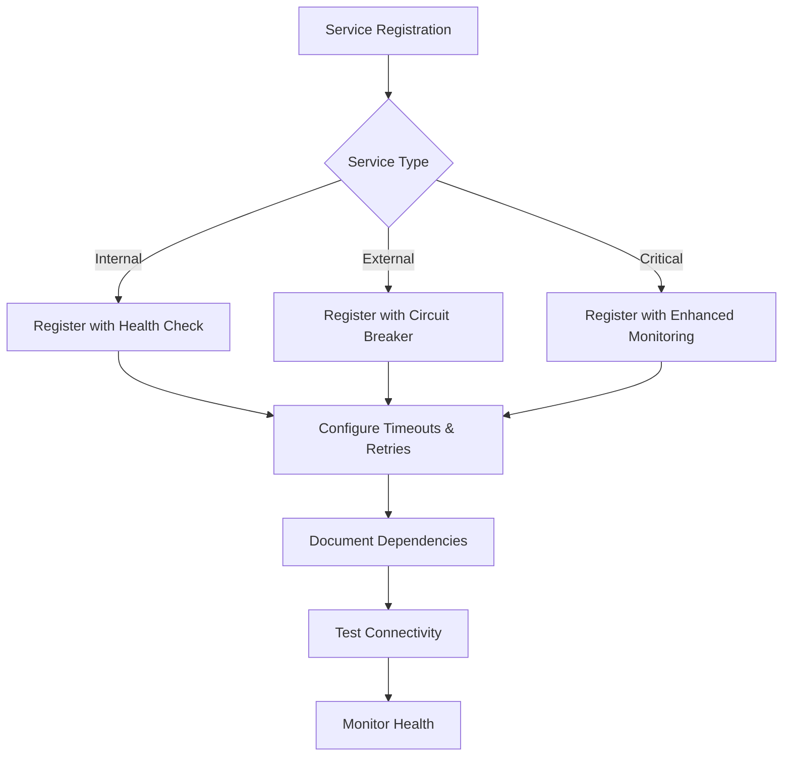

- Register services during application startup with environment-specific configuration
- Use descriptive service names and consistent naming conventions
- Implement service discovery when available
- Document service dependencies and fallback strategies

```javascript
// Example service registration with environment awareness
function registerServices(env) {
  // Base configuration
  const services = {
    auth: {
      timeout: 5000,
      retries: 2
    },
    users: {
      timeout: 10000,
      retries: 3
    }
  };
  
  // Environment-specific overrides
  const envConfig = {
    development: {
      auth: { target: 'http://localhost:3001' },
      users: { target: 'http://localhost:3002' }
    },
    staging: {
      auth: { target: 'https://auth-staging.example.com' },
      users: { target: 'https://users-staging.example.com' }
    },
    production: {
      auth: { target: 'https://auth.example.com' },
      users: { target: 'https://users.example.com' }
    }
  };
  
  // Register each service with combined config
  Object.entries(services).forEach(([name, baseConfig]) => {
    const envSpecific = envConfig[env][name] || {};
    config.registerProxyService(name, {
      ...baseConfig,
      ...envSpecific
    });
  });
  
  // Verify connectivity
  return Promise.all(
    Object.keys(services).map(async name => {
      try {
        await testServiceConnectivity(name);
        console.log(`Service ${name} connectivity verified`);
        return true;
      } catch (e) {
        console.error(`Service ${name} connectivity failed: ${e.message}`);
        return false;
      }
    })
  );
}
```

### 3. Error Handling Strategy

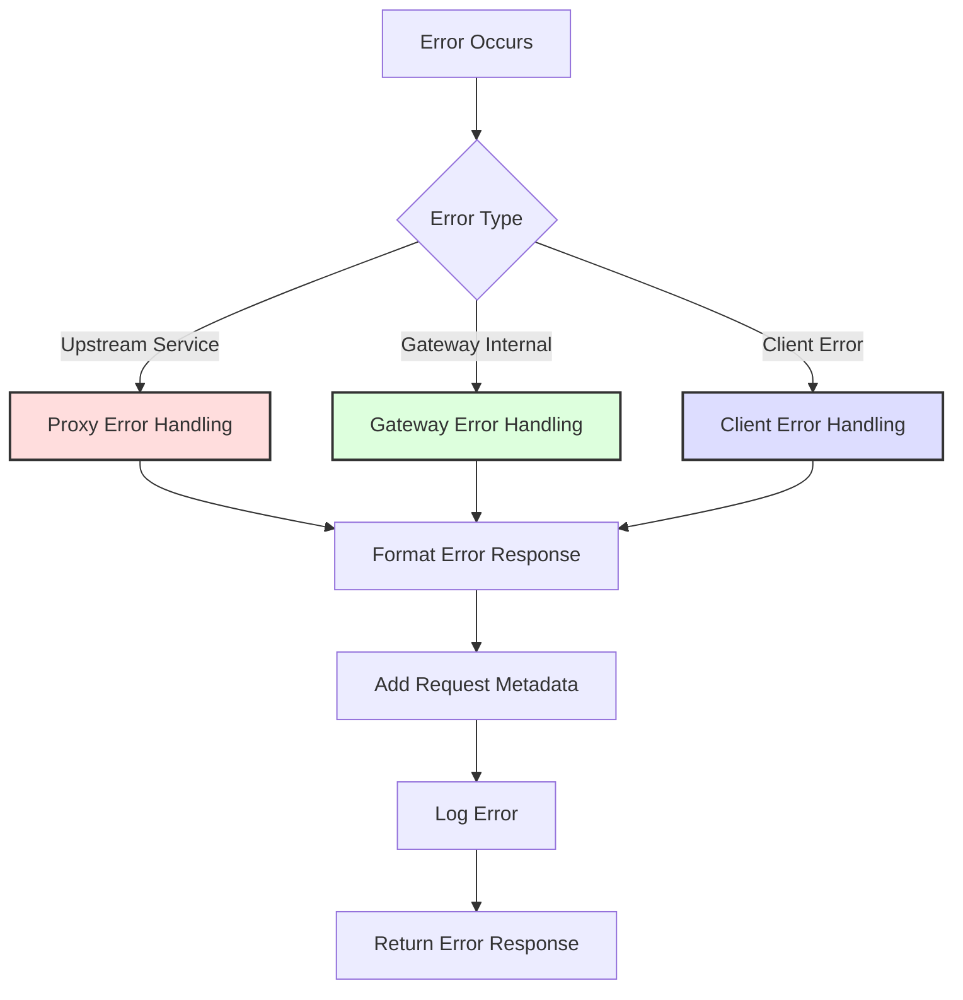

- Implement consistent error responses with standardized format
- Add request context to errors for troubleshooting
- Create custom error templates for different types of failures
- Log errors with appropriate severity levels

```javascript
// Example error handling strategy
function createErrorHandler() {
  return async function errorHandler(error, request, serviceName) {
    // Add request context
    const requestId = request.headers.get('X-Request-ID') || uuidv4();
    const path = new URL(request.url).pathname;
    
    // Create base error response
    const errorResponse = {
      error: {
        message: error.message || 'An unexpected error occurred',
        code: error.code || 'INTERNAL_ERROR',
        requestId: requestId
      }
    };
    
    // Add service info for proxy errors
    if (serviceName) {
      errorResponse.error.service = serviceName;
    }
    
    // Log the error with appropriate context
    const logLevel = error.status >= 500 ? 'error' : 'warn';
    logger[logLevel](`API Error: ${error.message}`, {
      requestId,
      path,
      method: request.method,
      serviceName,
      statusCode: error.status || 500,
      errorCode: error.code
    });
    
    // Return formatted error response
    return new Response(
      JSON.stringify(errorResponse),
      {
        status: error.status || 500,
        headers: {
          'Content-Type': 'application/json',
          'X-Request-ID': requestId
        }
      }
    );
  };
}
```

### 4. Comprehensive Monitoring Strategy

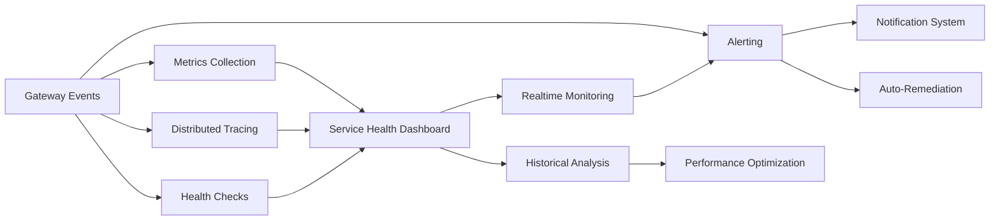

- Implement health checks for all upstream services
- Use structured logging with correlation IDs
- Create dashboard showing circuit breaker status
- Set up alerts for critical service degradation
- Track and analyze latency for performance tuning

```javascript
// Example health check implementation
async function healthCheck() {
  const services = config.proxy.services || {};
  const results = {};
  
  // Check each registered service
  await Promise.all(
    Object.entries(services).map(async ([name, serviceConfig]) => {
      try {
        const startTime = Date.now();
        const response = await fetch(`${serviceConfig.target}/health`, {
          method: 'GET',
          headers: { 'X-Health-Check': 'true' },
          timeout: 5000
        });
        
        const latency = Date.now() - startTime;
        const isHealthy = response.ok;
        
        results[name] = {
          status: isHealthy ? 'healthy' : 'unhealthy',
          latency: latency,
          lastChecked: new Date().toISOString()
        };
        
        // Update metrics
        metrics.observe(`gateway_service_latency_ms{service="${name}"}`, latency);
        metrics.set(`gateway_service_healthy{service="${name}"}`, isHealthy ? 1 : 0);
        
      } catch (e) {
        results[name] = {
          status: 'unhealthy',
          error: e.message,
          lastChecked: new Date().toISOString()
        };
        
        // Update metrics
        metrics.set(`gateway_service_healthy{service="${name}"}`, 0);
        
        // Trigger alert if critical service
        if (serviceConfig.critical) {
          alerts.trigger(`Critical service ${name} is down: ${e.message}`);
        }
      }
    })
  );
  
  // Return overall health
  const allHealthy = Object.values(results).every(r => r.status === 'healthy');
  
  return {
    status: allHealthy ? 'healthy' : 'degraded',
    services: results,
    timestamp: new Date().toISOString()
  };
}
```

### 5. Performance Optimization Techniques

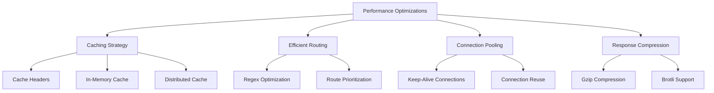

- Implement tiered caching strategy for responses
- Optimize regex patterns for efficiency
- Use connection pooling for upstream services
- Add compression for large response payloads
- Conduct load testing to identify bottlenecks

```javascript
// Example caching implementation
function createCachingMiddleware(config) {
  // Create cache storage based on config
  const cache = createCache(config.type, config.options);
  
  return async function cachingMiddleware(request, next) {
    // Skip cache for non-GET methods
    if (request.method !== 'GET') {
      return next(request);
    }
    
    const cacheKey = generateCacheKey(request);
    
    // Try to get from cache
    const cachedResponse = await cache.get(cacheKey);
    if (cachedResponse) {
      return cachedResponse;
    }
    
    // Get fresh response
    const response = await next(request);
    
    // Cache if successful and cacheable
    if (response.ok && isCacheableResponse(response)) {
      const clonedResponse = response.clone();
      const maxAge = getMaxAge(response.headers);
      
      if (maxAge > 0) {
        cache.set(cacheKey, clonedResponse, { ttl: maxAge });
      }
    }
    
    return response;
  };
}

// Example regex optimization
// Instead of using inefficient patterns:
// const userIdPattern = /^\/users\/(.*)$/;  // Greedy, can cause backtracking

// Use more specific and efficient patterns:
const userIdPattern = /^\/users\/([a-zA-Z0-9\-]+)$/;  // Specific character set with bounds
```