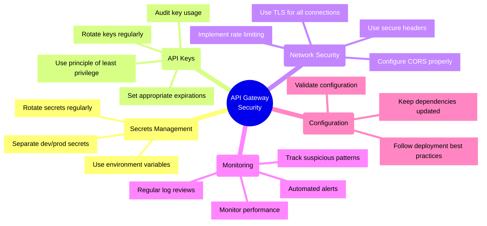

# API Gateway Integration Guide

This comprehensive guide explains how to integrate the API Gateway into your existing systems, providing detailed steps, examples, and diagrams to ensure a smooth integration process.

## Architecture Overview

The API Gateway is designed as a modular, cloud-native service built on Cloudflare Workers with multiple components that work together to provide a robust API management solution:


The API Gateway Workers system provides several core capabilities:

1. **Key Management**: Generate, validate, and manage API keys with fine-grained scopes
2. **Authentication & Authorization**: Role-based access control for administrative operations
3. **Request Proxying**: Forward requests to upstream services with circuit breaking and retries
4. **Request Transformation**: Modify requests and responses for compatibility
5. **Monitoring & Logging**: Comprehensive audit trail of all operations

### System Components


## Integration Approaches

The API Gateway Workers supports multiple integration patterns to fit different architectural needs:


### Gateway Integration Patterns


## Integration Steps

The API Gateway Workers integration follows a systematic approach to ensure secure and reliable deployment. The following diagram outlines the complete integration process:


### Step 1: Environment Preparation and Setup

First, set up your project structure and dependencies:


Create the necessary directory structure:

```bash
# Create project directory
mkdir -p api-gateway-workers
cd api-gateway-workers

# Initialize with Wrangler
wrangler init

# Create core directories
mkdir -p src/{api,core,infrastructure,lib}
mkdir -p src/api/{controllers,middleware}
mkdir -p src/core/{auth,keys,proxy,errors}
mkdir -p src/infrastructure/{config,di,http,storage}
```

Copy or create the following key files:

```
src/
├── api/
│   ├── controllers/
│   │   ├── KeysController.js     # Key management API endpoints
│   │   └── ValidationController.js  # Key validation endpoints
│   └── middleware/
│       ├── authMiddleware.js     # API key authentication
│       └── errorHandler.js       # Standardized error handling
├── core/
│   ├── auth/
│   │   └── AuthService.js        # Authentication logic
│   ├── keys/
│   │   ├── commands/             # Command objects
│   │   ├── handlers/             # Command handlers
│   │   └── KeyService.js         # Key management service
│   └── proxy/
│       └── ProxyService.js       # Proxy functionality
└── infrastructure/
    ├── config/
    │   ├── Config.js             # Configuration management
    │   └── SchemaValidator.js    # Config validation
    ├── di/
    │   └── Container.js          # Dependency injection
    └── http/
        └── Router.js             # Enhanced routing
```

### Step 2: Configure Core Dependencies

Update your `package.json` to include the required dependencies:

```json
{
  "name": "api-gateway-workers",
  "version": "1.0.0",
  "type": "module",
  "main": "src/index.js",
  "scripts": {
    "dev": "wrangler dev",
    "start": "wrangler dev",
    "deploy": "wrangler deploy",
    "test": "NODE_OPTIONS=--experimental-vm-modules jest",
    "test:watch": "NODE_OPTIONS=--experimental-vm-modules jest --watch",
    "test:coverage": "NODE_OPTIONS=--experimental-vm-modules jest --coverage"
  },
  "dependencies": {
    "uuid": "^9.0.0",
    "ajv": "^8.12.0"
  },
  "devDependencies": {
    "@jest/globals": "^29.5.0",
    "jest": "^29.5.0",
    "jest-environment-miniflare": "^2.14.0",
    "wrangler": "^3.0.0"
  }
}
```

Install the dependencies:

```bash
npm install
```

### Step 3: Configure the Gateway

The configuration process includes setting up storage, security, and integration points:


#### Create Configuration File

Create a configuration file at `config.json`:

```json
{
  "encryption": {
    "algorithm": "AES-GCM"
  },
  "hmac": {
    "algorithm": "SHA-384"
  },
  "keys": {
    "prefix": "km_",
    "defaultExpirationDays": 365
  },
  "security": {
    "cors": {
      "allowOrigin": "*",
      "allowMethods": "GET, POST, PUT, DELETE, OPTIONS",
      "allowHeaders": "Content-Type, Authorization, X-API-Key"
    },
    "apiKeyHeader": "X-API-Key"
  },
  "logging": {
    "level": "info",
    "includeTrace": true
  },
  "routing": {
    "versioning": {
      "enabled": true,
      "current": "1",
      "supported": ["1"],
      "deprecated": []
    }
  }
}
```

#### Configure Wrangler

Create or update your `wrangler.toml` with the following configuration:

```toml
name = "api-gateway-workers"
main = "src/index.js"
compatibility_date = "2023-06-28"
node_compat = true

[vars]
CONFIG_PATH = "./config.json"

# Create KV namespaces for each environment
# wrangler kv:namespace create "KEYS"
# wrangler kv:namespace create "KEYS" --env staging

[[kv_namespaces]]
binding = "KEYS"
id = "your-kv-namespace-id"  # Replace with actual ID

# Define Durable Object
[[durable_objects.bindings]]
name = "KEY_MANAGER"
class_name = "KeyManagerDurableObject"

# Staging environment
[env.staging]
[[env.staging.kv_namespaces]]
binding = "KEYS"
id = "your-staging-kv-namespace-id"  # Replace with actual ID

[[env.staging.durable_objects.bindings]]
name = "KEY_MANAGER"
class_name = "KeyManagerDurableObject"

# Development environment
[env.development]
[[env.development.kv_namespaces]]
binding = "KEYS"
id = "your-dev-kv-namespace-id"  # Replace with actual ID

[[env.development.durable_objects.bindings]]
name = "KEY_MANAGER"
class_name = "KeyManagerDurableObject"
```

#### Set Secure Environment Variables

Configure secure environment variables using Wrangler:

```bash
# Generate a strong encryption key
ENCRYPTION_KEY=$(openssl rand -hex 32)
echo "Your encryption key is: $ENCRYPTION_KEY"

# Generate a strong HMAC secret
HMAC_SECRET=$(openssl rand -hex 32)
echo "Your HMAC secret is: $HMAC_SECRET"

# Set secrets in Wrangler
wrangler secret put CONFIG_ENCRYPTION_KEY
# Paste the generated encryption key when prompted

wrangler secret put CONFIG_HMAC_SECRET
# Paste the generated HMAC secret when prompted

# Also set for staging
wrangler secret put CONFIG_ENCRYPTION_KEY --env staging
wrangler secret put CONFIG_HMAC_SECRET --env staging
```

### Step 4: Configure Proxy Services

Define upstream services that the API Gateway will proxy to:

```javascript
// In src/index.js or a configuration file
const proxyConfig = {
  services: {
    userService: {
      target: "https://users-api.example.com",
      pathRewrite: {
        "^/api/users": "/v1/users"  // Rewrite paths
      },
      headers: {
        "X-Internal-Service": "gateway"  // Add headers
      }
    },
    productService: {
      target: "https://products-api.example.com",
      timeout: 5000  // Service-specific timeout
    }
  }
};

// Register services
Object.entries(proxyConfig.services).forEach(([name, config]) => {
  proxyService.registerService(name, config);
});
```

### Step 5: Deploy and Test the Service


Deploy to development environment first:

```bash
# Start development server
wrangler dev
```

Then initialize the admin user:

```bash
# Initialize first admin
curl -X POST http://localhost:8787/setup \
  -H "Content-Type: application/json" \
  -d '{
    "name": "Super Admin",
    "email": "admin@example.com"
  }'
```

Save the returned API key securely - it will only be shown once.

Test key management functionality:

```bash
# Create a new API key
curl -X POST http://localhost:8787/keys \
  -H "Content-Type: application/json" \
  -H "X-API-Key: YOUR_ADMIN_KEY" \
  -d '{
    "name": "Test Service Key",
    "owner": "Test Service",
    "scopes": ["read:data", "write:data"]
  }'

# Validate the key
curl -X POST http://localhost:8787/validate \
  -H "Content-Type: application/json" \
  -d '{
    "key": "km_YOUR_SERVICE_KEY",
    "scopes": ["read:data"]
  }'
```

### Step 6: Production Deployment


Deploy to staging first:

```bash
wrangler deploy --env staging
```

After testing in staging, deploy to production:

```bash
wrangler deploy
```

Perform the initial admin setup in production:

```bash
curl -X POST https://api-gateway.yourcompany.com/setup \
  -H "Content-Type: application/json" \
  -d '{
    "name": "Production Admin",
    "email": "admin@yourcompany.com"
  }'
```

Store the production admin key securely in your company's secrets management system.

## Using the API Gateway

Once deployed, you can start using the API Gateway for both key management and proxy functionality. 

### Request Flow


### Authentication

For all operations that require authentication, include your API key in the `X-API-Key` header:

```
X-API-Key: km_your_api_key_here
```

### API Key Management

The following diagram shows the lifecycle of an API key:


#### Creating API Keys

```bash
# Example request
curl -X POST https://api-gateway.yourcompany.com/keys \
  -H "Content-Type: application/json" \
  -H "X-API-Key: km_your_admin_key" \
  -d '{
    "name": "Service API Key",
    "owner": "Example Service",
    "scopes": ["read:data", "write:data"],
    "expiresInDays": 365
  }'

# Example response
{
  "id": "key_1a2b3c4d5e6f",
  "key": "km_p8tb7y54nmx982jfvs37",
  "name": "Service API Key",
  "owner": "Example Service",
  "scopes": ["read:data", "write:data"],
  "status": "active",
  "createdAt": 1672531200000,
  "expiresAt": 1704067200000
}
```

#### Listing API Keys

```bash
# Example request
curl https://api-gateway.yourcompany.com/keys \
  -H "X-API-Key: km_your_admin_key"

# Example response
{
  "keys": [
    {
      "id": "key_1a2b3c4d5e6f",
      "name": "Service API Key",
      "owner": "Example Service",
      "scopes": ["read:data", "write:data"],
      "status": "active",
      "createdAt": 1672531200000,
      "expiresAt": 1704067200000
    }
  ],
  "count": 1,
  "cursor": null
}
```

#### Retrieving a Specific Key

```bash
# Example request
curl https://api-gateway.yourcompany.com/keys/key_1a2b3c4d5e6f \
  -H "X-API-Key: km_your_admin_key"

# Example response
{
  "id": "key_1a2b3c4d5e6f",
  "name": "Service API Key",
  "owner": "Example Service",
  "scopes": ["read:data", "write:data"],
  "status": "active",
  "createdAt": 1672531200000,
  "expiresAt": 1704067200000,
  "lastUsedAt": 1687968000000
}
```

#### Revoking API Keys

```bash
# Example request
curl -X DELETE https://api-gateway.yourcompany.com/keys/key_1a2b3c4d5e6f \
  -H "X-API-Key: km_your_admin_key"

# Example response
{
  "id": "key_1a2b3c4d5e6f",
  "status": "revoked",
  "revokedAt": 1688054400000
}
```

#### Rotating API Keys

Rotating a key creates a new key while keeping the old one active for a transition period:

```bash
# Example request
curl -X POST https://api-gateway.yourcompany.com/keys/key_1a2b3c4d5e6f/rotate \
  -H "Content-Type: application/json" \
  -H "X-API-Key: km_your_admin_key" \
  -d '{
    "transitionPeriodDays": 7
  }'

# Example response
{
  "oldKey": {
    "id": "key_1a2b3c4d5e6f",
    "key": "km_p8tb7y54nmx982jfvs37",
    "status": "deprecated",
    "expiresAt": 1688659200000
  },
  "newKey": {
    "id": "key_9h8g7f6e5d4c",
    "key": "km_r4nd0m5tr1ngv4lu3",
    "name": "Service API Key",
    "owner": "Example Service",
    "scopes": ["read:data", "write:data"],
    "status": "active",
    "createdAt": 1688054400000,
    "expiresAt": 1719590400000
  }
}
```

### Key Validation (Public Endpoint)

This endpoint does not require admin authentication and is used for validating API keys:

```bash
# Example request
curl -X POST https://api-gateway.yourcompany.com/validate \
  -H "Content-Type: application/json" \
  -d '{
    "key": "km_p8tb7y54nmx982jfvs37",
    "scopes": ["read:data"]
  }'

# Example response - valid key with sufficient scopes
{
  "isValid": true,
  "keyId": "key_1a2b3c4d5e6f",
  "scopes": ["read:data", "write:data"],
  "owner": "Example Service"
}

# Example response - valid key with insufficient scopes
{
  "isValid": false,
  "reason": "insufficient_scope",
  "requiredScopes": ["read:data", "admin:data"],
  "providedScopes": ["read:data"]
}

# Example response - invalid key
{
  "isValid": false,
  "reason": "invalid_key"
}
```

### Proxy Functionality

The API Gateway can proxy requests to upstream services:


To proxy a request, simply send it to the API Gateway with the appropriate path:

```bash
# Example request to proxied endpoint
curl https://api-gateway.yourcompany.com/api/users \
  -H "X-API-Key: km_service_key"

# The request will be forwarded to the configured upstream service
# For example: https://users-api.example.com/v1/users
```

## Role-Based Access Control

The API Gateway implements a comprehensive role-based access control system:


### Predefined Roles

The system comes with predefined roles:

| Role | Description | Permissions |
|------|-------------|------------|
| **SUPER_ADMIN** | Full system access | All permissions |
| **KEY_ADMIN** | Can manage API keys | `admin:keys:*` |
| **KEY_VIEWER** | Can only view API keys | `admin:keys:read` |
| **USER_ADMIN** | Can manage admin users | `admin:users:*` |
| **SUPPORT** | Limited read-only access | `admin:keys:read`, `admin:logs:read` |

### Permission Structure

Permissions follow a hierarchical structure:

```
resource:action
```

Where:
- **resource**: The system resource (keys, users, system, logs)
- **action**: The operation on that resource (create, read, update, delete)

Wildcards can be used to grant access to all actions on a resource:

```
admin:keys:*
```

## Monitoring and Observability

The API Gateway provides robust monitoring and observability features:


### Audit Logging

All administrative actions are logged with detailed contextual information:

```json
{
  "timestamp": "2023-06-29T15:30:45.123Z",
  "action": "key.create",
  "actor": {
    "id": "user_admin123",
    "email": "admin@example.com",
    "role": "KEY_ADMIN"
  },
  "resource": {
    "type": "api_key",
    "id": "key_1a2b3c4d5e6f"
  },
  "details": {
    "name": "Service API Key",
    "owner": "Example Service",
    "scopes": ["read:data", "write:data"]
  },
  "requestId": "req_xyz789",
  "clientIp": "192.168.1.1"
}
```

## Troubleshooting

A systematic approach to troubleshooting API Gateway issues:


### Common Issues and Solutions

#### Setup Issues

- **"Missing KV binding"**: 
  - Ensure your KV namespace is correctly configured in `wrangler.toml`
  - Run `wrangler kv:namespace list` to verify namespaces
  - Check that namespace IDs are correctly copied to your configuration

- **"Setup already completed"**: 
  - The setup endpoint can only be used once
  - Use an existing admin key to create new admin users
  - If needed, manually clear the admin flag in KV storage for testing

#### Authentication Issues

- **"Invalid API key"**: 
  - Verify that you're using the correct API key
  - Check for copy/paste errors (extra spaces, line breaks)
  - Ensure the key is not expired or revoked

- **"Permission denied"**: 
  - The API key does not have the required permission scope
  - Check the required permissions for the endpoint
  - Request a key with appropriate scopes

#### Storage Issues

- **KV Storage Problems**:
  - Verify the KV namespace exists with `wrangler kv:namespace list`
  - Check that the namespace ID in wrangler.toml is correct
  - Ensure you have the necessary permissions for the namespace
  - Check KV usage limits and quotas

#### Proxy Issues

- **"Service unavailable"**: 
  - Circuit breaker may be open - check logs for failure patterns
  - Verify that the upstream service is operational
  - Test direct connection to the upstream service
  - Try again after the circuit breaker timeout period

- **"Gateway timeout"**: 
  - Upstream service may be slow or unresponsive
  - Check proxy timeout settings
  - Investigate network latency issues
  - Consider increasing timeout for the specific service

## Security Best Practices



1. **Secret Management**:
   - Generate strong, random secrets for encryption and HMAC
   - Use Wrangler secrets or environment variables, never hardcode
   - Rotate secrets periodically for enhanced security

2. **Key Management**:
   - Set appropriate expirations for API keys
   - Implement key rotation processes
   - Use granular scopes following least privilege

3. **Network Security**:
   - Configure CORS settings appropriately
   - Implement rate limiting for public endpoints
   - Use TLS for all communications

4. **Monitoring and Auditing**:
   - Regularly review audit logs for suspicious activity
   - Set up alerts for unusual patterns
   - Monitor key usage and revoke unused keys

5. **Environment Isolation**:
   - Keep development, staging, and production environments separate
   - Use different keys and secrets for each environment
   - Implement proper access controls for production

## Extending the Gateway

The API Gateway is designed to be extensible. Here are some ways to enhance its functionality:


1. **Admin UI Development**:
   - Create a web interface for key management
   - Build dashboards for monitoring and analytics
   - Implement user management screens

2. **Enhanced Authentication**:
   - Add OAuth 2.0 support
   - Implement multi-factor authentication
   - Support JWT authentication

3. **Advanced Proxy Features**:
   - Add request transformation capabilities
   - Implement response caching
   - Add service discovery integration

4. **Monitoring Enhancements**:
   - Integrate with external monitoring services
   - Create custom metrics dashboards
   - Add performance profiling

5. **Traffic Management**:
   - Implement advanced rate limiting strategies
   - Add traffic prioritization
   - Support gradual rollouts and canary deployments
