# Code Organization and Structure

This document outlines the organization and structure of the API Key Manager codebase, which follows Clean Architecture principles.

## Architecture Overview

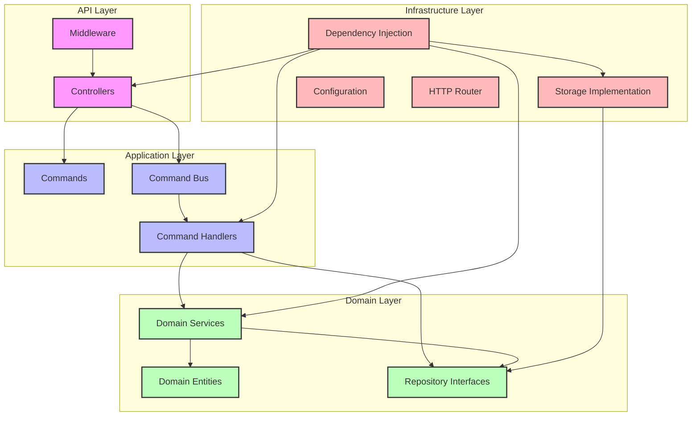

## Project Structure

The project is organized according to Clean Architecture layers:

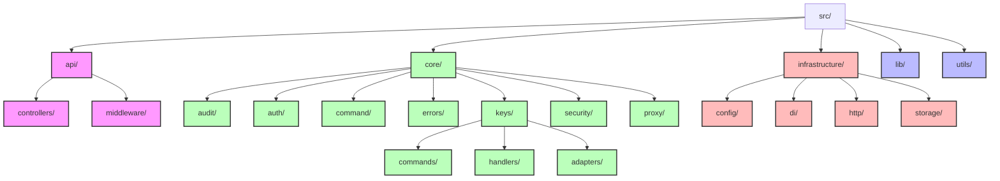

### Directory Structure

```
key-manager-workers/
├── src/                  # Source code
│   ├── api/              # API Layer
│   │   ├── controllers/  # API controllers
│   │   │   ├── BaseController.js
│   │   │   ├── KeysController.js
│   │   │   ├── SystemController.js
│   │   │   └── ValidationController.js
│   │   └── middleware/   # HTTP middleware
│   │       ├── authMiddleware.js
│   │       ├── corsMiddleware.js
│   │       ├── errorHandler.js
│   │       └── responseMiddleware.js
│   ├── core/             # Core Business Logic Layer
│   │   ├── audit/        # Audit logging domain
│   │   │   └── AuditLogger.js
│   │   ├── auth/         # Auth domain
│   │   │   ├── AuthService.js
│   │   │   └── adapters/
│   │   │       └── ApiKeyAdapter.js
│   │   ├── command/      # Command pattern implementation
│   │   │   ├── Command.js
│   │   │   ├── CommandBus.js
│   │   │   └── CommandHandler.js
│   │   ├── errors/       # Domain errors
│   │   │   └── ApiError.js
│   │   ├── keys/         # Key management domain
│   │   │   ├── KeyRepository.js
│   │   │   ├── KeyService.js
│   │   │   ├── adapters/
│   │   │   │   └── KeyServiceAdapter.js
│   │   │   ├── commands/ # Command objects
│   │   │   │   ├── CleanupExpiredKeysCommand.js
│   │   │   │   ├── CreateKeyCommand.js 
│   │   │   │   ├── GetKeyCommand.js
│   │   │   │   ├── ListKeysCommand.js
│   │   │   │   ├── ListKeysWithCursorCommand.js
│   │   │   │   ├── RevokeKeyCommand.js
│   │   │   │   ├── RotateKeyCommand.js
│   │   │   │   └── ValidateKeyCommand.js
│   │   │   └── handlers/ # Command handlers
│   │   │       ├── CleanupExpiredKeysHandler.js
│   │   │       ├── CreateKeyHandler.js
│   │   │       ├── GetKeyHandler.js
│   │   │       ├── ListKeysHandler.js
│   │   │       ├── ListKeysWithCursorHandler.js
│   │   │       ├── RevokeKeyHandler.js
│   │   │       ├── RotateKeyHandler.js
│   │   │       └── ValidateKeyHandler.js
│   │   ├── proxy/        # API Gateway proxy domain
│   │   │   ├── ProxyService.js
│   │   │   ├── CircuitBreaker.js
│   │   │   └── RetryStrategy.js
│   │   └── security/     # Security domain
│   │       ├── EncryptionService.js
│   │       ├── HmacService.js
│   │       ├── KeyGenerator.js
│   │       └── RateLimiter.js
│   ├── infrastructure/   # Infrastructure Layer
│   │   ├── config/       # Configuration
│   │   │   ├── Config.js
│   │   │   ├── ConfigLoader.js
│   │   │   ├── SchemaValidator.js
│   │   │   └── setupConfig.js
│   │   ├── di/           # Dependency injection
│   │   │   ├── Container.js
│   │   │   └── setupContainer.js
│   │   ├── http/         # HTTP infrastructure
│   │   │   └── Router.js
│   │   └── storage/      # Storage infrastructure
│   │       └── DurableObjectRepository.js
│   ├── lib/              # Core runtime functionality
│   │   ├── KeyManagerDurableObject.js # Main Durable Object
│   │   └── router.js     # HTTP router implementation
│   ├── models/           # Legacy business logic (being phased out)
│   │   ├── ApiKeyManager.js # Key management operations
│   │   └── types.js      # Type definitions
│   ├── utils/            # Utility functions
│   │   ├── response.js   # HTTP response formatting
│   │   ├── security.js   # Security utilities (key generation, rate limiting)
│   │   ├── storage.js    # Storage key generation
│   │   └── validation.js # Input validation
│   └── index.js          # Entry point
├── test/                 # Test suite (mirrors source structure)
│   ├── api/              # Tests for API layer
│   │   └── controllers/  # Controller tests
│   ├── auth/             # Legacy auth tests
│   ├── core/             # Tests for core layer
│   │   └── keys/         # Tests for key management domain
│   │       ├── commands/ # Tests for commands
│   │       └── handlers/ # Tests for handlers
│   ├── lib/              # Tests for core functionality
│   ├── models/           # Tests for business logic
│   ├── mocks/            # Mock implementations
│   ├── utils/            # Test utilities
│   │   ├── TestContainer.js # DI container for tests
│   │   └── factories.js  # Test object factories
│   ├── cloudflare-mock.js # Cloudflare API mocks
│   ├── crypto-mock.js    # Crypto mocks
│   ├── integration-test.sh # Integration test script
│   ├── jest-setup.js     # Jest setup
│   └── setup.js          # Test setup
├── docs/                 # Documentation
│   ├── API.md            # API documentation
│   ├── ARCHITECTURE.md   # Architecture documentation
│   ├── IMPROVEMENTS.md   # Future improvements
│   ├── INTEGRATION_GUIDE.md # Integration guide
│   ├── ORGANIZATION.md   # This file
│   ├── QUICKSTART.md     # Quick start guide
│   ├── SECURITY.md       # Security implementation details
│   └── TESTING_GUIDE.md  # Testing guide
├── jest.config.js        # Jest configuration
├── package-lock.json     # NPM lock file
├── package.json          # NPM package configuration
├── CHANGELOG.md          # Version change history
├── CONTRIBUTING.md       # Contribution guidelines
├── IMPLEMENTATION.md     # Implementation details
├── LICENSE               # License file
├── README.md             # Project readme
├── SUMMARY.md            # Project summary
└── wrangler.jsonc        # Cloudflare Workers configuration
```

## Clean Architecture Layers

```mermaid
graph TD
    subgraph User
        User((User))
    end
    
    subgraph "API Layer (Interface Adapters)"
        Controller[Controllers]
        Middleware[Middleware]
        Response[Response Formatter]
    end
    
    subgraph "Application Layer (Use Cases)"
        Command[Commands]
        Handler[Command Handlers]
        CommandBus[Command Bus]
    end
    
    subgraph "Domain Layer (Entities)"
        Entity[Domain Entities]
        ValueObject[Value Objects]
        DomainService[Domain Services]
        Repository[Repository Interface]
    end
    
    subgraph "Infrastructure Layer (Frameworks & Drivers)"
        DBImpl[Repository Implementation]
        DIContainer[Dependency Injection]
        Config[Configuration]
        Router[HTTP Router]
    end
    
    User --> Controller
    Controller --> Command
    Command --> CommandBus
    Middleware --> Controller
    Controller --> Response
    
    CommandBus --> Handler
    Handler --> DomainService
    Handler --> Repository
    
    DomainService --> Entity
    DomainService --> ValueObject
    DomainService --> Repository
    
    DBImpl -.-> Repository
    DIContainer -.-> DomainService
    DIContainer -.-> Handler
    DIContainer -.-> Controller
    Config -.-> All
    
    classDef api fill:#f9f,stroke:#333,stroke-width:2px
    classDef application fill:#bbf,stroke:#333,stroke-width:2px
    classDef domain fill:#bfb,stroke:#333,stroke-width:2px
    classDef infrastructure fill:#fbb,stroke:#333,stroke-width:2px
    classDef external fill:#ddd,stroke:#333,stroke-width:1px
    
    class Controller,Middleware,Response api
    class Command,Handler,CommandBus application
    class Entity,ValueObject,DomainService,Repository domain
    class DBImpl,DIContainer,Config,Router infrastructure
    class User external

    %% Dependency flow explanation
    linkStyle 0,1,2,3,4,5,6,7,8,9,10 stroke:#333,stroke-width:2px
    linkStyle 11,12,13,14,15 stroke:#888,stroke-width:2px,stroke-dasharray: 5 5
```

The codebase is organized according to Clean Architecture principles with distinct layers:

### 1. Domain Layer (`src/core/`)

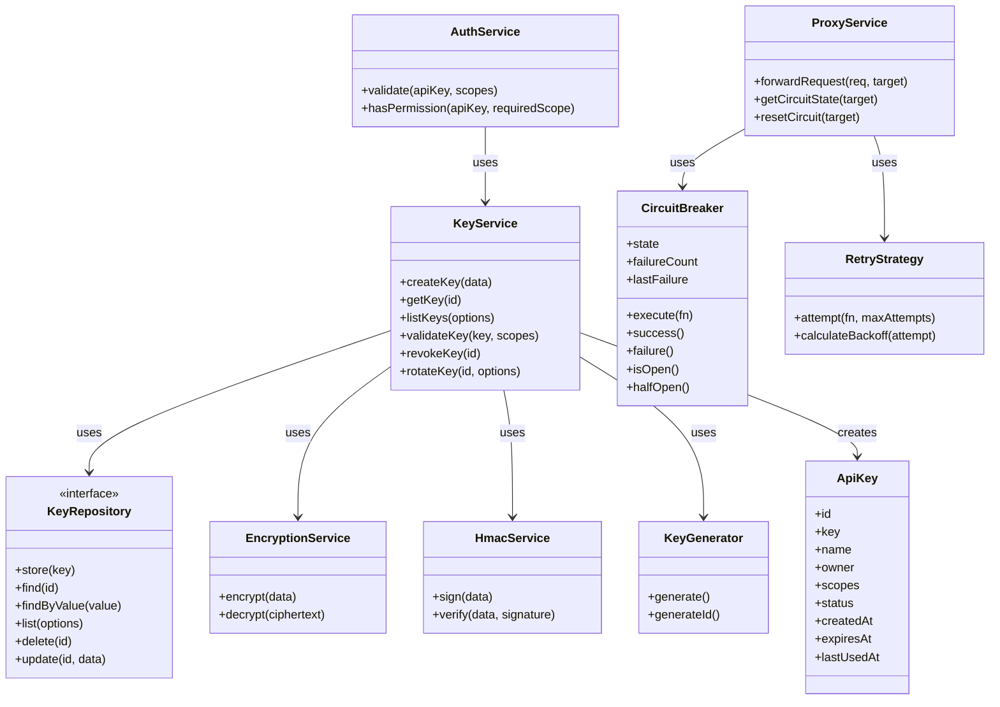

- Contains business logic and domain services
- Defines domain entities, value objects, and interfaces
- Has no dependencies on external frameworks or infrastructure
- **Key Components**:
  - `KeyService`: Core business logic for API key management
  - `AuthService`: Authentication and authorization logic
  - `ApiKey`: Domain entity representing an API key
  - `KeyRepository`: Interface for data access (repository pattern)
  - `ProxyService`: Handles API gateway proxy functionality
  - `CircuitBreaker`: Implements circuit breaker pattern for fault tolerance
  - `RetryStrategy`: Manages retry logic for failed requests

### 2. Application Layer (`src/core/*/handlers/`)

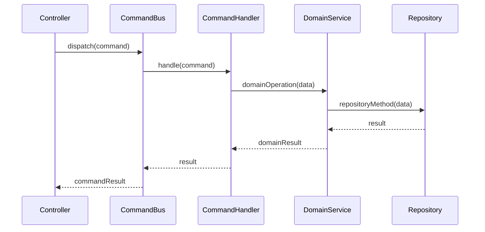

- Implements use cases through command handlers
- Acts as a bridge between the domain and interface layers
- Uses the Command pattern for encapsulating user intentions
- **Key Components**:
  - `Command.js`: Base class for commands
  - `CommandBus.js`: Routes commands to handlers
  - `CommandHandler.js`: Base class for handlers
  - Specific command handlers (e.g., `CreateKeyHandler.js`)
  - Specific command objects (e.g., `CreateKeyCommand.js`)

### 3. Infrastructure Layer (`src/infrastructure/`)

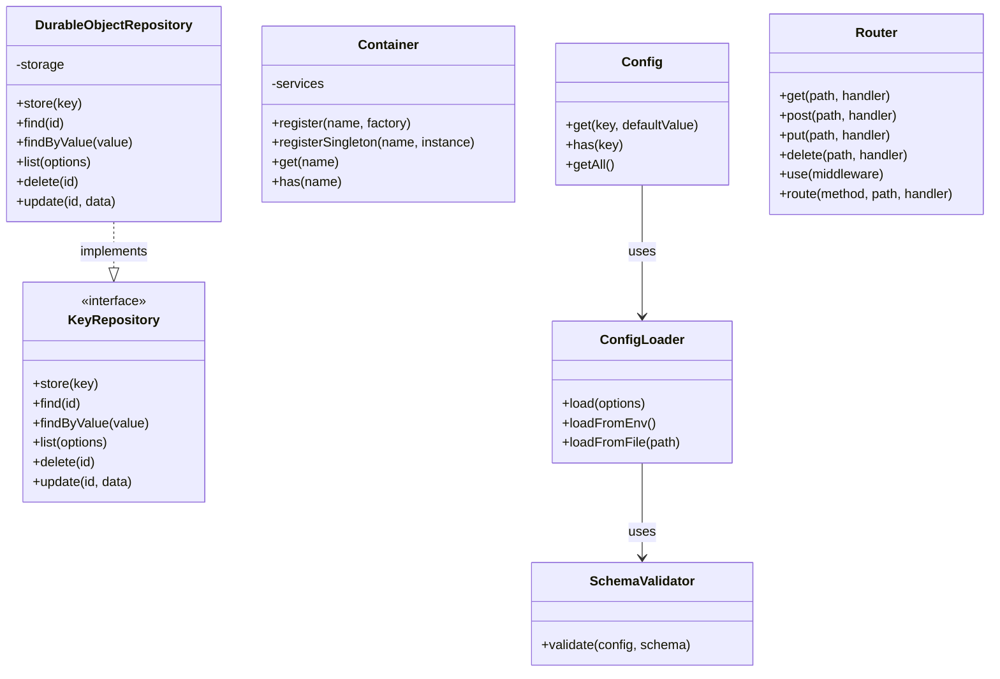

- Provides technical implementations of interfaces
- Manages configuration, storage, dependency injection
- Adapts external frameworks to work with the application
- **Key Components**:
  - `DurableObjectRepository.js`: Cloudflare Durable Objects implementation
  - `Container.js`: Dependency injection container
  - `Config.js`: Configuration management
  - `Router.js`: HTTP routing

### 4. API Layer (`src/api/`)

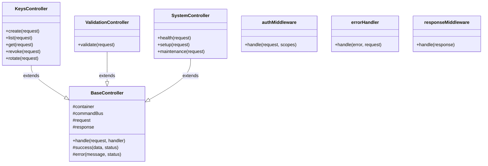

- Handles HTTP requests and responses
- Implements controllers for API endpoints
- Uses middleware for cross-cutting concerns
- **Key Components**:
  - `BaseController.js`: Base controller with common functionality
  - Specific controllers (e.g., `KeysController.js`)
  - Middleware for authentication, error handling, etc.

## Key Architectural Patterns

### Command Pattern

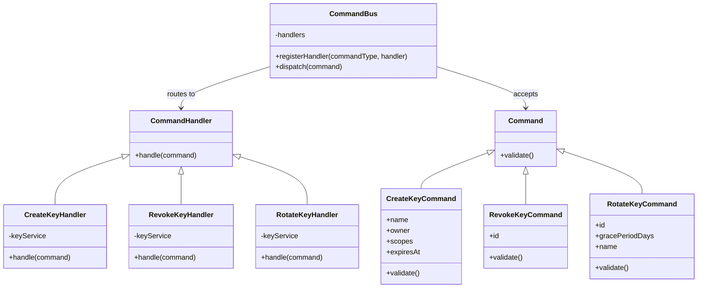

The application uses the Command pattern for encapsulating business operations:

- Commands represent user intentions (e.g., `CreateKeyCommand`, `RevokeKeyCommand`)
- Each command is handled by a specific handler (e.g., `CreateKeyHandler`, `RevokeKeyHandler`)
- The `CommandBus` routes commands to their appropriate handlers
- Commands are immutable data objects that encapsulate all necessary information

#### Command Flow Example

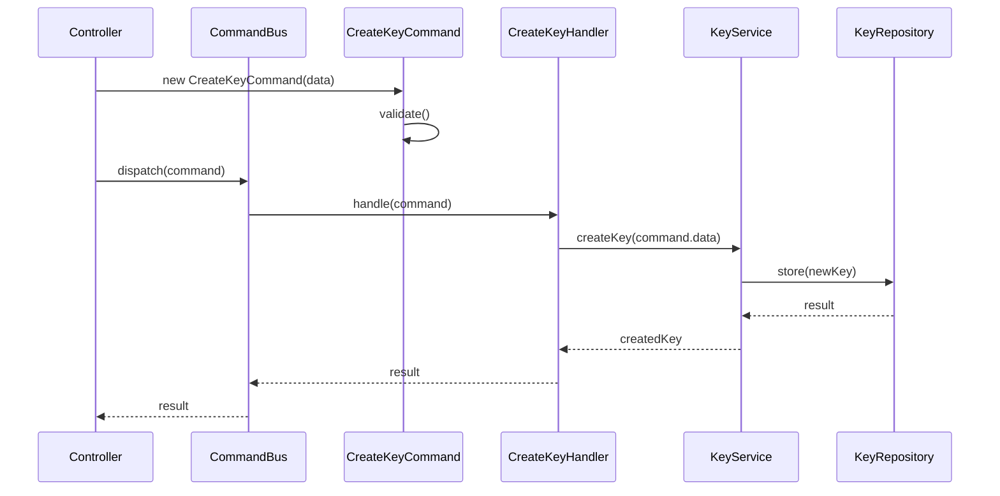

### Dependency Injection

```mermaid
graph TD
    Container[Container]
    setupContainer[setupContainer]
    
    Controller1[KeysController]
    Controller2[ValidationController]
    Controller3[SystemController]
    
    Service1[KeyService]
    Service2[AuthService]
    Service3[ProxyService]
    
    Repo[KeyRepository]
    
    setupContainer --> Container: configures
    Container --> Controller1: injects
    Container --> Controller2: injects
    Container --> Controller3: injects
    
    Container --> Service1: injects
    Container --> Service2: injects
    Container --> Service3: injects
    
    Container --> Repo: injects
    
    Service1 --> Repo: uses
    Service2 --> Service1: uses
    Controller1 --> Service1: uses
    Controller2 --> Service2: uses
```

Dependency injection is used for loose coupling and testability:

- `Container.js` provides IoC container functionality
- Services are registered in `setupContainer.js`
- Components receive dependencies through constructor injection
- The DI container can be configured differently for tests

#### Container Setup Example

```javascript
// Example from setupContainer.js
export function setupContainer() {
  const container = new Container();
  
  // Register infrastructure services
  container.registerSingleton('config', new Config());
  container.register('keyRepository', () => new DurableObjectRepository(storage));
  
  // Register domain services
  container.register('keyService', (c) => new KeyService(
    c.get('keyRepository'),
    c.get('encryptionService'),
    c.get('hmacService')
  ));
  
  container.register('authService', (c) => new AuthService(
    c.get('keyService')
  ));
  
  // Register command handlers
  container.register('createKeyHandler', (c) => new CreateKeyHandler(
    c.get('keyService')
  ));
  
  // Register controllers
  container.register('keysController', (c) => new KeysController(
    c.get('commandBus')
  ));
  
  return container;
}
```

### Repository Pattern

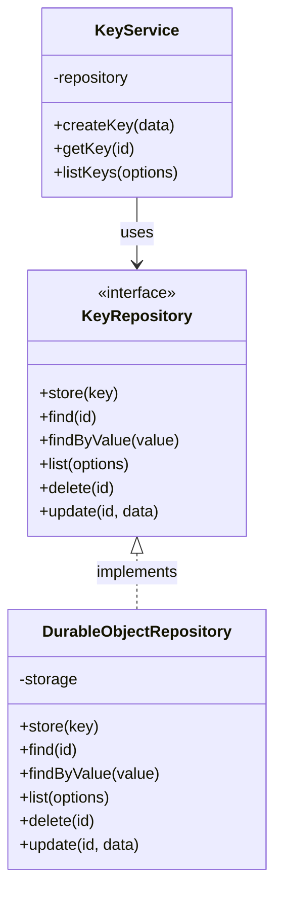

The repository pattern abstracts data access:

- `KeyRepository` interface defines data access methods
- `DurableObjectRepository` provides concrete implementation
- Business logic depends only on the abstract interface
- Allows swapping storage implementations without changing domain logic

### Adapter Pattern

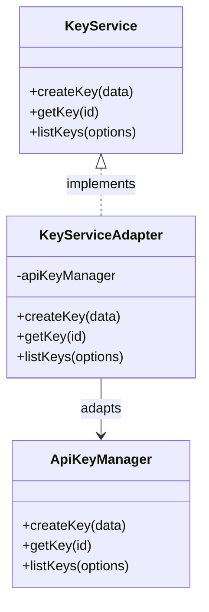

Adapters are used to integrate with external systems:

- `KeyServiceAdapter` adapts `ApiKeyManager` to the new architecture
- `ApiKeyAdapter` provides authentication capabilities
- Allows for gradual migration to new architecture

## Module Dependencies

Dependencies flow inward according to Clean Architecture principles:

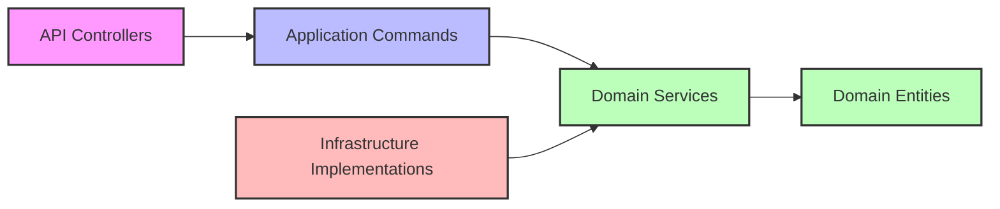

This ensures:

- Domain logic has no dependencies on external frameworks
- Application logic depends only on domain interfaces
- Infrastructure implementations depend on application and domain
- API depends on application commands and domain interfaces

## Test Organization

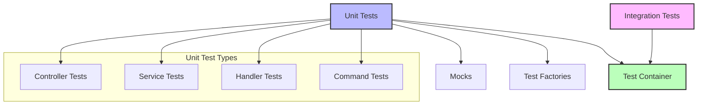

Tests mirror the source code structure:

- Unit tests for individual components
- Integration tests for testing components together
- `TestContainer` for managing dependencies in tests
- Test factories for creating test objects
- Mocks for external dependencies

### Testing Structure Example

```javascript
// Example of a command handler test
describe('CreateKeyHandler', () => {
  let container;
  let keyService;
  let handler;
  
  beforeEach(() => {
    // Set up test container
    container = new TestContainer();
    
    // Set up mocks
    keyService = {
      createKey: jest.fn().mockResolvedValue({
        id: 'test-id',
        key: 'km_test',
        name: 'Test Key'
      })
    };
    
    // Register mocks in container
    container.registerSingleton('keyService', keyService);
    
    // Create handler with injected dependencies
    handler = new CreateKeyHandler(container.get('keyService'));
  });
  
  it('should create a key with valid command', async () => {
    // Create command
    const command = new CreateKeyCommand({
      name: 'Test Key',
      owner: 'test@example.com',
      scopes: ['read:data']
    });
    
    // Execute handler
    const result = await handler.handle(command);
    
    // Verify results
    expect(keyService.createKey).toHaveBeenCalledWith({
      name: 'Test Key',
      owner: 'test@example.com',
      scopes: ['read:data']
    });
    expect(result).toEqual({
      id: 'test-id',
      key: 'km_test',
      name: 'Test Key'
    });
  });
});
```

## Coding Style

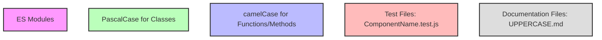

The project follows a consistent coding style:

- ES Modules for imports/exports
- Classes use PascalCase (e.g., `ApiKeyManager`)
- Functions/methods use camelCase (e.g., `createKey`)
- Test files follow the pattern `ComponentName.test.js`
- Documentation files use UPPERCASE.md

## API Gateway Extension

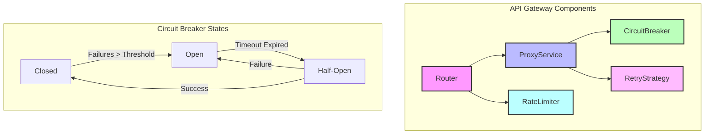

The API Gateway functionality extends the core key management features:

- Router with versioning and path matching
- Proxy service for forwarding requests
- Circuit breaker for fault tolerance
- Retry strategies for reliability
- Rate limiting for traffic management

## Configuration System

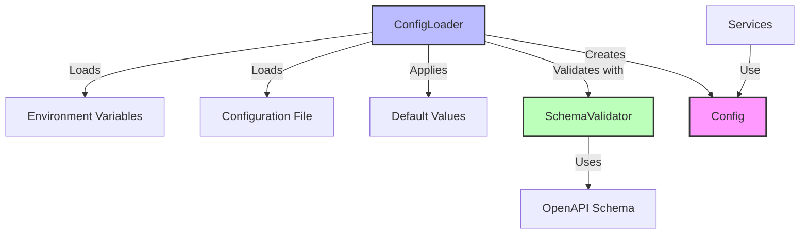

The configuration system provides a flexible way to configure the application:

- Configuration can be loaded from environment variables or files
- OpenAPI schema validation ensures configuration is valid
- Default values are applied for missing configuration
- Configuration is accessed through a unified interface