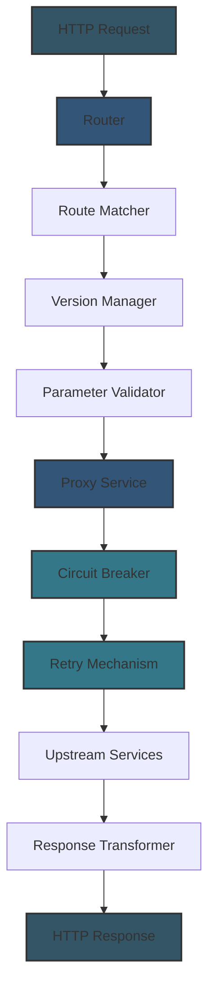

# API Gateway Features

This document details the API Gateway functionality implemented in the project, including routing, proxying, and fault tolerance mechanisms.

## Overview

The API Gateway functionality transforms this project from a simple API key manager to a full-featured API gateway with:

- Advanced request routing with regex pattern matching
- API versioning with header-based and URL-based version selection
- Path parameter validation
- Proxying requests to upstream services
- Circuit breaker pattern for fault tolerance
- Retry mechanism with exponential backoff
- Request and response transformation

## Architecture

The API Gateway is structured with several key components:



## Request Routing

The API Gateway implements sophisticated request routing:

### Regex Pattern Matching

Routes can be defined with regex patterns for flexible matching:

```javascript
// Example route with regex pattern
router.get(/^\/api\/products\/([^\/]+)\/reviews$/, reviewsController.getProductReviews);
```

This allows for:
- Dynamic path segments
- Optional parameters
- Pattern constraints
- Route grouping

### Path Parameter Extraction

Path parameters are automatically extracted and validated:

```javascript
// Route with named parameters
router.get('/api/users/:userId/posts/:postId', postsController.getUserPost);

// Access in controller
async getUserPost(request) {
  const { userId, postId } = request.params;
  // Use userId and postId
}
```

### Path Parameter Validation

Parameters can be validated against regex patterns:

```javascript
// Configuration-driven parameter validation
{
  "routing": {
    "paramValidation": {
      "userId": "^[0-9a-f]{24}$",
      "productId": "^[A-Z]{2}[0-9]{6}$"
    }
  }
}
```

Invalid parameters automatically return 400 Bad Request responses.

## API Versioning

The API Gateway supports comprehensive API versioning:

### Version Management

Versions are managed through configuration:

```json
{
  "routing": {
    "versioning": {
      "enabled": true,
      "current": "2",
      "supported": ["1", "2"],
      "deprecated": ["1"],
      "versionHeader": "X-API-Version"
    }
  }
}
```

### Version Resolution

API versions are resolved with the following priority:

1. URL path version (e.g., `/v2/api/resource`)
2. Custom version header (e.g., `X-API-Version: 2`)
3. Accept header with version (e.g., `Accept: application/vnd.company.v2+json`)
4. Default to the current version

### Version-Specific Routes

Routes can be defined for specific API versions:

```javascript
// Route for all versions
router.all('/api/resources', resourceController.getResources);

// Version-specific route
router.all('/api/resources/extended', {
  v1: resourceController.getBasicResources,
  v2: resourceController.getExtendedResources
});
```

### Version Deprecation

Deprecated versions return a warning header:

```
X-API-Version-Deprecated: Version 1 is deprecated and will be removed on 2024-12-31. Please use version 2.
```

## Proxying

The API Gateway can proxy requests to upstream services:

### Service Configuration

Upstream services are defined in configuration:

```json
{
  "proxy": {
    "enabled": true,
    "timeout": 30000,
    "services": {
      "userService": {
        "url": "https://users-api.example.com",
        "timeout": 5000
      },
      "orderService": {
        "url": "https://orders-api.example.com",
        "timeout": 10000
      }
    }
  }
}
```

### Request Proxying

Requests are proxied to the appropriate service:

```javascript
// Route that proxies to an upstream service
router.all('/api/users/:userId', async (request) => {
  return proxyService.forward(request, 'userService', {
    pathRewrite: { '^/api/users': '/v1/users' }
  });
});
```

### Path Rewriting

The Gateway can rewrite paths before forwarding:

```javascript
// Rewrite /api/products/123 to /v2/products/123
proxyService.forward(request, 'productService', {
  pathRewrite: { '^/api/products': '/v2/products' }
});
```

### Header Transformation

Headers can be added, modified, or removed:

```javascript
proxyService.forward(request, 'authService', {
  headers: {
    add: { 'X-Internal-Token': 'secret-token' },
    remove: ['X-API-Key', 'Cookie'],
    modify: { 'User-Agent': 'API-Gateway/1.0' }
  }
});
```

## Fault Tolerance

The API Gateway implements robust fault tolerance mechanisms:

### Circuit Breaker Pattern

The circuit breaker prevents cascading failures:

```javascript
// Circuit breaker configuration
{
  "proxy": {
    "circuitBreaker": {
      "enabled": true,
      "failureThreshold": 5,
      "resetTimeout": 30000
    }
  }
}
```

The circuit breaker has three states:
1. **Closed**: Requests flow normally
2. **Open**: Requests fail fast (after threshold of failures)
3. **Half-Open**: Limited requests to test recovery

### Retry Mechanism

Failed requests can be automatically retried:

```javascript
// Retry configuration
{
  "proxy": {
    "retry": {
      "enabled": true,
      "maxAttempts": 3,
      "backoffFactor": 2,
      "initialDelay": 100,
      "maxDelay": 3000
    }
  }
}
```

Features include:
- Exponential backoff
- Jitter for distributed systems
- Configurable retry conditions
- Request idempotency check

## Response Handling

The API Gateway provides response handling capabilities:

### Status Code Mapping

Upstream status codes can be remapped:

```javascript
proxyService.forward(request, 'legacyService', {
  statusCodeMap: {
    404: 200, // Return empty results instead of 404
    401: 403  // Map authentication errors to authorization errors
  }
});
```

### Response Transformation

Response bodies can be transformed:

```javascript
proxyService.forward(request, 'dataService', {
  transformResponse: (response) => {
    // Transform response data
    const data = response.data;
    return {
      ...data,
      _links: {
        self: `/api/data/${data.id}`,
        related: `/api/data/${data.id}/related`
      }
    };
  }
});
```

## Timeouts and Cancellation

Request timeouts are fully configurable:

```javascript
// Global timeout with per-service overrides
{
  "proxy": {
    "timeout": 30000,
    "services": {
      "fastService": {
        "url": "https://fast-api.example.com",
        "timeout": 5000
      }
    }
  }
}
```

Requests are automatically cancelled when timeouts occur, using the AbortController API.

## Monitoring and Metrics

The API Gateway provides monitoring capabilities:

- Request/response timing
- Success/failure rates
- Circuit breaker events
- Upstream service health
- Rate limiting metrics

## Security Considerations

The API Gateway includes several security features:

- **Request Validation**: Validates incoming requests before forwarding
- **Header Sanitization**: Removes or modifies sensitive headers
- **Upstream Authentication**: Adds internal authentication for upstream services
- **Response Scrubbing**: Removes sensitive data from responses
- **Rate Limiting**: Protects upstream services from overload
- **Timeout Management**: Prevents resource exhaustion from slow clients

## API Gateway Usage Examples

### Basic Proxying Example

```javascript
// Route definition with proxying
router.get('/api/products', async (request) => {
  return proxyService.forward(request, 'productService');
});
```

### Advanced Proxying with Transformation

```javascript
// Complex proxy with transformations
router.get('/api/products/:productId', async (request) => {
  return proxyService.forward(request, 'productService', {
    pathRewrite: { '^/api': '/v2' },
    headers: {
      add: { 'X-Internal-Token': process.env.INTERNAL_TOKEN },
      remove: ['X-API-Key']
    },
    transformResponse: (response) => {
      // Add HATEOAS links
      response.data._links = {
        self: `/api/products/${request.params.productId}`,
        reviews: `/api/products/${request.params.productId}/reviews`
      };
      return response.data;
    }
  });
});
```

### Versioned API Example

```javascript
// Version-specific routes
router.get('/api/features', {
  v1: async (request) => {
    // v1 implementation
    return { features: ['basic', 'standard'] };
  },
  v2: async (request) => {
    // v2 implementation with more features
    return { 
      features: ['basic', 'standard', 'premium', 'enterprise'],
      categories: true
    };
  }
});
```

### Fault Tolerance Example

```javascript
// Route with custom fault tolerance settings
router.post('/api/orders', async (request) => {
  return proxyService.forward(request, 'orderService', {
    // Order-specific fault tolerance
    retry: {
      maxAttempts: 5,
      backoffFactor: 1.5
    },
    circuitBreaker: {
      failureThreshold: 10,
      resetTimeout: 60000
    }
  });
});
```

## Future Enhancements

Planned enhancements to the API Gateway include:

- **Service Discovery**: Automatic discovery of upstream services
- **Load Balancing**: Distribution of requests across multiple instances
- **API Composition**: Combining responses from multiple services
- **Request Aggregation**: Batching multiple requests into single operations
- **WebSocket Support**: Proxying WebSocket connections
- **gRPC Support**: Proxying gRPC requests
- **GraphQL Support**: GraphQL query routing and composition

## See Also

- [Architecture Overview](./overview.md)
- [Configuration Reference](../reference/configuration-reference.md)
- [API Reference](../reference/api-reference.md)