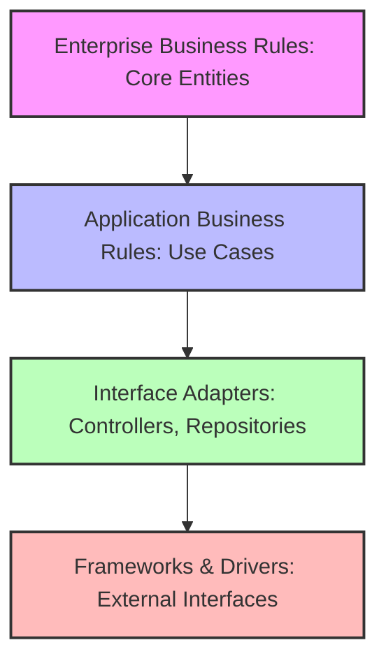
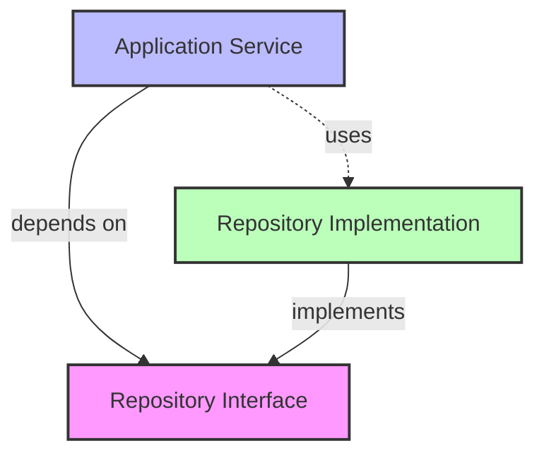

# Clean Architecture Implementation

This document details how Clean Architecture principles are implemented in the API Gateway Workers project.

## Clean Architecture Overview

Clean Architecture is a software design philosophy that separates concerns into distinct layers, with dependencies pointing inward toward the core domain. The key principles include:

1. **Independence from Frameworks**: The architecture doesn't depend on the existence of some library or framework
2. **Testability**: Business rules can be tested without external elements (UI, database, etc.)
3. **Independence from UI**: The UI can change easily without changing the rest of the system
4. **Independence from Database**: Business rules aren't bound to a specific database
5. **Independence from External Agencies**: Business rules don't know anything about interfaces to the outside world

## Layer Structure

The API Gateway Workers implements Clean Architecture with the following layers:



In our implementation, these layers map to:

### Domain Layer (Enterprise Business Rules)

Location: `src/core/domain/`

This innermost layer contains the core business logic and entities:

- **Entities**: API Key models with properties and behaviors
- **Value Objects**: Immutable objects representing domain concepts
- **Domain Services**: Core business logic services like key validation
- **Domain Events**: Events representing significant domain occurrences
- **Repository Interfaces**: Data access interfaces (not implementations)

Example domain entity:
```javascript
// src/core/domain/ApiKey.js
export class ApiKey {
  constructor({ id, name, value, owner, scopes, status, createdAt, expiresAt }) {
    this.id = id;
    this.name = name;
    this.value = value;
    this.owner = owner;
    this.scopes = scopes || [];
    this.status = status || 'active';
    this.createdAt = createdAt || new Date();
    this.expiresAt = expiresAt;
  }
  
  isExpired() {
    if (!this.expiresAt) return false;
    return new Date() > this.expiresAt;
  }
  
  hasScope(requiredScope) {
    return this.scopes.includes(requiredScope) || this.scopes.includes('*');
  }
  
  isActive() {
    return this.status === 'active' && !this.isExpired();
  }
}
```

Example repository interface:
```javascript
// src/core/domain/KeyRepository.js
export class KeyRepository {
  async createKey(keyData) { throw new Error('Not implemented'); }
  async getKey(id) { throw new Error('Not implemented'); }
  async getKeyByValue(value) { throw new Error('Not implemented'); }
  async listKeys(filters) { throw new Error('Not implemented'); }
  async updateKey(id, keyData) { throw new Error('Not implemented'); }
  async deleteKey(id) { throw new Error('Not implemented'); }
}
```

### Application Layer (Application Business Rules)

Location: `src/core/application/`

This layer contains application-specific business rules and use cases:

- **Use Cases**: Implemented as command handlers
- **Command Objects**: Represent user intents
- **Command Bus**: Routes commands to appropriate handlers
- **Application Services**: Coordinate domain entities and services

Example command:
```javascript
// src/core/application/commands/CreateKeyCommand.js
export class CreateKeyCommand {
  constructor({ name, owner, scopes, expiresAt }) {
    if (!name) throw new Error('Name is required');
    if (!owner) throw new Error('Owner is required');
    
    this.name = name;
    this.owner = owner;
    this.scopes = scopes || [];
    this.expiresAt = expiresAt;
  }
}
```

Example command handler:
```javascript
// src/core/application/handlers/CreateKeyHandler.js
export class CreateKeyHandler {
  constructor({ keyRepository, securityService }) {
    this.keyRepository = keyRepository;
    this.securityService = securityService;
  }
  
  async handle(command) {
    const keyValue = await this.securityService.generateSecureKey();
    const hashedValue = await this.securityService.hashKeyValue(keyValue);
    
    const keyData = {
      name: command.name,
      owner: command.owner,
      scopes: command.scopes,
      value: hashedValue,
      expiresAt: command.expiresAt,
      status: 'active',
      createdAt: new Date()
    };
    
    const createdKey = await this.keyRepository.createKey(keyData);
    
    // Return created key with plaintext value for first-time retrieval
    return {
      ...createdKey,
      value: keyValue
    };
  }
}
```

### Interface Adapters Layer

Location: `src/api/` and `src/infrastructure/`

This layer adapts between the application layer and external interfaces:

- **Controllers**: Convert HTTP requests to domain commands
- **Presenters**: Format domain data for external presentation
- **Repository Implementations**: Implement repository interfaces
- **Gateway Implementations**: External service interfaces
- **DTO Mappers**: Convert between domain and external data formats

Example controller:
```javascript
// src/api/controllers/KeysController.js
export class KeysController {
  constructor({ commandBus, logger }) {
    this.commandBus = commandBus;
    this.logger = logger;
  }
  
  async createKey(request) {
    try {
      const command = new CreateKeyCommand({
        name: request.body.name,
        owner: request.body.owner,
        scopes: request.body.scopes,
        expiresAt: request.body.expiresAt ? new Date(request.body.expiresAt) : null
      });
      
      const result = await this.commandBus.execute(command);
      
      return {
        status: 201,
        body: result
      };
    } catch (error) {
      this.logger.error('Error creating key', error);
      throw error;
    }
  }
}
```

Example repository implementation:
```javascript
// src/infrastructure/repositories/DurableObjectRepository.js
export class DurableObjectRepository extends KeyRepository {
  constructor(env) {
    super();
    this.env = env;
  }
  
  async createKey(keyData) {
    const id = crypto.randomUUID();
    const keyManagerId = this.env.KEY_MANAGER.idFromName('default');
    const keyManager = this.env.KEY_MANAGER.get(keyManagerId);
    
    return keyManager.fetch('/keys', {
      method: 'POST',
      body: JSON.stringify({
        id,
        ...keyData
      })
    }).then(response => response.json());
  }
  
  // Other methods implemented...
}
```

### Frameworks & Drivers Layer

Location: `src/worker.js` and various infrastructure implementations

This outermost layer connects to external frameworks and services:

- **Web Framework**: Cloudflare Workers runtime
- **Router**: URL routing and request handling
- **Durable Objects**: Storage implementation
- **External APIs**: Connections to external services
- **Configuration**: System configuration sources

Example worker setup:
```javascript
// src/worker.js
export default {
  async fetch(request, env, ctx) {
    const container = setupContainer(env);
    const router = container.get('router');
    
    return router.handle(request);
  }
};
```

## Dependency Rule

A fundamental principle of Clean Architecture is the dependency rule: source code dependencies only point inward. This means:

1. Inner layers don't know about outer layers
2. Outer layers depend on inner layers
3. Interfaces are defined in inner layers
4. Implementations are provided by outer layers

In our implementation:

- The domain layer has no dependencies on other layers
- The application layer depends only on the domain layer
- The interface adapters layer depends on the application and domain layers
- The frameworks & drivers layer depends on the interface adapters layer

## Dependency Inversion with Interfaces

We use interfaces and dependency injection to maintain the dependency rule while allowing inner layers to use functionality from outer layers:



Examples:

1. The `KeyRepository` interface is defined in the domain layer
2. The `DurableObjectRepository` implementation is in the infrastructure layer
3. Command handlers in the application layer depend on the `KeyRepository` interface
4. At runtime, the `DurableObjectRepository` is injected into the handlers

## Dependency Injection Container

We use a simple dependency injection container to wire everything together:

```javascript
// src/setupContainer.js
export function setupContainer(env) {
  const container = new Container();
  
  // Register infrastructure services
  container.register('logger', () => new Logger(env.CONFIG_LOGGING_LEVEL || 'info'));
  container.register('keyRepository', () => new DurableObjectRepository(env));
  
  // Register domain services
  container.register('securityService', () => new SecurityService(env.HMAC_SECRET));
  
  // Register application services
  container.register('createKeyHandler', (c) => new CreateKeyHandler({
    keyRepository: c.get('keyRepository'),
    securityService: c.get('securityService')
  }));
  
  // Register command bus
  container.register('commandBus', (c) => {
    const bus = new CommandBus();
    bus.register(CreateKeyCommand, c.get('createKeyHandler'));
    // Register other commands...
    return bus;
  });
  
  // Register controllers
  container.register('keysController', (c) => new KeysController({
    commandBus: c.get('commandBus'),
    logger: c.get('logger')
  }));
  
  // Register router
  container.register('router', (c) => {
    const router = new Router();
    router.post('/api/keys', c.get('keysController').createKey.bind(c.get('keysController')));
    // Register other routes...
    return router;
  });
  
  return container;
}
```

## Benefits of Clean Architecture in this Project

The Clean Architecture approach has provided several benefits:

1. **Testability**: Each layer can be tested in isolation with mocks for dependencies
2. **Maintainability**: Clear separation of concerns makes code easier to understand and modify
3. **Flexibility**: Storage implementations can be changed without affecting business logic
4. **Scalability**: Core business logic is decoupled from infrastructure concerns
5. **Security**: Domain rules are centralized and consistently applied

## Examples from the Codebase

### Domain Logic Protection

Domain rules are protected from external concerns:

```javascript
// Domain rule in the ApiKey entity
isValidForRequest(request, requiredScopes) {
  if (!this.isActive()) return false;
  if (this.isRateLimited()) return false;
  
  // Check scopes
  for (const scope of requiredScopes) {
    if (!this.hasScope(scope)) return false;
  }
  
  return true;
}
```

This domain logic is always enforced, regardless of how the API key is stored or retrieved.

### Use Case Implementation

Commands and handlers provide clear application use cases:

```javascript
// Clear use case for revoking a key
export class RevokeKeyCommand {
  constructor(id) {
    this.id = id;
  }
}

export class RevokeKeyHandler {
  constructor({ keyRepository }) {
    this.keyRepository = keyRepository;
  }
  
  async handle(command) {
    const key = await this.keyRepository.getKey(command.id);
    if (!key) throw new NotFoundError(`Key with ID ${command.id} not found`);
    
    key.status = 'revoked';
    return this.keyRepository.updateKey(command.id, key);
  }
}
```

### Interface Adapters

Controllers adapt between HTTP and domain layers:

```javascript
async validateKey(request) {
  try {
    const apiKey = request.headers.get('X-API-Key');
    if (!apiKey) throw new AuthenticationError('API key is required');
    
    const command = new ValidateKeyCommand(apiKey, request.body.scopes || []);
    const result = await this.commandBus.execute(command);
    
    return {
      status: 200,
      body: {
        valid: true,
        key: {
          id: result.id,
          name: result.name,
          owner: result.owner,
          scopes: result.scopes
        }
      }
    };
  } catch (error) {
    if (error instanceof AuthenticationError || error instanceof AuthorizationError) {
      return {
        status: error instanceof AuthenticationError ? 401 : 403,
        body: {
          valid: false,
          error: error.message
        }
      };
    }
    throw error;
  }
}
```

## See Also

- [Architecture Overview](overview.md) - High-level system architecture
- [Command Pattern](command-pattern.md) - Command pattern implementation details
- [Directory Structure](directory-structure.md) - Code organization and structure