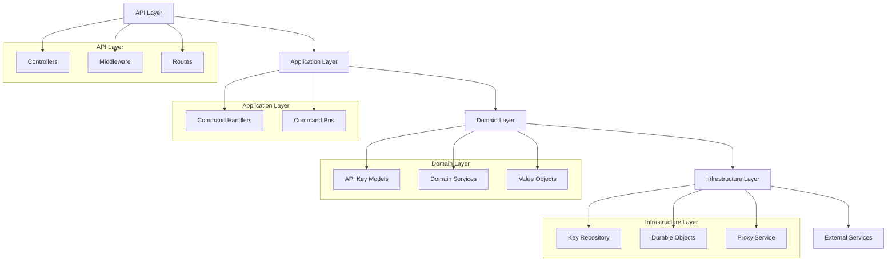
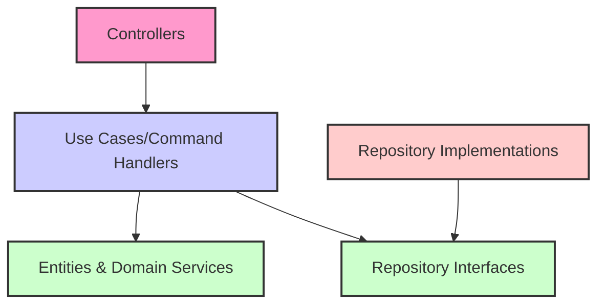
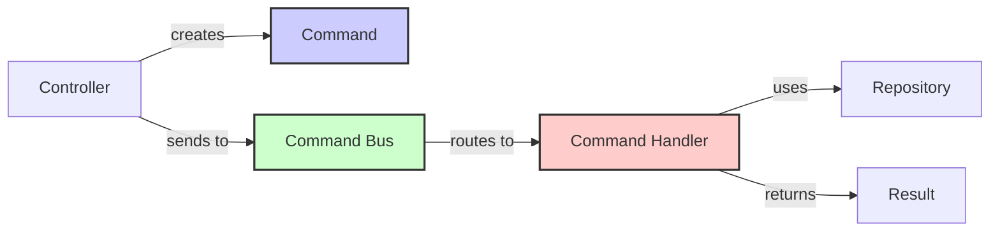
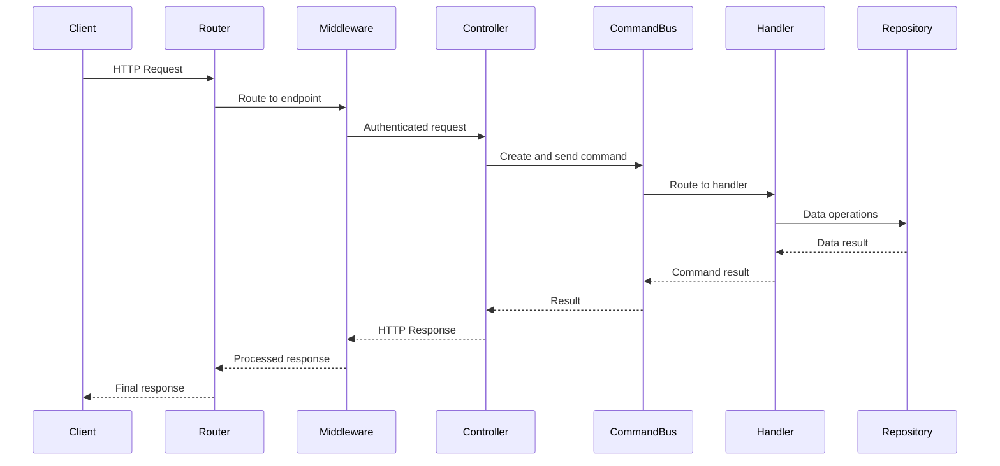
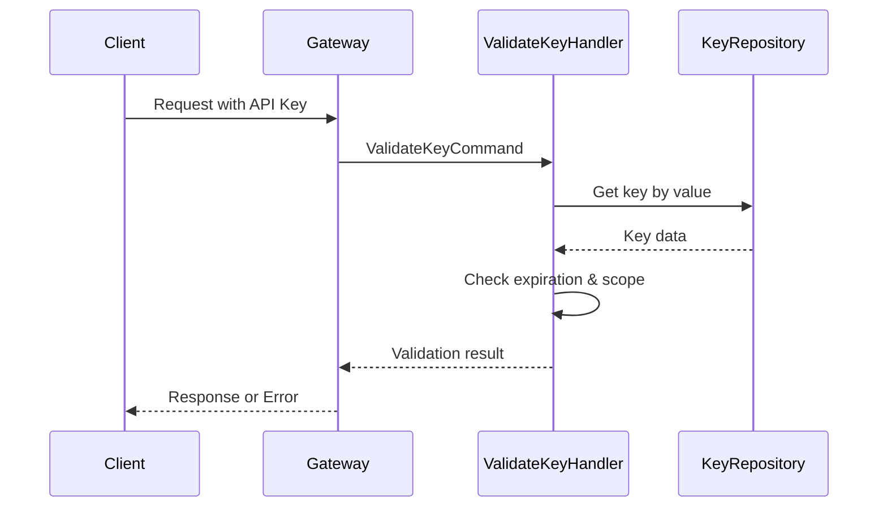
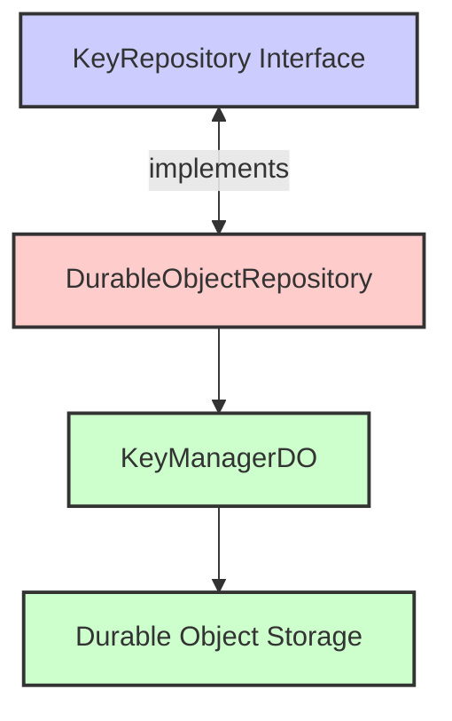
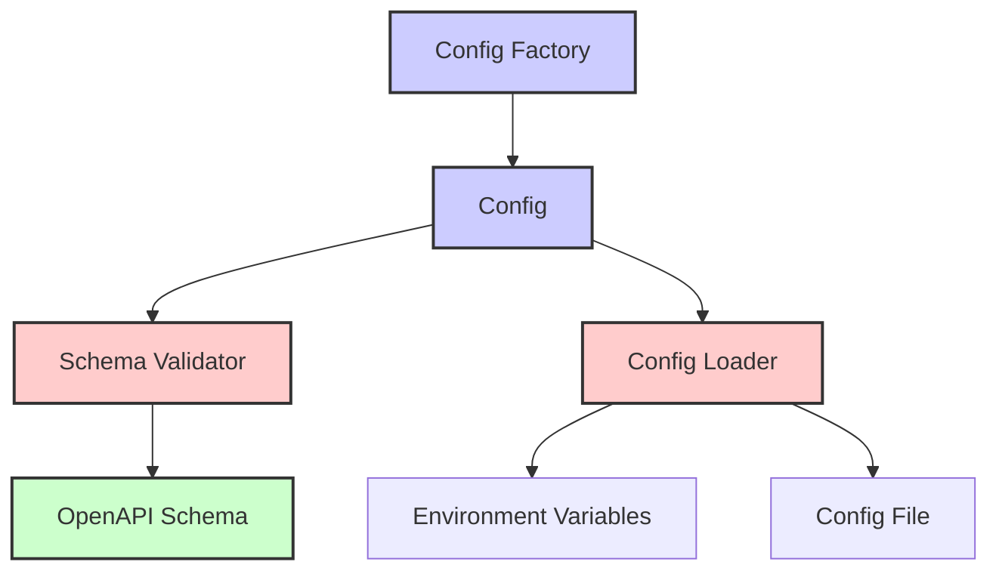

# API Gateway Architecture Overview

This document provides a high-level overview of the API Gateway Workers architecture, design patterns, and implementation decisions.

## Architectural Goals

The API Gateway Workers architecture was designed with the following goals:

1. **Modularity**: Components should be loosely coupled and independently testable
2. **Maintainability**: Clear separation of concerns for easier maintenance
3. **Scalability**: Built to scale with Cloudflare's global network
4. **Security**: Security-first design approach
5. **Extensibility**: Easy to extend with new features and capabilities

## System Components

The API Gateway Workers consists of the following major components:



### API Layer

The API Layer is responsible for handling HTTP requests and responses. It includes:

- **Controllers**: Handle specific API endpoints and translate between HTTP and domain commands
- **Middleware**: Cross-cutting concerns like authentication, logging, CORS, and error handling
- **Routes**: URL routing and path parameter extraction

### Application Layer

The Application Layer contains application-specific business logic:

- **Command Handlers**: Execute business logic for specific commands
- **Command Bus**: Routes commands to appropriate handlers
- **Use Cases**: Represent specific application use cases (implemented as handler methods)

### Domain Layer

The Domain Layer represents the core business domain:

- **API Key Models**: Domain entities like API keys
- **Domain Services**: Core business logic that doesn't fit in entities
- **Value Objects**: Immutable objects representing concepts like commands

### Infrastructure Layer

The Infrastructure Layer provides technical capabilities:

- **Repositories**: Data access abstraction (KeyRepository)
- **Durable Objects**: Cloudflare storage implementation
- **Proxy Service**: Forwards requests to backend services
- **Configuration**: System configuration

## Clean Architecture Implementation

The API Gateway Workers implements Clean Architecture principles:



Key aspects of this implementation:

1. **Dependency Rule**: Dependencies point inward, with the domain layer having no dependencies on outer layers
2. **Use Cases**: Implemented as command handlers
3. **Interfaces**: Repository interfaces defined in the domain layer
4. **Dependency Injection**: Outer layers injected into inner layers through interfaces

## Command Pattern

The API Gateway Workers uses the Command Pattern for business operations:



Commands include:
- CreateKeyCommand
- GetKeyCommand
- ListKeysCommand
- RevokeKeyCommand
- RotateKeyCommand
- ValidateKeyCommand

See the [Command Pattern documentation](command-pattern.md) for more details.

## Data Flow

### Request Flow



### API Key Validation Flow



## API Gateway Functionality

The system implements API Gateway functionality:

1. **Request Routing**: Route requests to backend services
2. **Path Parameter Validation**: Validate URL path parameters
3. **API Versioning**: Support for multiple API versions
4. **Request Transformation**: Modify requests before forwarding
5. **Response Transformation**: Modify responses from backends
6. **Circuit Breaker**: Fail fast when backends are unavailable
7. **Retry Mechanism**: Retry failed requests with backoff

See the [API Gateway documentation](api-gateway.md) for details.

## Key Management Functionality

The system provides key management capabilities:

1. **Key Creation**: Generate new API keys with scopes
2. **Key Validation**: Validate keys and check permissions
3. **Key Revocation**: Revoke existing keys
4. **Key Rotation**: Rotate keys while maintaining old ones temporarily
5. **Usage Tracking**: Track key usage statistics
6. **Rate Limiting**: Limit request rates per key

## Storage Architecture

API Gateway Workers uses Cloudflare Durable Objects for storage:



Storage features:
- ACID transactions for key operations
- Global distribution via Cloudflare's network
- Strong consistency guarantees
- Encryption of sensitive data at rest

## Security Architecture

Security is implemented at multiple levels:

1. **Transport Security**: HTTPS via Cloudflare
2. **Authentication**: API key validation
3. **Authorization**: Scope-based permissions
4. **Encryption**: Keys encrypted at rest
5. **HMAC Verification**: Tamper-proof key validation
6. **Rate Limiting**: Prevent abuse
7. **Input Validation**: Prevent injection attacks

See the [Security Reference](../reference/security-reference.md) for details.

## Configuration Architecture

The configuration system follows a layered approach:



Configuration features:
- Multiple sources with clear priorities
- Schema validation with OpenAPI
- Hierarchical structure
- Dynamic updates

## Dependency Injection

The project uses a simple dependency injection container:

```javascript
// Container registration
const container = new Container();
container.register('keyRepository', () => new DurableObjectRepository(env));
container.register('keyService', (c) => new KeyService(c.get('keyRepository')));
container.register('keysController', (c) => new KeysController({
  keyService: c.get('keyService'),
  logger: c.get('logger')
}));

// Usage
const keysController = container.get('keysController');
```

## Error Handling

The error handling approach uses a hierarchy of domain-specific errors:

```
ApiError (base class)
├── ValidationError
├── AuthenticationError
├── AuthorizationError
├── NotFoundError
├── ConflictError
├── RateLimitError
└── InternalError
```

Errors are converted to appropriate HTTP responses by middleware.

## See Also

- [Clean Architecture](clean-architecture.md) - Detailed explanation of the clean architecture implementation
- [Command Pattern](command-pattern.md) - Detailed explanation of the command pattern implementation
- [Directory Structure](directory-structure.md) - Code organization and structure
- [API Gateway Features](api-gateway.md) - API Gateway functionality details