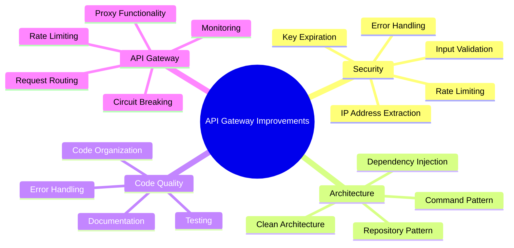
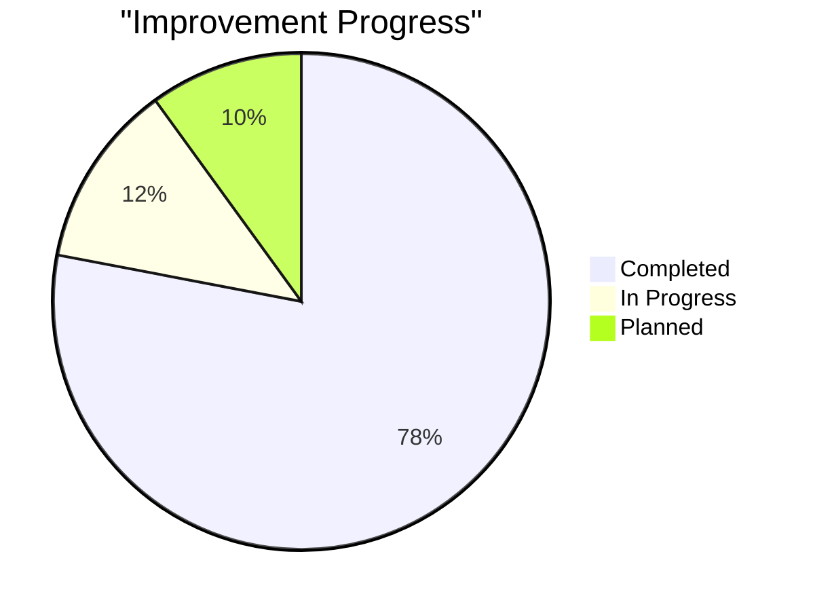
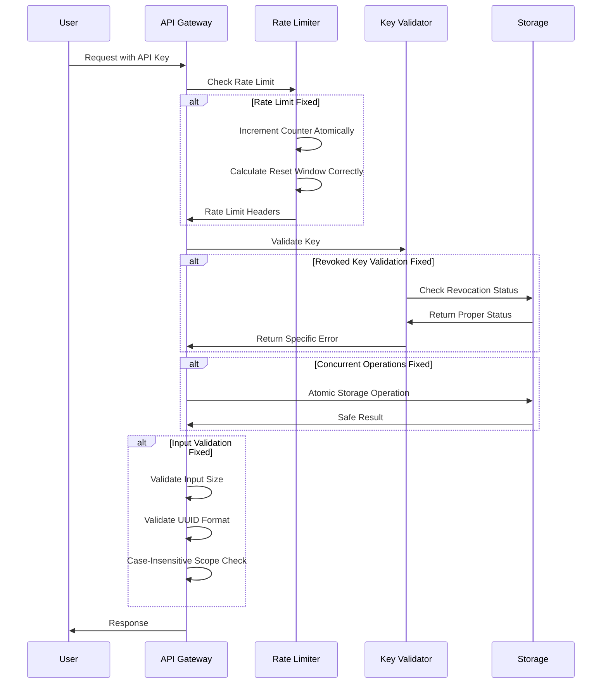
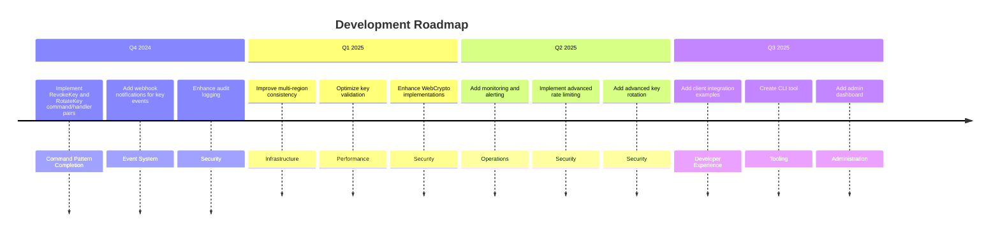
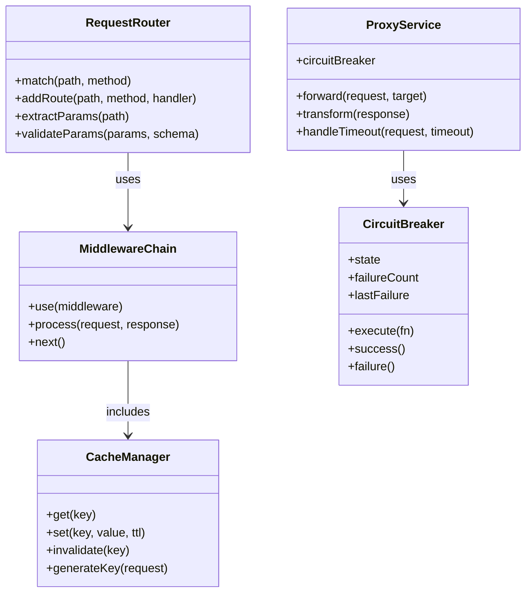

# Improvements Summary

This document summarizes the improvements made to the API Key Manager codebase.

## Overview of Improvements



## Progress Dashboard



## Code Improvements

### Security Enhancements

```mermaid
graph TD
    subgraph Security_Enhancements["Security"]
        IP[IP Address Extraction]
        Rate[Rate Limiting]
        Input[Input Validation]
        Error[Error Handling]
        Key[Key Expiration]
    end
    
    IP --> IP1[X-Forwarded-For Chain Handling]
    IP --> IP2[Cloudflare Header Priority]
    IP --> IP3[IP Format Validation]
    
    Rate --> Rate1[Request Counting]
    Rate --> Rate2[Endpoint Isolation]
    Rate --> Rate3[Improved Headers]
    
    Input --> Input1[Size Limits]
    Input --> Input2[Format Validation]
    Input --> Input3[Error Handling]
    
    Error --> Error1[Storage Operations]
    Error --> Error2[Partial Operation Cleanup]
    Error --> Error3[Non-blocking Updates]
    
    Key --> Key1[Automatic Cleanup]
    Key --> Key2[Stale Entry Management]
    Key --> Key3[Expiration Handling]
    
    style Security_Enhancements fill:#f9f,stroke:#333,stroke-width:2px
    style IP fill:#bbf,stroke:#333,stroke-width:1px
    style Rate fill:#bbf,stroke:#333,stroke-width:1px
    style Input fill:#bbf,stroke:#333,stroke-width:1px
    style Error fill:#bbf,stroke:#333,stroke-width:1px
    style Key fill:#bbf,stroke:#333,stroke-width:1px
```



1. **IP Address Extraction**
   - Added proper sanitization and validation to prevent IP spoofing
   - Prioritized trusted Cloudflare headers
   - Added handling for X-Forwarded-For chains
   - Implemented format validation for IP addresses

2. **Rate Limiting**
   - Fixed rate limiting implementation to correctly handle request counting
   - Improved limit checking logic
   - Enhanced header handling for rate limit information
   - Added proper isolation between clients and endpoints

3. **Input Validation**
   - Added size limits to all input fields
   - Implemented more robust validation for API key creation
   - Added error handling for malformed inputs
   - Improved UUID validation

4. **Error Handling**
   - Enhanced error handling for storage operations
   - Added cleanup of partial operations on failure
   - Improved error messages for better security
   - Added non-blocking updates for non-critical operations

5. **Key Expiration**
   - Fixed key expiration handling
   - Improved automatic cleanup of expired keys
   - Added cleanup of stale lookup entries
   - Enhanced error handling in cleanup operations

### Code Organization

```mermaid
graph TD
    subgraph "Documentation Improvements"
        D1[API Documentation]
        D2[Architecture Documentation]
        D3[Security Documentation]
        D4[Code Organization Documentation]
        D5[Quick Start Guide]
        D6[Contribution Guidelines]
    end
    
    subgraph "Code Structure Improvements"
        C1[Separation of Concerns]
        C2[Utility Organization]
        C3[Naming Conventions]
        C4[Readability]
    end
    
    subgraph "Configuration Improvements"
        F1[EditorConfig]
        F2[Prettier Configuration]
        F3[VS Code Settings]
        F4[.gitignore Rules]
    end
    
    style "Documentation Improvements" fill:#f9f,stroke:#333,stroke-width:2px
    style "Code Structure Improvements" fill:#bbf,stroke:#333,stroke-width:2px
    style "Configuration Improvements" fill:#bfb,stroke:#333,stroke-width:2px
```

1. **Documentation Structure**
   - Created comprehensive API documentation
   - Added architecture documentation
   - Created security implementation details
   - Added code organization documentation
   - Created quick start guide
   - Enhanced contribution guidelines
   - Added changelog

2. **Code Structure**
   - Clearer separation of concerns
   - Better organization of utility functions
   - Consistent naming conventions
   - Improved readability and maintainability

3. **Configuration Files**
   - Updated EditorConfig for consistent formatting
   - Enhanced Prettier configuration
   - Improved VS Code settings
   - Enhanced .gitignore rules

## Testing Improvements

```mermaid
flowchart TD
    subgraph "Test Suite Enhancements"
        A[Fixed Advanced Tests] --> A1[security.advanced.test.js]
        A --> A2[ApiKeyManager.advanced.test.js]
        A --> A3[Updated Test Expectations]
        A --> A4[Enhanced Mocks]
        
        B[Integration Testing] --> B1[Fixed Integration Script]
        B --> B2[API Endpoint Coverage]
        B --> B3[Error Case Testing]
        B --> B4[Revocation Behavior]
        
        C[Testing Completeness] --> C1[264 Tests Passing]
        C --> C2[Admin Function Tests]
        C --> C3[Error Handling Coverage]
        C --> C4[Test Utilities]
    end
    
    style "Test Suite Enhancements" fill:#f9f,stroke:#333,stroke-width:2px
    style A fill:#bbf,stroke:#333,stroke-width:1px
    style B fill:#bbf,stroke:#333,stroke-width:1px
    style C fill:#bbf,stroke:#333,stroke-width:1px
```

1. **Fixed Advanced Tests**
   - Fixed security.advanced.test.js failures
   - Fixed ApiKeyManager.advanced.test.js failures
   - Updated test expectations to match security requirements
   - Enhanced mock implementations for better testing

2. **Integration Testing**
   - Fixed integration test script
   - Ensured all API endpoints are properly tested
   - Added testing for error cases
   - Verified proper revocation behavior

## Specific Security Fixes



1. **Fixed rate limit calculation**
   - Previous implementation had a bug in the remaining count calculation
   - Fixed when counter increments to prevent race conditions
   - Improved reset logic to ensure proper window timing

2. **Fixed revoked key validation**
   - Maintained lookup entries for revoked keys to report proper status
   - Improved validation responses for revoked vs. invalid keys
   - Enhanced error messages for better security

3. **Fixed concurrent operation safety**
   - Improved handling of concurrent key validations
   - Enhanced storage operations for atomicity
   - Fixed potential race conditions in key updates

4. **Fixed input validation**
   - Added limits to prevent DoS attacks via large inputs
   - Improved validation of UUID format
   - Enhanced scope validation for case-insensitivity

## Recent Improvements

```mermaid
graph TD
    subgraph "Architecture Improvements"
        A1[Clean Architecture]
        A2[Command Pattern]
        A3[Error Handling]
        A4[Admin Management]
        A5[ValidateKey Command]
    end
    
    subgraph "Code Quality Improvements"
        C1[Storage Error Handling]
        C2[Separation of Concerns]
        C3[Documentation]
        C4[Error Logging]
    end
    
    subgraph "Testing Completeness"
        T1[264 Passing Tests]
        T2[Admin Tests]
        T3[Error Scenarios]
        T4[Test Utilities]
        T5[Mock Configuration]
    end
    
    A1 -->|Implemented| A2
    A2 -->|Enhanced| A3
    A3 -->|Improved| A4
    A4 -->|Added| A5
    
    C1 -->|Better| C2
    C2 -->|Clear| C3
    C3 -->|Helpful| C4
    
    T1 -->|Including| T2
    T2 -->|And| T3
    T3 -->|With| T4
    T4 -->|Using| T5
    
    style "Architecture Improvements" fill:#f9f,stroke:#333,stroke-width:2px
    style "Code Quality Improvements" fill:#bfb,stroke:#333,stroke-width:2px
    style "Testing Completeness" fill:#bbf,stroke:#333,stroke-width:2px
```

1. **Testing Completeness**
   - Fixed all failing tests with comprehensive test suite (264 tests passing)
   - Added dedicated test files for admin management functions
   - Improved test coverage for error handling scenarios
   - Enhanced test utilities for consistent testing approach
   - Fixed mock configurations for consistent test behavior

2. **Architecture Improvements**
   - Implemented clean architecture with clear layer separation
   - Added command pattern with dedicated command objects and handlers
   - Enhanced error handling across the codebase
   - Improved admin management with better error handling
   - Implemented ValidateKey command and handler

3. **Code Quality Improvements**
   - Added error handling for storage operations
   - Improved separation of concerns with command pattern
   - Enhanced documentation with architecture details
   - Fixed console error logging for better debugging

## Next Steps



1. **Additional Functionality**
   - Implement RevokeKey and RotateKey command/handler pairs
   - Add webhook notifications for key events
   - Enhance audit logging with more detailed events
   - Improve multi-region consistency
   - Add key tagging and organization features

2. **Performance and Security**
   - Optimize key validation for high-traffic scenarios
   - Enhance WebCrypto implementations
   - Add monitoring and alerting for security events
   - Implement advanced rate limiting strategies
   - Add advanced key rotation mechanisms

3. **Developer Experience**
   - Add more client integration examples
   - Enhance documentation with more examples
   - Create CLI tool for key management
   - Add admin dashboard
   - Improve error messages for better debugging

## API Gateway Roadmap

```mermaid
graph TB
    subgraph "Phase 1: Foundation"
        Routing[Request Routing]
        Middleware[Middleware System]
        Caching[Caching Layer]
        Proxy[Proxy Functionality]
    end
    
    subgraph "Phase 2: Advanced Features"
        Discovery[Service Discovery]
        LoadBalancing[Load Balancing]
        Transformation[Transformation]
        Traffic[Traffic Management]
    end
    
    subgraph "Phase 3: Enterprise Capabilities"
        Protocol[Protocol Support]
        Composition[API Composition]
        Analytics[Analytics Dashboard]
        Deployment[Deployment Strategies]
    end
    
    "Phase 1: Foundation" --> "Phase 2: Advanced Features"
    "Phase 2: Advanced Features" --> "Phase 3: Enterprise Capabilities"
    
    Routing --> Discovery
    Proxy --> LoadBalancing
    Middleware --> Transformation
    Proxy --> Traffic
    
    Discovery --> Composition
    Transformation --> Protocol
    Traffic --> Analytics
    LoadBalancing --> Deployment
    
    style "Phase 1: Foundation" fill:#bbf,stroke:#333,stroke-width:2px
    style "Phase 2: Advanced Features" fill:#bfb,stroke:#333,stroke-width:2px
    style "Phase 3: Enterprise Capabilities" fill:#f9f,stroke:#333,stroke-width:2px
```

As part of our evolution toward becoming a full-fledged API gateway, we are planning the following improvements:

### Phase 1: Foundation



#### Request Routing
- Implement advanced routing patterns with regex support
- Add path parameter extraction and validation
- Support for route priorities and wildcards
- Add route versioning capabilities

#### Middleware System
- Create pluggable middleware framework
- Add request/response transformation middleware
- Implement request validation middleware
- Add compression and decompression support

#### Caching Layer
- Implement response caching with configurable TTL
- Add cache invalidation mechanisms
- Support for conditional requests (If-Modified-Since, ETag)
- Add cache control header support

#### Proxy Functionality
- Create backend service proxy capabilities
- Add request forwarding with header preservation
- Implement timeout handling for backend services
- Add circuit breaker pattern for backend failures

### Phase 2: Advanced Features

```mermaid
graph LR
    subgraph "Service Discovery"
        Registry[Service Registry]
        Health[Health Checking]
        Discovery[Dynamic Discovery]
        Lookup[Service Lookup]
    end
    
    subgraph "Load Balancing"
        RoundRobin[Round Robin]
        LeastConn[Least Connections]
        Weighted[Weighted Balancing]
        Affinity[Session Affinity]
    end
    
    subgraph "Transformation"
        JSON[JSON Transformation]
        Mapping[Request/Response Mapping]
        Template[Templates]
        Headers[Header Modification]
    end
    
    subgraph "Traffic Management"
        RateLimit[Rate Limiting]
        Throttle[Request Throttling]
        Circuit[Circuit Breaking]
        Retry[Retry Policies]
    end
    
    Registry --> Discovery
    Health --> Registry
    Discovery --> Lookup
    
    RoundRobin --> Weighted
    LeastConn --> Affinity
    
    JSON --> Mapping
    Mapping --> Template
    Template --> Headers
    
    RateLimit --> Throttle
    Circuit --> Retry
    
    style "Service Discovery" fill:#f9f,stroke:#333,stroke-width:2px
    style "Load Balancing" fill:#bbf,stroke:#333,stroke-width:2px
    style "Transformation" fill:#bfb,stroke:#333,stroke-width:2px
    style "Traffic Management" fill:#fbb,stroke:#333,stroke-width:2px
```

#### Service Discovery
- Implement service registry with health checking
- Add dynamic endpoint discovery
- Create service lookup by name and metadata
- Implement service health status propagation

#### Load Balancing
- Add multiple load balancing strategies
- Implement weighted round-robin balancing
- Add least connections balancing
- Support for session affinity

#### Transformation Capabilities
- Add JSON transformation support
- Implement request/response mapping
- Create template-based transformations
- Add header modification capabilities

#### Traffic Management
- Implement advanced rate limiting by various criteria
- Add request throttling capabilities
- Implement circuit breaking for backend services
- Add retry policies for failed requests

### Phase 3: Enterprise Capabilities

```mermaid
flowchart TD
    subgraph "Protocol Support"
        WebSocket[WebSocket Proxy]
        GRPC[gRPC-Web Support]
        Conversion[Protocol Conversion]
        SSE[Server-Sent Events]
    end
    
    subgraph "API Composition"
        Aggregation[Request Aggregation]
        Merging[Response Merging]
        Mashup[API Mashup]
        Parallel[Parallel Requests]
    end
    
    subgraph "Analytics Dashboard"
        Performance[Performance Monitoring]
        Latency[Latency Tracking]
        Usage[Usage Analytics]
        Alerting[Performance Alerting]
    end
    
    subgraph "Deployment Strategies"
        BlueGreen[Blue/Green Deployment]
        Canary[Canary Deployment]
        Shadowing[Traffic Shadowing]
        AB[A/B Testing]
    end
    
    WebSocket --> Conversion
    GRPC --> SSE
    
    Aggregation --> Merging
    Mashup --> Parallel
    
    Performance --> Latency
    Usage --> Alerting
    
    BlueGreen --> Canary
    Shadowing --> AB
    
    style "Protocol Support" fill:#f9f,stroke:#333,stroke-width:2px
    style "API Composition" fill:#bbf,stroke:#333,stroke-width:2px
    style "Analytics Dashboard" fill:#bfb,stroke:#333,stroke-width:2px
    style "Deployment Strategies" fill:#fbb,stroke:#333,stroke-width:2px
```

#### Protocol Support
- Add WebSocket proxy capabilities
- Implement gRPC-Web support
- Add protocol conversion (REST to gRPC)
- Support for Server-Sent Events

#### API Composition
- Implement request aggregation from multiple backends
- Add response merging capabilities
- Create API mashup functionality
- Support for parallel and sequential backend requests

#### Analytics Dashboard
- Create performance monitoring dashboard
- Add latency and error rate tracking
- Implement usage analytics by client
- Add alerting for performance issues

#### Deployment Strategies
- Implement blue/green deployment capabilities
- Add canary deployment support
- Create traffic shadowing for testing
- Implement A/B testing capabilities