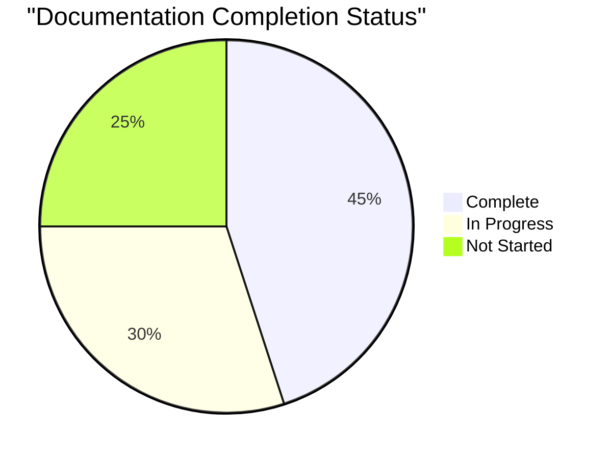
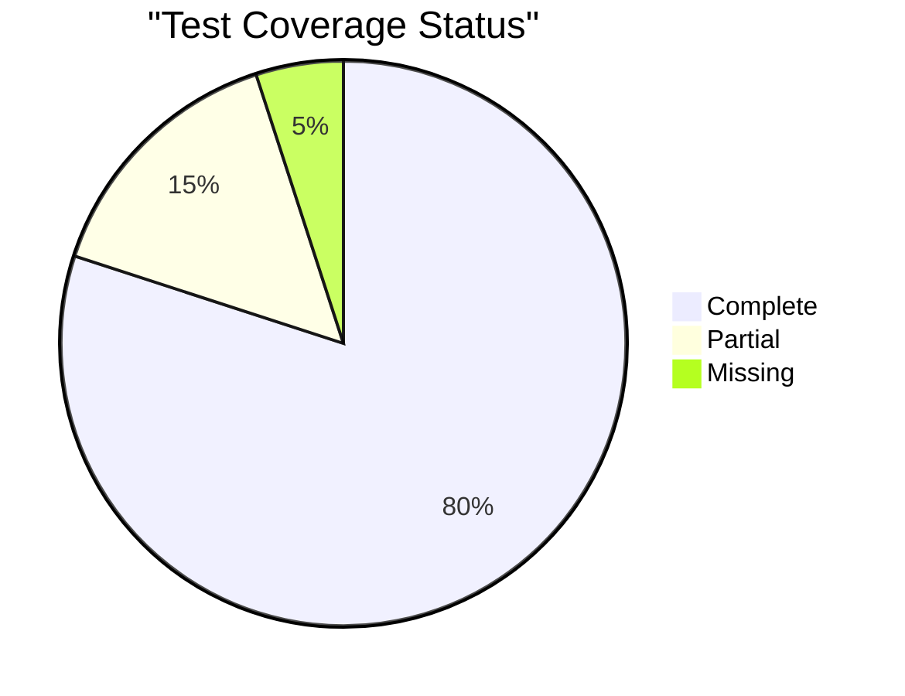
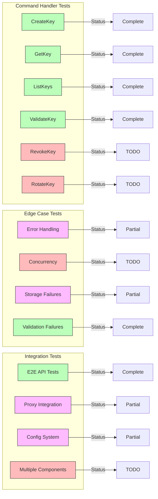
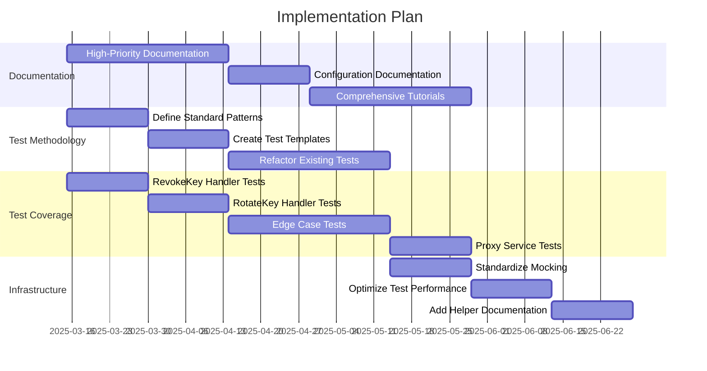

# Documentation and Testing Improvements

This document outlines comprehensive improvements to both the documentation and testing methodology for the API Gateway Workers project.

## Documentation and Testing Strategy

```mermaid
graph TD
    subgraph "Documentation Strategy"
        D1[New Documentation Files]
        D2[Updates to Existing Docs]
        D3[Code Examples]
        D4[Visual Diagrams]
    end
    
    subgraph "Testing Strategy"
        T1[Test Infrastructure]
        T2[Missing Test Coverage]
        T3[Test Methodology]
        T4[CI/CD Integration]
    end
    
    D1 --> D1a[API References]
    D1 --> D1b[Tutorials]
    D1 --> D1c[Operations Guides]
    
    D2 --> D2a[Configuration Details]
    D2 --> D2b[Security Practices]
    D2 --> D2c[Architecture Updates]
    
    D3 --> D3a[Configuration Examples]
    D3 --> D3b[Integration Examples]
    D3 --> D3c[Use Case Examples]
    
    D4 --> D4a[Architecture Diagrams]
    D4 --> D4b[Flow Charts]
    D4 --> D4c[Sequence Diagrams]
    
    T1 --> T1a[ES Module Mocking]
    T1 --> T1b[Test Containers]
    T1 --> T1c[Fixtures and Factories]
    
    T2 --> T2a[Command Handlers]
    T2 --> T2b[Edge Cases]
    T2 --> T2c[Integration Tests]
    
    T3 --> T3a[Consistent Patterns]
    T3 --> T3b[Environment Setup]
    T3 --> T3c[Test Documentation]
    
    T4 --> T4a[Coverage Thresholds]
    T4 --> T4b[Documentation Validation]
    T4 --> T4c[Performance Testing]
    
    style "Documentation Strategy" fill:#f9f,stroke:#333,stroke-width:2px
    style "Testing Strategy" fill:#bbf,stroke:#333,stroke-width:2px
```

## Documentation Improvements

### Documentation Progress 



### New Documentation Files

```mermaid
graph LR
    subgraph "High Priority"
        H1[TUTORIALS.md]
        H2[ERROR_HANDLING.md]
    end
    
    subgraph "Medium Priority"
        M1[MIGRATION.md]
        M2[OPERATIONS.md]
        M3[PERFORMANCE.md]
    end
    
    subgraph "Low Priority"
        L1[STYLE_GUIDE.md]
    end
    
    H1 -->|Includes| H1a[Step-by-step Guides]
    H1 -->|Includes| H1b[Common Use Cases]
    H1 -->|Includes| H1c[Troubleshooting]
    
    H2 -->|Includes| H2a[Error Codes]
    H2 -->|Includes| H2b[Error Resolutions]
    H2 -->|Includes| H2c[Error Handling Patterns]
    
    M1 -->|Includes| M1a[Version Migration]
    M1 -->|Includes| M1b[Breaking Changes]
    
    M2 -->|Includes| M2a[Monitoring]
    M2 -->|Includes| M2b[Logging]
    M2 -->|Includes| M2c[Deployment]
    
    M3 -->|Includes| M3a[Optimization]
    M3 -->|Includes| M3b[Benchmarks]
    
    L1 -->|Includes| L1a[Code Style]
    L1 -->|Includes| L1b[Documentation Style]
    
    style "High Priority" fill:#f77,stroke:#333,stroke-width:2px
    style "Medium Priority" fill:#7f7,stroke:#333,stroke-width:1px
    style "Low Priority" fill:#77f,stroke:#333,stroke-width:1px
```

| Priority | File                          | Description                                                    | Status |
|----------|-------------------------------|----------------------------------------------------------------|--------|
| High     | `/docs/TUTORIALS.md`          | Step-by-step tutorials for common use cases                     | TODO   |
| High     | `/docs/ERROR_HANDLING.md`     | Document all error codes, meanings, and resolutions            | TODO   |
| Medium   | `/docs/MIGRATION.md`          | Guide for migrating from previous versions                     | TODO   |
| Medium   | `/docs/OPERATIONS.md`         | Monitoring, logging, and operational considerations            | TODO   |
| Medium   | `/docs/PERFORMANCE.md`        | Performance optimization and tuning guidelines                 | TODO   |
| Low      | `/docs/STYLE_GUIDE.md`        | Coding and documentation style guide                           | TODO   |

### Updates to Existing Documentation

```mermaid
graph TD
    subgraph "High Priority Updates"
        HC[CONFIGURATION.md]
        HG[GATEWAY.md]
        HS[SECURITY.md]
    end
    
    subgraph "Medium Priority Updates"
        MQ[QUICKSTART.md]
        MA[ARCHITECTURE.md]
        MI[INTEGRATION_GUIDE.md]
        MT[TESTING_GUIDE.md]
        MR[README.md]
    end
    
    HC -->|Add| HC1[Environment Configs]
    HC -->|Add| HC2[More Examples]
    
    HG -->|Add| HG1[Advanced Proxy Cases]
    HG -->|Add| HG2[Circuit Breaker Examples]
    
    HS -->|Add| HS1[Security Best Practices]
    HS -->|Add| HS2[Threat Modeling]
    
    MQ -->|Improve| MQ1[Deployment Instructions]
    MQ -->|Add| MQ2[Cloudflare Integration]
    
    MA -->|Add| MA1[Component Diagrams]
    MA -->|Add| MA2[Decision Rationales]
    
    MI -->|Add| MI1[More Integration Examples]
    MI -->|Add| MI2[Common Services]
    
    MT -->|Document| MT1[Advanced Testing]
    MT -->|Add| MT2[Mocking Strategies]
    
    MR -->|Streamline| MR1[First-time User Flow]
    MR -->|Improve| MR2[Navigation]
    
    style "High Priority Updates" fill:#f77,stroke:#333,stroke-width:2px
    style "Medium Priority Updates" fill:#7f7,stroke:#333,stroke-width:1px
```

| Priority | File                               | Improvements Needed                                          | Status |
|----------|------------------------------------|------------------------------------------------------------- |--------|
| High     | `/docs/CONFIGURATION.md`           | Add more examples and environment-specific configurations    | TODO   |
| High     | `/docs/GATEWAY.md`                 | Expand proxy functionality documentation with advanced cases | TODO   |
| High     | `/docs/SECURITY.md`                | Add security best practices and threat modeling              | TODO   |
| Medium   | `/docs/QUICKSTART.md`              | Improve deployment instructions for Cloudflare               | TODO   |
| Medium   | `/docs/ARCHITECTURE.md`            | Add component interaction diagrams and decision rationales   | TODO   |
| Medium   | `/docs/INTEGRATION_GUIDE.md`       | Add more integration examples with common services           | TODO   |
| Medium   | `/docs/TESTING_GUIDE.md`           | Document advanced testing scenarios and mocking strategies   | TODO   |
| Medium   | `/README.md`                       | Streamline for first-time users with better navigation       | TODO   |

### Code Example Improvements

```mermaid
flowchart TB
    subgraph "Configuration Examples"
        CE1[Dev Environment]
        CE2[Production Environment]
        CE3[Custom Headers]
        CE4[Advanced Security]
    end
    
    subgraph "Proxy Examples"
        PE1[Basic Proxying]
        PE2[Circuit Breaking]
        PE3[Path Rewriting]
        PE4[Load Balancing]
    end
    
    subgraph "API Key Examples"
        AE1[Creation & Validation]
        AE2[Rotation & Revocation]
        AE3[Scopes & Permissions]
        AE4[Administrative Functions]
    end
    
    subgraph "Integration Examples"
        IE1[Single Page Apps]
        IE2[Server-Side Apps]
        IE3[Mobile Clients]
        IE4[Third-party Services]
    end
    
    style "Configuration Examples" fill:#f9f,stroke:#333,stroke-width:2px
    style "Proxy Examples" fill:#bbf,stroke:#333,stroke-width:2px
    style "API Key Examples" fill:#bfb,stroke:#333,stroke-width:2px
    style "Integration Examples" fill:#fbb,stroke:#333,stroke-width:2px
```

| Priority | Area                                | Description                                                 | Status |
|----------|-------------------------------------|-------------------------------------------------------------|--------|
| High     | Configuration Examples              | Add examples for various environments and use cases          | TODO   |
| Medium   | Proxy Configuration Examples        | Show how to configure proxying for different scenarios       | TODO   |
| Medium   | API Key Management Examples         | End-to-end examples of key lifecycle management              | TODO   |
| Medium   | Custom Router Examples              | Show how to create custom routing configurations             | TODO   |
| Low      | Frontend Integration Examples       | Examples of integrating with SPA and SSR frameworks          | TODO   |

## Testing Improvements

### Testing Progress



### Test Infrastructure

```mermaid
graph TD
    subgraph "Test Infrastructure Components"
        TI1[ES Module Mocking]
        TI2[Test Container]
        TI3[Test Setup]
        TI4[Test Helpers]
        TI5[Test Performance]
    end
    
    TI1 -->|Issues| TI1a[Import Resolution]
    TI1 -->|Issues| TI1b[Mocking Patterns]
    TI1 -->|Solution| TI1c[Standard Factory]
    
    TI2 -->|Features| TI2a[Dependency Injection]
    TI2 -->|Features| TI2b[Mock Registration]
    TI2 -->|Features| TI2c[Test Factories]
    
    TI3 -->|Issues| TI3a[Duplication]
    TI3 -->|Solution| TI3b[Shared Fixtures]
    TI3 -->|Solution| TI3c[Setup Helpers]
    
    TI4 -->|Needed| TI4a[Documentation]
    TI4 -->|Needed| TI4b[Examples]
    TI4 -->|Needed| TI4c[Usage Patterns]
    
    TI5 -->|Issues| TI5a[Slow Tests]
    TI5 -->|Solution| TI5b[Parallelization]
    TI5 -->|Solution| TI5c[Optimized Mocks]
    
    style "Test Infrastructure Components" fill:#f9f,stroke:#333,stroke-width:2px
    style TI1 fill:#fbb,stroke:#333,stroke-width:1px
    style TI2 fill:#bbf,stroke:#333,stroke-width:1px
    style TI3 fill:#bfb,stroke:#333,stroke-width:1px
    style TI4 fill:#bbf,stroke:#333,stroke-width:1px
    style TI5 fill:#bfb,stroke:#333,stroke-width:1px
```

| Priority | Improvement                        | Description                                                  | Status |
|----------|----------------------------------- |--------------------------------------------------------------|--------|
| High     | Fix ES Module Mocking              | Improve mocking approach for ES modules to avoid test failures| DONE   |
| High     | Consistent Mocking Pattern         | Standardize mocking approach across all test files            | TODO   |
| Medium   | Test Setup Refactoring             | Reduce duplication in test setup code                         | TODO   |
| Medium   | Test Helper Documentation          | Document available test helpers and utilities                 | TODO   |
| Low      | Test Performance Optimization      | Identify and optimize slow tests                              | TODO   |

### Missing Test Coverage



| Priority | Area                               | Description                                                   | Status |
|----------|------------------------------------|-----------------------------------------------------------------|--------|
| High     | RevokeKey and RotateKey Handlers   | Complete implementation and tests for these handlers           | TODO   |
| High     | Command Handler Edge Cases         | Add tests for edge cases in command handlers                   | TODO   |
| Medium   | Proxy Service Error Handling       | Add tests for error scenarios in proxy service                 | TODO   |
| Medium   | Config System Integration Tests    | Add tests for config integration with components               | TODO   |
| Low      | Performance Benchmarking Tests     | Add tests to measure and ensure performance                    | TODO   |

### Test Methodology Improvements

```mermaid
graph TD
    subgraph "Test Methodology Improvements"
        TM1[Environment Strategy]
        TM2[Mocking Consistency]
        TM3[Test Documentation]
        TM4[Integration Testing]
        TM5[Property Testing]
    end
    
    TM1 -->|Includes| TM1a[Environment Variables]
    TM1 -->|Includes| TM1b[CI Environments]
    TM1 -->|Includes| TM1c[Local Development]
    
    TM2 -->|Standard| TM2a[Module Mocking Pattern]
    TM2 -->|Standard| TM2b[Factory Functions]
    TM2 -->|Standard| TM2c[Mock Implementation]
    
    TM3 -->|Includes| TM3a[Test Purpose]
    TM3 -->|Includes| TM3b[Testing Pattern]
    TM3 -->|Includes| TM3c[Edge Cases Covered]
    
    TM4 -->|Improvements| TM4a[Realistic Scenarios]
    TM4 -->|Improvements| TM4b[Component Interaction]
    TM4 -->|Improvements| TM4c[System Boundaries]
    
    TM5 -->|Areas| TM5a[Input Validation]
    TM5 -->|Areas| TM5b[Data Transformations]
    TM5 -->|Areas| TM5c[Configuration Parsing]
    
    style "Test Methodology Improvements" fill:#f9f,stroke:#333,stroke-width:2px
    style TM1 fill:#bbf,stroke:#333,stroke-width:1px
    style TM2 fill:#fbb,stroke:#333,stroke-width:1px
    style TM3 fill:#bfb,stroke:#333,stroke-width:1px
    style TM4 fill:#bbf,stroke:#333,stroke-width:1px
    style TM5 fill:#fbf,stroke:#333,stroke-width:1px
```

| Priority | Improvement                        | Description                                                    | Status |
|----------|----------------------------------- |----------------------------------------------------------------|--------|
| High     | Environment-Based Test Strategy    | Adjust tests to work in different environments                  | TODO   |
| High     | Consistent Mocking Approach        | Use consistent patterns for mocking dependencies across tests   | TODO   |
| Medium   | Test Documentation                 | Add better documentation in test files                          | TODO   |
| Medium   | Integration Test Improvements      | Enhance integration tests with more realistic scenarios         | TODO   |
| Low      | Property-Based Testing             | Introduce property-based testing for appropriate areas          | TODO   |

## Implementation Plan



1. **Documentation First**
   - Start with high-priority documentation improvements
   - Focus on configuration documentation as it's the most recent addition
   - Create comprehensive tutorials to help users get started

2. **Test Methodology Standardization**
   - Define and document standard test patterns
   - Create templates for different types of tests
   - Refactor existing tests to follow standards

3. **Missing Test Coverage**
   - Implement tests for RevokeKey and RotateKey handlers
   - Add missing edge case tests for command handlers
   - Improve proxy service test coverage

4. **Infrastructure Improvements**
   - Standardize mocking approach
   - Optimize test performance
   - Add test helper documentation

## Next Steps

```mermaid
graph TD
    subgraph "CI/CD Integration"
        CI1[PR Template]
        CI2[Doc Validation]
        CI3[Test Coverage]
        CI4[Doc Reviews]
        CI5[Contribution Guide]
    end
    
    CI1 -->|Includes| CI1a[Documentation Requirements]
    CI1 -->|Includes| CI1b[Test Requirements]
    
    CI2 -->|Checks| CI2a[Formatting]
    CI2 -->|Checks| CI2b[Links]
    CI2 -->|Checks| CI2c[Completeness]
    
    CI3 -->|Enforces| CI3a[Coverage Thresholds]
    CI3 -->|Enforces| CI3b[Test Quality]
    
    CI4 -->|Schedule| CI4a[Regular Reviews]
    CI4 -->|Schedule| CI4b[Doc Updates]
    
    CI5 -->|Guidelines| CI5a[Style]
    CI5 -->|Guidelines| CI5b[Process]
    
    style "CI/CD Integration" fill:#f9f,stroke:#333,stroke-width:2px
    style CI1 fill:#bbf,stroke:#333,stroke-width:1px
    style CI2 fill:#bfb,stroke:#333,stroke-width:1px
    style CI3 fill:#fbb,stroke:#333,stroke-width:1px
    style CI4 fill:#fbf,stroke:#333,stroke-width:1px
    style CI5 fill:#bbf,stroke:#333,stroke-width:1px
```

1. Create a pull request template that includes documentation requirements
2. Set up documentation validation in CI/CD pipeline
3. Implement test coverage thresholds in CI/CD pipeline
4. Schedule regular documentation reviews
5. Create a documentation contribution guide

## Proper ES Module Testing Pattern

```mermaid
flowchart TD
    subgraph "ES Module Testing Pattern"
        M1[Import Module to Test]
        M2[Mock Dependencies]
        M3[Write Tests]
        M4[Run Tests with Jest]
    end
    
    M1 -->|Step 1| M1a["import { MyClass } from '../path/to/module'"]
    
    M2 -->|Step 2a| M2a["jest.mock('../path/to/dependency')"]
    M2 -->|Step 2b| M2b["Import mock factory"]
    M2 -->|Step 2c| M2c["Setup mock implementations"]
    
    M3 -->|Step 3a| M3a["Create test fixtures"]
    M3 -->|Step 3b| M3b["Define test cases"]
    M3 -->|Step 3c| M3c["Assert expected outcomes"]
    
    M4 -->|Step 4a| M4a["Use NODE_OPTIONS=--experimental-vm-modules"]
    M4 -->|Step 4b| M4b["Run jest with correct options"]
    
    style "ES Module Testing Pattern" fill:#f9f,stroke:#333,stroke-width:2px
    style M1 fill:#bbf,stroke:#333,stroke-width:1px
    style M2 fill:#bfb,stroke:#333,stroke-width:1px
    style M3 fill:#fbb,stroke:#333,stroke-width:1px
    style M4 fill:#fbf,stroke:#333,stroke-width:1px
```

## Notes

- The improved ConfigLoader test demonstrates the proper way to test components with ES module dependencies
- Documentation should be updated in parallel with code changes
- All new features should have corresponding documentation and tests
- Tests should be consistent in structure and follow established patterns